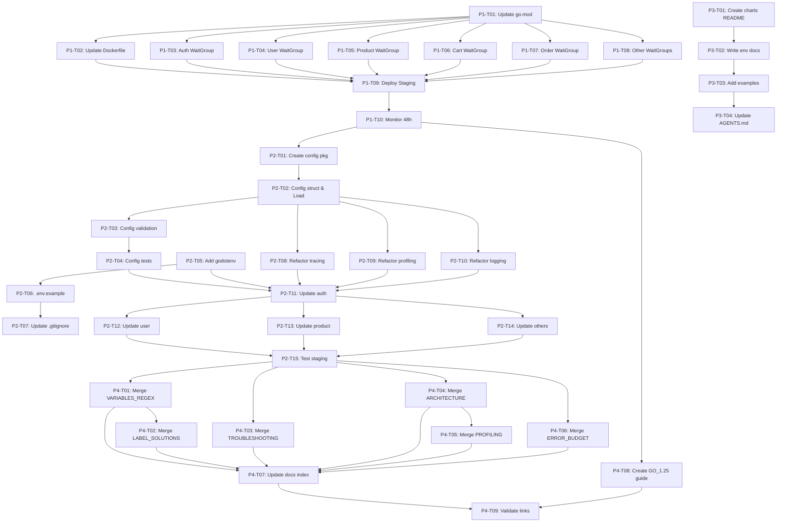

# Tasks: Go 1.25 Upgrade & Config Modernization

**Task ID:** `go125-config-modernization`  
**Created:** December 12, 2025  
**Total Effort:** 17 days (3 weeks)  
**Total Tasks:** 38 tasks

**Related Docs:**
- [Research](./research.md) - Technical analysis
- [Specification](./spec.md) - Requirements
- [Plan](./plan.md) - Implementation guide

---

## Progress Summary

| Phase | Tasks | Completed | In Progress | Blocked | Status |
|-------|-------|-----------|-------------|---------|--------|
| Phase 1: Go 1.25 Upgrade | 10 | 0 | 0 | 0 | 🔴 Not Started |
| Phase 2: Config Package | 15 | 0 | 0 | 0 | 🔴 Not Started |
| Phase 3: Helm Docs | 4 | 0 | 0 | 0 | 🔴 Not Started |
| Phase 4: Doc Consolidation | 9 | 0 | 0 | 0 | 🔴 Not Started |
| **TOTAL** | **38** | **0** | **0** | **0** | **0% Complete** |

---

## Phase 1: Go 1.25 Upgrade (Week 1 - 5 days)

**Objective:** Update all services to Go 1.25, refactor WaitGroup usage, deploy to staging

### P1-T01: Update Go Version in go.mod

**Priority:** High  
**Effort:** 30 minutes  
**Dependencies:** None  
**Assignee:** TBD

**Description:**
Update `services/go.mod` to Go 1.25

**Tasks:**
- [ ] Update go version: `go mod edit -go=1.25`
- [ ] Run `go get -u ./...` to update dependencies
- [ ] Run `go mod tidy` to clean up
- [ ] Verify no breaking changes in dependencies

**Acceptance Criteria:**
- `services/go.mod` contains `go 1.25`
- All dependencies compatible
- `go build ./...` succeeds locally

**Files to Modify:**
- `services/go.mod`

---

### P1-T02: Update Dockerfile to Go 1.25

**Priority:** High  
**Effort:** 15 minutes  
**Dependencies:** P1-T01  
**Assignee:** TBD

**Description:**
Update base image in Dockerfile from golang:1.23-alpine to golang:1.25-alpine

**Tasks:**
- [ ] Update FROM line: `FROM golang:1.25-alpine AS builder`
- [ ] Keep build flags as-is (CGO_ENABLED=0)
- [ ] No need for GOEXPERIMENT or -ldflags changes

**Acceptance Criteria:**
- Dockerfile uses golang:1.25-alpine
- Build succeeds locally
- Binary size unchanged

**Files to Modify:**
- `services/Dockerfile` (Line 1)

---

### P1-T03: Refactor WaitGroup in auth service

**Priority:** High  
**Effort:** 30 minutes  
**Dependencies:** P1-T01  
**Assignee:** TBD

**Description:**
Refactor graceful shutdown in `cmd/auth/main.go` to use Go 1.25 `WaitGroup.Go()` pattern

**Tasks:**
- [ ] Replace `wg.Add(1)` + `defer wg.Done()` with `wg.Go()`
- [ ] Add comments explaining shutdown sequence
- [ ] Test graceful shutdown locally

**Acceptance Criteria:**
- No more manual `wg.Add()` / `wg.Done()` pairs
- Shutdown completes within 10 seconds
- Code is simpler and clearer

**Files to Modify:**
- `services/cmd/auth/main.go` (graceful shutdown section)

**Code Pattern:**
```go
// BEFORE
var wg sync.WaitGroup
wg.Add(3)
go func() { defer wg.Done(); tp.Shutdown(ctx) }()
go func() { defer wg.Done(); middleware.StopProfiling() }()
go func() { defer wg.Done(); logger.Sync() }()
wg.Wait()

// AFTER
var wg sync.WaitGroup
wg.Go(func() { tp.Shutdown(ctx) })
wg.Go(func() { middleware.StopProfiling() })
wg.Go(func() { logger.Sync() })
wg.Wait()
```

---

### P1-T04: Refactor WaitGroup in user service

**Priority:** High  
**Effort:** 30 minutes  
**Dependencies:** P1-T01  
**Assignee:** TBD

**Description:**
Same as P1-T03 but for user service

**Files to Modify:**
- `services/cmd/user/main.go`

---

### P1-T05: Refactor WaitGroup in product service

**Priority:** High  
**Effort:** 30 minutes  
**Dependencies:** P1-T01  
**Assignee:** TBD

**Description:**
Same as P1-T03 but for product service

**Files to Modify:**
- `services/cmd/product/main.go`

---

### P1-T06: Refactor WaitGroup in cart service

**Priority:** High  
**Effort:** 30 minutes  
**Dependencies:** P1-T01  
**Assignee:** TBD

**Description:**
Same as P1-T03 but for cart service

**Files to Modify:**
- `services/cmd/cart/main.go`

---

### P1-T07: Refactor WaitGroup in order service

**Priority:** High  
**Effort:** 30 minutes  
**Dependencies:** P1-T01  
**Assignee:** TBD

**Description:**
Same as P1-T03 but for order service

**Files to Modify:**
- `services/cmd/order/main.go`

---

### P1-T08: Refactor WaitGroup in remaining services

**Priority:** High  
**Effort:** 1.5 hours  
**Dependencies:** P1-T01  
**Assignee:** TBD

**Description:**
Refactor WaitGroup in review, notification, shipping, shipping-v2 services (4 services)

**Tasks:**
- [ ] Review service: `cmd/review/main.go`
- [ ] Notification service: `cmd/notification/main.go`
- [ ] Shipping service: `cmd/shipping/main.go`
- [ ] Shipping-v2 service: `cmd/shipping-v2/main.go`

**Acceptance Criteria:**
- All 4 services use `wg.Go()` pattern
- Graceful shutdown works for all

**Files to Modify:**
- `services/cmd/review/main.go`
- `services/cmd/notification/main.go`
- `services/cmd/shipping/main.go`
- `services/cmd/shipping-v2/main.go`

---

### P1-T09: Build and deploy to staging

**Priority:** High  
**Effort:** 2 hours  
**Dependencies:** P1-T02, P1-T03, P1-T04, P1-T05, P1-T06, P1-T07, P1-T08  
**Assignee:** TBD

**Description:**
Build Docker images and deploy all services to staging environment

**Tasks:**
- [ ] Run `./scripts/04-build-microservices.sh`
- [ ] Deploy to staging: `./scripts/05-deploy-microservices.sh --local`
- [ ] Verify all pods start successfully
- [ ] Check logs for errors

**Acceptance Criteria:**
- All 9 services build successfully
- All pods in Running state
- Health checks pass
- No errors in logs

**Commands:**
```bash
./scripts/04-build-microservices.sh
./scripts/05-deploy-microservices.sh --local
kubectl get pods -n auth,user,product,cart,order,review,notification,shipping
```

---

### P1-T10: Monitor staging for 48 hours

**Priority:** High  
**Effort:** 2 days (passive monitoring)  
**Dependencies:** P1-T09  
**Assignee:** TBD

**Description:**
Monitor Grafana metrics and Prometheus alerts for 48 hours to validate Go 1.25 stability

**Tasks:**
- [ ] Monitor GC duration metrics (expect stable or improved)
- [ ] Monitor P95 latency (should be unchanged)
- [ ] Monitor error rate (should be unchanged)
- [ ] Check for any crashes or OOM events
- [ ] Review logs for unexpected errors

**Acceptance Criteria:**
- No increase in error rate
- P95 latency stable or improved
- No pod crashes
- GC metrics stable (10-40% improvement would be bonus)

**Metrics to Monitor:**
- `go_gc_duration_seconds` (Prometheus)
- `request_duration_seconds{quantile="0.95"}` (Prometheus)
- `error_rate_total` (Prometheus)
- Grafana GC panels

---

## Phase 2: Config Package (Week 2 - 5 days)

**Objective:** Create config package with validation, refactor middleware, update all services

### P2-T01: Create config package structure

**Priority:** High  
**Effort:** 30 minutes  
**Dependencies:** Phase 1 complete  
**Assignee:** TBD

**Description:**
Create directory structure and package declaration for config package

**Tasks:**
- [ ] Create directory: `services/pkg/config/`
- [ ] Create files: `config.go`, `config_test.go`
- [ ] Add package declaration

**Acceptance Criteria:**
- Directory exists
- Package compiles

**Files to Create:**
- `services/pkg/config/config.go`
- `services/pkg/config/config_test.go`

---

### P2-T02: Implement Config struct and Load function

**Priority:** High  
**Effort:** 3 hours  
**Dependencies:** P2-T01  
**Assignee:** TBD

**Description:**
Implement complete Config struct with all sub-configs and Load() function

**Tasks:**
- [ ] Define Config struct (Server, Tracing, Profiling, Logging)
- [ ] Implement Load() function with env var parsing
- [ ] Implement helper functions (getEnv, getEnvBool, getEnvFloat)
- [ ] Add auto-adjust for development env

**Acceptance Criteria:**
- Config struct defined with all fields
- Load() reads all env vars
- Falls back to defaults if not set
- Auto-adjusts sample rate for dev env

**Files to Modify:**
- `services/pkg/config/config.go`

**Reference:** See plan.md section "Day 1: Create Config Package" for complete code

---

### P2-T03: Implement Config validation

**Priority:** High  
**Effort:** 2 hours  
**Dependencies:** P2-T02  
**Assignee:** TBD

**Description:**
Implement Validate() method with comprehensive validation rules

**Tasks:**
- [ ] Validate sample rate (0.0-1.0)
- [ ] Validate port (1-65535)
- [ ] Validate endpoints (not empty if enabled)
- [ ] Return clear error messages with field names

**Acceptance Criteria:**
- Invalid sample rate fails with clear error
- Invalid port fails with clear error
- Missing endpoint handled correctly

**Files to Modify:**
- `services/pkg/config/config.go` (Validate method)

---

### P2-T04: Write config unit tests

**Priority:** High  
**Effort:** 2 hours  
**Dependencies:** P2-T03  
**Assignee:** TBD

**Description:**
Write comprehensive unit tests for config package

**Tasks:**
- [ ] Test valid config succeeds
- [ ] Test invalid sample rate fails
- [ ] Test invalid port fails
- [ ] Test Load() with env vars
- [ ] Test Load() with defaults

**Acceptance Criteria:**
- All edge cases covered
- Test coverage >90%
- `go test ./pkg/config/...` passes

**Files to Modify:**
- `services/pkg/config/config_test.go`

**Reference:** See plan.md for test examples

---

### P2-T05: Add godotenv dependency

**Priority:** Medium  
**Effort:** 15 minutes  
**Dependencies:** None  
**Assignee:** TBD

**Description:**
Add godotenv library for local development .env file support

**Tasks:**
- [ ] Run `go get github.com/joho/godotenv@latest`
- [ ] Verify dependency added to go.mod

**Acceptance Criteria:**
- godotenv in go.mod
- `go mod tidy` runs successfully

**Files to Modify:**
- `services/go.mod`

---

### P2-T06: Create .env.example template

**Priority:** Medium  
**Effort:** 15 minutes  
**Dependencies:** P2-T05  
**Assignee:** TBD

**Description:**
Create .env.example template with all configuration options

**Tasks:**
- [ ] Create `.env.example` in services/ directory
- [ ] Document all env vars with defaults
- [ ] Add comments explaining each var

**Acceptance Criteria:**
- File exists with all vars documented
- Clear, helpful comments

**Files to Create:**
- `services/.env.example`

**Reference:** See plan.md "Day 3: Add godotenv" for complete template

---

### P2-T07: Update .gitignore

**Priority:** Medium  
**Effort:** 5 minutes  
**Dependencies:** P2-T06  
**Assignee:** TBD

**Description:**
Add .env to .gitignore to prevent committing secrets

**Tasks:**
- [ ] Add `.env` to .gitignore
- [ ] Verify .env is ignored

**Acceptance Criteria:**
- .env in .gitignore
- Git doesn't track .env files

**Files to Modify:**
- `.gitignore`

---

### P2-T08: Refactor tracing middleware for config

**Priority:** High  
**Effort:** 2 hours  
**Dependencies:** P2-T02  
**Assignee:** TBD

**Description:**
Add new function to tracing middleware that accepts config struct

**Tasks:**
- [ ] Add `InitTracingWithConfigStruct(cfg config.TracingConfig)` function
- [ ] Keep old `InitTracing()` for backward compatibility
- [ ] Add deprecation warning to old function
- [ ] Test both functions work

**Acceptance Criteria:**
- New function accepts config struct
- Old function still works (deprecated)
- Deprecation warning logged

**Files to Modify:**
- `services/pkg/middleware/tracing.go`

---

### P2-T09: Refactor profiling middleware for config

**Priority:** High  
**Effort:** 1.5 hours  
**Dependencies:** P2-T02  
**Assignee:** TBD

**Description:**
Add new function to profiling middleware that accepts config struct

**Tasks:**
- [ ] Add `InitProfilingWithConfig(cfg config.ProfilingConfig)` function
- [ ] Keep old `InitProfiling()` for backward compatibility
- [ ] Add deprecation warning

**Acceptance Criteria:**
- New function accepts config struct
- Old function still works (deprecated)

**Files to Modify:**
- `services/pkg/middleware/profiling.go`

---

### P2-T10: Refactor logging middleware for config

**Priority:** High  
**Effort:** 1.5 hours  
**Dependencies:** P2-T02  
**Assignee:** TBD

**Description:**
Add new function to logging middleware that accepts config struct

**Tasks:**
- [ ] Add `NewLoggerWithConfig(cfg config.LoggingConfig)` function
- [ ] Keep old `NewLogger()` for backward compatibility
- [ ] Add deprecation warning

**Acceptance Criteria:**
- New function accepts config struct
- Old function still works (deprecated)

**Files to Modify:**
- `services/pkg/middleware/logging.go`

---

### P2-T11: Update auth service to use config package

**Priority:** High  
**Effort:** 1 hour  
**Dependencies:** P2-T04, P2-T05, P2-T08, P2-T09, P2-T10  
**Assignee:** TBD

**Description:**
Update auth service main.go to use config package

**Tasks:**
- [ ] Import godotenv autoload
- [ ] Import config package
- [ ] Call config.Load() at startup
- [ ] Handle validation errors
- [ ] Pass config to middleware initialization
- [ ] Test locally with .env file

**Acceptance Criteria:**
- Service uses config package
- Invalid config exits at startup with clear error
- .env file works locally
- Service starts successfully

**Files to Modify:**
- `services/cmd/auth/main.go`

**Reference:** See plan.md "Day 4-5: Update Services" for complete template

---

### P2-T12: Update user service to use config package

**Priority:** High  
**Effort:** 1 hour  
**Dependencies:** P2-T11  
**Assignee:** TBD

**Description:**
Same as P2-T11 but for user service

**Files to Modify:**
- `services/cmd/user/main.go`

---

### P2-T13: Update product service to use config package

**Priority:** High  
**Effort:** 1 hour  
**Dependencies:** P2-T11  
**Assignee:** TBD

**Description:**
Same as P2-T11 but for product service

**Files to Modify:**
- `services/cmd/product/main.go`

---

### P2-T14: Update remaining services (6 services)

**Priority:** High  
**Effort:** 6 hours  
**Dependencies:** P2-T11  
**Assignee:** TBD

**Description:**
Update cart, order, review, notification, shipping, shipping-v2 services to use config package

**Tasks:**
- [ ] Cart service: `cmd/cart/main.go`
- [ ] Order service: `cmd/order/main.go`
- [ ] Review service: `cmd/review/main.go`
- [ ] Notification service: `cmd/notification/main.go`
- [ ] Shipping service: `cmd/shipping/main.go`
- [ ] Shipping-v2 service: `cmd/shipping-v2/main.go`

**Acceptance Criteria:**
- All 6 services use config package
- All services start successfully
- Config validation works for all

**Files to Modify:**
- `services/cmd/cart/main.go`
- `services/cmd/order/main.go`
- `services/cmd/review/main.go`
- `services/cmd/notification/main.go`
- `services/cmd/shipping/main.go`
- `services/cmd/shipping-v2/main.go`

---

### P2-T15: Test config validation in staging

**Priority:** High  
**Effort:** 1 hour  
**Dependencies:** P2-T14  
**Assignee:** TBD

**Description:**
Deploy to staging and test that config validation catches errors at startup

**Tasks:**
- [ ] Deploy services to staging
- [ ] Test invalid sample rate (should fail at startup)
- [ ] Test invalid port (should fail at startup)
- [ ] Verify error messages are clear
- [ ] Rollback and verify services start normally

**Acceptance Criteria:**
- Invalid config causes immediate exit
- Error messages include field names
- Normal config starts successfully

**Commands:**
```bash
# Test invalid config
kubectl set env deployment/auth -n auth OTEL_SAMPLE_RATE=invalid
kubectl logs -n auth -l app=auth | grep "invalid sample rate"

# Rollback
kubectl rollout undo deployment/auth -n auth
```

---

## Phase 3: Helm Documentation (Week 2 - 2 days, parallel)

**Objective:** Document env vs extraEnv patterns in Helm charts

### P3-T01: Create charts/README.md structure

**Priority:** Medium  
**Effort:** 1 hour  
**Dependencies:** None (parallel with Phase 2)  
**Assignee:** TBD

**Description:**
Create README.md in charts/ directory with basic structure

**Tasks:**
- [ ] Create `charts/README.md`
- [ ] Add title and introduction
- [ ] Create section structure (placeholder content)

**Acceptance Criteria:**
- File exists with clear structure
- Sections defined

**Files to Create:**
- `charts/README.md`

---

### P3-T02: Write env variable documentation

**Priority:** Medium  
**Effort:** 3 hours  
**Dependencies:** P3-T01  
**Assignee:** TBD

**Description:**
Document all env variable patterns (env, structured config, extraEnv)

**Tasks:**
- [ ] Write "Base Configuration (env)" section
- [ ] Write "Structured Configuration" section
- [ ] Write "Service-Specific Configuration (extraEnv)" section
- [ ] Write "Execution Order" section
- [ ] Write "Secret Management" section
- [ ] Add decision matrix table
- [ ] Add examples for each pattern

**Acceptance Criteria:**
- All sections complete with examples
- Decision matrix clear
- Secret injection example included

**Files to Modify:**
- `charts/README.md`

**Reference:** See plan.md "Phase 3: Helm Documentation" for complete content

---

### P3-T03: Add usage examples

**Priority:** Medium  
**Effort:** 1 hour  
**Dependencies:** P3-T02  
**Assignee:** TBD

**Description:**
Add practical usage examples for common scenarios

**Tasks:**
- [ ] Add helm install example
- [ ] Add per-service override example
- [ ] Add secret injection example

**Acceptance Criteria:**
- Examples are complete and runnable
- Cover common use cases

**Files to Modify:**
- `charts/README.md`

---

### P3-T04: Update AGENTS.md with Helm docs link

**Priority:** Low  
**Effort:** 15 minutes  
**Dependencies:** P3-T03  
**Assignee:** TBD

**Description:**
Update AGENTS.md to link to new charts/README.md

**Tasks:**
- [ ] Add link to charts/README.md in Helm section
- [ ] Update Helm conventions section
- [ ] Add note about env vs extraEnv pattern

**Acceptance Criteria:**
- Link added and works
- Documentation easily discoverable

**Files to Modify:**
- `AGENTS.md` (Helm section)

---

## Phase 4: Documentation Consolidation (Week 3 - 5 days)

**Objective:** Merge redundant docs, update index, create new dev guides

### P4-T01: Merge monitoring VARIABLES_REGEX into METRICS

**Priority:** Medium  
**Effort:** 1 hour  
**Dependencies:** None  
**Assignee:** TBD

**Description:**
Merge `monitoring/VARIABLES_REGEX.md` content into `monitoring/METRICS.md`

**Tasks:**
- [ ] Add "Dashboard Variables" section to METRICS.md
- [ ] Copy content from VARIABLES_REGEX.md
- [ ] Update internal links
- [ ] Delete VARIABLES_REGEX.md
- [ ] Verify no broken links

**Acceptance Criteria:**
- Content merged successfully
- Source file deleted
- No broken links

**Files to Modify:**
- `docs/monitoring/METRICS.md` (add section)

**Files to Delete:**
- `docs/monitoring/VARIABLES_REGEX.md`

---

### P4-T02: Merge monitoring METRICS_LABEL_SOLUTIONS into METRICS

**Priority:** Medium  
**Effort:** 1 hour  
**Dependencies:** P4-T01  
**Assignee:** TBD

**Description:**
Merge `monitoring/METRICS_LABEL_SOLUTIONS.md` into `monitoring/METRICS.md`

**Tasks:**
- [ ] Add "Label Configuration" section to METRICS.md
- [ ] Copy content from METRICS_LABEL_SOLUTIONS.md
- [ ] Update internal links
- [ ] Delete METRICS_LABEL_SOLUTIONS.md
- [ ] Verify no broken links

**Acceptance Criteria:**
- Content merged successfully
- Source file deleted
- No broken links

**Files to Modify:**
- `docs/monitoring/METRICS.md` (add section)

**Files to Delete:**
- `docs/monitoring/METRICS_LABEL_SOLUTIONS.md`

---

### P4-T03: Merge monitoring TROUBLESHOOTING into SETUP

**Priority:** High  
**Effort:** 2 hours  
**Dependencies:** None  
**Assignee:** TBD

**Description:**
Merge `monitoring/TROUBLESHOOTING.md` into `getting-started/SETUP.md`

**Tasks:**
- [ ] Add "Troubleshooting" section to SETUP.md
- [ ] Organize by component (Prometheus, Grafana, SLO, Metrics)
- [ ] Copy content from TROUBLESHOOTING.md
- [ ] Update internal links
- [ ] Delete TROUBLESHOOTING.md
- [ ] Verify no broken links

**Acceptance Criteria:**
- Content organized by component
- Source file deleted
- No broken links
- Easy to navigate

**Files to Modify:**
- `docs/getting-started/SETUP.md` (add section)

**Files to Delete:**
- `docs/monitoring/TROUBLESHOOTING.md`

---

### P4-T04: Merge APM ARCHITECTURE into APM README

**Priority:** Medium  
**Effort:** 1 hour  
**Dependencies:** None  
**Assignee:** TBD

**Description:**
Merge `apm/ARCHITECTURE.md` into `apm/README.md`

**Tasks:**
- [ ] Add "Architecture" section to apm/README.md
- [ ] Copy content from ARCHITECTURE.md
- [ ] Convert any ASCII diagrams to Mermaid
- [ ] Update internal links
- [ ] Delete ARCHITECTURE.md
- [ ] Verify no broken links

**Acceptance Criteria:**
- Content merged with architecture diagrams
- All diagrams use Mermaid syntax
- Source file deleted
- No broken links

**Files to Modify:**
- `docs/apm/README.md` (add section)

**Files to Delete:**
- `docs/apm/ARCHITECTURE.md`

---

### P4-T05: Merge APM PROFILING into APM README

**Priority:** Medium  
**Effort:** 1 hour  
**Dependencies:** P4-T04  
**Assignee:** TBD

**Description:**
Merge `apm/PROFILING.md` into `apm/README.md`

**Tasks:**
- [ ] Add "Continuous Profiling" section to apm/README.md
- [ ] Copy content from PROFILING.md
- [ ] Update internal links
- [ ] Delete PROFILING.md
- [ ] Verify no broken links

**Acceptance Criteria:**
- Content merged successfully
- Same level of detail as other sections
- Source file deleted
- No broken links

**Files to Modify:**
- `docs/apm/README.md` (add section)

**Files to Delete:**
- `docs/apm/PROFILING.md`

---

### P4-T06: Merge SLO ERROR_BUDGET_POLICY into ALERTING

**Priority:** Medium  
**Effort:** 1 hour  
**Dependencies:** None  
**Assignee:** TBD

**Description:**
Merge `slo/ERROR_BUDGET_POLICY.md` into `slo/ALERTING.md`

**Tasks:**
- [ ] Add "Error Budget Management" section to ALERTING.md
- [ ] Copy content from ERROR_BUDGET_POLICY.md
- [ ] Update internal links
- [ ] Delete ERROR_BUDGET_POLICY.md
- [ ] Verify no broken links

**Acceptance Criteria:**
- Content merged successfully
- Policy guidelines included
- Source file deleted
- No broken links

**Files to Modify:**
- `docs/slo/ALERTING.md` (add section)

**Files to Delete:**
- `docs/slo/ERROR_BUDGET_POLICY.md`

---

### P4-T07: Update docs/README.md index

**Priority:** High  
**Effort:** 1 hour  
**Dependencies:** P4-T01, P4-T02, P4-T03, P4-T04, P4-T05, P4-T06  
**Assignee:** TBD

**Description:**
Update documentation index to reflect consolidated structure

**Tasks:**
- [ ] Update file count (24 → 15)
- [ ] Remove references to deleted files
- [ ] Update navigation structure
- [ ] Add "Recently Updated" section
- [ ] Update last modified date

**Acceptance Criteria:**
- File count accurate
- All links valid
- Navigation clear
- Recently Updated section added

**Files to Modify:**
- `docs/README.md`

---

### P4-T08: Create GO_1.25_UPGRADE.md guide

**Priority:** Medium  
**Effort:** 2 hours  
**Dependencies:** Phase 1 complete  
**Assignee:** TBD

**Description:**
Create comprehensive Go 1.25 upgrade guide

**Tasks:**
- [ ] Create `docs/development/GO_1.25_UPGRADE.md`
- [ ] Document migration steps
- [ ] Explain new features (WaitGroup.Go, etc.)
- [ ] Add breaking changes section
- [ ] Include code examples from actual codebase

**Acceptance Criteria:**
- Complete migration guide
- Code examples from real code
- Clear and actionable

**Files to Create:**
- `docs/development/GO_1.25_UPGRADE.md`

---

### P4-T09: Validate all documentation links

**Priority:** High  
**Effort:** 1 hour  
**Dependencies:** P4-T07, P4-T08  
**Assignee:** TBD

**Description:**
Run link checker and fix any broken links

**Tasks:**
- [ ] Run link checker on all docs
- [ ] Fix broken internal links
- [ ] Fix broken external links (if any)
- [ ] Verify all Mermaid diagrams render
- [ ] Test navigation from README

**Acceptance Criteria:**
- Zero broken links
- All diagrams render correctly
- Navigation works smoothly

**Commands:**
```bash
# Manual check or use tool
find docs/ -name "*.md" -exec grep -l "](.*\.md)" {} \;
```

---

## Task Dependencies Graph



---

## Parallel Execution Opportunities

**Can be done in parallel:**

1. **Phase 1 - WaitGroup Refactoring:**
   - P1-T03 to P1-T08 (all 9 services can be done simultaneously by different devs)

2. **Phase 2 - Service Updates:**
   - P2-T11, P2-T12, P2-T13, P2-T14 (4 parallel streams)

3. **Phase 3 runs parallel with Phase 2:**
   - Helm documentation (P3-T01 to P3-T04) can start during Phase 2

4. **Phase 4 - Doc Merges:**
   - P4-T01, P4-T03, P4-T04, P4-T06 (independent merges)

**Estimated with parallel execution:**
- **Serial:** 17 days
- **With 2-3 devs:** 12-14 days
- **With full team:** 10 days

---

## Risk & Blocker Tracking

| Risk ID | Description | Probability | Impact | Mitigation |
|---------|-------------|-------------|--------|------------|
| R1 | Dependency incompatibility with Go 1.25 | Low | High | Test in staging first (P1-T10) |
| R2 | Config validation breaks existing deployments | Medium | High | Maintain backward compatibility (P2-T08-10) |
| R3 | Documentation merge causes broken links | Low | Medium | Run link validator (P4-T09) |
| R4 | Team unfamiliar with new patterns | Medium | Low | Create comprehensive guides (P4-T08) |

**Current Blockers:** None

---

## Next Actions

1. **Review this task breakdown** with team
2. **Assign tasks** to team members
3. **Set up project board** (Kanban or similar)
4. **Begin Phase 1** - P1-T01 (Update go.mod)
5. **Schedule daily standups** to track progress

---

**Document Version:** 1.0  
**Last Updated:** December 12, 2025  
**Status:** Ready to Execute
