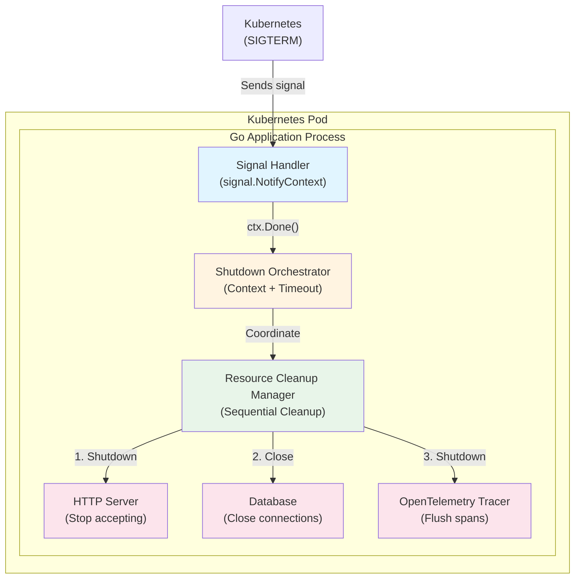
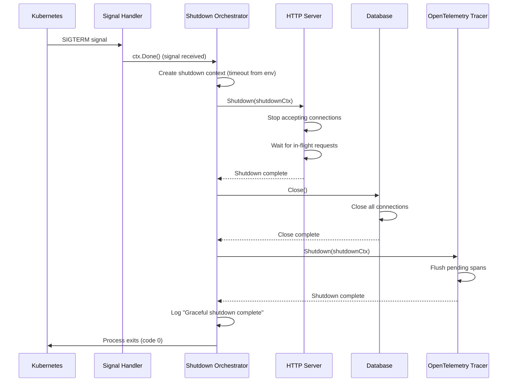
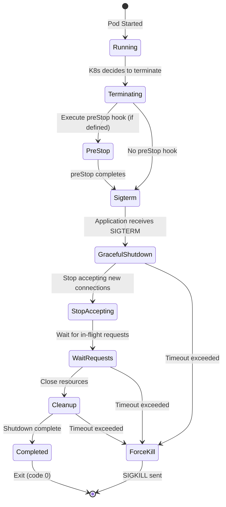

# Technical Plan: Graceful Shutdown Enhancement for Go Microservices

**Task ID:** graceful-shutdown-research
**Created:** 2025-12-25
**Status:** Ready for Implementation
**Based on:** spec.md

---

## 1. System Architecture

### Overview

The graceful shutdown enhancement follows an **in-process orchestration pattern** where signal handling, shutdown coordination, and resource cleanup all occur within each microservice's main process. This is a **refactoring effort** that improves existing shutdown logic without changing external interfaces or APIs.



### Architecture Decisions

| Decision | Choice | Rationale |
|----------|--------|-----------|
| **Signal Handling** | `signal.NotifyContext` (context-based) | Modern Go pattern, testable, integrates with context ecosystem |
| **Shutdown Timeout** | Configurable via `SHUTDOWN_TIMEOUT` env var | Allows per-service tuning, default 10s maintains current behavior |
| **Cleanup Sequence** | Explicit sequential (HTTP → DB → Tracer) | Predictable order, easier to debug, follows industry best practices |
| **K8s Grace Period** | `terminationGracePeriodSeconds: 30` | Provides buffer (10s shutdown + 20s buffer) to prevent SIGKILL |
| **Error Handling** | Log errors, continue cleanup | Non-blocking approach ensures all resources get cleanup attempt |
| **Backward Compatibility** | Same external behavior | No breaking changes, only internal implementation improvement |

### Shutdown Flow



### Kubernetes Termination Lifecycle

The following diagrams illustrate the complete Kubernetes pod termination lifecycle, showing how our graceful shutdown implementation fits into the Kubernetes orchestration:

**State Diagram:**



**Timeline:**

```mermaid
gantt
    title Kubernetes Pod Termination Timeline (terminationGracePeriodSeconds: 30s)
    dateFormat HH:mm:ss
    axisFormat %H:%M:%S
    
    section Termination
    Pod marked Terminating :00:00:00, 1s
    Removed from EndpointSlices :00:00:01, 1s
    preStop hook (if any) :00:00:02, 3s
    SIGTERM sent :00:00:05, 1s
    Graceful shutdown :00:00:06, 10s
    SIGKILL (if timeout) :00:00:30, 1s
```



**Key Points:**
- Pod is removed from EndpointSlices immediately when marked "Terminating" (traffic stops)
- Our graceful shutdown implementation handles the SIGTERM → GracefulShutdown → Cleanup flow
- If shutdown exceeds `terminationGracePeriodSeconds` (30s), Kubernetes sends SIGKILL
- Our configurable shutdown timeout (default 10s) ensures we complete well within the grace period

---

## 2. Component Design

### Component 1: Signal Handler

**Purpose:** Intercept and handle termination signals (SIGTERM, SIGINT) using modern Go patterns.

**Responsibilities:**
- Create signal context using `signal.NotifyContext`
- Provide context that cancels when signal received
- Handle both SIGTERM (Kubernetes) and SIGINT (local dev)

**Interface:**
```go
// In main.go
ctx, stop := signal.NotifyContext(context.Background(), syscall.SIGTERM, syscall.SIGINT)
defer stop()

// Wait for signal
<-ctx.Done()
```

**Dependencies:** 
- `os/signal` package
- `syscall` package
- `context` package

**Error Handling:**
- Signal context creation should never fail (no error return)
- If signal already received, context immediately cancelled

---

### Component 2: Shutdown Orchestrator

**Purpose:** Coordinate graceful shutdown sequence with configurable timeout.

**Responsibilities:**
- Read shutdown timeout from environment variable
- Create shutdown context with timeout
- Coordinate cleanup sequence
- Log shutdown progress
- Handle timeout scenarios

**Interface:**
```go
// Get shutdown timeout from env var
shutdownTimeout := getShutdownTimeout() // Default: 10s

// Create shutdown context
shutdownCtx, cancel := context.WithTimeout(context.Background(), shutdownTimeout)
defer cancel()

// Orchestrate cleanup
shutdownSequence(shutdownCtx, srv, db, tp, logger)
```

**Helper Function:**
```go
func getShutdownTimeout() time.Duration {
    defaultTimeout := 10 * time.Second
    
    timeoutStr := os.Getenv("SHUTDOWN_TIMEOUT")
    if timeoutStr == "" {
        return defaultTimeout
    }
    
    timeout, err := time.ParseDuration(timeoutStr)
    if err != nil {
        // Log warning, use default
        return defaultTimeout
    }
    
    // Validate: must be positive, reasonable max (e.g., 60s)
    if timeout <= 0 || timeout > 60*time.Second {
        // Log warning, use default
        return defaultTimeout
    }
    
    return timeout
}
```

**Dependencies:**
- `os` package (for environment variables)
- `time` package
- `context` package

**Error Handling:**
- Invalid timeout format: log warning, use default
- Timeout exceeded: log warning, continue cleanup

---

### Component 3: Resource Cleanup Manager

**Purpose:** Execute explicit cleanup sequence for all resources.

**Responsibilities:**
- Shutdown HTTP server (stop accepting, wait for in-flight)
- Close database connections
- Shutdown tracer (flush spans)
- Log each cleanup step
- Continue cleanup even if one step fails

**Interface:**
```go
func shutdownSequence(ctx context.Context, srv *http.Server, db *sql.DB, tp interface{ Shutdown(context.Context) error }, logger *zap.Logger) {
    // 1. HTTP Server shutdown
    logger.Info("Shutting down HTTP server...")
    if err := srv.Shutdown(ctx); err != nil {
        logger.Error("HTTP server shutdown error", zap.Error(err))
    } else {
        logger.Info("HTTP server shutdown complete")
    }
    
    // 2. Database close
    logger.Info("Closing database connections...")
    if err := db.Close(); err != nil {
        logger.Error("Database close error", zap.Error(err))
    } else {
        logger.Info("Database closed")
    }
    
    // 3. Tracer shutdown
    if tp != nil {
        logger.Info("Shutting down tracer...")
        if err := tp.Shutdown(ctx); err != nil {
            logger.Error("Tracer shutdown error", zap.Error(err))
        } else {
            logger.Info("Tracer shutdown complete")
        }
    }
    
    logger.Info("Graceful shutdown complete")
}
```

**Cleanup Order:**
1. **HTTP Server** - Stop accepting new connections first
2. **Database** - Close connections after server stops accepting
3. **Tracer** - Flush spans last (may need DB for some exporters)

**Dependencies:**
- `net/http` package
- `database/sql` package (or specific DB driver)
- OpenTelemetry tracer interface
- `zap` logger

**Error Handling:**
- Each cleanup step logs errors but continues
- Timeout context respected for each step
- Non-critical errors don't prevent shutdown completion

---

### Component 4: Configuration Integration

**Purpose:** Integrate shutdown timeout configuration into existing config system.

**Responsibilities:**
- Add `SHUTDOWN_TIMEOUT` to Helm values
- Document configuration option
- Ensure backward compatibility (default if not set)

**Helm Values Pattern:**
```yaml
# charts/values/{service}.yaml
env:
  - name: SHUTDOWN_TIMEOUT
    value: "10s"  # Default, can be overridden per service
```

**Configuration Guide Update:**
- Document `SHUTDOWN_TIMEOUT` in `docs/guides/CONFIGURATION.md`
- Explain default value and format
- Provide examples

**Dependencies:**
- Helm chart templates
- Configuration documentation

---

## 3. Technology Stack

| Layer | Technology | Version | Rationale |
|-------|------------|---------|-----------|
| **Language** | Go | 1.25 | Required for `signal.NotifyContext` (available since 1.16) |
| **Signal Handling** | `os/signal` | Standard library | Modern context-based signal handling |
| **Context** | `context` | Standard library | Timeout and cancellation support |
| **HTTP Server** | `net/http` | Standard library | Existing server shutdown support |
| **Logging** | `zap` | Existing | Structured logging for shutdown events |
| **Tracing** | OpenTelemetry | Existing | Tracer shutdown for span flushing |
| **Orchestration** | Kubernetes | 1.33+ | `terminationGracePeriodSeconds` support |
| **Deployment** | Helm | 3.x | Template configuration for K8s |

### Dependencies

**No new dependencies required** - all functionality uses:
- Go standard library (`os/signal`, `context`, `time`, `os`)
- Existing dependencies (`zap`, OpenTelemetry)
- Kubernetes native features

---

## 4. Data Model

**N/A** - No data model changes required. This is a refactoring of internal shutdown logic only.

**Internal State:**
- Signal context (managed by `signal.NotifyContext`)
- Shutdown context (managed by `context.WithTimeout`)
- Resource references (HTTP server, database, tracer)

---

## 5. API Contracts

**N/A** - No API changes. This is purely internal refactoring.

**No External Interfaces Changed:**
- HTTP endpoints remain unchanged
- Request/response formats unchanged
- Service discovery unchanged
- Health check endpoints unchanged

**Internal Changes Only:**
- Signal handling implementation
- Shutdown sequence logic
- Resource cleanup order

---

## 6. Security Considerations

### Authentication
**N/A** - No authentication changes. Shutdown is internal process management.

### Authorization
**N/A** - No authorization changes. Shutdown is triggered by Kubernetes signals, not user actions.

### Data Protection
- **Database Connections:** Properly closed during shutdown to prevent connection leaks
- **Tracer Spans:** Flushed before shutdown to ensure trace data not lost
- **No Sensitive Data:** Shutdown process doesn't handle user data

### Security Checklist
- [x] No new attack surfaces introduced
- [x] Existing security measures remain intact
- [x] Resource cleanup prevents connection leaks
- [x] No new environment variables expose sensitive data
- [x] Shutdown timeout validation prevents DoS (max 60s)

---

## 7. Performance Strategy

### Optimization Targets

| Target | Current | Target | Strategy |
|--------|---------|--------|----------|
| **Shutdown Duration** | ~10s (fixed) | < configured timeout | Configurable per service |
| **Request Loss** | Unknown | 0 requests | Proper shutdown sequence |
| **Resource Leaks** | Possible | 0 leaks | Explicit cleanup |

### Shutdown Performance

**Current Behavior:**
- Fixed 10-second timeout
- Parallel shutdown of tracer and server (good)
- Database closed via defer (implicit)

**Target Behavior:**
- Configurable timeout (default 10s)
- Explicit sequential cleanup
- All resources properly closed

**Performance Considerations:**
- Shutdown timeout should be reasonable (not too long, not too short)
- Cleanup steps should be fast (close connections, flush spans)
- No blocking operations during shutdown

### Scaling Approach

**Horizontal Scaling:**
- Each pod handles its own shutdown independently
- No coordination needed between pods
- Kubernetes manages pod lifecycle

**Vertical Scaling:**
- Shutdown timeout may need adjustment for services with many connections
- Configurable timeout allows per-service tuning

---

## 8. Implementation Phases

### Phase 1: Configuration Foundation (Day 1)

**Goal:** Add configuration support for shutdown timeout.

**Tasks:**
- [ ] Add `SHUTDOWN_TIMEOUT` env var to all 9 Helm values files
- [ ] Create `getShutdownTimeout()` helper function
- [ ] Add timeout validation logic
- [ ] Update `docs/guides/CONFIGURATION.md` with new env var
- [ ] Test configuration loading (unit test or manual test)

**Deliverables:**
- Configuration support ready
- Documentation updated

**Risk:** Low - configuration only, no behavior change yet

---

### Phase 2: Signal Handling Migration (Day 1-2)

**Goal:** Migrate from channel-based to context-based signal handling.

**Tasks:**
- [ ] Update all 9 services: Replace `signal.Notify` with `signal.NotifyContext`
- [ ] Update signal handling code in `main.go` for each service
- [ ] Ensure `defer stop()` is called
- [ ] Test signal handling (manual: Ctrl+C, SIGTERM)
- [ ] Verify backward compatibility (same signals handled)

**Services to Update:**
1. auth
2. user
3. product
4. cart
5. order
6. review
7. notification
8. shipping
9. shipping-v2

**Deliverables:**
- All services use modern signal handling
- Signal handling tested

**Risk:** Low - well-established pattern, backward compatible

---

### Phase 3: Explicit Cleanup Sequence (Day 2)

**Goal:** Implement explicit resource cleanup sequence.

**Tasks:**
- [ ] Update all 9 services: Replace parallel cleanup with explicit sequence
- [ ] Implement cleanup order: HTTP Server → Database → Tracer
- [ ] Add logging for each cleanup step
- [ ] Ensure errors don't block other cleanup steps
- [ ] Keep `defer db.Close()` for safety (defensive programming)
- [ ] Test cleanup sequence (manual shutdown test)

**Deliverables:**
- Explicit cleanup sequence implemented
- All resources properly closed

**Risk:** Low - improves existing cleanup, no breaking changes

---

### Phase 4: Kubernetes Configuration (Day 2-3)

**Goal:** Add Kubernetes graceful shutdown configuration.

**Tasks:**
- [ ] Update `charts/templates/deployment.yaml`: Add `terminationGracePeriodSeconds`
- [ ] Add `terminationGracePeriodSeconds: 30` to all 9 Helm values files
- [ ] Document Kubernetes configuration in deployment guide
- [ ] Test in Kubernetes: Deploy one service, verify graceful shutdown
- [ ] Verify no SIGKILL during rolling updates
- [ ] Monitor shutdown duration in production

**Deliverables:**
- Kubernetes configuration applied
- Graceful shutdown verified in K8s

**Risk:** Low - standard Kubernetes feature, well-documented

---

### Phase 5: Testing & Validation (Day 3)

**Goal:** Comprehensive testing and validation.

**Tasks:**
- [ ] Unit tests for `getShutdownTimeout()` helper
- [ ] Integration test: Signal handling in test environment
- [ ] Manual test: Rolling update in Kubernetes
- [ ] Verify zero request loss during deployments
- [ ] Verify all shutdowns complete within grace period
- [ ] Code review: Ensure consistency across all 9 services
- [ ] Documentation review: All changes documented

**Deliverables:**
- All tests passing
- Production-ready code
- Documentation complete

**Risk:** Medium - need thorough testing to ensure no regressions

---

## 9. Testing Strategy

### Unit Tests

**Test: `getShutdownTimeout()`**
```go
func TestGetShutdownTimeout(t *testing.T) {
    tests := []struct {
        name     string
        envValue string
        want     time.Duration
    }{
        {"default when empty", "", 10 * time.Second},
        {"valid duration", "15s", 15 * time.Second},
        {"invalid format", "invalid", 10 * time.Second},
        {"negative value", "-5s", 10 * time.Second},
        {"too large", "120s", 10 * time.Second},
    }
    
    for _, tt := range tests {
        t.Run(tt.name, func(t *testing.T) {
            os.Setenv("SHUTDOWN_TIMEOUT", tt.envValue)
            defer os.Unsetenv("SHUTDOWN_TIMEOUT")
            
            got := getShutdownTimeout()
            if got != tt.want {
                t.Errorf("getShutdownTimeout() = %v, want %v", got, tt.want)
            }
        })
    }
}
```

**Test: Signal Context Creation**
```go
func TestSignalContext(t *testing.T) {
    ctx, stop := signal.NotifyContext(context.Background(), syscall.SIGTERM)
    defer stop()
    
    // Should not be done initially
    select {
    case <-ctx.Done():
        t.Fatal("context should not be done initially")
    default:
        // Good
    }
    
    // Simulate signal (in real test, would send actual signal)
    // For unit test, we can cancel the context
    stop()
    
    // Context should be done after stop
    select {
    case <-ctx.Done():
        // Good
    case <-time.After(100 * time.Millisecond):
        t.Fatal("context should be done after stop")
    }
}
```

### Integration Tests

**Test: Graceful Shutdown Flow**
1. Start service
2. Send SIGTERM signal
3. Verify shutdown sequence executes
4. Verify all resources closed
5. Verify process exits cleanly

**Test: Shutdown Timeout**
1. Start service with short timeout (e.g., 1s)
2. Simulate slow cleanup (add delay)
3. Verify timeout is respected
4. Verify cleanup continues despite timeout

### Manual Testing

**Test: Rolling Update**
1. Deploy service with new graceful shutdown code
2. Trigger rolling update
3. Monitor pod termination events
4. Verify no SIGKILL (check pod events)
5. Verify zero request loss (check metrics)

**Test: Local Development**
1. Run service locally
2. Send Ctrl+C (SIGINT)
3. Verify graceful shutdown
4. Check logs for shutdown sequence

---

## 10. Risk Assessment

| Risk | Impact | Likelihood | Mitigation |
|------|--------|------------|------------|
| **Backward Compatibility** | Medium | Low | Test thoroughly, maintain same external behavior, keep defer db.Close() |
| **Shutdown Timeout Too Short** | High | Medium | Default 10s maintained, configurable allows tuning, validate reasonable max |
| **Shutdown Timeout Too Long** | Medium | Low | Max validation (60s), K8s grace period (30s) provides safety |
| **Resource Cleanup Failure** | Medium | Low | Error logging, continue cleanup, defer db.Close() as safety net |
| **K8s Grace Period Mismatch** | High | Low | Set grace period to shutdown_timeout + buffer (30s default) |
| **Inconsistent Implementation** | Medium | Medium | Code review, use same pattern across all services, helper functions |
| **Testing Gaps** | Medium | Medium | Comprehensive test plan, manual testing in K8s, monitor production |

### Risk Mitigation Strategies

1. **Backward Compatibility:**
   - Keep `defer db.Close()` as safety net
   - Maintain same signal handling (SIGTERM, SIGINT)
   - No API changes

2. **Timeout Configuration:**
   - Default value matches current (10s)
   - Validation prevents unreasonable values
   - Documentation explains tuning

3. **Kubernetes Configuration:**
   - Default grace period (30s) provides buffer
   - Can be adjusted per service if needed
   - Monitor shutdown duration in production

4. **Testing:**
   - Unit tests for configuration
   - Integration tests for shutdown flow
   - Manual testing in Kubernetes
   - Production monitoring

---

## 11. Implementation Details

### Code Pattern (Before → After)

**Before (Current):**
```go
// Channel-based signal handling
quit := make(chan os.Signal, 1)
signal.Notify(quit, syscall.SIGINT, syscall.SIGTERM)
<-quit

logger.Info("Shutting down server...")

// Fixed timeout
shutdownCtx, cancel := context.WithTimeout(context.Background(), 10*time.Second)
defer cancel()

// Parallel cleanup
var wg sync.WaitGroup
if tp != nil {
    wg.Add(1)
    go func() {
        defer wg.Done()
        tp.Shutdown(shutdownCtx)
    }()
}
wg.Add(1)
go func() {
    defer wg.Done()
    srv.Shutdown(shutdownCtx)
}()
wg.Wait()
```

**After (Target):**
```go
// Context-based signal handling
ctx, stop := signal.NotifyContext(context.Background(), syscall.SIGTERM, syscall.SIGINT)
defer stop()

// Start server
go func() {
    if err := srv.ListenAndServe(); err != nil && err != http.ErrServerClosed {
        logger.Fatal("Server failed", zap.Error(err))
    }
}()

// Wait for shutdown signal
<-ctx.Done()
logger.Info("Shutdown signal received")

// Configurable timeout
shutdownTimeout := getShutdownTimeout()
shutdownCtx, cancel := context.WithTimeout(context.Background(), shutdownTimeout)
defer cancel()

// Explicit cleanup sequence
logger.Info("Shutting down server...")

// 1. HTTP Server
if err := srv.Shutdown(shutdownCtx); err != nil {
    logger.Error("Server shutdown error", zap.Error(err))
} else {
    logger.Info("HTTP server shutdown complete")
}

// 2. Database (explicit + defer for safety)
if err := db.Close(); err != nil {
    logger.Error("Database close error", zap.Error(err))
} else {
    logger.Info("Database closed")
}

// 3. Tracer
if tp != nil {
    if err := tp.Shutdown(shutdownCtx); err != nil {
        logger.Error("Tracer shutdown error", zap.Error(err))
    } else {
        logger.Info("Tracer shutdown complete")
    }
}

logger.Info("Graceful shutdown complete")
```

### Helper Function

**Location:** `services/cmd/{service}/main.go` (or shared package if needed)

```go
// getShutdownTimeout returns shutdown timeout from SHUTDOWN_TIMEOUT env var
// Default: 10 seconds
// Max: 60 seconds (safety limit)
func getShutdownTimeout() time.Duration {
    const (
        defaultTimeout = 10 * time.Second
        maxTimeout     = 60 * time.Second
    )
    
    timeoutStr := os.Getenv("SHUTDOWN_TIMEOUT")
    if timeoutStr == "" {
        return defaultTimeout
    }
    
    timeout, err := time.ParseDuration(timeoutStr)
    if err != nil {
        // Log warning if logger available, otherwise silent fallback
        return defaultTimeout
    }
    
    // Validate: must be positive and within reasonable limit
    if timeout <= 0 || timeout > maxTimeout {
        return defaultTimeout
    }
    
    return timeout
}
```

### Kubernetes Configuration

**Helm Template Update:**
```yaml
# charts/templates/deployment.yaml
spec:
  template:
    spec:
      {{- if .Values.terminationGracePeriodSeconds }}
      terminationGracePeriodSeconds: {{ .Values.terminationGracePeriodSeconds }}
      {{- else }}
      terminationGracePeriodSeconds: 30  # Default
      {{- end }}
```

**Helm Values Update:**
```yaml
# charts/values/{service}.yaml
terminationGracePeriodSeconds: 30  # shutdown_timeout (10s) + buffer (20s)

env:
  # ... existing env vars ...
  - name: SHUTDOWN_TIMEOUT
    value: "10s"  # Default, can be overridden per service
```

---

## 12. Open Questions

- [x] **Should we add metrics for shutdown duration?** 
  - **Decision:** Use existing Prometheus metrics. Shutdown duration can be inferred from pod termination events and logs.

- [x] **Should we add health check endpoint that returns "shutting down" status?**
  - **Decision:** Out of scope. Kubernetes removes pod from EndpointSlices immediately, which is sufficient.

- [x] **Should we validate shutdown timeout format?**
  - **Decision:** Yes, use `time.ParseDuration` with validation (positive, max 60s).

---

## 13. Revision History

| Version | Date | Changes | Author |
|---------|------|---------|--------|
| 1.0 | 2025-12-25 | Initial technical plan | System |

---

## Next Steps

1. ✅ Review plan with team
2. Run `/tasks graceful-shutdown-research` to generate implementation tasks
3. Run `/implement graceful-shutdown-research` to start building
4. Test in Kubernetes environment
5. Monitor shutdown metrics in production

---

*Plan created with SDD 2.0*

