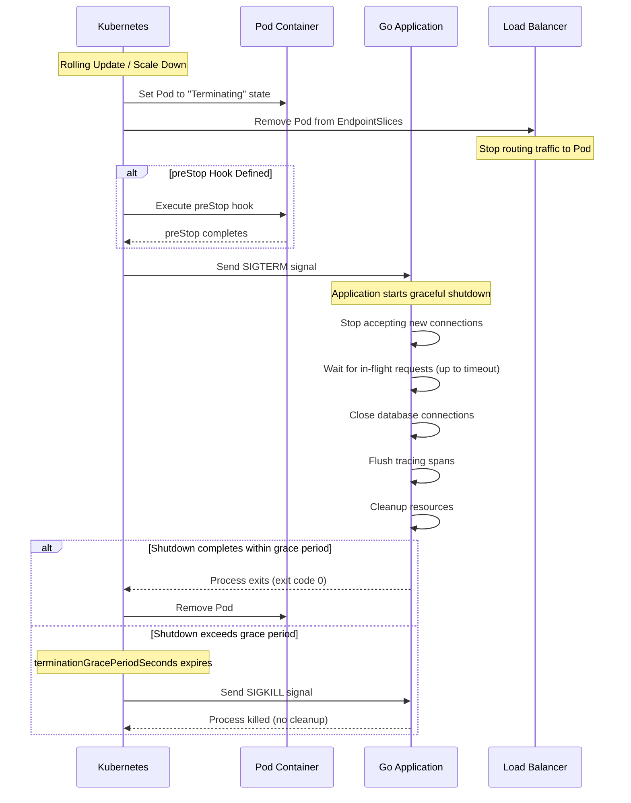
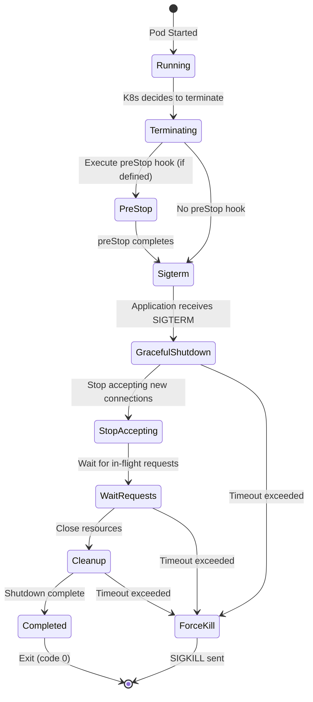

# Research: Graceful Shutdown Implementation for Go Microservices in Kubernetes

**Task ID:** graceful-shutdown-research
**Date:** 2025-12-25
**Last Updated:** 2025-12-25
**Version:** 1.1
**Status:** Complete

**Reference:** [Mastering Graceful Shutdowns in Go: A Comprehensive Guide for Kubernetes](https://hackernoon.com/mastering-graceful-shutdowns-in-go-a-comprehensive-guide-for-kubernetes)

---

## Executive Summary

Graceful shutdown is critical for production Go applications running in Kubernetes. It ensures data integrity, prevents request loss, and maintains a seamless user experience during deployments and scaling operations. Our codebase already implements basic graceful shutdown patterns, but there are opportunities to improve alignment with industry best practices from companies like Shopee, Grab, Uber, and modern Go patterns.

**Key Findings:**
1. **Current Implementation**: ✅ Basic graceful shutdown exists (signal handling, server shutdown, tracer cleanup)
2. **Gaps Identified**: ⚠️ Missing modern `signal.NotifyContext`, no in-flight request tracking, no Kubernetes-specific config
3. **Best Practices**: Industry standard uses `signal.NotifyContext`, explicit in-flight request tracking, Kubernetes `terminationGracePeriodSeconds`, and `preStop` hooks
4. **Recommendation**: Enhance current implementation with modern Go patterns and Kubernetes-specific configurations

---

## Codebase Analysis

### Current Implementation Pattern

**Location:** All 9 services follow the same pattern in `services/cmd/{service}/main.go`

**Current Code Structure:**

```go
// Signal handling (channel-based - older approach)
quit := make(chan os.Signal, 1)
signal.Notify(quit, syscall.SIGINT, syscall.SIGTERM)
<-quit

logger.Info("Shutting down server...")

// Shutdown context with timeout
shutdownCtx, cancel := context.WithTimeout(context.Background(), 10*time.Second)
defer cancel()

// Parallel shutdown with WaitGroup
var wg sync.WaitGroup

// Shutdown tracing (flush pending spans)
if tp != nil {
    wg.Add(1)
    go func() {
        defer wg.Done()
        if err := tp.Shutdown(shutdownCtx); err != nil {
            logger.Error("Error shutting down tracer", zap.Error(err))
        } else {
            logger.Info("Tracer shutdown complete")
        }
    }()
}

// Shutdown HTTP server
wg.Add(1)
go func() {
    defer wg.Done()
    if err := srv.Shutdown(shutdownCtx); err != nil {
        logger.Error("Server forced to shutdown", zap.Error(err))
    } else {
        logger.Info("HTTP server shutdown complete")
    }
}()

wg.Wait()
logger.Info("Server exited gracefully")
```

**Strengths:**
- ✅ Handles SIGTERM and SIGINT signals
- ✅ Uses `server.Shutdown()` for graceful HTTP server shutdown
- ✅ Has shutdown timeout (10 seconds)
- ✅ Parallel shutdown of tracer and HTTP server
- ✅ Proper error handling and logging
- ✅ Database connections closed with `defer db.Close()`

**Limitations:**
- ⚠️ Uses channel-based signal handling (`signal.Notify`) instead of modern `signal.NotifyContext`
- ⚠️ No explicit tracking of in-flight requests (relies on Gin's automatic handling)
- ⚠️ Database connection cleanup happens via `defer` (not in shutdown sequence)
- ⚠️ No Kubernetes-specific configuration (`terminationGracePeriodSeconds`, `preStop` hooks)
- ⚠️ Fixed 10-second timeout (not configurable)

### Handler Analysis

**Finding:** Handlers are synchronous, no goroutines spawned

**Example from `services/internal/auth/web/v1/handler.go`:**

```go
func Login(c *gin.Context) {
    // Synchronous handler - no goroutines
    ctx, span := middleware.StartSpan(c.Request.Context(), "http.request", ...)
    defer span.End()
    
    // Process request synchronously
    response, err := authService.Login(ctx, req)
    // ...
    c.JSON(http.StatusOK, response)
}
```

**Implication:** Gin framework automatically handles each request in its own goroutine. When `server.Shutdown()` is called, Gin waits for all in-flight request handlers to complete. This is good, but we should verify this behavior.

### Kubernetes Configuration

**Finding:** No Kubernetes-specific graceful shutdown configuration

**Missing:**
- `terminationGracePeriodSeconds` in Deployment spec
- `preStop` lifecycle hook
- No documentation about Kubernetes termination lifecycle

**Current Helm Template:** `charts/templates/deployment.yaml`
- No `terminationGracePeriodSeconds` configured
- No `lifecycle.preStop` hook defined

---

## Linux Signals Deep Dive

### Signal Types

**Shutdown Signals:**

| Signal | Description | Can be Caught? | Use Case |
|--------|-------------|----------------|----------|
| **SIGTERM** | Termination request | ✅ Yes | Kubernetes sends this to pods during termination |
| **SIGKILL** | Force termination | ❌ No | Kubernetes sends this after grace period expires |
| **SIGINT** | Interrupt (Ctrl+C) | ✅ Yes | User-initiated termination |
| **SIGQUIT** | Quit (Ctrl+D) | ✅ Yes | User-initiated quit |

**Key Points:**
- SIGTERM is the primary signal Kubernetes uses for pod termination
- SIGKILL cannot be caught - process is immediately killed
- SIGINT is useful for local development (Ctrl+C)
- SIGQUIT can be used for graceful shutdown with core dump

### Signal Handling in Go

**Two Approaches:**

#### 1. Channel-Based (Current - Older Pattern)

```go
quit := make(chan os.Signal, 1)
signal.Notify(quit, syscall.SIGTERM, syscall.SIGINT)
<-quit  // Block until signal received
```

**Pros:**
- Simple and straightforward
- Works with all Go versions
- Easy to understand

**Cons:**
- Doesn't integrate well with context-based patterns
- Harder to test
- Less idiomatic in modern Go

#### 2. Context-Based (Modern - Recommended)

```go
ctx, stop := signal.NotifyContext(context.Background(), syscall.SIGTERM, syscall.SIGINT)
defer stop()

// Use ctx.Done() to detect shutdown
<-ctx.Done()
```

**Pros:**
- ✅ Integrates with Go's context pattern
- ✅ Can be passed to functions that accept context
- ✅ Better for testing (can cancel context programmatically)
- ✅ More idiomatic Go code
- ✅ Can combine with other contexts (timeout, cancellation)

**Cons:**
- Requires Go 1.16+ (we're on Go 1.25, so ✅ compatible)

**Reference:** [Go 1.16 Release Notes - signal.NotifyContext](https://golang.org/doc/go1.16#os/signal)

---

## Kubernetes Termination Lifecycle

### Termination Flow Diagram



### Key Kubernetes Concepts

#### 1. Pod Termination State

When Kubernetes decides to terminate a pod:
1. **Pod marked as "Terminating"** - Removed from Service EndpointSlices immediately (Endpoints API deprecated in K8s 1.35)
2. **Traffic stops** - Load balancer (kube-proxy) stops routing new requests via EndpointSlices
3. **preStop hook** - Optional hook executed before SIGTERM
4. **SIGTERM sent** - Application receives termination signal
5. **Grace period** - Kubernetes waits `terminationGracePeriodSeconds` (default: 30s)
6. **SIGKILL sent** - If still running after grace period

#### 2. terminationGracePeriodSeconds

**Default:** 30 seconds

**Purpose:** Maximum time Kubernetes waits for graceful shutdown before force-killing

**Configuration:**

```yaml
spec:
  template:
    spec:
      terminationGracePeriodSeconds: 30  # Default, can increase if needed
```

**Best Practice:** Set to `shutdown_timeout + buffer` (e.g., if shutdown timeout is 10s, set to 15-20s)

#### 3. preStop Hook

**Purpose:** Execute cleanup tasks before SIGTERM is sent

**Common Use Cases:**
- Drain connections from load balancer
- Wait for health checks to fail
- Notify external systems

**Example:**

```yaml
lifecycle:
  preStop:
    exec:
      command:
        - /bin/sh
        - -c
        - |
          # Wait for load balancer to stop routing traffic
          sleep 5
          # Or: curl -X POST http://localhost:8080/health/drain
```

**Note:** `preStop` execution time counts toward `terminationGracePeriodSeconds`

#### 4. EndpointSlices (Replaces Endpoints)

**Status:** Endpoints API deprecated in Kubernetes 1.33, removed in 1.35

**What are EndpointSlices?**

EndpointSlices are the modern replacement for the legacy Endpoints API. They provide better scalability and performance for large Kubernetes clusters.

**Key Benefits:**

1. **Better Scalability:** Endpoints stored all Pod IPs in a single object, causing performance issues at scale. EndpointSlices split endpoints into smaller chunks (max 100 endpoints per slice, configurable up to 1000).

2. **Efficient Updates:** Only affected EndpointSlices need updates when Pods change, reducing data transfer and processing overhead.

3. **Dual-Stack Support:** Native support for both IPv4 and IPv6 endpoints.

4. **Large Cluster Performance:** Critical for clusters with thousands of nodes (e.g., OpenAI's 7500-node cluster).

**How It Works:**

- Control plane automatically creates EndpointSlices for Services with selectors
- Each EndpointSlice groups endpoints by IP family, protocol, port, and Service name
- kube-proxy watches EndpointSlices (not Endpoints) for routing decisions
- When a Pod is terminated, it's immediately removed from EndpointSlices, stopping traffic routing

**EndpointSlice Conditions:**

- `serving`: Endpoint is currently serving responses (maps to Pod Ready condition)
- `terminating`: Endpoint is terminating (set when Pod receives deletion timestamp)
- `ready`: Shortcut for "serving and not terminating"

**During Pod Termination:**

When Kubernetes decides to terminate a Pod:
1. Pod marked as "Terminating" state
2. **Pod removed from EndpointSlices immediately** - kube-proxy stops routing traffic
3. `preStop` hook executed (if defined)
4. SIGTERM sent to container
5. Grace period countdown begins
6. SIGKILL sent if still running after grace period

**Reference:** [Kubernetes EndpointSlices Documentation](https://kubernetes.io/docs/concepts/services-networking/endpoint-slices/)

**OpenAI Scaling Case Study:**

OpenAI's infrastructure team scaled Kubernetes to 7500 nodes, where EndpointSlices became critical:
- Legacy Endpoints API couldn't handle the scale efficiently
- EndpointSlices provided the necessary performance improvements
- Reduced control plane load and improved update efficiency
- Essential for large-scale production deployments

**Reference:** [OpenAI: Scaling Kubernetes to 7500 Nodes](https://openai.com/index/scaling-kubernetes-to-7500-nodes/)

---

## Best Practices from Industry

### Pattern 1: Modern Go Signal Handling (Stripe, GitHub)

**Approach:** Use `signal.NotifyContext` with context-based shutdown

```go
func main() {
    // Modern signal handling
    ctx, stop := signal.NotifyContext(context.Background(), syscall.SIGTERM, syscall.SIGINT)
    defer stop()
    
    // Start server
    go func() {
        if err := srv.ListenAndServe(); err != nil && err != http.ErrServerClosed {
            logger.Fatal("Failed to start server", zap.Error(err))
        }
    }()
    
    // Wait for shutdown signal
    <-ctx.Done()
    
    // Graceful shutdown
    shutdownCtx, cancel := context.WithTimeout(context.Background(), 10*time.Second)
    defer cancel()
    
    if err := srv.Shutdown(shutdownCtx); err != nil {
        logger.Error("Server shutdown error", zap.Error(err))
    }
}
```

**Benefits:**
- ✅ Context-based (idiomatic Go)
- ✅ Easy to test (can cancel context)
- ✅ Can combine with other contexts

### Pattern 2: In-Flight Request Tracking (Uber, Grab)

**Approach:** Explicitly track in-flight requests with WaitGroup

**Use Case:** When handlers spawn goroutines for background processing

```go
var wg sync.WaitGroup

func handler(w http.ResponseWriter, r *http.Request) {
    wg.Add(1)
    go func() {
        defer wg.Done()
        // Process request asynchronously
        processRequest(r)
    }()
    w.WriteHeader(http.StatusOK)
}

// During shutdown
func shutdown() {
    // Stop accepting new requests
    srv.Shutdown(ctx)
    
    // Wait for all in-flight requests
    wg.Wait()
}
```

**Our Case:** Handlers are synchronous, so Gin's automatic handling is sufficient. However, if we add background processing, we'll need this pattern.

### Pattern 3: Resource Cleanup Order (Shopee, Grab)

**Approach:** Explicit cleanup sequence during shutdown

```go
func shutdown() {
    // 1. Stop accepting new connections
    srv.Shutdown(ctx)
    
    // 2. Wait for in-flight requests (if tracking)
    wg.Wait()
    
    // 3. Close database connections
    db.Close()
    
    // 4. Flush tracing spans
    tp.Shutdown(ctx)
    
    // 5. Close other resources
    redis.Close()
    // ...
}
```

**Our Current:** Database closed via `defer`, tracer shutdown in parallel. Should be more explicit.

### Pattern 4: Kubernetes-Specific Configuration (All Large Companies)

**Approach:** Configure Kubernetes for optimal graceful shutdown

```yaml
spec:
  template:
    spec:
      terminationGracePeriodSeconds: 30  # Match shutdown timeout + buffer
      containers:
        - name: app
          lifecycle:
            preStop:
              exec:
                command:
                  - /bin/sh
                  - -c
                  - |
                    # Optional: Wait for drain or health check
                    sleep 2
```

**Benefits:**
- ✅ Ensures enough time for graceful shutdown
- ✅ Can drain connections before SIGTERM
- ✅ Prevents SIGKILL during shutdown

---

## Comparison: Current vs Best Practices

| Aspect | Current Implementation | Best Practice | Gap |
|--------|----------------------|---------------|-----|
| **Signal Handling** | Channel-based (`signal.Notify`) | Context-based (`signal.NotifyContext`) | ⚠️ Should migrate |
| **In-Flight Requests** | Relies on Gin's automatic handling | Explicit tracking (if needed) | ✅ OK for now |
| **Shutdown Timeout** | Fixed 10 seconds | Configurable via env var | ⚠️ Should make configurable |
| **Resource Cleanup** | `defer db.Close()`, parallel tracer | Explicit cleanup sequence | ⚠️ Should be explicit |
| **K8s Config** | None | `terminationGracePeriodSeconds`, `preStop` | ❌ Missing |
| **Error Handling** | ✅ Good | ✅ Good | ✅ OK |
| **Logging** | ✅ Good | ✅ Good | ✅ OK |

---

## Recommendations

### Primary Recommendation: Enhance Current Implementation

**Rationale:**
- Current implementation is solid but can be improved
- Modern Go patterns are more idiomatic
- Kubernetes-specific config ensures reliable shutdown
- Low risk - incremental improvements

### Implementation Priorities

#### Priority 1: Migrate to `signal.NotifyContext` (High Impact, Low Risk)

**Why:**
- More idiomatic Go code
- Better integration with context pattern
- Easier to test
- Industry standard

**Change:**
```go
// Before
quit := make(chan os.Signal, 1)
signal.Notify(quit, syscall.SIGINT, syscall.SIGTERM)
<-quit

// After
ctx, stop := signal.NotifyContext(context.Background(), syscall.SIGINT, syscall.SIGTERM)
defer stop()
<-ctx.Done()
```

#### Priority 2: Add Kubernetes Configuration (High Impact, Low Risk)

**Why:**
- Ensures graceful shutdown in Kubernetes
- Prevents SIGKILL during shutdown
- Industry standard practice

**Changes:**

1. **Add `terminationGracePeriodSeconds` to Helm template:**

```yaml
# charts/templates/deployment.yaml
spec:
  template:
    spec:
      terminationGracePeriodSeconds: {{ .Values.terminationGracePeriodSeconds | default 30 }}
```

2. **Add to values.yaml:**

```yaml
# charts/values.yaml
terminationGracePeriodSeconds: 30  # Match shutdown timeout + buffer
```

3. **Optional: Add `preStop` hook** (if needed for connection draining):

```yaml
lifecycle:
  preStop:
    exec:
      command:
        - /bin/sh
        - -c
        - sleep 2  # Wait for load balancer to drain
```

#### Priority 3: Make Shutdown Timeout Configurable (Medium Impact, Low Risk)

**Why:**
- Different services may need different timeouts
- Allows tuning without code changes

**Change:**
```go
shutdownTimeout := 10 * time.Second
if timeoutStr := os.Getenv("SHUTDOWN_TIMEOUT"); timeoutStr != "" {
    if timeout, err := time.ParseDuration(timeoutStr); err == nil {
        shutdownTimeout = timeout
    }
}
shutdownCtx, cancel := context.WithTimeout(context.Background(), shutdownTimeout)
```

#### Priority 4: Explicit Resource Cleanup Sequence (Medium Impact, Low Risk)

**Why:**
- More predictable shutdown order
- Better error handling
- Easier to debug

**Change:**
```go
// Explicit cleanup sequence
logger.Info("Shutting down server...")

// 1. Stop accepting new connections
if err := srv.Shutdown(shutdownCtx); err != nil {
    logger.Error("Server shutdown error", zap.Error(err))
}

// 2. Close database connections
if err := db.Close(); err != nil {
    logger.Error("Database close error", zap.Error(err))
}

// 3. Flush tracing spans
if tp != nil {
    if err := tp.Shutdown(shutdownCtx); err != nil {
        logger.Error("Tracer shutdown error", zap.Error(err))
    }
}
```

**Note:** Current `defer db.Close()` is fine, but explicit cleanup is clearer.

#### Priority 5: Add In-Flight Request Tracking (Low Priority - Only if Needed)

**When to add:**
- If handlers spawn goroutines for background processing
- If we need to wait for async operations to complete

**Current Status:** ✅ Not needed - handlers are synchronous, Gin handles requests automatically

---

## Code Examples

### Example 1: Modern Signal Handling (Recommended)

```go
package main

import (
    "context"
    "net/http"
    "os"
    "os/signal"
    "syscall"
    "time"
    
    "github.com/gin-gonic/gin"
    "go.uber.org/zap"
)

func main() {
    logger, _ := zap.NewProduction()
    defer logger.Sync()
    
    // Modern signal handling with context
    ctx, stop := signal.NotifyContext(context.Background(), syscall.SIGTERM, syscall.SIGINT)
    defer stop()
    
    srv := &http.Server{
        Addr:    ":8080",
        Handler: setupRouter(),
    }
    
    // Start server in goroutine
    go func() {
        logger.Info("Starting server", zap.String("addr", srv.Addr))
        if err := srv.ListenAndServe(); err != nil && err != http.ErrServerClosed {
            logger.Fatal("Server failed", zap.Error(err))
        }
    }()
    
    // Wait for shutdown signal
    <-ctx.Done()
    logger.Info("Shutdown signal received")
    
    // Graceful shutdown with timeout
    shutdownCtx, cancel := context.WithTimeout(context.Background(), 10*time.Second)
    defer cancel()
    
    if err := srv.Shutdown(shutdownCtx); err != nil {
        logger.Error("Server shutdown error", zap.Error(err))
    } else {
        logger.Info("Server shutdown complete")
    }
}
```

### Example 2: With In-Flight Request Tracking

```go
var wg sync.WaitGroup

func handler(w http.ResponseWriter, r *http.Request) {
    wg.Add(1)
    go func() {
        defer wg.Done()
        // Process request asynchronously
        processRequest(r)
    }()
    w.WriteHeader(http.StatusOK)
}

func shutdown() {
    // Stop accepting new connections
    srv.Shutdown(ctx)
    
    // Wait for all in-flight requests
    done := make(chan struct{})
    go func() {
        wg.Wait()
        close(done)
    }()
    
    select {
    case <-done:
        logger.Info("All requests completed")
    case <-time.After(5 * time.Second):
        logger.Warn("Timeout waiting for requests")
    }
}
```

### Example 3: Complete Pattern (Industry Standard)

```go
func main() {
    // Setup
    logger, _ := zap.NewProduction()
    defer logger.Sync()
    
    db := connectDB()
    defer db.Close()
    
    tp := initTracing()
    
    // Modern signal handling
    ctx, stop := signal.NotifyContext(context.Background(), syscall.SIGTERM, syscall.SIGINT)
    defer stop()
    
    srv := &http.Server{
        Addr:    ":8080",
        Handler: setupRouter(),
    }
    
    // Start server
    go func() {
        logger.Info("Starting server")
        if err := srv.ListenAndServe(); err != nil && err != http.ErrServerClosed {
            logger.Fatal("Server failed", zap.Error(err))
        }
    }()
    
    // Wait for shutdown signal
    <-ctx.Done()
    logger.Info("Shutdown signal received")
    
    // Shutdown with timeout
    shutdownCtx, cancel := context.WithTimeout(context.Background(), 10*time.Second)
    defer cancel()
    
    // Parallel shutdown
    var wg sync.WaitGroup
    
    // 1. Shutdown HTTP server (stops accepting new connections)
    wg.Add(1)
    go func() {
        defer wg.Done()
        if err := srv.Shutdown(shutdownCtx); err != nil {
            logger.Error("Server shutdown error", zap.Error(err))
        } else {
            logger.Info("Server shutdown complete")
        }
    }()
    
    // 2. Shutdown tracer (flush spans)
    if tp != nil {
        wg.Add(1)
        go func() {
            defer wg.Done()
            if err := tp.Shutdown(shutdownCtx); err != nil {
                logger.Error("Tracer shutdown error", zap.Error(err))
            } else {
                logger.Info("Tracer shutdown complete")
            }
        }()
    }
    
    // Wait for all shutdowns to complete
    wg.Wait()
    
    // 3. Close database (explicit cleanup)
    if err := db.Close(); err != nil {
        logger.Error("Database close error", zap.Error(err))
    }
    
    logger.Info("Graceful shutdown complete")
}
```

---

## Kubernetes Termination Lifecycle Diagram



**Timeline:**

```mermaid
gantt
    title Kubernetes Pod Termination Timeline (terminationGracePeriodSeconds: 30s)
    dateFormat HH:mm:ss
    axisFormat %H:%M:%S
    
    section Termination
    Pod marked Terminating :00:00:00, 1s
    Removed from EndpointSlices :00:00:01, 1s
    preStop hook (if any) :00:00:02, 3s
    SIGTERM sent :00:00:05, 1s
    Graceful shutdown :00:00:06, 10s
    SIGKILL (if timeout) :00:00:30, 1s
```



---

## Interview Preparation: Key Concepts

### 1. Linux Signals

**Q: What is SIGTERM vs SIGKILL?**

**A:**
- **SIGTERM**: Termination request signal. Can be caught and handled by application. Used for graceful shutdown.
- **SIGKILL**: Force termination signal. Cannot be caught. Process is immediately killed. Used as last resort.

**Q: Which signal does Kubernetes send first?**

**A:** SIGTERM. Kubernetes sends SIGTERM first, waits for `terminationGracePeriodSeconds` (default 30s), then sends SIGKILL if process is still running.

### 2. Graceful Shutdown in Go

**Q: How do you implement graceful shutdown in Go?**

**A:**
1. Listen for SIGTERM/SIGINT using `signal.NotifyContext` (modern) or `signal.Notify` (legacy)
2. Stop accepting new connections with `server.Shutdown(ctx)`
3. Wait for in-flight requests to complete (Gin does this automatically, or use WaitGroup if tracking)
4. Close resources (database, connections, flush tracing)
5. Exit cleanly

**Q: Why use `server.Shutdown()` instead of just exiting?**

**A:** `server.Shutdown()`:
- Stops accepting new connections immediately
- Waits for existing connections to complete
- Prevents request loss during shutdown
- Ensures data integrity

### 3. Kubernetes Termination

**Q: What happens when Kubernetes terminates a pod?**

**A:**
1. Pod marked as "Terminating"
2. Removed from Service EndpointSlices (traffic stops) - Endpoints API deprecated in K8s 1.35
3. `preStop` hook executed (if defined)
4. SIGTERM sent to container
5. Kubernetes waits `terminationGracePeriodSeconds` (default 30s)
6. SIGKILL sent if still running

**Q: What is `terminationGracePeriodSeconds`?**

**A:** Maximum time Kubernetes waits for graceful shutdown before force-killing (SIGKILL). Default: 30 seconds. Should be set to `shutdown_timeout + buffer`.

**Q: What is a `preStop` hook?**

**A:** Command executed before SIGTERM is sent. Common use: wait for load balancer to drain connections, or notify external systems. Execution time counts toward grace period.

### 4. Best Practices

**Q: How do you handle long-running requests during shutdown?**

**A:**
- Set appropriate `shutdown_timeout` (e.g., 10-30 seconds)
- Set `terminationGracePeriodSeconds` to `shutdown_timeout + buffer`
- Track in-flight requests with WaitGroup if handlers spawn goroutines
- Log warnings if shutdown exceeds timeout
- Consider request cancellation using context

**Q: What if shutdown takes longer than grace period?**

**A:** Kubernetes sends SIGKILL, process is force-killed. No cleanup happens. To prevent:
- Increase `terminationGracePeriodSeconds`
- Reduce shutdown timeout
- Optimize cleanup operations
- Use `preStop` hook to drain connections earlier

---

## Open Questions

1. **Shutdown Timeout:** Should it be configurable per service or global?
   - **Recommendation:** Configurable per service via env var

2. **preStop Hook:** Do we need connection draining?
   - **Recommendation:** Start without, add if needed

3. **In-Flight Tracking:** Do we need explicit WaitGroup for handlers?
   - **Recommendation:** Not needed now (handlers are synchronous), add if we spawn goroutines

4. **Database Cleanup:** Should we move `defer db.Close()` to explicit shutdown?
   - **Recommendation:** Keep `defer` for safety, but also close explicitly in shutdown

5. **Error Handling:** What should happen if shutdown fails?
   - **Recommendation:** Log error, continue shutdown, exit with non-zero code if critical

---

## Next Steps

1. **Review findings** with team
2. **Prioritize improvements** (start with signal.NotifyContext migration)
3. **Run `/specify graceful-shutdown-research`** to define detailed requirements
4. **Run `/plan graceful-shutdown-research`** to create implementation plan
5. **Test graceful shutdown** in Kubernetes environment
6. **Document** Kubernetes termination lifecycle for team

---

## References

- [Mastering Graceful Shutdowns in Go - HackerNoon](https://hackernoon.com/mastering-graceful-shutdowns-in-go-a-comprehensive-guide-for-kubernetes)
- [Go signal.NotifyContext Documentation](https://pkg.go.dev/os/signal#NotifyContext)
- [Kubernetes Pod Lifecycle](https://kubernetes.io/docs/concepts/workloads/pods/pod-lifecycle/)
- [Kubernetes EndpointSlices Documentation](https://kubernetes.io/docs/concepts/services-networking/endpoint-slices/)
- [OpenAI: Scaling Kubernetes to 7500 Nodes](https://openai.com/index/scaling-kubernetes-to-7500-nodes/)
- [Kubernetes v1.33: Endpoints Deprecation](https://kubernetes.io/blog/2025/04/24/endpoints-deprecation/)
- [Gin Framework Graceful Shutdown](https://github.com/gin-gonic/gin#graceful-shutdown)
- [Go net/http Server.Shutdown](https://pkg.go.dev/net/http#Server.Shutdown)

---

*Research completed with SDD 2.0*

