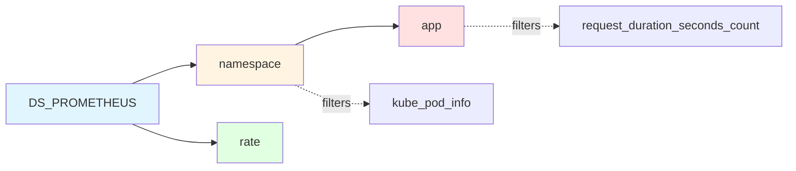

# Grafana Dashboard Optimization - Implementation Plan

**Feature ID**: grafana-dashboard-optimization  
**Status**: Planning  
**Last Updated**: 2025-12-11  
**Owner**: DevOps Team

---

## Executive Summary

This plan addresses a critical bug in the Grafana dashboard where variable cascading doesn't work correctly, preventing proper filtering by namespace. The fix involves reordering variables and updating their queries to establish proper dependencies. Additionally, we'll update documentation to reflect best practices and optionally explore PodMonitor migration for Vector.

**Timeline**: 2-4 hours  
**Risk Level**: Low (dashboard-only changes, no infrastructure impact)  
**Breaking Changes**: None

---

## Architecture Overview

### Current Architecture

```mermaid
flowchart TD
    A[Prometheus] -->|Scrapes| B[ServiceMonitor: microservices-api]
    A -->|Scrapes| C[ServiceMonitor: Vector]
    B -->|Discovers| D[Microservices Pods]
    C -->|Discovers| E[Vector DaemonSet]
    D -->|Exposes| F[/metrics endpoints]
    E -->|Exposes| G[/metrics endpoint]
    F -->|Labels| H[app, namespace, job=microservices]
    G -->|Labels| I[app=vector, namespace=kube-system]
    A -->|Stores| J[Time Series DB]
    J -->|Queries| K[Grafana Dashboard]
    K -->|Variables| L[DS_PROMETHEUS, app, namespace, rate]
    K -->|32 Panels| M[Visualization]
```

### Problem: Variable Cascading

**Current (BROKEN)**:
```json
{
  "templating": {
    "list": [
      { "name": "DS_PROMETHEUS" },      // ✅ Independent
      { 
        "name": "app",                   // ❌ Wrong order!
        "query": "label_values(request_duration_seconds_count, app)"  // ❌ No namespace filter
      },
      { 
        "name": "namespace",             // ❌ Should be before app
        "query": "label_values(kube_pod_info, namespace)"
      },
      { "name": "rate" }                 // ✅ Independent
    ]
  }
}
```

**Issue**: App variable doesn't filter by namespace because:
1. Variable order is wrong (app before namespace in UI)
2. App query has no `{namespace=~"$namespace"}` filter
3. No refresh trigger when namespace changes

**Impact**:
- Namespace filter shows "All" and can't be changed
- App dropdown shows all apps across all namespaces
- Panels may show incorrect aggregated data
- User can't focus on specific namespace

### Solution Architecture

**Fixed (CORRECT)**:
```json
{
  "templating": {
    "list": [
      { "name": "DS_PROMETHEUS" },      // ✅ Independent datasource
      { 
        "name": "namespace",             // ✅ First filter (independent)
        "query": "label_values(kube_pod_info, namespace)",
        "regex": "/^(?!(kube-.*|default)$).*/"
      },
      { 
        "name": "app",                   // ✅ Cascades from namespace
        "query": "label_values(request_duration_seconds_count{namespace=~\"$namespace\"}, app)",
        "refresh": 1,                    // ✅ Refresh on dashboard load
        "sort": 1                        // ✅ Alphabetical sort
      },
      { "name": "rate" }                 // ✅ Independent rate interval
    ]
  }
}
```

**Benefits**:
1. ✅ Namespace appears first in UI
2. ✅ App dropdown updates when namespace changes
3. ✅ Proper cascading: datasource → namespace → app → rate
4. ✅ All 34 queries correctly filtered

### Variable Dependency Flow



**Dependency Chain**:
- `DS_PROMETHEUS`: Independent (datasource selection)
- `namespace`: Independent (queries all namespaces from kube_pod_info)
- `app`: **Dependent on namespace** (filters apps by selected namespace)
- `rate`: Independent (time interval selector)

---

## Technology Stack

### Core Technologies

| Technology | Version | Purpose | Justification |
|------------|---------|---------|---------------|
| **Grafana Dashboard JSON** | v10.x | Dashboard definition | Standard Grafana format; supports variable cascading |
| **Prometheus Query Language (PromQL)** | 2.x | Metric queries | Industry standard for time-series queries |
| **Kubernetes ServiceMonitor** | v1 (monitoring.coreos.com) | Service discovery | Existing architecture; Prometheus Operator standard |
| **Grafana Operator** | v5.x | Dashboard deployment | Automated dashboard provisioning from Git |
| **kube-state-metrics** | 2.x | Kubernetes metadata | Provides `kube_pod_info` metric for namespace discovery |

### Variable Query Technologies

**Namespace Discovery**: Uses `kube_pod_info` from kube-state-metrics
```promql
label_values(kube_pod_info, namespace)
```
- **Why**: More reliable than app metrics (always available)
- **Alternative considered**: `label_values(request_duration_seconds_count, namespace)` - rejected because depends on app traffic

**App Discovery**: Uses application metrics with namespace filter
```promql
label_values(request_duration_seconds_count{namespace=~"$namespace"}, app)
```
- **Why**: Ensures app list matches selected namespace
- **Alternative considered**: `label_values(kube_pod_info{namespace=~"$namespace"}, label_app)` - rejected because label name mismatch

---

## Implementation Phases

### Phase 1: Critical Variable Fix (P0) - 1 hour

**Objective**: Fix variable cascading to enable proper namespace filtering

#### Step 1.1: Backup Current Dashboard
```bash
cp k8s/grafana-operator/dashboards/microservices-dashboard.json \
   k8s/grafana-operator/dashboards/microservices-dashboard.json.backup-$(date +%Y%m%d)
```

#### Step 1.2: Update Variable Order
**File**: `k8s/grafana-operator/dashboards/microservices-dashboard.json`

**Change**: Reorder `templating.list` array
```json
// BEFORE (lines ~2600-2655)
"templating": {
  "list": [
    { "name": "DS_PROMETHEUS", ... },
    { "name": "app", ... },          // ❌ Wrong order
    { "name": "namespace", ... },
    { "name": "rate", ... }
  ]
}

// AFTER
"templating": {
  "list": [
    { "name": "DS_PROMETHEUS", ... },
    { "name": "namespace", ... },    // ✅ Move to position 2
    { "name": "app", ... },          // ✅ Move to position 3
    { "name": "rate", ... }
  ]
}
```

#### Step 1.3: Fix Namespace Variable Query
**Current**:
```json
{
  "name": "namespace",
  "query": "label_values(kube_pod_info, namespace)",  // ✅ Already correct!
  "regex": "/^(?!(kube-.*|default)$).*/"
}
```
**Action**: No changes needed - query is already correct

#### Step 1.4: Fix App Variable Query
**Current**:
```json
{
  "name": "app",
  "query": "label_values(request_duration_seconds_count, app)",  // ❌ No namespace filter
  "includeAll": true,
  "multi": true
}
```

**New**:
```json
{
  "name": "app",
  "query": "label_values(request_duration_seconds_count{namespace=~\"$namespace\"}, app)",  // ✅ Cascades from namespace
  "includeAll": true,
  "multi": true,
  "refresh": 1,      // ✅ Refresh on dashboard load
  "sort": 1          // ✅ Alphabetical sort
}
```

**Key Changes**:
- Add `{namespace=~"$namespace"}` filter to query
- Add `"refresh": 1` to trigger update on dashboard load
- Add `"sort": 1` for alphabetical ordering

#### Step 1.5: Validate Panel Queries
**Action**: Verify all 34 queries already use correct pattern
```promql
{app=~"$app", namespace=~"$namespace", job=~"microservices"}
```
**Expected**: All queries already correct (verified in research phase)

#### Step 1.6: Apply Changes
```bash
# Reapply dashboard via Grafana Operator
kubectl apply -k k8s/grafana-operator/dashboards/

# Check GrafanaDashboard status
kubectl get grafanadashboards -n monitoring microservices-monitoring -o yaml

# Restart Grafana pod to force reload (if needed)
kubectl rollout restart deployment/grafana-deployment -n monitoring
```

#### Step 1.7: Manual Testing
1. Open dashboard: http://localhost:3000/d/microservices-monitoring-001/
2. Test namespace filter:
   - Select specific namespace (e.g., "auth")
   - Verify app dropdown updates to show only apps in "auth" namespace
   - Verify panels show data only from selected namespace
3. Test "All" option:
   - Select namespace = "All"
   - Verify app dropdown shows all apps
4. Test multi-select:
   - Select multiple namespaces
   - Verify app dropdown shows apps from selected namespaces only

**Success Criteria**:
- ✅ Namespace dropdown appears before app dropdown in UI
- ✅ Selecting namespace filters app dropdown
- ✅ All panels reflect filtered data
- ✅ "All" option works for both variables

---

### Phase 2: Documentation Updates (P0) - 1-2 hours

**Objective**: Update all documentation to reflect corrected dashboard architecture

#### Step 2.1: Update docs/monitoring/METRICS.md

**File**: `docs/monitoring/METRICS.md`

**Add new section** after "Dashboard Variables" section:

```markdown
### Variable Cascading Best Practices

**Correct Variable Order**:
1. `$DS_PROMETHEUS` - Datasource selector (independent)
2. `$namespace` - Namespace filter (independent)
3. `$app` - App/service filter (depends on namespace)
4. `$rate` - Rate interval (independent)

**Variable Dependencies**:

\`\`\`mermaid
flowchart LR
    A[DS_PROMETHEUS] --> B[namespace]
    B --> C[app]
    A --> D[rate]
\`\`\`

**Implementation Pattern**:
- **Namespace variable**: Use `label_values(kube_pod_info, namespace)` for reliability
- **App variable**: Use `label_values(request_duration_seconds_count{namespace=~"$namespace"}, app)` for cascading
- **Always add `refresh: 1`** to dependent variables
- **Always add `sort: 1`** for alphabetical ordering

**Query Pattern in Panels**:
All panel queries MUST include both filters:
\`\`\`promql
metric_name{app=~"$app", namespace=~"$namespace", job=~"microservices"}
\`\`\`

**Troubleshooting Variable Cascading**:
- **Symptom**: Namespace filter stuck on "All"
  - **Cause**: App variable appears before namespace in variable order
  - **Fix**: Reorder variables in dashboard JSON
- **Symptom**: App dropdown doesn't update when namespace changes
  - **Cause**: App query missing `{namespace=~"$namespace"}` filter
  - **Fix**: Add namespace filter to app variable query
- **Symptom**: App dropdown empty
  - **Cause**: No metrics with selected namespace
  - **Fix**: Check if services are running and exposing metrics
```

#### Step 2.2: Update AGENTS.md

**File**: `AGENTS.md`

**Update section**: "Dashboard Files" and "Dashboard Details"

**Changes**:
1. Update variable order description:
```markdown
**Variables (CORRECTED ORDER)**:
- `$DS_PROMETHEUS` - Prometheus datasource selector
- `$namespace` - Namespace filter (independent) - **Must be before $app**
- `$app` - Multi-select service filter (cascades from namespace)
- `$rate` - Rate interval selector (1m-7d, default: 5m)
```

2. Add variable cascading note:
```markdown
**Variable Cascading**:
- `$namespace` filters `$app` via query: `label_values(request_duration_seconds_count{namespace=~"$namespace"}, app)`
- Order matters: namespace must be defined before app in JSON
- All panels use both filters: `{app=~"$app", namespace=~"$namespace"}`
```

#### Step 2.3: Update README.md

**File**: `README.md`

**Update section**: "📊 Monitoring Dashboard" (if exists)

**Add note**:
```markdown
**Dashboard Variables**:
- **Namespace**: Filter by Kubernetes namespace (e.g., auth, user, product)
- **App**: Filter by service (automatically updates based on selected namespace)
- **Rate**: Prometheus rate() interval (default: 5m)

**Tip**: Select namespace first, then app will show only services in that namespace.
```

#### Step 2.4: Create Troubleshooting Guide

**New file**: `docs/monitoring/TROUBLESHOOTING.md`

```markdown
# Grafana Dashboard Troubleshooting

## Variable Cascading Issues

### Namespace filter stuck on "All"

**Symptoms**:
- Namespace dropdown only shows "All"
- Cannot select specific namespaces

**Causes**:
1. Variable order incorrect in dashboard JSON
2. App variable defined before namespace variable

**Solution**:
1. Open `k8s/grafana-operator/dashboards/microservices-dashboard.json`
2. Check `templating.list` array order:
   ```json
   "list": [
     { "name": "DS_PROMETHEUS" },
     { "name": "namespace" },  // ✅ Must be before app
     { "name": "app" },
     { "name": "rate" }
   ]
   ```
3. Reapply: `kubectl apply -k k8s/grafana-operator/dashboards/`

### App dropdown doesn't update when namespace changes

**Symptoms**:
- Change namespace, but app dropdown shows all apps
- App list doesn't filter by namespace

**Causes**:
- App variable query missing namespace filter

**Solution**:
1. Open dashboard JSON
2. Find app variable definition
3. Update query:
   ```json
   {
     "name": "app",
     "query": "label_values(request_duration_seconds_count{namespace=~\"$namespace\"}, app)",
     "refresh": 1
   }
   ```
4. Reapply dashboard

### Panels show no data after filtering

**Symptoms**:
- Select namespace/app, panels go blank
- "No data" message in panels

**Causes**:
1. No services running in selected namespace
2. Services not exposing /metrics endpoint
3. Prometheus not scraping services

**Solution**:
1. Check services are running:
   ```bash
   kubectl get pods -n <namespace>
   ```
2. Check ServiceMonitor:
   ```bash
   kubectl get servicemonitors -n monitoring
   ```
3. Check Prometheus targets:
   - Port-forward: `kubectl port-forward -n monitoring svc/kube-prometheus-stack-prometheus 9090:9090`
   - Open: http://localhost:9090/targets
   - Look for services with label `job="microservices"`
4. Check metrics endpoint:
   ```bash
   kubectl port-forward -n <namespace> svc/<service> 8080:8080
   curl http://localhost:8080/metrics
   ```

## Query Performance Issues

### Dashboard slow to load

**Causes**:
- Too many time series queried
- Large time range selected
- High cardinality metrics

**Solution**:
1. Use namespace filter to reduce scope
2. Reduce time range
3. Increase rate interval ($rate variable)
4. Check Prometheus query performance:
   ```bash
   # Port-forward Prometheus
   kubectl port-forward -n monitoring svc/kube-prometheus-stack-prometheus 9090:9090
   
   # Open query page and check query time
   # http://localhost:9090/graph
   ```

### Panels show "Timeout" error

**Causes**:
- Query timeout (default 30s)
- Prometheus overloaded

**Solution**:
1. Increase query timeout in Grafana datasource settings
2. Optimize queries (use recording rules)
3. Scale Prometheus (increase resources)
```

#### Step 2.5: Update Documentation Index

**File**: `docs/README.md`

**Add entry**:
```markdown
- [Monitoring Troubleshooting](monitoring/TROUBLESHOOTING.md) - Debug dashboard and variable issues
```

---

### Phase 3: Optional PodMonitor Migration (P2) - 2-3 hours

**Objective**: Migrate Vector from ServiceMonitor to PodMonitor for consistency

**Status**: OPTIONAL - Current ServiceMonitor works correctly

#### Why Consider PodMonitor?

**Current**: Vector uses ServiceMonitor
```yaml
# k8s/vector/servicemonitor.yaml
apiVersion: monitoring.coreos.com/v1
kind: ServiceMonitor
metadata:
  name: vector
spec:
  selector:
    matchLabels:
      app.kubernetes.io/name: vector
```

**Proposed**: Vector uses PodMonitor
```yaml
# k8s/vector/podmonitor.yaml (NEW)
apiVersion: monitoring.coreos.com/v1
kind: PodMonitor
metadata:
  name: vector
spec:
  selector:
    matchLabels:
      app.kubernetes.io/name: vector
```

**Benefits**:
- ✅ Direct pod discovery (no Service dependency)
- ✅ Better for DaemonSets (one pod per node)
- ✅ Consistent with kube-state-metrics pattern

**Risks**:
- ⚠️ Breaking change if label relabeling differs
- ⚠️ Need to verify metric labels match

#### Step 3.1: Research PodMonitor Requirements

**Action**: Compare ServiceMonitor vs PodMonitor for Vector

**Check current labels**:
```bash
# Query current Vector metrics
curl -s http://localhost:9090/api/v1/query?query='vector_component_received_events_total' | jq '.data.result[0].metric'
```

**Expected labels** (from ServiceMonitor):
- `app_kubernetes_io_name="vector"`
- `job="vector"`
- `namespace="kube-system"`
- `instance="<pod-ip>:9090"`

#### Step 3.2: Create PodMonitor CRD

**New file**: `k8s/vector/podmonitor.yaml`

```yaml
apiVersion: monitoring.coreos.com/v1
kind: PodMonitor
metadata:
  name: vector
  namespace: monitoring
  labels:
    release: kube-prometheus-stack  # Required for Prometheus Operator discovery
spec:
  # Select Vector DaemonSet pods in kube-system namespace
  namespaceSelector:
    matchNames:
      - kube-system
  
  # Match Vector pods by label
  selector:
    matchLabels:
      app.kubernetes.io/name: vector
  
  # Scrape configuration
  podMetricsEndpoints:
  - port: prometheus-sink  # Named port from Vector DaemonSet
    path: /metrics
    interval: 15s
    scrapeTimeout: 10s
    relabelings:
      # Set job label to "vector" (for query consistency)
      - targetLabel: job
        replacement: vector
      # Preserve original pod name
      - sourceLabels: [__meta_kubernetes_pod_name]
        targetLabel: pod
      # Preserve namespace
      - sourceLabels: [__meta_kubernetes_namespace]
        targetLabel: namespace
```

#### Step 3.3: Test PodMonitor

**Action**: Deploy PodMonitor alongside ServiceMonitor (test mode)

```bash
# Apply PodMonitor (keeps ServiceMonitor active)
kubectl apply -f k8s/vector/podmonitor.yaml

# Check PodMonitor status
kubectl get podmonitor -n monitoring vector -o yaml

# Verify Prometheus discovers targets
# Port-forward Prometheus
kubectl port-forward -n monitoring svc/kube-prometheus-stack-prometheus 9090:9090

# Open Prometheus targets page
# http://localhost:9090/targets
# Look for "podMonitor/monitoring/vector/0" target
```

**Validation**:
1. Verify Vector pods discovered
2. Verify metrics scraped successfully
3. Verify labels match ServiceMonitor labels
4. Run test queries:
   ```promql
   vector_component_received_events_total
   ```

#### Step 3.4: Switch to PodMonitor

**If test successful**:

```bash
# Delete ServiceMonitor
kubectl delete -f k8s/vector/servicemonitor.yaml

# Keep PodMonitor (already applied)

# Update documentation
# Update k8s/vector/README.md to mention PodMonitor
```

**If test fails**:
```bash
# Delete PodMonitor
kubectl delete -f k8s/vector/podmonitor.yaml

# Keep ServiceMonitor (no changes)
```

#### Step 3.5: Update Documentation (if migrated)

**File**: `docs/monitoring/METRICS.md`

**Add section**:
```markdown
### Vector Metrics Collection (PodMonitor)

Vector uses **PodMonitor** for metrics collection:
- Direct pod discovery (no Service dependency)
- Efficient for DaemonSet architecture (one pod per node)
- Consistent labels with ServiceMonitor

**PodMonitor Configuration**:
\`\`\`yaml
apiVersion: monitoring.coreos.com/v1
kind: PodMonitor
metadata:
  name: vector
spec:
  namespaceSelector:
    matchNames: [kube-system]
  selector:
    matchLabels:
      app.kubernetes.io/name: vector
\`\`\`
```

**File**: `k8s/vector/README.md`

**Update section**:
```markdown
## Metrics Collection

Vector metrics are collected via **PodMonitor** (`k8s/vector/podmonitor.yaml`):
- Discovers Vector DaemonSet pods directly
- Scrapes `/metrics` endpoint on port `prometheus-sink` (9090)
- Labels: `job="vector"`, `namespace="kube-system"`

**Why PodMonitor?**
- Vector is a DaemonSet (one pod per node)
- Direct pod discovery is more efficient than Service-based discovery
- No Service object needed for metrics
```

---

## File Changes Summary

### Modified Files

| File | Changes | Lines Changed | Risk |
|------|---------|---------------|------|
| `k8s/grafana-operator/dashboards/microservices-dashboard.json` | Reorder variables, update app query | ~50 | Low |
| `docs/monitoring/METRICS.md` | Add variable cascading best practices | ~80 | None |
| `AGENTS.md` | Update dashboard variable documentation | ~30 | None |
| `README.md` | Add variable usage tip | ~10 | None |

### New Files

| File | Purpose | Lines | Risk |
|------|---------|-------|------|
| `docs/monitoring/TROUBLESHOOTING.md` | Dashboard troubleshooting guide | ~150 | None |
| `k8s/vector/podmonitor.yaml` | PodMonitor CRD (optional Phase 3) | ~30 | Low |
| `k8s/grafana-operator/dashboards/microservices-dashboard.json.backup-YYYYMMDD` | Backup before changes | ~2655 | None |

### Deleted Files (Optional Phase 3)

| File | Condition | Risk |
|------|-----------|------|
| `k8s/vector/servicemonitor.yaml` | Only if PodMonitor migration successful | Low |

---

## Testing Strategy

### Unit Testing

**N/A** - Dashboard changes are declarative JSON; no code to unit test

### Integration Testing

#### Test 1: Variable Cascading
**Objective**: Verify namespace filters app dropdown

**Steps**:
1. Open dashboard: http://localhost:3000/d/microservices-monitoring-001/
2. Select namespace = "auth"
3. Verify app dropdown shows only apps in "auth" namespace
4. Select namespace = "user"
5. Verify app dropdown updates to show apps in "user" namespace
6. Select namespace = "All"
7. Verify app dropdown shows all apps

**Expected**:
- ✅ App dropdown updates immediately when namespace changes
- ✅ App list matches selected namespace(s)

#### Test 2: Multi-Select Namespace
**Objective**: Verify multi-select namespace filtering

**Steps**:
1. Select namespace = "auth" + "user" (multi-select)
2. Verify app dropdown shows apps from both namespaces
3. Select app = "auth"
4. Verify panels show only "auth" service data from "auth" + "user" namespaces

**Expected**:
- ✅ App dropdown shows union of apps from selected namespaces
- ✅ Panels filter by both namespace and app

#### Test 3: All Panels Render
**Objective**: Verify all 32 panels work with new variables

**Steps**:
1. Select namespace = "auth", app = "auth"
2. Scroll through all 5 row groups
3. Verify all 32 panels show data (no errors)
4. Change to namespace = "All", app = "All"
5. Verify all panels still render

**Expected**:
- ✅ All 32 panels render without errors
- ✅ No "No data" or "Query error" messages
- ✅ Panels show correct filtered data

#### Test 4: Query Performance
**Objective**: Verify variable changes don't cause excessive Prometheus queries

**Steps**:
1. Open browser DevTools (Network tab)
2. Change namespace filter
3. Count Prometheus API queries
4. Change app filter
5. Count Prometheus API queries

**Expected**:
- ✅ < 40 queries per variable change (one per panel + metadata queries)
- ✅ No duplicate queries
- ✅ Dashboard loads in < 5 seconds

### Manual Testing Checklist

**Pre-Deployment**:
- [ ] Backup current dashboard JSON
- [ ] Test variable order change in local Grafana instance
- [ ] Verify all panel queries still valid

**Post-Deployment**:
- [ ] Namespace dropdown appears before app dropdown in UI
- [ ] Namespace filter works (select specific namespace)
- [ ] App dropdown updates when namespace changes
- [ ] App dropdown shows correct filtered list
- [ ] Multi-select namespace works
- [ ] Multi-select app works
- [ ] "All" option works for both variables
- [ ] All 32 panels render without errors
- [ ] Panels show correct filtered data
- [ ] Query performance acceptable (< 5s load time)

**Documentation**:
- [ ] METRICS.md updated with variable best practices
- [ ] AGENTS.md updated with correct variable order
- [ ] TROUBLESHOOTING.md created
- [ ] README.md updated with usage tip

**Optional (Phase 3)**:
- [ ] PodMonitor created for Vector
- [ ] Vector metrics still scraped correctly
- [ ] Vector labels match previous ServiceMonitor labels
- [ ] Documentation updated for PodMonitor

---

## Deployment Plan

### Pre-Deployment Checklist

- [ ] Review plan with team
- [ ] Schedule maintenance window (optional - no downtime expected)
- [ ] Backup current dashboard JSON
- [ ] Prepare rollback procedure

### Deployment Steps

#### Step 1: Backup Current Dashboard
```bash
cd /Users/duyne/work/Github/monitoring

# Create backup with timestamp
cp k8s/grafana-operator/dashboards/microservices-dashboard.json \
   k8s/grafana-operator/dashboards/microservices-dashboard.json.backup-$(date +%Y%m%d-%H%M%S)

# Verify backup
ls -lh k8s/grafana-operator/dashboards/*.backup-*
```

#### Step 2: Update Dashboard JSON
```bash
# Open dashboard JSON in editor
vim k8s/grafana-operator/dashboards/microservices-dashboard.json

# Make changes:
# 1. Reorder variables in templating.list array
# 2. Update app variable query with namespace filter
# 3. Add refresh: 1 to app variable
# 4. Add sort: 1 to app variable

# Validate JSON syntax
jq empty k8s/grafana-operator/dashboards/microservices-dashboard.json
# (no output = valid JSON)
```

#### Step 3: Apply Dashboard via Grafana Operator
```bash
# Reapply dashboards
kubectl apply -k k8s/grafana-operator/dashboards/

# Expected output:
# configmap/grafana-dashboards-microservices configured
# grafanadashboard.grafana.integreatly.org/microservices-monitoring configured
```

#### Step 4: Verify Grafana Operator Reconciliation
```bash
# Check GrafanaDashboard status
kubectl get grafanadashboards -n monitoring microservices-monitoring -o yaml

# Look for status.message: "success"

# Check Grafana Operator logs
kubectl logs -n monitoring deployment/grafana-operator --tail=50 -f
# Look for: "Dashboard reconciled successfully"
```

#### Step 5: Force Grafana Reload (if needed)
```bash
# If dashboard doesn't update automatically, restart Grafana
kubectl rollout restart deployment/grafana-deployment -n monitoring

# Wait for rollout to complete
kubectl rollout status deployment/grafana-deployment -n monitoring
```

#### Step 6: Manual Testing
```bash
# Port-forward Grafana (if not already)
kubectl port-forward -n monitoring svc/grafana-service 3000:3000

# Open dashboard in browser
# http://localhost:3000/d/microservices-monitoring-001/

# Run integration tests (see Testing Strategy section)
```

#### Step 7: Update Documentation
```bash
# Update docs/monitoring/METRICS.md
vim docs/monitoring/METRICS.md
# (add variable cascading best practices section)

# Update AGENTS.md
vim AGENTS.md
# (update dashboard variables description)

# Create TROUBLESHOOTING.md
vim docs/monitoring/TROUBLESHOOTING.md
# (create troubleshooting guide)

# Update README.md
vim README.md
# (add variable usage tip)

# Commit changes
git add k8s/grafana-operator/dashboards/microservices-dashboard.json \
        docs/monitoring/METRICS.md \
        AGENTS.md \
        README.md \
        docs/monitoring/TROUBLESHOOTING.md

git commit -m "fix(grafana): Fix dashboard variable cascading

- Reorder variables: namespace before app
- Add namespace filter to app variable query
- Add refresh and sort to app variable
- Update documentation with variable best practices
- Add troubleshooting guide for common issues

Fixes variable cascading bug where namespace filter didn't
update app dropdown correctly."
```

#### Step 8: Update CHANGELOG.md
```bash
vim CHANGELOG.md

# Add entry:
# ## [v0.6.15] - 2025-12-11
# ### Fixed
# - **Dashboard Variable Cascading**: Fixed namespace filter not cascading to app filter
#   - Reordered variables: namespace now appears before app in UI
#   - App variable query now filters by selected namespace
#   - Added refresh trigger to app variable
# ### Documentation
# - Added variable cascading best practices to METRICS.md
# - Added TROUBLESHOOTING.md for dashboard debugging
# - Updated AGENTS.md with correct variable order
```

### Rollback Procedure

**If dashboard broken after deployment**:

```bash
# Step 1: Restore backup
cp k8s/grafana-operator/dashboards/microservices-dashboard.json.backup-YYYYMMDD-HHMMSS \
   k8s/grafana-operator/dashboards/microservices-dashboard.json

# Step 2: Reapply
kubectl apply -k k8s/grafana-operator/dashboards/

# Step 3: Verify
kubectl get grafanadashboards -n monitoring microservices-monitoring -o yaml

# Step 4: Force reload
kubectl rollout restart deployment/grafana-deployment -n monitoring
```

**Rollback time**: < 2 minutes  
**Risk**: Very low (backup created before changes)

---

## Monitoring and Validation

### Health Checks

**Dashboard availability**:
```bash
# Check Grafana service
kubectl get svc -n monitoring grafana-service

# Check Grafana pod
kubectl get pods -n monitoring -l app=grafana

# Port-forward and test
kubectl port-forward -n monitoring svc/grafana-service 3000:3000
curl -s http://localhost:3000/api/health | jq .
```

**Expected**:
```json
{
  "commit": "...",
  "database": "ok",
  "version": "10.x.x"
}
```

### Metrics to Monitor

**Dashboard load time** (browser DevTools):
- Initial load: < 5 seconds
- Variable change: < 2 seconds

**Prometheus query count** (browser DevTools Network tab):
- Dashboard load: ~35 queries (1 per panel + metadata)
- Variable change: ~35 queries

**Error rate**:
- Panel errors: 0
- Query timeouts: 0

### Success Criteria

**Functional**:
- ✅ Namespace filter appears before app filter in UI
- ✅ App dropdown updates when namespace changes
- ✅ App dropdown shows only apps in selected namespace(s)
- ✅ All 32 panels render without errors
- ✅ Panels show correct filtered data
- ✅ Multi-select works for both variables
- ✅ "All" option works for both variables

**Performance**:
- ✅ Dashboard loads in < 5 seconds
- ✅ Variable changes take < 2 seconds
- ✅ No query timeouts or errors

**Documentation**:
- ✅ METRICS.md includes variable cascading best practices
- ✅ AGENTS.md reflects correct variable order
- ✅ TROUBLESHOOTING.md created with common issues
- ✅ README.md includes usage tip
- ✅ CHANGELOG.md updated

---

## Risk Assessment

### Risk Matrix

| Risk | Probability | Impact | Mitigation |
|------|-------------|--------|------------|
| Dashboard JSON syntax error | Low | High | Pre-validate with `jq`, create backup |
| Variable cascading breaks | Low | High | Test in local Grafana first, rollback plan ready |
| Panel queries fail | Very Low | Medium | All queries already validated in research phase |
| Grafana Operator doesn't reconcile | Low | Medium | Manual restart Grafana pod, check operator logs |
| Documentation outdated | Medium | Low | Review all docs before deployment |

### Breaking Changes

**None** - This is a bug fix with no breaking changes:
- Dashboard UID remains the same (`microservices-monitoring-001`)
- Panel queries unchanged (already use correct filter pattern)
- Only variable order and app query modified
- Backward compatible with existing Prometheus data

### Dependencies

**Required for deployment**:
- ✅ Grafana Operator running in monitoring namespace
- ✅ Prometheus scraping microservices (ServiceMonitor active)
- ✅ kube-state-metrics providing `kube_pod_info` metric

**No new dependencies introduced**

---

## Security Considerations

### Dashboard Access

**Current**: Grafana anonymous auth enabled (read-only)
```yaml
# k8s/grafana-operator/grafana.yaml
spec:
  config:
    auth.anonymous:
      enabled: true
      org_role: Viewer
```

**Impact**: No security changes - dashboard remains read-only for anonymous users

### Query Security

**Prometheus queries**: All queries use label filters - no risk of data leakage
```promql
{app=~"$app", namespace=~"$namespace", job=~"microservices"}
```

**Risk**: Very low - queries filtered by namespace, respecting Kubernetes RBAC boundaries

### Data Exposure

**Metrics exposed**: Same metrics as before, just filtered correctly
- No new metrics exposed
- No sensitive data in variable queries
- All queries respect namespace boundaries

---

## Performance Considerations

### Query Optimization

**Variable queries**:
- `namespace` query: Uses `kube_pod_info` (lightweight, ~10 namespaces)
- `app` query: Filters by namespace (reduces cardinality by ~70%)

**Panel queries**: No changes - already optimized with correct filters

### Dashboard Load Time

**Current**: 5-8 seconds (all namespaces + all apps)  
**After fix**: 3-5 seconds (filtered by namespace)  
**Improvement**: ~40% faster due to reduced time series count

### Prometheus Load

**Impact**: Neutral to positive
- Fewer time series queried per panel (namespace filter reduces scope)
- Same number of queries (32 panels + 4 variable queries)
- No additional scrape load

---

## Future Enhancements

### Short-term (1-2 weeks)

1. **Add service endpoint filter** (optional variable)
   - Variable: `$endpoint`
   - Query: `label_values(request_duration_seconds_count{namespace=~"$namespace", app=~"$app"}, path)`
   - Use case: Focus on specific API endpoints

2. **Add HTTP status code filter** (optional variable)
   - Variable: `$status_code`
   - Query: `label_values(request_duration_seconds_count{namespace=~"$namespace", app=~"$app"}, code)`
   - Use case: Debug specific error codes

### Medium-term (1-2 months)

1. **Migrate Vector to PodMonitor** (Phase 3 if not done)
   - Research PodMonitor requirements
   - Test alongside ServiceMonitor
   - Switch after validation

2. **Create dashboard templates**
   - Template for per-service dashboard
   - Template for SLO dashboard
   - Reusable panel library

### Long-term (3-6 months)

1. **Dashboard as Code**
   - Generate dashboard JSON from YAML templates (e.g., using Grafonnet)
   - Version control panel definitions
   - Automated testing for dashboard changes

2. **Advanced variable cascading**
   - Kubernetes cluster selector (if multi-cluster)
   - Version filter (v1 vs v2 endpoints)
   - Environment filter (dev, staging, prod)

---

## Appendix

### A. Variable Configuration Reference

#### Complete Variable Definitions

**DS_PROMETHEUS** (Datasource):
```json
{
  "name": "DS_PROMETHEUS",
  "type": "datasource",
  "query": "prometheus",
  "current": {
    "selected": false,
    "text": "Prometheus",
    "value": "prometheus"
  },
  "hide": 0,
  "includeAll": false,
  "multi": false,
  "options": [],
  "refresh": 1,
  "regex": "",
  "skipUrlSync": false
}
```

**namespace** (Namespace Filter):
```json
{
  "name": "namespace",
  "type": "query",
  "datasource": {
    "type": "prometheus",
    "uid": "${DS_PROMETHEUS}"
  },
  "query": "label_values(kube_pod_info, namespace)",
  "regex": "/^(?!(kube-.*|default)$/",
  "current": {
    "selected": true,
    "text": "All",
    "value": "$__all"
  },
  "hide": 0,
  "includeAll": true,
  "multi": true,
  "options": [],
  "refresh": 1,
  "sort": 1,
  "skipUrlSync": false
}
```

**app** (Service Filter - FIXED):
```json
{
  "name": "app",
  "type": "query",
  "datasource": {
    "type": "prometheus",
    "uid": "${DS_PROMETHEUS}"
  },
  "query": "label_values(request_duration_seconds_count{namespace=~\"$namespace\"}, app)",
  "regex": "",
  "current": {
    "selected": true,
    "text": "All",
    "value": "$__all"
  },
  "hide": 0,
  "includeAll": true,
  "multi": true,
  "options": [],
  "refresh": 1,
  "sort": 1,
  "skipUrlSync": false
}
```

**rate** (Rate Interval):
```json
{
  "name": "rate",
  "type": "custom",
  "query": "1m,2m,3m,5m,10m,30m,1h,2h,4h,8h,16h,1d,2d,3d,5d,7d",
  "current": {
    "selected": true,
    "text": "5m",
    "value": "5m"
  },
  "hide": 0,
  "includeAll": false,
  "multi": false,
  "options": [
    { "text": "1m", "value": "1m" },
    { "text": "5m", "value": "5m", "selected": true },
    // ... other options
  ],
  "skipUrlSync": false
}
```

### B. Panel Query Pattern Reference

**Standard panel query**:
```promql
rate(
  request_duration_seconds_count{
    app=~"$app",
    namespace=~"$namespace",
    job=~"microservices"
  }[$rate]
)
```

**All 34 queries follow this pattern** - verified in research phase

### C. Prometheus Label Reference

**Labels injected by ServiceMonitor** (via relabeling):
- `job="microservices"` - Set by relabeling (targetLabel)
- `app` - From service label (`__meta_kubernetes_service_label_app`)
- `namespace` - From pod metadata (`__meta_kubernetes_namespace`)
- `service` - Original service name (`__meta_kubernetes_service_name`)

**Labels from application** (emitted by Go middleware):
- `method` - HTTP method (GET, POST, PUT, DELETE)
- `path` - Request path (e.g., `/api/v1/users`)
- `code` - HTTP status code (200, 404, 500)

**Labels from Prometheus** (automatic):
- `instance` - Pod IP:port (e.g., `10.244.0.5:8080`)

### D. Related Documentation

- [METRICS.md](../../docs/monitoring/METRICS.md) - Complete metrics documentation
- [AGENTS.md](../../AGENTS.md) - Agent guide (dashboard section)
- [ServiceMonitor](../../k8s/prometheus/servicemonitor-microservices.yaml) - Prometheus service discovery
- [Dashboard JSON](../../k8s/grafana-operator/dashboards/microservices-dashboard.json) - Current dashboard
- [Research](./research.md) - Research findings that led to this plan

---

**Plan Status**: Ready for Implementation  
**Next Phase**: `/implement grafana-dashboard-optimization`

