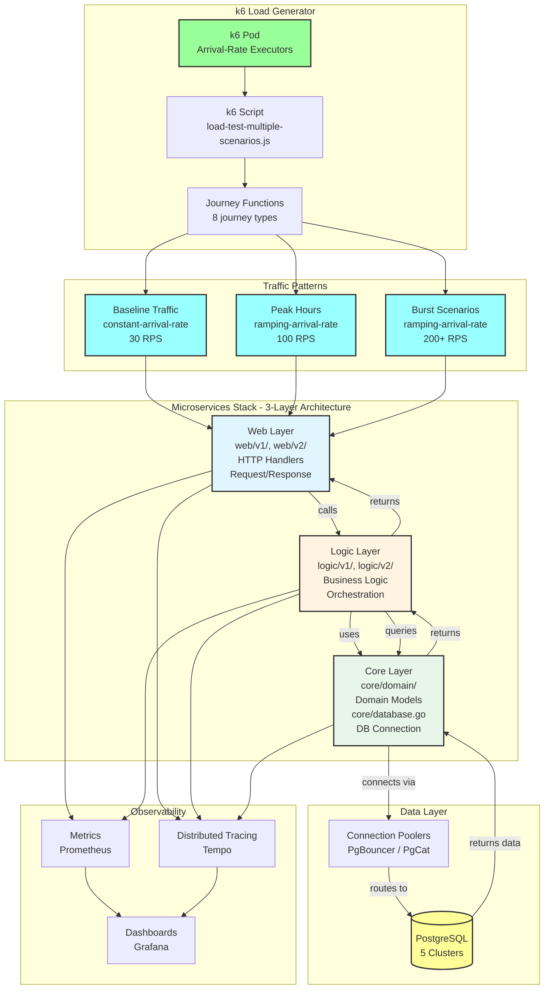

# Technical Plan: Production-Ready k6 Load Testing Strategy

**Task ID:** k6-load-test-strategy
**Created:** 2025-12-25
**Status:** Ready for Implementation
**Based on:** spec.md

---

## 1. System Architecture

### Overview

The k6 load testing system will migrate from `ramping-vus` executor to `ramping-arrival-rate` executor, enabling realistic production traffic simulation with full user journey testing. The architecture maintains existing journey functions while enhancing them with registration steps and adding new traffic pattern scenarios.



### Architecture Decisions

| Decision | Choice | Rationale |
|----------|--------|-----------|
| **Executor Type** | `ramping-arrival-rate` + `constant-arrival-rate` | Simulates realistic request arrival patterns (RPS) rather than VU count, matching production behavior |
| **Journey Enhancement** | Add registration step to all authenticated journeys | Tests complete user lifecycle (register → login → use), validates full stack including database writes |
| **Traffic Pattern Strategy** | Multiple concurrent scenarios (baseline + peak + burst) | Simulates realistic production traffic with steady baseline, predictable peaks, and sudden spikes |
| **Tagging Strategy** | Add `stack_layer` and `operation` tags to all requests | Enables performance analysis by layer (Web/Logic/Database) and operation type (read/write) |
| **Configuration Management** | Helm values + environment variables | Externalizes configuration for easy adjustment without code changes |
| **Backward Compatibility** | Keep existing journey functions, enhance them | Minimizes risk, allows gradual migration, maintains existing test coverage |

---

## 2. Technology Stack

| Layer | Technology | Version | Rationale |
|-------|------------|---------|-----------|
| **Load Testing** | k6 | latest (open-source) | Industry-standard load testing tool, supports arrival-rate executors, no account required |
| **Script Language** | JavaScript (ES6+) | ES2020 | k6 native language, supports modern async/await, good for complex journey flows |
| **Container Runtime** | Docker | latest | k6 runs in containerized environment |
| **Orchestration** | Kubernetes | 1.33+ | Deploy k6 as pod, manage via Helm |
| **Package Manager** | Helm | 3.14+ | Kubernetes package management for k6 deployment |
| **Observability** | Prometheus | latest | Metrics collection (already integrated) |
| **Tracing** | Tempo | latest | Distributed tracing (already integrated) |
| **Visualization** | Grafana | latest | Dashboard visualization (already integrated) |

### Dependencies

**k6 Script Dependencies:**
- `k6/http` - HTTP client for API calls
- `k6/metrics` - Custom metrics (Rate, Trend, Counter)
- Built-in k6 functions: `check`, `sleep`, `group`

**No External Dependencies:**
- k6 open-source has all required features
- No npm packages needed
- No custom k6 extensions required

---

## 3. Component Design

### Component 1: Scenario Configuration

**Purpose:** Define traffic patterns using arrival-rate executors with realistic RPS targets.

**Responsibilities:**
- Configure baseline traffic scenario (`constant-arrival-rate`)
- Configure peak hours scenario (`ramping-arrival-rate`)
- Configure burst scenarios (`ramping-arrival-rate` with sudden spikes)
- Maintain journey mix distribution (40/30/15/10/5)
- Set VU allocation (`preAllocatedVUs`, `maxVUs`)

**Interfaces:**
```javascript
export const options = {
  scenarios: {
    baseline_traffic: {
      executor: 'constant-arrival-rate',
      rate: 30,  // RPS
      timeUnit: '1s',
      duration: '24h',
      preAllocatedVUs: 50,
      maxVUs: 200,
      exec: 'browserUserScenario',
    },
    peak_hours: {
      executor: 'ramping-arrival-rate',
      startRate: 20,
      timeUnit: '1s',
      preAllocatedVUs: 100,
      maxVUs: 300,
      stages: [
        { duration: '3h', target: 80 },   // Morning ramp-up
        { duration: '3h', target: 100 },  // Morning peak
        { duration: '2h', target: 60 },   // Lunch dip
        { duration: '4h', target: 90 },   // Afternoon recovery
        { duration: '4h', target: 100 },  // Evening peak
        { duration: '8h', target: 20 },   // Night low
      ],
      exec: 'shoppingUserScenario',
    },
    flash_sale: {
      executor: 'ramping-arrival-rate',
      startRate: 0,
      timeUnit: '1s',
      preAllocatedVUs: 200,
      maxVUs: 500,
      stages: [
        { duration: '2h', target: 0 },     // Pre-event
        { duration: '30s', target: 200 },  // Sudden burst
        { duration: '5m', target: 200 },   // Sustain
        { duration: '30s', target: 50 },   // Quick drop
        { duration: '1h', target: 0 },     // Post-event
      ],
      exec: 'shoppingUserScenario',
    }
  },
  thresholds: {
    // Performance thresholds
  }
}
```

**Dependencies:** Journey functions (exec functions)

**Configuration:**
- RPS targets configurable via environment variables
- Stage durations configurable via Helm values
- VU allocation based on expected load

---

### Component 2: Journey Functions

**Purpose:** Implement complete user journeys from registration through purchase, testing full stack.

**Responsibilities:**
- Execute full user lifecycle (register → login → browse → purchase)
- Test database reads (GET products, reviews, orders)
- Test database writes (POST orders, carts, reviews)
- Tag requests with stack layer and operation type
- Handle errors gracefully with retries

**Interfaces:**
```javascript
// Enhanced journey function with registration
function ecommerceShoppingJourney() {
  const userId = `user-${__VU}-${Date.now()}`;
  const email = `${userId}@test.com`;
  const sessionId = `session-${__VU}-${Date.now()}`;
  const tags = { 
    scenario: 'shopping_user', 
    journey: 'ecommerce_purchase',
    session_id: sessionId,
    user_id: userId
  };
  
  // Step 1: REGISTER (Web → Logic → Database WRITE)
  makeRequest('POST', `${SERVICES.auth}/api/v2/auth/register`, {
    username: userId,
    email: email,
    password: 'password123',
  }, { ...tags, flow_step: '1_register', service_target: 'auth', 
       operation: 'db_write', stack_layer: 'database' });
  sleep(1.0);
  
  // Step 2: LOGIN (Web → Logic → Database READ)
  makeRequest('POST', `${SERVICES.auth}/api/v2/auth/login`, {
    username: userId,
    password: 'password123',
  }, { ...tags, flow_step: '2_login', service_target: 'auth',
       operation: 'db_read', stack_layer: 'database' });
  sleep(0.5);
  
  // ... continue with remaining steps
}
```

**Journey Types:**
1. **E-commerce Shopping Journey** (10 steps) - Full lifecycle
2. **Product Review Journey** (6 steps) - Review workflow
3. **Order Tracking Journey** (7 steps) - Order management
4. **Quick Browse Journey** (5 steps) - Abandoned cart
5. **API Monitoring Journey** (7 services) - API client
6. **Timeout/Retry Journey** - Resilience testing
7. **Concurrent Operations Journey** - Race conditions
8. **Error Handling Journey** - Error scenarios

**Dependencies:** `makeRequest()` helper function, service URLs

**Enhancement Requirements:**
- Add registration step as first step in authenticated journeys
- Add stack layer tags (`web`, `logic`, `database`)
- Add operation type tags (`db_read`, `db_write`)
- Use unique user IDs: `user-${__VU}-${Date.now()}`

---

### Component 3: Request Helper Function

**Purpose:** Centralized request handling with tagging, metrics, and error handling.

**Responsibilities:**
- Make HTTP requests with proper tagging
- Record custom metrics (duration, errors, requests)
- Handle errors with retry logic
- Tag requests with stack layer and operation type
- Log request context for debugging

**Interfaces:**
```javascript
function makeRequest(method, url, body, tags) {
  const params = {
    headers: { 'Content-Type': 'application/json' },
    tags: {
      ...tags,
      // Ensure stack_layer and operation tags are present
      stack_layer: tags.stack_layer || 'web',
      operation: tags.operation || 'api_call',
    },
  };
  
  let response;
  const startTime = Date.now();
  
  // Execute request based on method
  if (method === 'GET') {
    response = http.get(url, params);
  } else if (method === 'POST') {
    response = http.post(url, JSON.stringify(body), params);
  }
  // ... other methods
  
  const duration = Date.now() - startTime;
  
  // Record metrics
  requestDuration.add(duration, tags);
  requestsTotal.add(1, tags);
  errorRate.add(response.status >= 400, tags);
  
  // Check response
  check(response, {
    'status is 2xx or 4xx': (r) => r.status >= 200 && r.status < 500,
  });
  
  return response;
}
```

**Dependencies:** k6/http, k6/metrics, custom metrics

**Enhancement Requirements:**
- Add `stack_layer` tag support (default: 'web')
- Add `operation` tag support (default: 'api_call')
- Ensure tags propagate to Prometheus and Tempo

---

### Component 4: Scenario Functions

**Purpose:** Map scenarios to journey functions with proper distribution.

**Responsibilities:**
- Execute appropriate journey based on scenario type
- Maintain journey mix percentages
- Handle edge cases (timeout, retry, concurrent ops, errors)
- Distribute journeys according to weights

**Interfaces:**
```javascript
export function shoppingUserScenario() {
  const tags = { scenario: 'shopping_user', user_type: 'shopping' };
  
  // 80% E-commerce Shopping Journey (full lifecycle)
  if (Math.random() < 0.8) {
    ecommerceShoppingJourney();
    sleep(Math.random() * 5 + 10);
    return;
  }
  
  // 10% Concurrent Operations Journey
  if (Math.random() < 0.1) {
    concurrentOperationsJourney();
    sleep(Math.random() * 5 + 10);
    return;
  }
  
  // 10% Simple shopping (legacy)
  // ... simple shopping flow
}
```

**Journey Distribution:**
- Browser User: 60% Quick Browse, 40% Simple browsing
- Shopping User: 80% E-commerce, 10% Concurrent Ops, 10% Simple
- Registered User: 50% Order Tracking, 30% Product Review, 15% Error Handling, 5% Simple
- API Client: 70% API Monitoring, 10% Timeout/Retry, 20% Fast endpoints
- Admin User: Management operations

**Dependencies:** Journey functions

---

### Component 5: Configuration Management

**Purpose:** Externalize traffic patterns and RPS targets for easy adjustment.

**Responsibilities:**
- Define RPS targets for baseline, peak, burst scenarios
- Configure stage durations for peak hours
- Configure burst timing and intensity
- Make configuration accessible via Helm values

**Interfaces:**
```javascript
// Configuration from environment variables or defaults
const CONFIG = {
  baselineRPS: __ENV.BASELINE_RPS || 30,
  peakRPS: __ENV.PEAK_RPS || 100,
  burstRPS: __ENV.BURST_RPS || 200,
  burstDuration: __ENV.BURST_DURATION || '5m',
  burstTiming: __ENV.BURST_TIMING || '2h', // When burst occurs
};
```

**Helm Values Integration:**
```yaml
# charts/values/k6-scenarios.yaml
env:
  - name: BASELINE_RPS
    value: "30"
  - name: PEAK_RPS
    value: "100"
  - name: BURST_RPS
    value: "200"
  - name: BURST_DURATION
    value: "5m"
  - name: BURST_TIMING
    value: "2h"
```

**Dependencies:** k6 environment variables (`__ENV`)

---

## 4. Data Model

### Test Data Structure

**User Data:**
```javascript
{
  userId: `user-${__VU}-${Date.now()}`,  // Unique per VU iteration
  email: `${userId}@test.com`,
  password: 'password123',  // Fixed for simplicity
  sessionId: `session-${__VU}-${Date.now()}`,
}
```

**Request Tags:**
```javascript
{
  scenario: 'shopping_user' | 'browser_user' | 'registered_user' | 'api_client' | 'admin_user',
  journey: 'ecommerce_purchase' | 'product_review' | 'order_tracking' | 'quick_browse' | ...,
  session_id: string,
  user_id: string,
  flow_step: '1_register' | '2_login' | '3_profile' | ...,
  service_target: 'auth' | 'user' | 'product' | 'cart' | 'order' | ...,
  operation: 'db_read' | 'db_write' | 'api_call',
  stack_layer: 'web' | 'logic' | 'database',
  product_id?: string,
  order_id?: string,
  cart_id?: string,
}
```

**Traffic Pattern Configuration:**
```javascript
{
  baseline: {
    executor: 'constant-arrival-rate',
    rate: number,  // RPS
    duration: string,  // e.g., '24h'
  },
  peak: {
    executor: 'ramping-arrival-rate',
    stages: [
      { duration: string, target: number },  // RPS target
    ],
  },
  burst: {
    executor: 'ramping-arrival-rate',
    stages: [
      { duration: string, target: number },
    ],
  }
}
```

---

## 5. API Contracts

### k6 Script Structure

**Main Export:**
```javascript
export const options = {
  scenarios: {
    // Scenario definitions
  },
  thresholds: {
    // Performance thresholds
  }
}
```

**Journey Function Signatures:**
```javascript
function ecommerceShoppingJourney(): void
function productReviewJourney(): void
function orderTrackingJourney(): void
function quickBrowseJourney(): void
function apiMonitoringJourney(): void
function timeoutRetryJourney(): void
function concurrentOperationsJourney(): void
function errorHandlingJourney(): void
```

**Scenario Function Signatures:**
```javascript
export function browserUserScenario(): void
export function shoppingUserScenario(): void
export function registeredUserScenario(): void
export function apiClientScenario(): void
export function adminUserScenario(): void
```

**Helper Function Signatures:**
```javascript
function makeRequest(
  method: 'GET' | 'POST' | 'PUT' | 'DELETE',
  url: string,
  body: object | null,
  tags: object
): http.Response
```

### Microservice API Endpoints Used

**Auth Service:**
- `POST /api/v2/auth/register` - User registration
- `POST /api/v2/auth/login` - User login

**User Service:**
- `GET /api/v2/users/:id` - Get user by ID
- `GET /api/v1/users/profile` - Get user profile

**Product Service:**
- `GET /api/v2/catalog/items` - Browse products
- `GET /api/v1/products/:id` - Get product details

**Cart Service:**
- `POST /api/v2/carts/:cartId/items` - Add to cart
- `GET /api/v1/cart` - View cart

**Order Service:**
- `POST /api/v1/orders` - Create order
- `GET /api/v1/orders` - List orders
- `GET /api/v2/orders/:orderId/status` - Get order status

**Review Service:**
- `GET /api/v1/reviews` - Read reviews
- `POST /api/v2/reviews` - Write review

**Shipping Service:**
- `GET /api/v1/shipping/track` - Track shipment

**Shipping-v2 Service:**
- `POST /api/v2/shipments/estimate` - Estimate shipping

**Notification Service:**
- `POST /api/v2/notifications` - Send notification
- `GET /api/v1/notifications` - Get notifications

---

## 6. Security Considerations

### Authentication
- Uses simple username/password authentication (not JWT tokens)
- Each VU creates unique user account for isolation
- No shared authentication state between VUs

### Data Isolation
- Each VU uses unique user ID: `user-${__VU}-${Date.now()}`
- No data conflicts between concurrent VUs
- Test data clearly identifiable (test.com email domain)

### Security Checklist
- [x] No sensitive production data used in tests
- [x] Test data clearly marked (test.com domain)
- [x] No authentication tokens stored or shared
- [x] All requests use HTTPS (via Kubernetes service URLs)
- [x] No external dependencies (all internal services)

---

## 7. Performance Strategy

### k6 Performance Optimization

**Resource Allocation:**
- **Current**: 2-4Gi RAM, 1-2 CPU cores for 250 VUs
- **Target**: Support 500+ concurrent VUs for arrival-rate executors
- **Strategy**: 
  - Pre-allocate VUs (`preAllocatedVUs`) to reduce allocation overhead
  - Set `maxVUs` based on expected peak arrival rate
  - Monitor k6 pod resource usage during tests

**Script Optimization:**
- Minimize JavaScript execution overhead
- Use efficient data structures
- Avoid unnecessary string concatenation
- Cache service URLs (already done)

**Executor Efficiency:**
- `constant-arrival-rate`: Most efficient for steady traffic
- `ramping-arrival-rate`: Efficient for variable traffic (better than ramping-vus)
- Pre-allocate VUs to match expected peak load

### System Under Test Performance

**Performance Targets:**
- Baseline (30 RPS): p95 < 500ms, error rate < 0.1%
- Peak (100 RPS): p95 < 800ms, error rate < 1%
- Burst (200+ RPS): p95 < 1500ms, error rate < 5%

**Database Performance:**
- Read operations: p95 < 200ms
- Write operations: p95 < 300ms
- Connection pool utilization: < 80%

**Optimization Strategy:**
- Monitor database connection pool metrics
- Track query performance during load tests
- Identify slow queries via distributed traces
- Validate database indexes are used

---

## 8. Implementation Phases

### Phase 1: Foundation - Arrival-Rate Executor Migration (Week 1)

**Goal:** Migrate from `ramping-vus` to `ramping-arrival-rate` executor.

**Tasks:**
- [ ] Update scenario configuration to use `ramping-arrival-rate` executor
- [ ] Convert VU-based stages to RPS-based stages
- [ ] Configure `preAllocatedVUs` and `maxVUs` for each scenario
- [ ] Update baseline traffic to use `constant-arrival-rate`
- [ ] Test executor migration with existing journeys
- [ ] Validate RPS targets match expected traffic patterns

**Deliverables:**
- Updated `k6/load-test-multiple-scenarios.js` with arrival-rate executors
- RPS targets documented
- Test results showing RPS accuracy

**Success Criteria:**
- All scenarios use arrival-rate executors
- RPS targets achieved within ±5% accuracy
- Existing journeys work without modification

---

### Phase 2: Full User Journey Enhancement (Week 1-2)

**Goal:** Add registration step to all authenticated journeys and enhance tagging.

**Tasks:**
- [ ] Add registration step to E-commerce Shopping Journey
- [ ] Add registration step to Product Review Journey
- [ ] Add registration step to Order Tracking Journey
- [ ] Add registration step to Quick Browse Journey
- [ ] Update `makeRequest()` to support `stack_layer` and `operation` tags
- [ ] Add tags to all journey steps (stack_layer, operation)
- [ ] Test registration → login → browse flow
- [ ] Validate database writes (registration) and reads (login, browse)

**Deliverables:**
- Enhanced journey functions with registration
- Tagged requests with stack_layer and operation
- Test results showing full user lifecycle

**Success Criteria:**
- All authenticated journeys start with registration
- Registration success rate > 99%
- Tags visible in Prometheus metrics and Tempo traces
- Database operations validated (reads and writes)

---

### Phase 3: Production Traffic Patterns (Week 2)

**Goal:** Implement realistic production traffic patterns (baseline, peak, burst).

**Tasks:**
- [ ] Implement baseline traffic scenario (`constant-arrival-rate`, 30 RPS)
- [ ] Implement peak hours scenario (`ramping-arrival-rate` with time-based stages)
- [ ] Implement flash sale burst scenario (sudden spike to 200 RPS)
- [ ] Implement marketing campaign burst scenario (gradual ramp-up/down)
- [ ] Configure concurrent scenario execution
- [ ] Test traffic pattern accuracy (actual RPS vs target RPS)
- [ ] Validate system behavior during traffic spikes

**Deliverables:**
- Baseline traffic scenario
- Peak hours scenario with morning/evening peaks
- Burst scenarios (flash sale, marketing campaign)
- Traffic pattern configuration

**Success Criteria:**
- Baseline traffic maintains steady 30 RPS (±5%)
- Peak hours scenario matches time-based stages
- Burst scenarios achieve target RPS within 30 seconds
- System handles traffic spikes without crashes

---

### Phase 4: Configuration & Observability (Week 2-3)

**Goal:** Externalize configuration and ensure full observability.

**Tasks:**
- [ ] Add environment variables for RPS targets
- [ ] Update Helm values to include traffic pattern configuration
- [ ] Validate tags appear in Prometheus metrics
- [ ] Validate tags appear in Tempo traces
- [ ] Create Grafana dashboard filters for stack_layer and operation tags
- [ ] Document configuration options
- [ ] Test configuration changes without code modification

**Deliverables:**
- Environment variable configuration
- Updated Helm values file
- Grafana dashboard enhancements
- Configuration documentation

**Success Criteria:**
- RPS targets configurable via Helm values
- Tags visible in all observability tools
- Configuration changes take effect without code changes
- Documentation complete

---

### Phase 5: Testing & Validation (Week 3)

**Goal:** Validate all requirements met and system production-ready.

**Tasks:**
- [ ] Run full test suite with all scenarios
- [ ] Validate journey completion rate > 95%
- [ ] Validate error rates meet targets (baseline < 0.1%, peak < 1%, burst < 5%)
- [ ] Validate latency targets met (baseline p95 < 500ms, peak p95 < 800ms, burst p95 < 1500ms)
- [ ] Validate database performance (read p95 < 200ms, write p95 < 300ms)
- [ ] Validate trace coverage 100%
- [ ] Validate metric coverage 100%
- [ ] Test edge cases (registration conflicts, 404s, timeouts)
- [ ] Test error handling (retries, exponential backoff)
- [ ] Document troubleshooting guide

**Deliverables:**
- Test results report
- Performance validation report
- Troubleshooting guide
- Production-ready validation

**Success Criteria:**
- All acceptance criteria met
- All success metrics achieved
- Edge cases handled correctly
- System production-ready

---

## 9. Risk Assessment

| Risk | Impact | Likelihood | Mitigation |
|------|--------|------------|------------|
| **Arrival-rate executor complexity** | Medium | Medium | Start with simple scenarios, gradually add complexity. Document executor behavior clearly. |
| **Registration conflicts** | Low | Medium | Use unique user IDs (`user-${__VU}-${Date.now()}`). Handle 409 errors gracefully. |
| **k6 pod resource exhaustion** | High | Low | Monitor resource usage. Increase limits if needed. Pre-allocate VUs efficiently. |
| **Database connection pool exhaustion** | High | Medium | Monitor connection pool metrics. Validate pool size sufficient for load. |
| **Traffic pattern accuracy** | Medium | Low | Validate RPS targets achieved. Adjust executor configuration if needed. |
| **Journey function errors** | Medium | Low | Add comprehensive error handling. Test edge cases. Log errors with context. |
| **Tag propagation issues** | Low | Low | Validate tags in Prometheus and Tempo. Test tag filtering in Grafana. |
| **Backward compatibility** | Low | Low | Keep existing journey functions. Enhance incrementally. Test existing scenarios still work. |
| **Configuration complexity** | Low | Medium | Document configuration clearly. Use sensible defaults. Provide examples. |
| **Test duration too long** | Low | Low | Configure test duration via environment variables. Allow shorter test runs for validation. |

---

## 10. Testing Strategy

### Unit Testing (k6 Script Validation)

**Test Journey Functions:**
- Validate registration step executes correctly
- Validate login step executes after registration
- Validate all journey steps execute in correct order
- Validate tags are added correctly
- Validate error handling works

**Test Scenario Configuration:**
- Validate arrival-rate executors configured correctly
- Validate RPS targets match configuration
- Validate VU allocation sufficient for arrival rates
- Validate concurrent scenarios don't conflict

### Integration Testing (End-to-End)

**Test Full User Journey:**
- Register → Login → Browse → Purchase flow works
- Database writes (registration, cart, order) succeed
- Database reads (login, products, reviews) succeed
- Distributed traces show complete flow
- Metrics collected for all steps

**Test Traffic Patterns:**
- Baseline traffic maintains steady RPS
- Peak hours scenario ramps correctly
- Burst scenario achieves target RPS quickly
- Concurrent scenarios don't interfere

### Performance Testing

**Test System Under Load:**
- Baseline traffic: Validate error rate < 0.1%, p95 < 500ms
- Peak traffic: Validate error rate < 1%, p95 < 800ms
- Burst traffic: Validate error rate < 5%, p95 < 1500ms
- Database performance: Validate read/write latencies

**Test k6 Performance:**
- k6 pod handles 500+ VUs without resource exhaustion
- Script execution starts within 5 seconds
- Test results available within 1 minute

---

## 11. Deployment Strategy

### Deployment Approach

**Incremental Migration:**
1. Deploy new k6 script alongside existing one
2. Run both in parallel for validation
3. Compare results (RPS, error rates, latencies)
4. Switch to new script once validated
5. Remove old script

**Rollback Plan:**
- Keep old k6 script version in Git
- Can quickly revert to `ramping-vus` executor if needed
- Helm values support version pinning

### Deployment Steps

1. **Update k6 Script:**
   - Modify `k6/load-test-multiple-scenarios.js`
   - Add arrival-rate executors
   - Enhance journey functions
   - Add tagging support

2. **Update Helm Values:**
   - Add environment variables for RPS targets
   - Update resource limits if needed
   - Document configuration options

3. **Build k6 Image:**
   - GitHub Actions builds automatically on push
   - Image tagged with version (e.g., `v6`)

4. **Deploy to Kubernetes:**
   - `helm upgrade --install k6-scenarios charts/ -f charts/values/k6-scenarios.yaml -n k6`
   - Monitor pod startup and logs
   - Validate scenarios execute correctly

5. **Validate Results:**
   - Check Prometheus metrics for RPS accuracy
   - Check Tempo traces for journey completion
   - Check Grafana dashboards for performance
   - Validate error rates and latencies

---

## 12. Monitoring & Observability

### Metrics to Monitor

**k6 Metrics:**
- `http_reqs` - Total requests per second
- `http_req_duration` - Request latency (p50, p95, p99)
- `http_req_failed` - Error rate
- `vus` - Virtual users (for arrival-rate, shows allocated VUs)
- Custom metrics: `k6_errors`, `k6_request_duration`, `k6_requests_total`

**System Metrics:**
- Microservice CPU/memory usage
- Database connection pool utilization
- Database query performance
- Error rates by service and endpoint

**Traffic Pattern Metrics:**
- Actual RPS vs target RPS (arrival-rate accuracy)
- Journey completion rate
- Registration success rate
- Database read/write performance by operation type

### Dashboards

**Grafana Dashboard Enhancements:**
- Add filters for `stack_layer` tag (web/logic/database)
- Add filters for `operation` tag (db_read/db_write/api_call)
- Add RPS accuracy panel (actual vs target)
- Add journey completion rate panel
- Add database performance panel (read vs write)

**Tempo Trace Analysis:**
- Filter traces by `stack_layer` tag
- Filter traces by `operation` tag
- Analyze end-to-end journey latency
- Identify slow database queries

---

## 13. Documentation Requirements

### Code Documentation

**k6 Script Comments:**
- Document each journey function with step-by-step flow
- Document traffic pattern configuration
- Document RPS targets and timing
- Document tag usage and meaning

**Configuration Documentation:**
- Document environment variables
- Document Helm values options
- Document RPS target configuration
- Document burst scenario configuration

### User Documentation

**Load Testing Guide:**
- How to run load tests
- How to configure traffic patterns
- How to interpret results
- How to troubleshoot common issues

**Journey Documentation:**
- Document each journey type with flow diagram
- Document which services each journey touches
- Document database operations (read/write) per journey
- Document expected journey completion time

---

## 14. Open Questions

- [ ] **RPS Target Validation**: Do the RPS targets (30 baseline, 100 peak, 200 burst) match production expectations? (Need production data or estimates)
- [ ] **Test Duration**: Is 24-hour baseline test appropriate, or should it be shorter? (Current: 6.5 hours - may need adjustment)
- [ ] **Burst Frequency**: How often should burst scenarios run? (Daily, weekly, on-demand?)
- [ ] **Resource Limits**: Are current k6 pod limits (2-4Gi RAM, 1-2 CPU) sufficient for 500+ VUs? (May need to increase)
- [ ] **Database Load**: What is expected database load during peak traffic? (Need to validate database can handle concurrent reads/writes)
- [ ] **Journey Mix Validation**: Do journey mix percentages (40/30/15/10/5) match production analytics? (May need adjustment based on real data)

---

## 15. Success Criteria

### Technical Success

- [ ] All scenarios use arrival-rate executors
- [ ] All journeys include registration step
- [ ] All requests tagged with stack_layer and operation
- [ ] Traffic patterns achieve target RPS within ±5%
- [ ] Journey completion rate > 95%
- [ ] Registration success rate > 99%

### Performance Success

- [ ] Baseline traffic: Error rate < 0.1%, p95 < 500ms
- [ ] Peak traffic: Error rate < 1%, p95 < 800ms
- [ ] Burst traffic: Error rate < 5%, p95 < 1500ms
- [ ] Database reads: p95 < 200ms
- [ ] Database writes: p95 < 300ms

### Observability Success

- [ ] Trace coverage: 100% of requests traced
- [ ] Metric coverage: 100% of endpoints have metrics
- [ ] Tags visible in Prometheus and Tempo
- [ ] Grafana dashboards show stack_layer and operation filters

---

## Next Steps

1. **Review technical plan** with DevOps/SRE team and backend developers
2. **Resolve open questions** - Gather production data for RPS targets
3. **Run `/tasks k6-load-test-strategy`** to generate detailed implementation tasks
4. **Start implementation** - Begin with Phase 1 (Arrival-Rate Executor Migration)
5. **Validate incrementally** - Test each phase before moving to next

---

*Plan created with SDD 2.0*

