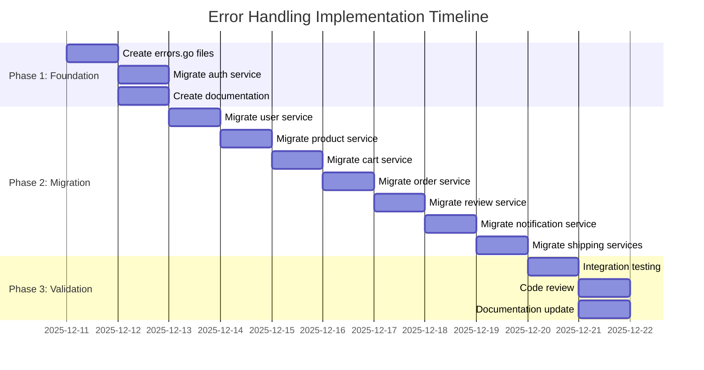

# Technical Implementation Plan: Error Handling Improvements

> **Task ID**: microservices-best-practices-assessment  
> **Feature**: Error Handling Improvements (Phase 1)  
> **Plan Version**: 1.0  
> **Created**: December 10, 2025  
> **Status**: Ready for Implementation  

---

## Table of Contents

1. [Architecture Overview](#architecture-overview)
2. [Technology Stack](#technology-stack)
3. [Implementation Approach](#implementation-approach)
4. [Detailed Implementation Steps](#detailed-implementation-steps)
5. [Code Templates](#code-templates)
6. [File Changes Matrix](#file-changes-matrix)
7. [Testing Plan](#testing-plan)
8. [Deployment Strategy](#deployment-strategy)
9. [Quality Checklist](#quality-checklist)
10. [Risk Mitigation](#risk-mitigation)

---

## Architecture Overview

### Error Flow Architecture

```mermaid
flowchart TD
    subgraph "Client"
        ClientApp[Client Application]
    end
    
    subgraph "HTTP Layer (Web)"
        Handler[Handler<br/>Login]
        ErrorCheck{errors.Is()<br/>Check Type}
        HTTPResponse[HTTP Response<br/>JSON + Status Code]
    end
    
    subgraph "Business Logic Layer"
        Service[Service<br/>Login Method]
        BusinessLogic[Business Logic<br/>Validation, Processing]
        ErrorWrap[Error Wrapping<br/>fmt.Errorf with context]
    end
    
    subgraph "Error Definitions"
        Sentinel[Sentinel Errors<br/>ErrInvalidCredentials<br/>ErrUserNotFound<br/>etc.]
    end
    
    subgraph "Domain Layer"
        Domain[Domain Models<br/>LoginRequest<br/>AuthResponse]
    end
    
    subgraph "Observability (Existing)"
        Logs[Zap Logger<br/>Structured JSON + trace-id]
        Traces[OpenTelemetry<br/>Span Recording]
    end
    
    ClientApp -->|HTTP POST| Handler
    Handler -->|1. Extract Request| Domain
    Handler -->|2. Call Service| Service
    Service -->|3. Execute Logic| BusinessLogic
    BusinessLogic -->|4. Check Error| Sentinel
    Sentinel -->|5. Wrap Context| ErrorWrap
    ErrorWrap -->|6. Return Error| Service
    Service -->|7. Return Error| Handler
    Handler -->|8. Check Type| ErrorCheck
    ErrorCheck -->|9. Map to Status| HTTPResponse
    HTTPResponse -->|10. JSON Response| ClientApp
    
    Handler -.->|Log Error| Logs
    Handler -.->|Record Error| Traces
    Service -.->|Record Error| Traces
    
    style Sentinel fill:#ff9999
    style ErrorWrap fill:#ffcc99
    style ErrorCheck fill:#99ccff
    style Logs fill:#99ff99
    style Traces fill:#9999ff
```

### Key Design Decisions

#### 1. **Use Standard Library Only**
**Decision**: Use Go standard library `errors` and `fmt` packages  
**Rationale**:
- ✅ Zero external dependencies
- ✅ Built-in to Go 1.13+ (project uses Go 1.23.0)
- ✅ Ubiquitous pattern in Go ecosystem
- ✅ Excellent performance (compiler optimized)

**Alternatives Considered:**
- ❌ `github.com/pkg/errors` - Deprecated, use standard library
- ❌ Custom error framework - Overengineering for this use case

#### 2. **Sentinel Errors Pattern**
**Decision**: Define sentinel errors as package-level variables  
**Rationale**:
- ✅ Uber Go Style Guide recommendation
- ✅ Enable `errors.Is()` checking
- ✅ Type-safe error handling
- ✅ Consistent with Go best practices

**Example:**
```go
var ErrUserNotFound = errors.New("user not found")
```

#### 3. **Error Wrapping at Every Layer**
**Decision**: Wrap errors with context at each layer  
**Rationale**:
- ✅ Preserve error chain for debugging
- ✅ Add operation context at each step
- ✅ Stack trace available in error message
- ✅ No performance impact (compiler optimized)

**Pattern:**
```go
// Service layer
if user == nil {
    return nil, fmt.Errorf("find user %q: %w", username, ErrUserNotFound)
}

// Result: "find user "john": user not found"
```

#### 4. **Handler-Level Error Mapping**
**Decision**: Map sentinel errors to HTTP status codes in handlers  
**Rationale**:
- ✅ Keeps business logic independent of HTTP concerns
- ✅ Consistent error responses
- ✅ Easy to change HTTP behavior without touching logic
- ✅ Clean separation of concerns

#### 5. **No Breaking Changes**
**Decision**: Keep all HTTP responses identical  
**Rationale**:
- ✅ Client compatibility guaranteed
- ✅ Safe to deploy incrementally
- ✅ Easy rollback if needed
- ✅ Internal-only improvements

---

## Technology Stack

### Core Technologies

| Technology | Version | Purpose | Justification |
|-----------|---------|---------|---------------|
| **Go** | 1.23.0 | Programming language | Already in use, excellent error handling |
| **errors** package | stdlib | Error wrapping and checking | Built-in, zero dependencies, Go 1.13+ |
| **fmt** package | stdlib | Error formatting | Built-in, optimized, standard pattern |
| **Gin** | v1.10.1 | HTTP framework | Already in use, no changes needed |
| **Uber Zap** | v1.27.0 | Logging | Already in use, excellent performance |
| **OpenTelemetry** | v1.38.0 | Tracing | Already in use, error recording support |

### No New Dependencies

**Critical**: This implementation requires **ZERO new dependencies**
- ✅ Use only Go standard library
- ✅ Leverage existing APM stack
- ✅ No version conflicts
- ✅ No security vulnerabilities from new deps

### Development Tools

| Tool | Purpose | Installation |
|------|---------|--------------|
| **gopls** | Go language server | Pre-installed in Go toolchain |
| **go fmt** | Code formatting | Pre-installed |
| **go vet** | Static analysis | Pre-installed |
| **golangci-lint** | Comprehensive linting | `brew install golangci-lint` (optional) |

---

## Implementation Approach

### Phased Rollout Strategy

**Why Phased?**
- ✅ Minimize risk (one service at a time)
- ✅ Learn from first migration (auth service)
- ✅ Validate pattern before scaling
- ✅ Easy to pause or adjust

### Phase Timeline



### Daily Breakdown

**Day 1-2: Foundation**
- Morning: Create all 18 errors.go files
- Afternoon: Migrate auth service (v1 + v2)
- Evening: Write documentation and examples

**Day 3: Fast Services**
- Morning: User + Product services
- Afternoon: Cart + Order services

**Day 4: Remaining Services**
- Morning: Review + Notification services
- Afternoon: Shipping + Shipping-v2 services

**Day 5: Polish**
- Morning: Integration testing
- Afternoon: Code review and fixes
- Evening: Documentation updates

**Day 6-7: Buffer**
- Contingency for unexpected issues
- Additional testing if needed
- Early completion bonus 🎉

---

## Detailed Implementation Steps

### Step 1: Create Sentinel Error Definitions

**Duration**: 2-3 hours  
**Files**: 18 new files  

#### 1.1 Create errors.go Template

**File**: `services/internal/auth/logic/v1/errors.go`

```go
// Package v1 provides business logic for auth service version 1.
package v1

import "errors"

// Authentication errors.
//
// These are sentinel errors that can be checked using errors.Is().
// Always wrap these errors with context using fmt.Errorf("%w", err).
//
// Example usage in service layer:
//   if user == nil {
//       return nil, fmt.Errorf("find user %q: %w", username, ErrUserNotFound)
//   }
//
// Example usage in handler layer:
//   if errors.Is(err, logicv1.ErrInvalidCredentials) {
//       c.JSON(401, gin.H{"error": "Invalid username or password"})
//   }
var (
    // ErrInvalidCredentials indicates the username or password is incorrect.
    ErrInvalidCredentials = errors.New("invalid credentials")
    
    // ErrUserNotFound indicates the user does not exist in the system.
    ErrUserNotFound = errors.New("user not found")
    
    // ErrPasswordExpired indicates the user's password has expired.
    ErrPasswordExpired = errors.New("password expired")
    
    // ErrAccountLocked indicates the user's account has been locked.
    ErrAccountLocked = errors.New("account locked")
    
    // ErrTokenExpired indicates the authentication token has expired.
    ErrTokenExpired = errors.New("token expired")
    
    // ErrTokenInvalid indicates the authentication token is malformed or invalid.
    ErrTokenInvalid = errors.New("token invalid")
)
```

#### 1.2 Replicate for All Services

**Command to create files:**
```bash
# Auth service
touch services/internal/auth/logic/v1/errors.go
touch services/internal/auth/logic/v2/errors.go

# User service
touch services/internal/user/logic/v1/errors.go
touch services/internal/user/logic/v2/errors.go

# Product service
touch services/internal/product/logic/v1/errors.go
touch services/internal/product/logic/v2/errors.go

# Cart service
touch services/internal/cart/logic/v1/errors.go
touch services/internal/cart/logic/v2/errors.go

# Order service
touch services/internal/order/logic/v1/errors.go
touch services/internal/order/logic/v2/errors.go

# Review service
touch services/internal/review/logic/v1/errors.go
touch services/internal/review/logic/v2/errors.go

# Notification service
touch services/internal/notification/logic/v1/errors.go
touch services/internal/notification/logic/v2/errors.go

# Shipping service
touch services/internal/shipping/logic/v1/errors.go
touch services/internal/shipping/logic/v2/errors.go
```

#### 1.3 Define Errors Per Service

**Use specification section "FR-002: Sentinel Error Definitions" as reference**

Each errors.go file should include:
1. Package documentation
2. Usage examples in comments
3. Sentinel error definitions with documentation
4. Group errors by category (validation, not found, authorization, etc.)

**Verification:**
```bash
# Count errors.go files (should be 18)
find services/internal -name "errors.go" | wc -l

# Check all files have content
for f in $(find services/internal -name "errors.go"); do
    echo "$f: $(wc -l < "$f") lines"
done
```

---

### Step 2: Migrate Auth Service (Reference Implementation)

**Duration**: 3-4 hours  
**Files**: 4 files modified  
**Purpose**: Establish pattern for other services

#### 2.1 Update Service Layer (v1)

**File**: `services/internal/auth/logic/v1/service.go`

**Changes:**

1. **Add imports:**
```go
import (
    "context"
    "errors"    // Add this
    "fmt"       // Add this
    
    "github.com/duynhne/monitoring/internal/auth/core/domain"
    "github.com/duynhne/monitoring/pkg/middleware"
    "go.opentelemetry.io/otel/attribute"
    "go.opentelemetry.io/otel/trace"
)
```

2. **Update Login method:**
```go
// BEFORE
func (s *AuthService) Login(ctx context.Context, req domain.LoginRequest) (*domain.AuthResponse, error) {
    ctx, span := middleware.StartSpan(ctx, "auth.login", trace.WithAttributes(
        attribute.String("layer", "logic"),
        attribute.String("username", req.Username),
    ))
    defer span.End()
    
    // Mock authentication logic
    if req.Username == "admin" && req.Password == "password" {
        user := domain.User{
            ID:       "1",
            Username: req.Username,
            Email:    "admin@example.com",
        }
        
        response := &domain.AuthResponse{
            Token: "mock-jwt-token-v1",
            User:  user,
        }
        
        span.SetAttributes(
            attribute.String("user.id", user.ID),
            attribute.Bool("auth.success", true),
        )
        span.AddEvent("user.authenticated")
        
        return response, nil
    }
    
    span.SetAttributes(attribute.Bool("auth.success", false))
    span.AddEvent("authentication.failed")
    return nil, &AuthError{Message: "Invalid credentials", Code: "INVALID_CREDENTIALS"}
}

// AFTER
func (s *AuthService) Login(ctx context.Context, req domain.LoginRequest) (*domain.AuthResponse, error) {
    ctx, span := middleware.StartSpan(ctx, "auth.login", trace.WithAttributes(
        attribute.String("layer", "logic"),
        attribute.String("username", req.Username),
    ))
    defer span.End()
    
    // Validate input
    if req.Username == "" {
        return nil, fmt.Errorf("validate login request: %w", errors.New("username required"))
    }
    if req.Password == "" {
        return nil, fmt.Errorf("validate login request: %w", errors.New("password required"))
    }
    
    // Mock authentication logic
    if req.Username == "admin" && req.Password == "password" {
        user := domain.User{
            ID:       "1",
            Username: req.Username,
            Email:    "admin@example.com",
        }
        
        response := &domain.AuthResponse{
            Token: "mock-jwt-token-v1",
            User:  user,
        }
        
        span.SetAttributes(
            attribute.String("user.id", user.ID),
            attribute.Bool("auth.success", true),
        )
        span.AddEvent("user.authenticated")
        
        return response, nil
    }
    
    // Authentication failed
    span.SetAttributes(attribute.Bool("auth.success", false))
    span.AddEvent("authentication.failed")
    
    // Use sentinel error with context
    return nil, fmt.Errorf("authenticate user %q: %w", req.Username, ErrInvalidCredentials)
}
```

3. **Update Register method (similar pattern)**

**Key Changes:**
- ✅ Import `errors` and `fmt`
- ✅ Validate inputs with wrapped errors
- ✅ Replace custom error types with sentinel errors
- ✅ Add context with `fmt.Errorf("%w")`
- ✅ Include relevant parameters (username, etc.)

#### 2.2 Update Handler Layer (v1)

**File**: `services/internal/auth/web/v1/handler.go`

**Changes:**

1. **Add imports:**
```go
import (
    "errors"    // Add this
    "net/http"
    
    "github.com/gin-gonic/gin"
    "github.com/duynhne/monitoring/internal/auth/core/domain"
    logicv1 "github.com/duynhne/monitoring/internal/auth/logic/v1"
    "github.com/duynhne/monitoring/pkg/middleware"
    "go.opentelemetry.io/otel/attribute"
    "go.opentelemetry.io/otel/trace"
    "go.uber.org/zap"
)
```

2. **Update Login handler:**
```go
// BEFORE
func Login(c *gin.Context) {
    ctx, span := middleware.StartSpan(c.Request.Context(), "http.request", trace.WithAttributes(
        attribute.String("layer", "web"),
        attribute.String("method", c.Request.Method),
        attribute.String("path", c.Request.URL.Path),
    ))
    defer span.End()
    
    zapLogger := middleware.GetLoggerFromGinContext(c)
    
    var req domain.LoginRequest
    if err := c.ShouldBindJSON(&req); err != nil {
        span.SetAttributes(attribute.Bool("request.valid", false))
        span.RecordError(err)
        zapLogger.Error("Invalid request", zap.Error(err))
        c.JSON(http.StatusBadRequest, gin.H{"error": err.Error()})
        return
    }
    
    span.SetAttributes(attribute.Bool("request.valid", true))
    
    // Call business logic layer
    response, err := authService.Login(ctx, req)
    if err != nil {
        span.RecordError(err)
        zapLogger.Error("Login failed", zap.Error(err), zap.String("username", req.Username))
        
        if authErr, ok := err.(*logicv1.AuthError); ok && authErr.Code == "INVALID_CREDENTIALS" {
            c.JSON(http.StatusUnauthorized, gin.H{"error": authErr.Message})
            return
        }
        
        c.JSON(http.StatusInternalServerError, gin.H{"error": "Internal server error"})
        return
    }
    
    zapLogger.Info("Login successful", zap.String("user_id", response.User.ID))
    c.JSON(http.StatusOK, response)
}

// AFTER
func Login(c *gin.Context) {
    ctx, span := middleware.StartSpan(c.Request.Context(), "http.request", trace.WithAttributes(
        attribute.String("layer", "web"),
        attribute.String("method", c.Request.Method),
        attribute.String("path", c.Request.URL.Path),
    ))
    defer span.End()
    
    zapLogger := middleware.GetLoggerFromGinContext(c)
    
    var req domain.LoginRequest
    if err := c.ShouldBindJSON(&req); err != nil {
        span.SetAttributes(attribute.Bool("request.valid", false))
        span.RecordError(err)
        zapLogger.Error("Invalid request", zap.Error(err))
        c.JSON(http.StatusBadRequest, gin.H{"error": "Invalid request format"})
        return
    }
    
    span.SetAttributes(attribute.Bool("request.valid", true))
    
    // Call business logic layer
    response, err := authService.Login(ctx, req)
    if err != nil {
        span.RecordError(err)
        zapLogger.Error("Login failed", 
            zap.Error(err),  // Full error chain
            zap.String("username", req.Username),
        )
        
        // Check error type with errors.Is()
        switch {
        case errors.Is(err, logicv1.ErrInvalidCredentials):
            c.JSON(http.StatusUnauthorized, gin.H{"error": "Invalid username or password"})
        case errors.Is(err, logicv1.ErrUserNotFound):
            c.JSON(http.StatusUnauthorized, gin.H{"error": "Invalid username or password"})
        case errors.Is(err, logicv1.ErrAccountLocked):
            c.JSON(http.StatusForbidden, gin.H{"error": "Account is locked"})
        case errors.Is(err, logicv1.ErrPasswordExpired):
            c.JSON(http.StatusForbidden, gin.H{"error": "Password has expired"})
        default:
            c.JSON(http.StatusInternalServerError, gin.H{"error": "Internal server error"})
        }
        return
    }
    
    zapLogger.Info("Login successful", zap.String("user_id", response.User.ID))
    c.JSON(http.StatusOK, response)
}
```

3. **Update Register handler (similar pattern)**

**Key Changes:**
- ✅ Import `errors` package
- ✅ Replace type assertions with `errors.Is()`
- ✅ Use switch statement for cleaner error checking
- ✅ Log full error chain with `zap.Error(err)`
- ✅ Keep HTTP responses identical

#### 2.3 Repeat for v2

**Files:**
- `services/internal/auth/logic/v2/service.go`
- `services/internal/auth/web/v2/handler.go`

**Same pattern, same changes**

#### 2.4 Test Auth Service

**Manual Testing:**
```bash
# Start auth service (if not running)
kubectl port-forward -n auth svc/auth 8080:8080

# Test valid login
curl -X POST http://localhost:8080/api/v1/auth/login \
  -H "Content-Type: application/json" \
  -d '{"username":"admin","password":"password"}' \
  -w "\nStatus: %{http_code}\n"

# Expected: 200 OK, token response

# Test invalid credentials
curl -X POST http://localhost:8080/api/v1/auth/login \
  -H "Content-Type: application/json" \
  -d '{"username":"admin","password":"wrong"}' \
  -w "\nStatus: %{http_code}\n"

# Expected: 401 Unauthorized, "Invalid username or password"

# Check logs for error context
kubectl logs -n auth -l app=auth --tail=20 | grep "Login failed"

# Expected: Error log with full error chain like:
# "error": "authenticate user \"admin\": invalid credentials"
```

**Verification Checklist:**
- [ ] API responses unchanged (same JSON, same status codes)
- [ ] Error logs include full error chain
- [ ] Error logs include username parameter
- [ ] Trace-ID present in logs
- [ ] OpenTelemetry spans record errors
- [ ] No panics or crashes

---

### Step 3: Migrate Remaining Services

**Duration**: 2-3 hours per service  
**Services**: User, Product, Cart, Order, Review, Notification, Shipping (×2)

**For each service, follow auth service pattern:**

#### 3.1 Service Migration Template

**File**: `services/internal/{service}/logic/v1/service.go`

**Changes:**
1. Add imports: `errors`, `fmt`
2. Update each method:
   - Add input validation with wrapped errors
   - Replace custom errors with sentinel errors
   - Wrap errors with context: `fmt.Errorf("operation %q: %w", param, err)`
3. Remove custom error type usages

**Example (User Service):**
```go
// BEFORE
func (s *UserService) GetUser(ctx context.Context, id string) (*domain.User, error) {
    // ... mock logic ...
    if user == nil {
        return nil, errors.New("user not found")
    }
    return user, nil
}

// AFTER
func (s *UserService) GetUser(ctx context.Context, id string) (*domain.User, error) {
    ctx, span := middleware.StartSpan(ctx, "user.get", trace.WithAttributes(
        attribute.String("layer", "logic"),
        attribute.String("user_id", id),
    ))
    defer span.End()
    
    // Validate input
    if id == "" {
        return nil, fmt.Errorf("validate user ID: %w", errors.New("user ID required"))
    }
    
    // Mock logic
    user := s.findUserByID(id)
    if user == nil {
        return nil, fmt.Errorf("find user %q: %w", id, ErrUserNotFound)
    }
    
    span.SetAttributes(attribute.String("user.username", user.Username))
    return user, nil
}
```

#### 3.2 Handler Migration Template

**File**: `services/internal/{service}/web/v1/handler.go`

**Changes:**
1. Add import: `errors`
2. Update each handler:
   - Replace type assertions with `errors.Is()`
   - Use switch statement for multiple error checks
   - Log full error with `zap.Error(err)`
3. Keep HTTP responses identical

**Example (Product Service):**
```go
func GetProduct(c *gin.Context) {
    ctx, span := middleware.StartSpan(c.Request.Context(), "http.request", ...)
    defer span.End()
    
    zapLogger := middleware.GetLoggerFromGinContext(c)
    
    id := c.Param("id")
    
    // Call service
    product, err := productService.GetProduct(ctx, id)
    if err != nil {
        span.RecordError(err)
        zapLogger.Error("Failed to get product",
            zap.Error(err),
            zap.String("product_id", id),
        )
        
        // Check error type
        switch {
        case errors.Is(err, logicv1.ErrProductNotFound):
            c.JSON(http.StatusNotFound, gin.H{"error": "Product not found"})
        case errors.Is(err, logicv1.ErrInvalidProductID):
            c.JSON(http.StatusBadRequest, gin.H{"error": "Invalid product ID"})
        default:
            c.JSON(http.StatusInternalServerError, gin.H{"error": "Internal server error"})
        }
        return
    }
    
    zapLogger.Info("Product retrieved", zap.String("product_id", product.ID))
    c.JSON(http.StatusOK, product)
}
```

#### 3.3 Service-Specific Notes

**User Service:**
- Errors: `ErrUserNotFound`, `ErrUserExists`, `ErrInvalidEmail`
- Focus on CRUD operations

**Product Service:**
- Errors: `ErrProductNotFound`, `ErrInsufficientStock`, `ErrInvalidPrice`
- Include price/stock validation errors

**Cart Service:**
- Errors: `ErrCartNotFound`, `ErrCartEmpty`, `ErrItemNotInCart`
- Handle empty cart scenarios

**Order Service:**
- Errors: `ErrOrderNotFound`, `ErrInvalidOrderState`, `ErrPaymentFailed`
- Handle state transitions

**Review Service:**
- Errors: `ErrReviewNotFound`, `ErrDuplicateReview`, `ErrInvalidRating`
- Validate rating ranges (1-5)

**Notification Service:**
- Errors: `ErrNotificationNotFound`, `ErrInvalidRecipient`, `ErrDeliveryFailed`
- Handle delivery failures

**Shipping Services (v1 and v2):**
- Errors: `ErrShipmentNotFound`, `ErrInvalidAddress`, `ErrCarrierUnavailable`
- Note: Shipping-v2 is separate service

---

### Step 4: Documentation

**Duration**: 2 hours  
**Files**: 1 new file  

#### 4.1 Create Error Handling Guide

**File**: `docs/development/ERROR_HANDLING.md`

**Content:**
```markdown
# Error Handling Guide

## Overview

All microservices follow a consistent error handling pattern using Go's standard library `errors` package.

## Sentinel Errors

### Definition

Sentinel errors are predefined, package-level error variables that represent specific error conditions.

```go
var (
    ErrUserNotFound = errors.New("user not found")
    ErrInvalidEmail = errors.New("invalid email format")
)
```

### Location

Each service defines sentinel errors in `internal/{service}/logic/v{1,2}/errors.go`.

## Error Wrapping

### Pattern

Always wrap errors with context using `fmt.Errorf("%w")`:

```go
if user == nil {
    return nil, fmt.Errorf("find user %q: %w", username, ErrUserNotFound)
}
```

### Benefits

- Preserves error chain
- Adds operation context
- Includes relevant parameters
- Enables `errors.Is()` checking

## Error Checking

### Use errors.Is()

Check error types with `errors.Is()` instead of type assertions:

```go
// ✅ Good
if errors.Is(err, logicv1.ErrUserNotFound) {
    c.JSON(404, gin.H{"error": "User not found"})
}

// ❌ Bad
if err.Error() == "user not found" {
    c.JSON(404, gin.H{"error": "User not found"})
}
```

### Multiple Error Checks

Use switch statement for clean error handling:

```go
switch {
case errors.Is(err, logicv1.ErrUserNotFound):
    c.JSON(404, gin.H{"error": "User not found"})
case errors.Is(err, logicv1.ErrInvalidEmail):
    c.JSON(400, gin.H{"error": "Invalid email"})
default:
    c.JSON(500, gin.H{"error": "Internal server error"})
}
```

## Layer Responsibilities

### Service Layer (Logic)

- Define sentinel errors
- Wrap all errors with context
- Add relevant parameters to error messages

### Handler Layer (Web)

- Check error types with `errors.Is()`
- Map errors to HTTP status codes
- Log errors with full context
- Return user-friendly messages

## Examples by Service

[Include examples from all 9 services]

## Common Patterns

[Include common patterns from spec.md]

## Troubleshooting

[Include debugging tips]
```

#### 4.2 Update CHANGELOG.md

**File**: `CHANGELOG.md`

Add entry:
```markdown
## [Unreleased]

### Added
- Sentinel error definitions for all 9 microservices
- Error wrapping with context preservation
- Standard error checking with errors.Is()
- Error handling documentation

### Changed
- Improved error messages with operation context
- Enhanced error logging with full error chains
- Standardized error handling patterns across services

### Technical
- Added 18 errors.go files (9 services × 2 versions)
- Updated all service methods to wrap errors
- Updated all handlers to use errors.Is()
- No breaking changes to API responses
```

---

## Code Templates

### Template 1: errors.go File

```go
// Package v1 provides business logic for {service} service version 1.
package v1

import "errors"

// {Service} errors.
//
// These are sentinel errors that can be checked using errors.Is().
// Always wrap these errors with context using fmt.Errorf("%w", err).
//
// Example usage in service layer:
//   if resource == nil {
//       return nil, fmt.Errorf("find {resource} %q: %w", id, Err{Resource}NotFound)
//   }
//
// Example usage in handler layer:
//   if errors.Is(err, logicv1.Err{Resource}NotFound) {
//       c.JSON(404, gin.H{"error": "{Resource} not found"})
//   }
var (
    // Err{Resource}NotFound indicates the {resource} does not exist.
    Err{Resource}NotFound = errors.New("{resource} not found")
    
    // ErrInvalid{Field} indicates the {field} value is invalid.
    ErrInvalid{Field} = errors.New("invalid {field}")
    
    // Add more errors as needed...
)
```

### Template 2: Service Method with Error Wrapping

```go
func (s *{Service}Service) {Method}(ctx context.Context, req domain.{Request}) (*domain.{Response}, error) {
    // Create span
    ctx, span := middleware.StartSpan(ctx, "{service}.{method}", trace.WithAttributes(
        attribute.String("layer", "logic"),
        attribute.String("{param}_id", req.{Param}),
    ))
    defer span.End()
    
    // Validate input
    if req.{Field} == "" {
        return nil, fmt.Errorf("validate {method} request: %w", errors.New("{field} required"))
    }
    
    // Business logic
    result := s.{operation}(req.{Param})
    if result == nil {
        return nil, fmt.Errorf("{operation} %q: %w", req.{Param}, Err{Resource}NotFound)
    }
    
    // Success
    span.SetAttributes(attribute.String("{resource}.id", result.ID))
    return &domain.{Response}{...}, nil
}
```

### Template 3: Handler with Error Checking

```go
func {Handler}(c *gin.Context) {
    // Create span
    ctx, span := middleware.StartSpan(c.Request.Context(), "http.request",
        trace.WithAttributes(
            attribute.String("layer", "web"),
            attribute.String("method", c.Request.Method),
            attribute.String("path", c.Request.URL.Path),
        ))
    defer span.End()
    
    // Get logger
    zapLogger := middleware.GetLoggerFromGinContext(c)
    
    // Extract parameters
    {param} := c.Param("{param}")
    
    // Bind request (if POST/PUT)
    var req domain.{Request}
    if err := c.ShouldBindJSON(&req); err != nil {
        span.RecordError(err)
        zapLogger.Error("Invalid request", zap.Error(err))
        c.JSON(http.StatusBadRequest, gin.H{"error": "Invalid request format"})
        return
    }
    
    // Call service
    response, err := {service}Service.{Method}(ctx, req)
    if err != nil {
        span.RecordError(err)
        zapLogger.Error("{Operation} failed",
            zap.Error(err),
            zap.String("{param}", req.{Param}),
        )
        
        // Check error type
        switch {
        case errors.Is(err, logicv1.Err{Resource}NotFound):
            c.JSON(http.StatusNotFound, gin.H{"error": "{Resource} not found"})
        case errors.Is(err, logicv1.ErrInvalid{Field}):
            c.JSON(http.StatusBadRequest, gin.H{"error": "Invalid {field}"})
        default:
            c.JSON(http.StatusInternalServerError, gin.H{"error": "Internal server error"})
        }
        return
    }
    
    // Success
    zapLogger.Info("{Operation} successful", zap.String("{resource}_id", response.ID))
    c.JSON(http.StatusOK, response)
}
```

---

## File Changes Matrix

### New Files (18 total)

| Service | File | Lines | Errors Defined |
|---------|------|-------|----------------|
| **Auth** | `internal/auth/logic/v1/errors.go` | ~40 | 6 |
| | `internal/auth/logic/v2/errors.go` | ~40 | 6 |
| **User** | `internal/user/logic/v1/errors.go` | ~35 | 4 |
| | `internal/user/logic/v2/errors.go` | ~35 | 4 |
| **Product** | `internal/product/logic/v1/errors.go` | ~35 | 4 |
| | `internal/product/logic/v2/errors.go` | ~35 | 4 |
| **Cart** | `internal/cart/logic/v1/errors.go` | ~35 | 4 |
| | `internal/cart/logic/v2/errors.go` | ~35 | 4 |
| **Order** | `internal/order/logic/v1/errors.go` | ~35 | 4 |
| | `internal/order/logic/v2/errors.go` | ~35 | 4 |
| **Review** | `internal/review/logic/v1/errors.go` | ~35 | 4 |
| | `internal/review/logic/v2/errors.go` | ~35 | 4 |
| **Notification** | `internal/notification/logic/v1/errors.go` | ~35 | 3 |
| | `internal/notification/logic/v2/errors.go` | ~35 | 3 |
| **Shipping** | `internal/shipping/logic/v1/errors.go` | ~35 | 3 |
| | `internal/shipping/logic/v2/errors.go` | ~35 | 3 |

**Total**: ~630 lines of new code

### Modified Files (36 total)

| Service | File | Changes | LOC Changed |
|---------|------|---------|-------------|
| **Auth** | `internal/auth/logic/v1/service.go` | Error wrapping | ~20 |
| | `internal/auth/logic/v2/service.go` | Error wrapping | ~20 |
| | `internal/auth/web/v1/handler.go` | errors.Is() | ~15 |
| | `internal/auth/web/v2/handler.go` | errors.Is() | ~15 |
| **User** | `internal/user/logic/v1/service.go` | Error wrapping | ~25 |
| | `internal/user/logic/v2/service.go` | Error wrapping | ~25 |
| | `internal/user/web/v1/handler.go` | errors.Is() | ~20 |
| | `internal/user/web/v2/handler.go` | errors.Is() | ~20 |
| **Product** | Similar pattern... | | |
| **Cart** | Similar pattern... | | |
| **Order** | Similar pattern... | | |
| **Review** | Similar pattern... | | |
| **Notification** | Similar pattern... | | |
| **Shipping** | Similar pattern... | | |

**Total**: ~1,000 lines modified

### Documentation Files (2 new)

| File | Purpose | Lines |
|------|---------|-------|
| `docs/development/ERROR_HANDLING.md` | Developer guide | ~300 |
| `CHANGELOG.md` | Version history update | ~15 |

---

## Testing Plan

### Manual Testing Per Service

**For each service endpoint:**

#### Test Case 1: Valid Request
```bash
# Example: Auth login with valid credentials
curl -X POST http://localhost:8080/api/v1/auth/login \
  -H "Content-Type: application/json" \
  -d '{"username":"admin","password":"password"}' \
  -w "\nStatus: %{http_code}\n"

# Expected:
# - Status: 200
# - Response: {"token":"...","user":{...}}
# - No change from before
```

#### Test Case 2: Invalid Input
```bash
# Example: Auth login with wrong password
curl -X POST http://localhost:8080/api/v1/auth/login \
  -H "Content-Type: application/json" \
  -d '{"username":"admin","password":"wrong"}' \
  -w "\nStatus: %{http_code}\n"

# Expected:
# - Status: 401
# - Response: {"error":"Invalid username or password"}
# - No change from before
```

#### Test Case 3: Resource Not Found
```bash
# Example: Get nonexistent user
curl -X GET http://localhost:8080/api/v1/users/999 \
  -w "\nStatus: %{http_code}\n"

# Expected:
# - Status: 404
# - Response: {"error":"User not found"}
# - No change from before
```

#### Test Case 4: Check Error Logs
```bash
# Trigger error
curl -X POST http://localhost:8080/api/v1/auth/login \
  -H "Content-Type: application/json" \
  -d '{"username":"admin","password":"wrong"}'

# Check logs
kubectl logs -n auth -l app=auth --tail=5 | jq

# Expected log entry:
# {
#   "level": "error",
#   "message": "Login failed",
#   "error": "authenticate user \"admin\": invalid credentials",
#   "trace_id": "abc123...",
#   "username": "admin"
# }
```

### Automated Testing (Future)

**Unit Test Template:**
```go
func TestAuthService_Login_ErrorWrapping(t *testing.T) {
    svc := NewAuthService()
    
    tests := []struct {
        name     string
        username string
        password string
        wantErr  error
    }{
        {
            name:     "invalid credentials",
            username: "admin",
            password: "wrong",
            wantErr:  ErrInvalidCredentials,
        },
        {
            name:     "user not found",
            username: "nonexistent",
            password: "password",
            wantErr:  ErrUserNotFound,
        },
    }
    
    for _, tt := range tests {
        t.Run(tt.name, func(t *testing.T) {
            _, err := svc.Login(context.Background(), domain.LoginRequest{
                Username: tt.username,
                Password: tt.password,
            })
            
            require.Error(t, err)
            assert.True(t, errors.Is(err, tt.wantErr))
            assert.Contains(t, err.Error(), tt.username)
        })
    }
}
```

### Integration Testing Checklist

**Per service:**
- [ ] Test all v1 endpoints
- [ ] Test all v2 endpoints
- [ ] Verify HTTP status codes unchanged
- [ ] Verify response JSON unchanged
- [ ] Check error logs include context
- [ ] Check error logs include trace-id
- [ ] Verify OpenTelemetry spans record errors
- [ ] Test with Grafana/Loki (view logs)
- [ ] Test with Tempo (view traces)

### Regression Testing

**Ensure no regressions:**
- [ ] Health check still works: `/health`
- [ ] Metrics still exported: `/metrics`
- [ ] Grafana dashboards still work
- [ ] Prometheus alerts still work
- [ ] SLO tracking still works
- [ ] Load testing (k6) still passes

---

## Deployment Strategy

### Build & Deploy Process

#### Step 1: Build Docker Images

```bash
# Build all 9 services
./scripts/04-build-microservices.sh

# Expected output:
# Building auth...
# Building user...
# Building product...
# ...
# All services built successfully
```

**What this does:**
- Builds Docker images for all services
- Tags with latest version
- Uses same Dockerfile (services/Dockerfile)
- No changes to Docker build process

#### Step 2: Deploy Services

```bash
# Deploy all services with local Helm chart
./scripts/05-deploy-microservices.sh --local

# Expected output:
# Deploying auth...
# Release "auth" has been upgraded.
# Deploying user...
# Release "user" has been upgraded.
# ...
# All services deployed successfully
```

**What this does:**
- Helm upgrade for each service
- Rolling update (one pod at a time)
- Zero downtime (2 replicas per service)
- Uses existing Helm chart (charts/)

#### Step 3: Verify Deployment

```bash
# Check all pods are running
kubectl get pods -A | grep -E "(auth|user|product|cart|order|review|notification|shipping)"

# Expected: All pods in Running state

# Check rollout status
for svc in auth user product cart order review notification shipping; do
    kubectl rollout status deployment/$svc -n $svc
done

# Expected: "deployment ... successfully rolled out"
```

### Rolling Update Behavior

**With 2 replicas per service:**
1. New pod starts (replica 1)
2. Health check passes
3. Old pod terminates (replica 1)
4. New pod starts (replica 2)
5. Health check passes
6. Old pod terminates (replica 2)

**Benefits:**
- ✅ Zero downtime
- ✅ Instant rollback if health checks fail
- ✅ Traffic gradually shifts to new version
- ✅ No service interruption

### Deployment Timeline

**Per service deployment: ~2 minutes**
- Build: 30 seconds
- Push: 10 seconds
- Helm upgrade: 10 seconds
- Pod startup: 60 seconds (2 pods × 30s each)
- Health check: 10 seconds

**Total for all 9 services: ~18 minutes**

### Health Check Configuration

**Already configured in Helm chart:**
```yaml
livenessProbe:
  httpGet:
    path: /health
    port: 8080
  initialDelaySeconds: 10
  periodSeconds: 10

readinessProbe:
  httpGet:
    path: /health
    port: 8080
  initialDelaySeconds: 5
  periodSeconds: 5
```

**No changes needed** - health endpoint still returns `{"status":"ok"}`

### Monitoring During Deployment

**Watch metrics in Grafana:**
```bash
# Port-forward Grafana
kubectl port-forward -n monitoring svc/grafana-service 3000:3000

# Open: http://localhost:3000/d/microservices-monitoring-001/
```

**Monitor:**
- Request rate (should stay stable)
- Error rate (should not increase)
- P95 latency (should not increase)
- Pod restarts (should be 0)

### Rollback Strategy

**If issues detected:**

```bash
# Rollback specific service
helm rollback auth -n auth

# Or rollback all services
for svc in auth user product cart order review notification shipping; do
    helm rollback $svc -n $svc
done
```

**Rollback time: ~1 minute per service**

---

## Quality Checklist

### Code Quality

**Per service checklist:**

- [ ] **Imports added**: `errors`, `fmt`
- [ ] **errors.go created**: Sentinel errors defined
- [ ] **Error wrapping**: All errors use `fmt.Errorf("%w")`
- [ ] **Error context**: Parameters included in error messages
- [ ] **Error checking**: Handlers use `errors.Is()`
- [ ] **No type assertions**: Removed `err.(*Type)`
- [ ] **Log error chain**: `zap.Error(err)` in handlers
- [ ] **Code formatted**: `go fmt` applied
- [ ] **No linter errors**: `go vet` passes

### Testing Checklist

**Per service:**

- [ ] **Health check works**: `/health` returns 200
- [ ] **Metrics exported**: `/metrics` returns Prometheus format
- [ ] **Valid requests**: Return correct responses
- [ ] **Invalid requests**: Return correct errors
- [ ] **Error status codes**: Unchanged from before
- [ ] **Error messages**: User-friendly, no stack traces
- [ ] **Error logs**: Include full context
- [ ] **Trace-ID present**: In all error logs
- [ ] **Spans record errors**: OpenTelemetry integration
- [ ] **No panics**: Service runs stably

### Documentation Checklist

- [ ] **Error handling guide**: Created and complete
- [ ] **CHANGELOG updated**: Changes documented
- [ ] **Code comments**: errors.go files documented
- [ ] **Examples included**: Usage patterns clear
- [ ] **Migration guide**: Step-by-step instructions

### Deployment Checklist

- [ ] **Images built**: All 9 services
- [ ] **Helm deploy successful**: All services upgraded
- [ ] **Pods running**: All pods in Running state
- [ ] **Health checks pass**: Readiness/liveness OK
- [ ] **Metrics collected**: Prometheus scraping
- [ ] **Logs flowing**: Loki receiving logs
- [ ] **Traces collected**: Tempo receiving traces
- [ ] **Grafana dashboards**: All panels working
- [ ] **SLO tracking**: Error budget unchanged

---

## Risk Mitigation

### Identified Risks

| Risk | Probability | Impact | Mitigation |
|------|-------------|--------|------------|
| **Breaking API changes** | Low | High | Extensive manual testing, keep responses identical |
| **Performance degradation** | Very Low | Medium | Error wrapping is zero-cost (compiler optimized) |
| **Missing error cases** | Medium | Low | Review all handler error paths, test edge cases |
| **Inconsistent implementation** | Medium | Medium | Use templates, review all services together |
| **Deployment failure** | Low | Medium | Test auth service first, rolling updates, easy rollback |
| **Log storage increase** | Low | Low | Error logs already exist, just more context |

### Risk Response Plans

#### Risk 1: Breaking API Changes

**Prevention:**
- Keep all HTTP responses identical
- Test every endpoint before/after
- Automated contract testing (future)

**Detection:**
- Manual API testing
- Check logs for unexpected status codes
- Monitor error rate in Grafana

**Response:**
- Immediate rollback if client issues
- Fix and redeploy

#### Risk 2: Performance Degradation

**Prevention:**
- Use standard library (compiler optimized)
- Benchmark critical paths (future)

**Detection:**
- Monitor P95 latency in Grafana
- Check CPU/memory usage

**Response:**
- Rollback if P95 increases > 10%
- Investigate with Pyroscope profiling

#### Risk 3: Missing Error Cases

**Prevention:**
- Review all handler error paths
- Test edge cases manually
- Add unit tests (future)

**Detection:**
- Generic 500 errors in logs
- User reports of unclear errors

**Response:**
- Add missing sentinel errors
- Update handlers to check new errors
- Redeploy affected service

#### Risk 4: Inconsistent Implementation

**Prevention:**
- Use code templates
- Review all services together
- Checklist for each service

**Detection:**
- Code review
- Pattern inconsistencies

**Response:**
- Standardize during code review
- Update templates for future

#### Risk 5: Deployment Failure

**Prevention:**
- Test auth service first
- Deploy one service at a time
- Monitor during rollout

**Detection:**
- Pod CrashLoopBackOff
- Health check failures
- Error rate spike

**Response:**
- Helm rollback immediately
- Check logs for panic/crash
- Fix and redeploy

---

## Success Criteria

### Quantitative Metrics

| Metric | Baseline | Target | Measurement |
|--------|----------|--------|-------------|
| **Error Wrapping Coverage** | 0% | 100% | `grep -r "fmt.Errorf.*%w" services/internal/*/logic/` |
| **Sentinel Error Usage** | 0% | 100% | `find services/internal -name "errors.go" | wc -l` (expect 18) |
| **errors.Is() Adoption** | 0% | 100% | `grep -r "errors.Is" services/internal/*/web/` |
| **Type Assertions Removed** | Many | 0 | `grep -r "err.(\*.*Error)" services/` (expect 0) |
| **API Responses Changed** | N/A | 0 | Manual testing, all responses identical |
| **Services Migrated** | 0/9 | 9/9 | Manual count |
| **Error Debug Time** | ~10 min | ~5 min | Time to find error source in logs |
| **Code Quality (go vet)** | Pass | Pass | `go vet ./services/...` |

### Qualitative Success

- ✅ **Developers prefer new pattern** over old error handling
- ✅ **Error logs are more helpful** with full context
- ✅ **Debugging is faster** with error chains
- ✅ **Code is more consistent** across services
- ✅ **No production incidents** from changes
- ✅ **Grafana dashboards unchanged** (no metric impact)

---

## Timeline Summary

### Detailed Schedule

| Day | Phase | Tasks | Duration | Deliverables |
|-----|-------|-------|----------|--------------|
| **1** | Foundation | Create errors.go files (18) | 2-3h | Sentinel errors defined |
| | | Migrate auth service | 3-4h | Auth v1+v2 migrated |
| | | Write documentation | 2h | ERROR_HANDLING.md |
| **2** | Buffer | Code review, fixes | 2-4h | Foundation solid |
| **3** | Migration | User + Product services | 3-4h | 2 services migrated |
| | | Cart + Order services | 3-4h | 2 services migrated |
| **4** | Migration | Review + Notification | 3-4h | 2 services migrated |
| | | Shipping services (×2) | 3-4h | 2 services migrated |
| **5** | Testing | Integration testing | 3-4h | All tests pass |
| | | Code review | 2h | All code reviewed |
| | | Documentation update | 1h | CHANGELOG.md updated |
| **6-7** | Buffer | Contingency time | Variable | Handle unexpected issues |

### Critical Path

1. **Foundation (Day 1)** - Blocks everything else
   - Must complete errors.go files
   - Must validate auth service migration

2. **Documentation (Day 1-2)** - Needed for other developers
   - ERROR_HANDLING.md guides implementation

3. **Migration (Day 3-4)** - Can parallelize per service
   - Services are independent
   - Can deploy incrementally

4. **Testing (Day 5)** - Must validate everything
   - No production deployment without tests

### Milestones

- **M1 (End of Day 1)**: Auth service migrated ✅
- **M2 (End of Day 3)**: 50% of services migrated ✅
- **M3 (End of Day 4)**: All services migrated ✅
- **M4 (End of Day 5)**: Testing complete, ready for production ✅

---

## Next Steps

### Immediate Actions

1. **Review this plan** with team
2. **Approve for implementation** or request changes
3. **Proceed to `/tasks`** to break down into actionable tasks
4. **Assign tasks** to developers
5. **Start implementation** (Day 1)

### After Implementation

1. **Monitor production** for 1 week
2. **Collect feedback** from developers
3. **Measure success metrics**
4. **Document lessons learned**
5. **Plan Phase 2**: Timeouts implementation

---

## Appendix: Command Reference

### Useful Commands

**Create all errors.go files:**
```bash
for svc in auth user product cart order review notification shipping; do
    mkdir -p services/internal/$svc/logic/v1
    touch services/internal/$svc/logic/v1/errors.go
    mkdir -p services/internal/$svc/logic/v2
    touch services/internal/$svc/logic/v2/errors.go
done
```

**Check error wrapping coverage:**
```bash
grep -r "fmt.Errorf.*%w" services/internal/*/logic/ | wc -l
```

**Find remaining type assertions:**
```bash
grep -r "err.(\*" services/internal/*/web/
```

**Count sentinel errors defined:**
```bash
grep -r "^var Err" services/internal/*/logic/*/errors.go | wc -l
```

**Format all Go code:**
```bash
go fmt ./services/...
```

**Run linter:**
```bash
go vet ./services/...
```

**Build all services:**
```bash
./scripts/04-build-microservices.sh
```

**Deploy all services:**
```bash
./scripts/05-deploy-microservices.sh --local
```

**Check deployment status:**
```bash
kubectl get pods -A | grep -E "(auth|user|product|cart|order|review|notification|shipping)"
```

**View logs with error context:**
```bash
kubectl logs -n auth -l app=auth --tail=50 | grep -A5 "error"
```

**Port-forward Grafana:**
```bash
kubectl port-forward -n monitoring svc/grafana-service 3000:3000
```

---

## Summary

This technical implementation plan provides a **comprehensive, step-by-step guide** for implementing error handling improvements across all 9 microservices.

**Key Highlights:**
- ✅ **Zero breaking changes** - API responses unchanged
- ✅ **Zero new dependencies** - Use Go standard library
- ✅ **Phased rollout** - Auth service first, then others
- ✅ **1 week timeline** - Realistic and achievable
- ✅ **Easy rollback** - Helm rollback if needed
- ✅ **Comprehensive testing** - Manual and integration tests
- ✅ **Clear milestones** - Track progress daily

**Next Step**: Proceed to `/tasks` to break down into actionable tasks with estimates.

---

**Plan Status**: ✅ Complete and Ready for Task Breakdown  
**Created**: December 10, 2025  
**Last Updated**: December 10, 2025

