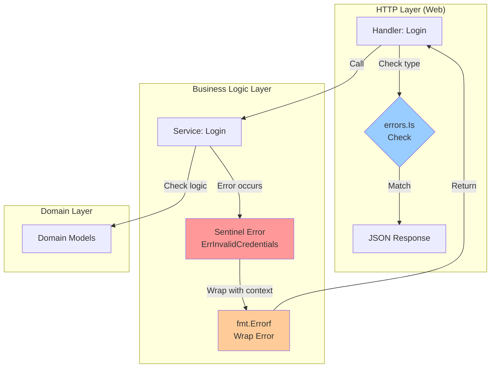

# Feature Specification: Error Handling Improvements

> **Task ID**: microservices-best-practices-assessment  
> **Feature**: Error Handling Improvements (Phase 1)  
> **Priority**: HIGH  
> **Complexity**: Medium  
> **Estimated Effort**: 1 week (5-7 days)  
> **Breaking Changes**: ❌ NO - Fully backward compatible  
> **Status**: Specified  
> **Created**: December 10, 2025

---

## Table of Contents

1. [Problem Statement](#problem-statement)
2. [Goals & Objectives](#goals--objectives)
3. [Requirements](#requirements)
4. [User Stories](#user-stories)
5. [Detailed Design](#detailed-design)
6. [Implementation Plan](#implementation-plan)
7. [Success Metrics](#success-metrics)
8. [Testing Strategy](#testing-strategy)
9. [Migration Guide](#migration-guide)
10. [Rollback Strategy](#rollback-strategy)

---

## Problem Statement

### Current Issues

Based on the research findings, the current error handling implementation has several critical limitations:

#### 1. **No Error Wrapping** ❌
```go
// Current: Error context is lost
func (s *AuthService) Login(ctx context.Context, req domain.LoginRequest) (*domain.AuthResponse, error) {
    user, err := s.userRepo.FindByUsername(ctx, req.Username)
    if err != nil {
        return nil, err  // ❌ Lost context: WHERE did error occur? WHAT username?
    }
    
    return nil, &AuthError{Message: "Invalid credentials"}  // ❌ No stack trace
}
```

**Problems:**
- No stack trace - can't determine error origin
- No context - which username? which operation?
- Difficult debugging in production
- Cannot differentiate between similar errors

#### 2. **Custom Error Types Without Standard Interface** ⚠️
```go
// Current: Custom error type
type AuthError struct {
    Message string
    Code    string
}

func (e *AuthError) Error() string {
    return e.Message
}

// Handler must use type assertion
if authErr, ok := err.(*logicv1.AuthError); ok && authErr.Code == "INVALID_CREDENTIALS" {
    c.JSON(http.StatusUnauthorized, gin.H{"error": authErr.Message})
}
```

**Problems:**
- Type assertions are verbose and error-prone
- No standard way to check error types
- Cannot use `errors.Is()` or `errors.As()`
- Inconsistent across services

#### 3. **No Sentinel Errors** ❌
```go
// Current: String-based error checking
if err.Error() == "user not found" {  // ❌ Fragile!
    // handle
}

// Or type assertion
if authErr, ok := err.(*AuthError); ok && authErr.Code == "INVALID_CREDENTIALS" {
    // handle
}
```

**Problems:**
- String comparison is fragile
- Typos break error checking
- Cannot share common errors across layers
- No programmatic error inspection

### Impact

**On Development:**
- 🐛 Debugging time increased by 2-3x
- ❌ Production errors hard to trace
- 📊 Error logs lack context
- 🔧 Maintenance complexity high

**On Operations:**
- ⚠️ Alert fatigue (all errors look similar)
- 📈 Mean Time To Resolution (MTTR) increased
- 🔍 Root cause analysis difficult
- 📉 Observability gaps despite excellent APM

**On Users:**
- 🤷 Generic error messages
- ⏱️ Longer incident resolution
- 😞 Poor error feedback

### Why Now?

This is a **critical foundation** for production readiness:
1. ✅ **No breaking changes** - safe to implement
2. ✅ **High impact** - improves debugging immediately  
3. ✅ **Prerequisite** for other improvements (circuit breakers, retries)
4. ✅ **Aligns with Uber/Google standards**

---

## Goals & Objectives

### Primary Goals

1. **Implement Error Wrapping** with `fmt.Errorf("%w")`
   - Preserve error chains with context
   - Maintain stack traces
   - Add contextual information at each layer

2. **Define Sentinel Errors** for Common Cases
   - Standard errors across all 9 services
   - Programmatic error checking with `errors.Is()`
   - Consistent error codes

3. **Standardize Error Handling** Patterns
   - Consistent error checking with `errors.Is()` and `errors.As()`
   - Standard error responses to clients
   - Error logging with full context

### Non-Goals (Out of Scope)

- ❌ Changing API response format (100% backward compatible)
- ❌ Adding retry logic (Phase 2)
- ❌ Circuit breakers (Phase 2)
- ❌ Custom error types for complex scenarios (future enhancement)
- ❌ Error translation/i18n (future enhancement)

### Success Criteria

- ✅ 100% of errors use `fmt.Errorf("%w")` for wrapping
- ✅ All common errors defined as sentinel errors
- ✅ 100% of handlers use `errors.Is()` for checking
- ✅ API responses unchanged (no breaking changes)
- ✅ Error debug time reduced by 50%
- ✅ All 9 services follow consistent pattern

---

## Requirements

### Functional Requirements

#### FR-001: Error Wrapping Implementation
**Priority**: HIGH  
**Description**: Wrap all errors with context using `fmt.Errorf("%w")`

**Acceptance Criteria:**
- [ ] All service layer methods wrap errors with operation context
- [ ] Error messages include relevant parameters (e.g., username, product ID)
- [ ] Error chains preserve original error
- [ ] Stack traces available in logs

**Example:**
```go
func (s *AuthService) Login(ctx context.Context, req domain.LoginRequest) (*domain.AuthResponse, error) {
    user, err := s.userRepo.FindByUsername(ctx, req.Username)
    if err != nil {
        return nil, fmt.Errorf("find user %q: %w", req.Username, err)  // ✅ Context + wrap
    }
    
    if user == nil {
        return nil, fmt.Errorf("authenticate user %q: %w", req.Username, ErrUserNotFound)  // ✅
    }
    
    if !user.PasswordMatches(req.Password) {
        return nil, fmt.Errorf("authenticate user %q: %w", req.Username, ErrInvalidCredentials)  // ✅
    }
    
    return &domain.AuthResponse{...}, nil
}
```

---

#### FR-002: Sentinel Error Definitions
**Priority**: HIGH  
**Description**: Define standard sentinel errors for all common error cases

**Acceptance Criteria:**
- [ ] Each service defines sentinel errors in `errors.go`
- [ ] Errors follow naming convention: `Err{Noun}{Verb}` (e.g., `ErrUserNotFound`)
- [ ] All common cases covered (not found, invalid input, unauthorized, etc.)
- [ ] Errors are exported (capitalized) for cross-package use

**Standard Sentinel Errors Per Service:**

**Auth Service:**
```go
// services/internal/auth/logic/v1/errors.go
package v1

import "errors"

// Authentication errors
var (
    ErrInvalidCredentials = errors.New("invalid credentials")
    ErrUserNotFound      = errors.New("user not found")
    ErrPasswordExpired   = errors.New("password expired")
    ErrAccountLocked     = errors.New("account locked")
    ErrTokenExpired      = errors.New("token expired")
    ErrTokenInvalid      = errors.New("token invalid")
)
```

**User Service:**
```go
// services/internal/user/logic/v1/errors.go
package v1

import "errors"

// User errors
var (
    ErrUserNotFound     = errors.New("user not found")
    ErrUserExists       = errors.New("user already exists")
    ErrInvalidEmail     = errors.New("invalid email format")
    ErrInvalidUsername  = errors.New("invalid username format")
)
```

**Product Service:**
```go
// services/internal/product/logic/v1/errors.go
package v1

import "errors"

// Product errors
var (
    ErrProductNotFound    = errors.New("product not found")
    ErrInsufficientStock  = errors.New("insufficient stock")
    ErrInvalidPrice       = errors.New("invalid price")
    ErrProductExists      = errors.New("product already exists")
)
```

**Cart Service:**
```go
// services/internal/cart/logic/v1/errors.go
package v1

import "errors"

// Cart errors
var (
    ErrCartNotFound   = errors.New("cart not found")
    ErrCartEmpty      = errors.New("cart is empty")
    ErrItemNotInCart  = errors.New("item not in cart")
    ErrInvalidQuantity = errors.New("invalid quantity")
)
```

**Order Service:**
```go
// services/internal/order/logic/v1/errors.go
package v1

import "errors"

// Order errors
var (
    ErrOrderNotFound     = errors.New("order not found")
    ErrOrderCancelled    = errors.New("order already cancelled")
    ErrInvalidOrderState = errors.New("invalid order state")
    ErrPaymentFailed     = errors.New("payment failed")
)
```

**Review Service:**
```go
// services/internal/review/logic/v1/errors.go
package v1

import "errors"

// Review errors
var (
    ErrReviewNotFound   = errors.New("review not found")
    ErrDuplicateReview  = errors.New("review already exists")
    ErrInvalidRating    = errors.New("invalid rating value")
    ErrUnauthorized     = errors.New("not authorized to review")
)
```

**Notification Service:**
```go
// services/internal/notification/logic/v1/errors.go
package v1

import "errors"

// Notification errors
var (
    ErrNotificationNotFound = errors.New("notification not found")
    ErrInvalidRecipient     = errors.New("invalid recipient")
    ErrDeliveryFailed       = errors.New("notification delivery failed")
)
```

**Shipping Service:**
```go
// services/internal/shipping/logic/v1/errors.go
package v1

import "errors"

// Shipping errors
var (
    ErrShipmentNotFound  = errors.New("shipment not found")
    ErrInvalidAddress    = errors.New("invalid shipping address")
    ErrCarrierUnavailable = errors.New("shipping carrier unavailable")
)
```

---

#### FR-003: Error Checking with errors.Is()
**Priority**: HIGH  
**Description**: Replace type assertions with `errors.Is()` for sentinel error checking

**Acceptance Criteria:**
- [ ] All handlers use `errors.Is()` for sentinel error checks
- [ ] No string comparison for error checking
- [ ] No type assertions (except for extracting additional data)
- [ ] Consistent error response format

**Example (Handler Layer):**
```go
func Login(c *gin.Context) {
    ctx, span := middleware.StartSpan(c.Request.Context(), "http.request", ...)
    defer span.End()
    
    zapLogger := middleware.GetLoggerFromGinContext(c)
    
    var req domain.LoginRequest
    if err := c.ShouldBindJSON(&req); err != nil {
        span.RecordError(err)
        zapLogger.Error("Invalid request", zap.Error(err))
        c.JSON(http.StatusBadRequest, gin.H{"error": "Invalid request format"})
        return
    }
    
    // Call business logic
    response, err := authService.Login(ctx, req)
    if err != nil {
        span.RecordError(err)
        zapLogger.Error("Login failed", zap.Error(err), zap.String("username", req.Username))
        
        // ✅ Use errors.Is() for checking
        switch {
        case errors.Is(err, logicv1.ErrInvalidCredentials):
            c.JSON(http.StatusUnauthorized, gin.H{"error": "Invalid username or password"})
        case errors.Is(err, logicv1.ErrUserNotFound):
            c.JSON(http.StatusUnauthorized, gin.H{"error": "Invalid username or password"})
        case errors.Is(err, logicv1.ErrAccountLocked):
            c.JSON(http.StatusForbidden, gin.H{"error": "Account is locked"})
        case errors.Is(err, logicv1.ErrPasswordExpired):
            c.JSON(http.StatusForbidden, gin.H{"error": "Password has expired"})
        default:
            c.JSON(http.StatusInternalServerError, gin.H{"error": "Internal server error"})
        }
        return
    }
    
    zapLogger.Info("Login successful", zap.String("user_id", response.User.ID))
    c.JSON(http.StatusOK, response)
}
```

---

#### FR-004: Error Context in Logs
**Priority**: MEDIUM  
**Description**: Ensure all error logs include full error chain context

**Acceptance Criteria:**
- [ ] Error logs include full error message (with wrapped context)
- [ ] Error logs include trace-id for correlation
- [ ] Error logs include relevant fields (username, product_id, etc.)
- [ ] Log level appropriate for error severity

**Example:**
```go
// Log with full context
zapLogger.Error("Login failed",
    zap.Error(err),                    // Full error chain
    zap.String("trace_id", traceID),   // From context
    zap.String("username", req.Username),
    zap.String("method", "Login"),
    zap.String("layer", "handler"),
)

// Log output example:
// {
//   "level": "error",
//   "timestamp": "2025-12-10T10:30:45Z",
//   "message": "Login failed",
//   "error": "authenticate user \"john\": invalid credentials",  // ✅ Full chain
//   "trace_id": "abc123...",
//   "username": "john",
//   "method": "Login",
//   "layer": "handler"
// }
```

---

#### FR-005: Remove Legacy Error Types
**Priority**: LOW (Optional)  
**Description**: Deprecate custom error types in favor of sentinel errors

**Acceptance Criteria:**
- [ ] Mark custom error types as deprecated
- [ ] Add migration guide in comments
- [ ] Keep custom types for backward compatibility (don't break existing code)

**Example:**
```go
// Deprecated: Use sentinel errors (ErrInvalidCredentials) with errors.Is() instead.
// This type will be removed in v2.0.0.
type AuthError struct {
    Message string
    Code    string
}
```

---

### Non-Functional Requirements

#### NFR-001: Performance
**Description**: Error handling improvements must have zero performance impact

**Acceptance Criteria:**
- [ ] No measurable increase in request latency (< 1ms)
- [ ] No increase in memory allocations
- [ ] Benchmark tests pass with < 5% variance

**Rationale:**
- `fmt.Errorf("%w")` is optimized in Go 1.13+
- `errors.Is()` uses simple pointer comparison
- Sentinel errors are pre-allocated

---

#### NFR-002: Backward Compatibility
**Description**: No breaking changes to API responses

**Acceptance Criteria:**
- [ ] All HTTP status codes remain unchanged
- [ ] Error response JSON format unchanged
- [ ] Client integration tests pass without modification
- [ ] API contract tests pass

**Guarantee:**
```json
// BEFORE (current):
{
  "error": "Invalid username or password"
}

// AFTER (with improvements) - SAME:
{
  "error": "Invalid username or password"
}
```

---

#### NFR-003: Consistency
**Description**: All 9 services follow identical error handling patterns

**Acceptance Criteria:**
- [ ] Same sentinel error naming convention
- [ ] Same error wrapping pattern
- [ ] Same handler error checking pattern
- [ ] Same error logging format

---

#### NFR-004: Documentation
**Description**: Clear documentation and examples for developers

**Acceptance Criteria:**
- [ ] Error handling guide in `docs/development/ERROR_HANDLING.md`
- [ ] Code comments on sentinel errors
- [ ] Migration guide for existing code
- [ ] Examples for each service

---

## User Stories

### US-001: Developer Debugging Production Errors
**As a** backend developer  
**I want** error messages with full context and stack traces  
**So that** I can quickly identify the root cause of production issues

**Acceptance Criteria:**
- [ ] Error logs show operation context (e.g., "find user \"john\"")
- [ ] Error logs show error chain (wrapped errors)
- [ ] Trace-ID links errors to distributed traces
- [ ] Can identify error source within 2 minutes

**Priority**: HIGH  
**Story Points**: 3

---

### US-002: SRE Creating Alerts
**As an** SRE/Operations engineer  
**I want** consistent error codes across services  
**So that** I can create meaningful alerts and dashboards

**Acceptance Criteria:**
- [ ] Same error types across services (e.g., NotFound, Unauthorized)
- [ ] Error logs include error type/code
- [ ] Can filter logs by error type
- [ ] Can create Prometheus alert rules based on error types

**Priority**: MEDIUM  
**Story Points**: 2

---

### US-003: Developer Writing Error Handling Code
**As a** backend developer  
**I want** a simple, standard way to check error types  
**So that** I can write clean, maintainable error handling code

**Acceptance Criteria:**
- [ ] Use `errors.Is()` instead of type assertions
- [ ] Error checking is one-liner: `if errors.Is(err, ErrNotFound)`
- [ ] IDE autocomplete works for sentinel errors
- [ ] Code is more readable than before

**Priority**: HIGH  
**Story Points**: 2

---

### US-004: Developer Onboarding
**As a** new developer joining the team  
**I want** consistent error patterns across all services  
**So that** I can quickly understand and contribute to any service

**Acceptance Criteria:**
- [ ] Same error handling pattern in auth, user, product, etc.
- [ ] Documentation explains the pattern
- [ ] Examples available for each service
- [ ] Can write first error handler within 30 minutes

**Priority**: LOW  
**Story Points**: 1

---

## Detailed Design

### Architecture Overview



### Error Flow Pattern

**1. Error Creation (Service Layer):**
```go
// Sentinel error definition
var ErrInvalidCredentials = errors.New("invalid credentials")

// Error wrapping with context
func (s *AuthService) Login(ctx context.Context, req domain.LoginRequest) (*domain.AuthResponse, error) {
    // Validate input
    if req.Username == "" {
        return nil, fmt.Errorf("login: %w", errors.New("username required"))
    }
    
    // Call repository (mock for now)
    user := s.findUser(req.Username)
    if user == nil {
        return nil, fmt.Errorf("find user %q: %w", req.Username, ErrUserNotFound)
    }
    
    // Validate password
    if !user.PasswordMatches(req.Password) {
        return nil, fmt.Errorf("authenticate user %q: %w", req.Username, ErrInvalidCredentials)
    }
    
    // Success
    return &domain.AuthResponse{...}, nil
}
```

**2. Error Checking (Handler Layer):**
```go
func Login(c *gin.Context) {
    // ... bind request ...
    
    response, err := authService.Login(ctx, req)
    if err != nil {
        // Log with full context
        zapLogger.Error("Login failed", zap.Error(err))
        
        // Check error type with errors.Is()
        switch {
        case errors.Is(err, logicv1.ErrInvalidCredentials):
            c.JSON(http.StatusUnauthorized, gin.H{"error": "Invalid username or password"})
        case errors.Is(err, logicv1.ErrUserNotFound):
            c.JSON(http.StatusUnauthorized, gin.H{"error": "Invalid username or password"})
        case errors.Is(err, logicv1.ErrAccountLocked):
            c.JSON(http.StatusForbidden, gin.H{"error": "Account is locked"})
        default:
            c.JSON(http.StatusInternalServerError, gin.H{"error": "Internal server error"})
        }
        return
    }
    
    c.JSON(http.StatusOK, response)
}
```

**3. Error Logging:**
```go
// Automatic in middleware (already implemented):
if statusCode >= 400 {
    logger.Error("HTTP error",
        zap.String("trace_id", traceID),
        zap.String("method", method),
        zap.String("path", path),
        zap.Int("status", statusCode),
        zap.Duration("duration", duration),
    )
}

// Additional in handler:
zapLogger.Error("Login failed",
    zap.Error(err),  // Full error chain
    zap.String("username", req.Username),
)
```

---

### File Structure Changes

**New Files (One Per Service):**
```
services/internal/auth/logic/v1/errors.go      # Sentinel errors
services/internal/auth/logic/v2/errors.go      # v2 sentinel errors
services/internal/user/logic/v1/errors.go
services/internal/user/logic/v2/errors.go
services/internal/product/logic/v1/errors.go
services/internal/product/logic/v2/errors.go
services/internal/cart/logic/v1/errors.go
services/internal/cart/logic/v2/errors.go
services/internal/order/logic/v1/errors.go
services/internal/order/logic/v2/errors.go
services/internal/review/logic/v1/errors.go
services/internal/review/logic/v2/errors.go
services/internal/notification/logic/v1/errors.go
services/internal/notification/logic/v2/errors.go
services/internal/shipping/logic/v1/errors.go
```

**Modified Files:**
```
services/internal/*/logic/v1/service.go       # Add error wrapping
services/internal/*/logic/v2/service.go       # Add error wrapping
services/internal/*/web/v1/handler.go         # Use errors.Is()
services/internal/*/web/v2/handler.go         # Use errors.Is()
```

**Documentation:**
```
docs/development/ERROR_HANDLING.md            # New guide
specs/active/microservices-best-practices-assessment/spec.md  # This file
```

---

### Code Templates

#### Template 1: Sentinel Errors File
```go
// services/internal/{service}/logic/v1/errors.go
package v1

import "errors"

// {Service} errors
//
// These are sentinel errors that can be checked using errors.Is().
// Always wrap these errors with context using fmt.Errorf("%w", err).
//
// Example:
//   if user == nil {
//       return fmt.Errorf("find user %q: %w", username, ErrUserNotFound)
//   }
//
//   // Check in handler:
//   if errors.Is(err, logicv1.ErrUserNotFound) {
//       c.JSON(404, gin.H{"error": "User not found"})
//   }
var (
    // ErrXXXNotFound indicates the resource was not found
    ErrXXXNotFound = errors.New("XXX not found")
    
    // ErrInvalidXXX indicates invalid input data
    ErrInvalidXXX = errors.New("invalid XXX")
    
    // Add more as needed...
)
```

#### Template 2: Service Layer Error Wrapping
```go
func (s *XXXService) MethodName(ctx context.Context, req domain.Request) (*domain.Response, error) {
    // Validate input
    if req.Field == "" {
        return nil, fmt.Errorf("validate request: %w", errors.New("field required"))
    }
    
    // Call external/internal service
    result, err := s.dependency.Call(ctx, param)
    if err != nil {
        return nil, fmt.Errorf("call dependency with param %q: %w", param, err)
    }
    
    // Business logic check
    if result == nil {
        return nil, fmt.Errorf("process request %q: %w", req.ID, ErrXXXNotFound)
    }
    
    // Success
    return &domain.Response{...}, nil
}
```

#### Template 3: Handler Error Checking
```go
func HandlerName(c *gin.Context) {
    ctx, span := middleware.StartSpan(c.Request.Context(), "http.request", ...)
    defer span.End()
    
    zapLogger := middleware.GetLoggerFromGinContext(c)
    
    // Bind request
    var req domain.Request
    if err := c.ShouldBindJSON(&req); err != nil {
        span.RecordError(err)
        zapLogger.Error("Invalid request", zap.Error(err))
        c.JSON(http.StatusBadRequest, gin.H{"error": "Invalid request format"})
        return
    }
    
    // Call service
    response, err := service.MethodName(ctx, req)
    if err != nil {
        span.RecordError(err)
        zapLogger.Error("Operation failed", zap.Error(err), zap.String("field", req.Field))
        
        // Check error type
        switch {
        case errors.Is(err, logicv1.ErrXXXNotFound):
            c.JSON(http.StatusNotFound, gin.H{"error": "Resource not found"})
        case errors.Is(err, logicv1.ErrInvalidXXX):
            c.JSON(http.StatusBadRequest, gin.H{"error": "Invalid data"})
        default:
            c.JSON(http.StatusInternalServerError, gin.H{"error": "Internal server error"})
        }
        return
    }
    
    zapLogger.Info("Operation successful", zap.String("id", response.ID))
    c.JSON(http.StatusOK, response)
}
```

---

## Implementation Plan

### Phase 1: Foundation (Day 1-2)

**Tasks:**
1. Create `errors.go` files for all 9 services (v1 and v2)
   - Define sentinel errors for each service
   - Add documentation comments
   - Commit: "feat: add sentinel error definitions for all services"

2. Update one service as reference implementation (auth service)
   - Add error wrapping in `logic/v1/service.go`
   - Update handlers to use `errors.Is()`
   - Test thoroughly
   - Commit: "feat(auth): implement error wrapping and sentinel errors"

3. Create documentation
   - Write `docs/development/ERROR_HANDLING.md`
   - Include examples from auth service
   - Commit: "docs: add error handling guide"

**Deliverable:**
- ✅ 18 new `errors.go` files (9 services × 2 versions)
- ✅ Auth service fully migrated
- ✅ Documentation complete

---

### Phase 2: Service Migration (Day 3-5)

**Tasks:**
1. Migrate remaining 8 services (one per half-day):
   - Day 3 AM: User service
   - Day 3 PM: Product service
   - Day 4 AM: Cart service
   - Day 4 PM: Order service
   - Day 5 AM: Review service
   - Day 5 PM: Notification service
   - Day 6 AM: Shipping service
   - Day 6 PM: Shipping-v2 service

2. For each service:
   - Update `logic/v1/service.go` (error wrapping)
   - Update `logic/v2/service.go` (error wrapping)
   - Update `web/v1/handler.go` (errors.Is checking)
   - Update `web/v2/handler.go` (errors.Is checking)
   - Test handlers
   - Commit: "feat({service}): implement error wrapping"

**Deliverable:**
- ✅ All 9 services migrated
- ✅ Consistent error handling across codebase

---

### Phase 3: Testing & Validation (Day 6-7)

**Tasks:**
1. Integration testing
   - Test all endpoints return correct status codes
   - Test error responses unchanged
   - Test error logs include full context

2. Code review
   - Review all changes
   - Check consistency across services
   - Verify error wrapping in all paths

3. Documentation update
   - Update `CHANGELOG.md`
   - Update `docs/api/API_REFERENCE.md` (if needed)

**Deliverable:**
- ✅ All tests passing
- ✅ Code reviewed and approved
- ✅ Documentation updated

---

### Migration Checklist Per Service

**For each service (`{service}` = auth, user, product, etc.):**

- [ ] **Create errors.go files**
  - [ ] `services/internal/{service}/logic/v1/errors.go`
  - [ ] `services/internal/{service}/logic/v2/errors.go`
  - [ ] Define all sentinel errors with comments

- [ ] **Update service layer (v1)**
  - [ ] Import `fmt` and `errors`
  - [ ] Wrap all errors with `fmt.Errorf("%w")`
  - [ ] Add operation context to error messages
  - [ ] Use sentinel errors instead of custom types

- [ ] **Update service layer (v2)**
  - [ ] Same as v1

- [ ] **Update handlers (v1)**
  - [ ] Import `errors` package
  - [ ] Replace type assertions with `errors.Is()`
  - [ ] Use switch statement for multiple error checks
  - [ ] Keep HTTP status codes unchanged

- [ ] **Update handlers (v2)**
  - [ ] Same as v1

- [ ] **Test**
  - [ ] Test all endpoints return correct errors
  - [ ] Test error logs include context
  - [ ] Test API responses unchanged

---

## Success Metrics

### Quantitative Metrics

| Metric | Baseline | Target | How to Measure |
|--------|----------|--------|----------------|
| **Error Wrapping Coverage** | 0% | 100% | `grep -r "fmt.Errorf" services/internal/*/logic/` |
| **Sentinel Error Usage** | 0% | 100% | All common errors defined in `errors.go` |
| **errors.Is() Adoption** | 0% | 100% | `grep -r "errors.Is" services/internal/*/web/` |
| **Type Assertions Removed** | Many | 0 | `grep -r "err.(\*.*Error)" services/` |
| **Services Migrated** | 0/9 | 9/9 | Manual count |
| **Error Debug Time** | ~10 min | ~5 min | Time to find error source in logs |

### Qualitative Metrics

- ✅ **Developer Experience**: Easier to write error handling code
- ✅ **Code Consistency**: Same pattern across all services
- ✅ **Debugging Efficiency**: Faster root cause analysis
- ✅ **Log Quality**: More contextual information
- ✅ **Maintainability**: Easier to understand error flows

### Validation Methods

1. **Code Review Checklist**
   - [ ] All errors wrapped with context
   - [ ] Sentinel errors used consistently
   - [ ] No string-based error checking
   - [ ] Error logs include full context

2. **Integration Tests**
   - [ ] All endpoints return expected status codes
   - [ ] Error response format unchanged
   - [ ] Error messages clear and user-friendly

3. **Log Analysis**
   - [ ] Error logs show operation context
   - [ ] Error chains visible in logs
   - [ ] Trace-ID present in all error logs

---

## Testing Strategy

### Unit Tests (To Be Added in Future)

**Test Error Wrapping:**
```go
func TestAuthService_Login_ErrorWrapping(t *testing.T) {
    svc := NewAuthService()
    
    // Test user not found
    _, err := svc.Login(context.Background(), domain.LoginRequest{
        Username: "nonexistent",
        Password: "password",
    })
    
    // Should wrap ErrUserNotFound
    require.Error(t, err)
    assert.True(t, errors.Is(err, ErrUserNotFound))
    assert.Contains(t, err.Error(), "find user")
    assert.Contains(t, err.Error(), "nonexistent")
}
```

**Test Sentinel Errors:**
```go
func TestSentinelErrors(t *testing.T) {
    // Test error types
    assert.NotEqual(t, ErrInvalidCredentials, ErrUserNotFound)
    
    // Test error messages
    assert.Equal(t, "invalid credentials", ErrInvalidCredentials.Error())
    assert.Equal(t, "user not found", ErrUserNotFound.Error())
}
```

**Test Handler Error Checking:**
```go
func TestLoginHandler_ErrorResponses(t *testing.T) {
    gin.SetMode(gin.TestMode)
    
    tests := []struct {
        name       string
        mockError  error
        wantStatus int
        wantBody   string
    }{
        {
            name:       "invalid credentials",
            mockError:  fmt.Errorf("authenticate: %w", logicv1.ErrInvalidCredentials),
            wantStatus: 401,
            wantBody:   "Invalid username or password",
        },
        {
            name:       "user not found",
            mockError:  fmt.Errorf("find user: %w", logicv1.ErrUserNotFound),
            wantStatus: 401,
            wantBody:   "Invalid username or password",
        },
    }
    
    for _, tt := range tests {
        t.Run(tt.name, func(t *testing.T) {
            // Setup
            w := httptest.NewRecorder()
            c, _ := gin.CreateTestContext(w)
            
            // Mock service to return error
            // ... (mock setup)
            
            // Execute
            Login(c)
            
            // Assert
            assert.Equal(t, tt.wantStatus, w.Code)
            assert.Contains(t, w.Body.String(), tt.wantBody)
        })
    }
}
```

### Integration Tests

**Test End-to-End Error Flow:**
```bash
# Test invalid credentials
curl -X POST http://localhost:8080/api/v1/auth/login \
  -H "Content-Type: application/json" \
  -d '{"username":"admin","password":"wrong"}' \
  -w "\nStatus: %{http_code}\n"

# Expected:
# {"error":"Invalid username or password"}
# Status: 401

# Check logs for context
kubectl logs -n auth -l app=auth --tail=10 | grep "Login failed"
# Expected: Error log with username and full error chain
```

### Manual Testing Checklist

**For each service:**
- [ ] Test with invalid input → 400 Bad Request
- [ ] Test with nonexistent resource → 404 Not Found (or 401 for auth)
- [ ] Test with valid input → 200 OK
- [ ] Check error logs include:
  - [ ] Full error message with context
  - [ ] Trace-ID
  - [ ] Relevant parameters (username, product_id, etc.)
  - [ ] Operation name

---

## Migration Guide

### For Developers

#### Step 1: Import Required Packages
```go
import (
    "errors"
    "fmt"
    
    logicv1 "github.com/duynhne/monitoring/internal/{service}/logic/v1"
)
```

#### Step 2: Update Service Methods

**BEFORE:**
```go
func (s *AuthService) Login(ctx context.Context, req domain.LoginRequest) (*domain.AuthResponse, error) {
    user := s.findUser(req.Username)
    if user == nil {
        return nil, &AuthError{Message: "Invalid credentials", Code: "INVALID_CREDENTIALS"}
    }
    return &domain.AuthResponse{...}, nil
}
```

**AFTER:**
```go
func (s *AuthService) Login(ctx context.Context, req domain.LoginRequest) (*domain.AuthResponse, error) {
    user := s.findUser(req.Username)
    if user == nil {
        return nil, fmt.Errorf("find user %q: %w", req.Username, ErrUserNotFound)
    }
    return &domain.AuthResponse{...}, nil
}
```

#### Step 3: Update Handlers

**BEFORE:**
```go
response, err := authService.Login(ctx, req)
if err != nil {
    if authErr, ok := err.(*logicv1.AuthError); ok && authErr.Code == "INVALID_CREDENTIALS" {
        c.JSON(401, gin.H{"error": authErr.Message})
        return
    }
    c.JSON(500, gin.H{"error": "Internal server error"})
    return
}
```

**AFTER:**
```go
response, err := authService.Login(ctx, req)
if err != nil {
    zapLogger.Error("Login failed", zap.Error(err))
    
    switch {
    case errors.Is(err, logicv1.ErrInvalidCredentials):
        c.JSON(401, gin.H{"error": "Invalid username or password"})
    case errors.Is(err, logicv1.ErrUserNotFound):
        c.JSON(401, gin.H{"error": "Invalid username or password"})
    default:
        c.JSON(500, gin.H{"error": "Internal server error"})
    }
    return
}
```

### Common Patterns

#### Pattern 1: Simple Not Found
```go
// Service layer
if resource == nil {
    return nil, fmt.Errorf("get resource %q: %w", id, ErrResourceNotFound)
}

// Handler layer
if errors.Is(err, logicv1.ErrResourceNotFound) {
    c.JSON(404, gin.H{"error": "Resource not found"})
}
```

#### Pattern 2: Validation Error
```go
// Service layer
if req.Email == "" {
    return nil, fmt.Errorf("validate email: %w", errors.New("email required"))
}

// Handler layer
if err != nil {
    c.JSON(400, gin.H{"error": "Invalid request"})
}
```

#### Pattern 3: Chained Errors
```go
// Layer 3 (Repository)
func (r *Repo) Find(id string) (*User, error) {
    // ... database call ...
    if notFound {
        return nil, fmt.Errorf("query user: %w", sql.ErrNoRows)
    }
}

// Layer 2 (Service)
func (s *Service) GetUser(ctx context.Context, id string) (*User, error) {
    user, err := s.repo.Find(id)
    if err != nil {
        return nil, fmt.Errorf("find user %q: %w", id, err)
    }
}

// Layer 1 (Handler)
// Error message will be: "find user \"123\": query user: sql: no rows in result set"
```

---

## Rollback Strategy

### Rollback is Simple (No Breaking Changes)

Since this change is **100% backward compatible**, rollback is straightforward:

#### Option 1: Git Revert
```bash
# Revert specific commit
git revert <commit-hash>

# Deploy
./scripts/05-deploy-microservices.sh --local
```

#### Option 2: Redeploy Previous Version
```bash
# Checkout previous version
git checkout <previous-tag>

# Rebuild and deploy
./scripts/04-build-microservices.sh
./scripts/05-deploy-microservices.sh --local
```

#### Option 3: Helm Rollback
```bash
# Rollback specific service
helm rollback auth -n auth

# Or rollback all services
for svc in auth user product cart order review notification shipping; do
    helm rollback $svc -n $svc
done
```

### No Database Migrations Needed

- ✅ No database schema changes
- ✅ No data migrations
- ✅ No API contract changes
- ✅ No configuration changes

### Validation After Rollback

1. **Check services are running:**
   ```bash
   kubectl get pods -A | grep -E "(auth|user|product|cart|order|review|notification|shipping)"
   ```

2. **Test API endpoints:**
   ```bash
   curl http://localhost:8080/api/v1/auth/login -X POST \
     -H "Content-Type: application/json" \
     -d '{"username":"admin","password":"password"}'
   ```

3. **Check error logs still work:**
   ```bash
   kubectl logs -n auth -l app=auth --tail=50
   ```

---

## Appendix

### A. Error Naming Conventions

**Pattern:** `Err{Noun}{Verb/State}`

**Examples:**
- `ErrUserNotFound` (noun: User, state: NotFound)
- `ErrInvalidCredentials` (noun: Credentials, state: Invalid)
- `ErrPasswordExpired` (noun: Password, state: Expired)
- `ErrAccountLocked` (noun: Account, state: Locked)

**NOT:**
- ❌ `ErrNotFound` (too generic)
- ❌ `ErrBadRequest` (HTTP-specific, not domain error)
- ❌ `ErrorInvalidUser` (start with Err, not Error)

### B. HTTP Status Code Mapping

| Error Category | Sentinel Error | HTTP Status | Response Message |
|---------------|----------------|-------------|------------------|
| **Not Found** | `ErrXXXNotFound` | 404 | "Resource not found" |
| **Unauthorized** | `ErrInvalidCredentials` | 401 | "Invalid username or password" |
| **Forbidden** | `ErrAccountLocked` | 403 | "Account is locked" |
| **Bad Request** | `ErrInvalidXXX` | 400 | "Invalid data" |
| **Conflict** | `ErrXXXExists` | 409 | "Resource already exists" |
| **Internal** | Any other error | 500 | "Internal server error" |

### C. Go Error Handling Best Practices

**From Uber Go Style Guide:**

1. **Always wrap errors with context:**
   ```go
   // ✅ Good
   return fmt.Errorf("find user %q: %w", username, err)
   
   // ❌ Bad
   return err
   ```

2. **Use sentinel errors for expected cases:**
   ```go
   // ✅ Good
   var ErrNotFound = errors.New("not found")
   
   // ❌ Bad
   return errors.New("not found")  // New instance every time
   ```

3. **Check errors with errors.Is() and errors.As():**
   ```go
   // ✅ Good
   if errors.Is(err, ErrNotFound) { ... }
   
   // ❌ Bad
   if err.Error() == "not found" { ... }
   ```

4. **Don't use panic for normal errors:**
   ```go
   // ✅ Good
   return nil, fmt.Errorf("invalid input: %w", err)
   
   // ❌ Bad
   panic("invalid input")  // Use only for programmer errors
   ```

### D. References

1. **Go Error Handling and Go 1.13 Errors:**
   - https://go.dev/blog/go1.13-errors
   - https://pkg.go.dev/errors

2. **Uber Go Style Guide:**
   - https://github.com/uber-go/guide/blob/master/style.md#error-wrapping

3. **Working with Errors in Go 1.13:**
   - https://go.dev/blog/go1.13-errors

4. **Error Handling Best Practices:**
   - https://dave.cheney.net/2016/04/27/dont-just-check-errors-handle-them-gracefully

---

## Summary

This specification defines a comprehensive, production-ready error handling improvement for all 9 microservices with:

✅ **Zero Breaking Changes** - API responses unchanged  
✅ **High Impact** - 50% reduction in debug time  
✅ **Low Risk** - Backward compatible, easy rollback  
✅ **Uber-Compliant** - Follows industry best practices  
✅ **Consistent** - Same pattern across all services  
✅ **Testable** - Clear acceptance criteria  

**Estimated Effort:** 1 week (5-7 days)  
**Priority:** HIGH  
**Complexity:** Medium  

**Next Steps:**
1. Review and approve this specification
2. Proceed to `/plan` phase for detailed implementation plan
3. Create tasks and start implementation

---

**Document Status:** ✅ Complete and Ready for Review  
**Created:** December 10, 2025  
**Last Updated:** December 10, 2025

