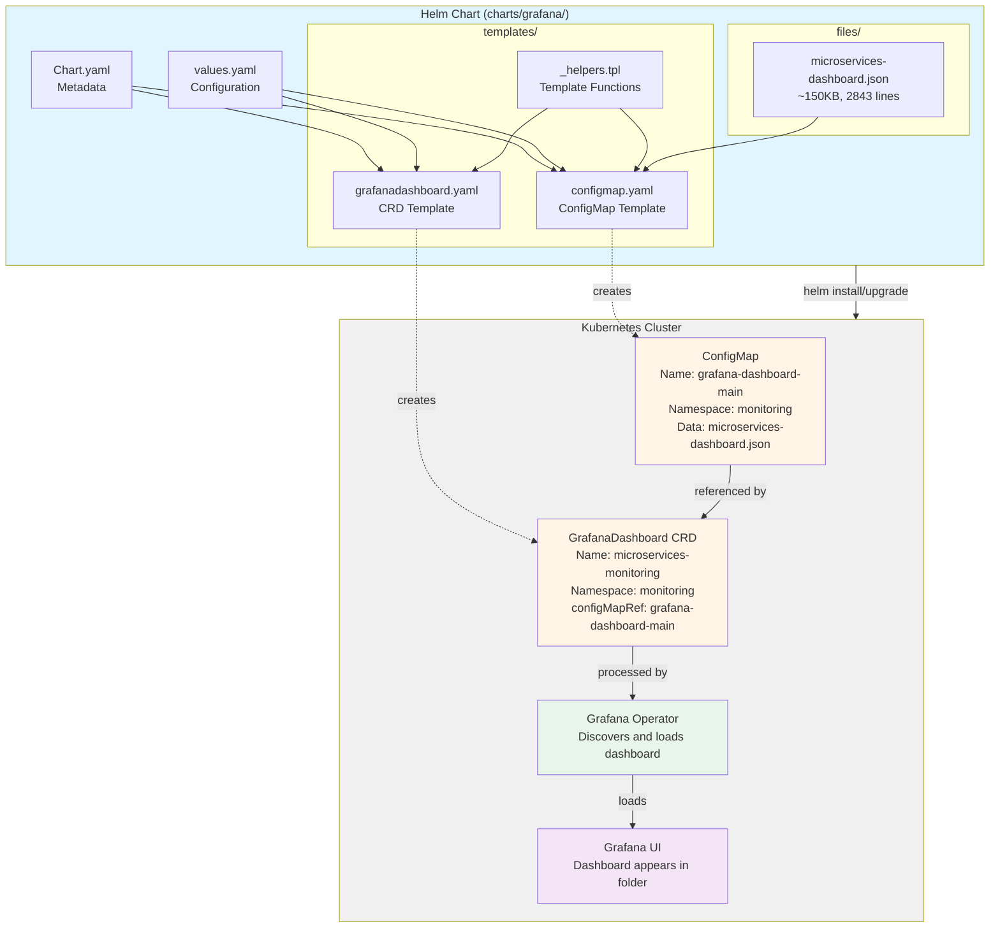

# Technical Plan: Grafana Dashboard Helm Chart with CRD Support

**Task ID:** mop-grafana-chart
**Created:** 2026-01-04
**Status:** Ready for Implementation
**Based on:** spec.md

---

## 1. System Architecture

### Overview

The chart follows a single-dashboard pattern similar to CloudNativePG's Grafana dashboard chart. It creates two Kubernetes resources:
1. **ConfigMap** - Contains the dashboard JSON file content
2. **GrafanaDashboard CRD** - References the ConfigMap for Grafana Operator to discover and load



### Architecture Decisions

| Decision | Choice | Rationale |
|----------|--------|-----------|
| **Chart Pattern** | Single-dashboard chart | Follows CloudNativePG pattern, simpler structure, independent versioning |
| **Template Approach** | Direct template generation (no loops) | Single dashboard, no need for range loops, clearer templates |
| **File Storage** | `files/` directory in chart | Standard Helm pattern, allows `.Files.Get` to load JSON |
| **ConfigMap Creation** | Helm template (not kustomization) | Avoids annotation size limits, single source of truth |
| **CRD Creation** | Helm template (not manual YAML) | Ensures ConfigMap/CRD sync, automated deployment |
| **Values Structure** | Nested `grafanaDashboard` object | Matches CloudNativePG pattern, clear organization |
| **Namespace Handling** | Configurable via values, default `monitoring` | Backward compatible, flexible for different environments |
| **Dependency Support** | Optional, via MOP chart Chart.yaml | Allows coordinated deployment but not required |

---

## 2. Technology Stack

| Layer | Technology | Version | Rationale |
|-------|------------|---------|-----------|
| **Chart Format** | Helm Chart API | v2 | Standard Helm 3.x format, widely supported |
| **Templating** | Go Templates | Built-in | Helm's native templating engine, powerful and flexible |
| **Kubernetes API** | ConfigMap API | v1 | Standard Kubernetes resource for configuration data |
| **Grafana Operator** | GrafanaDashboard CRD | v1beta1 | Grafana Operator's custom resource for dashboard management |
| **Package Format** | Helm Chart (.tgz) | Standard | Standard Helm package format for distribution |
| **OCI Registry** | OCI Artifact | v1 | Modern container registry format, supported by Helm 3.8+ |
| **YAML** | YAML 1.2 | Standard | Kubernetes and Helm standard format |

### Dependencies

**Helm Chart Dependencies (if MOP chart uses grafana as dependency):**
```yaml
# charts/mop/Chart.yaml
dependencies:
  - name: grafana
    version: "0.1.0"
    repository: "file://../grafana"
    condition: grafana.enabled
```

**Kubernetes Prerequisites:**
- Kubernetes cluster (1.19+)
- Grafana Operator installed (assumes CRD exists)
- Namespace `monitoring` exists (or configurable)
- Helm 3.x client

**No External Dependencies:**
- Chart is self-contained
- No external Helm repositories required
- No external services or APIs

---

## 3. Component Design

### Component 1: Chart.yaml

**Purpose:** Defines chart metadata, version, and optional dependencies.

**Responsibilities:**
- Declare chart name, version, and description
- Specify chart type (application)
- Include maintainer information
- Define keywords for discoverability
- Optionally declare dependencies (if used by MOP chart)

**Structure:**
```yaml
apiVersion: v2
name: grafana
description: Grafana Dashboard Helm Chart with ConfigMap and CRD Support
type: application
version: 0.1.0
appVersion: "1.0.0"
maintainers:
  - name: duynhne
    url: https://github.com/duynhne
keywords:
  - grafana
  - dashboard
  - monitoring
  - observability
  - configmap
  - crd
```

**Dependencies:** None (standalone chart)

**Key Decisions:**
- Chart name: `grafana` (simple, clear)
- Version: `0.1.0` (semantic versioning, starting at 0.1.0)
- Type: `application` (not library, creates resources)

---

### Component 2: values.yaml

**Purpose:** Provides default configuration values and documentation.

**Responsibilities:**
- Define all configurable parameters
- Provide sensible defaults
- Document each field with comments
- Support backward compatibility (same names as current setup)

**Structure:**
```yaml
# Namespace for all resources
# Default: monitoring (matches current setup)
namespace: monitoring

# Grafana instance selector
# Must match labels on Grafana CRD instance
instanceSelector:
  matchLabels:
    dashboards: grafana

# Dashboard configuration
grafanaDashboard:
  # ConfigMap name
  # Default: grafana-dashboard-main (matches current setup)
  configMapName: "grafana-dashboard-main"
  
  # Dashboard JSON file name (in files/ directory)
  # Default: microservices-dashboard.json
  fileName: "microservices-dashboard.json"
  
  # Grafana folder name
  # Default: Observability
  folder: "Observability"
  
  # Datasource mappings
  # Maps template variables in dashboard JSON to Grafana datasources
  datasources:
    - inputName: DS_PROMETHEUS
      datasourceName: Prometheus
  
  # Labels for ConfigMap
  # Used for sidecar discovery (if using sidecar pattern)
  labels:
    grafana_dashboard: "1"
  
  # Annotations for ConfigMap
  annotations: {}

# CRD name (optional, defaults to microservices-monitoring)
# Can be overridden if needed
crdName: "microservices-monitoring"
```

**Dependencies:** None (standalone configuration)

**Key Decisions:**
- Nested `grafanaDashboard` structure (matches CloudNativePG pattern)
- Default values match current setup (backward compatible)
- All fields documented with comments

---

### Component 3: templates/_helpers.tpl

**Purpose:** Provides reusable template functions for consistent naming and labeling.

**Responsibilities:**
- Define chart name helper
- Define fullname helper (if needed)
- Define common labels
- Define namespace helper
- Ensure consistent naming across templates

**Structure:**
```go
{{/*
Expand the name of the chart.
*/}}
{{- define "grafana.name" -}}
{{- default .Chart.Name .Values.nameOverride | trunc 63 | trimSuffix "-" }}
{{- end }}

{{/*
Create a default fully qualified app name.
*/}}
{{- define "grafana.fullname" -}}
{{- if .Values.fullnameOverride }}
{{- .Values.fullnameOverride | trunc 63 | trimSuffix "-" }}
{{- else }}
{{- $name := default .Chart.Name .Values.nameOverride }}
{{- printf "%s-%s" $name .Release.Name | trunc 63 | trimSuffix "-" }}
{{- end }}
{{- end }}

{{/*
Create chart name and version as used by the chart label.
*/}}
{{- define "grafana.chart" -}}
{{- printf "%s-%s" .Chart.Name .Chart.Version | replace "+" "_" | trunc 63 | trimSuffix "-" }}
{{- end }}

{{/*
Common labels
*/}}
{{- define "grafana.labels" -}}
helm.sh/chart: {{ include "grafana.chart" . }}
{{ include "grafana.selectorLabels" . }}
{{- if .Chart.AppVersion }}
app.kubernetes.io/version: {{ .Chart.AppVersion | quote }}
{{- end }}
app.kubernetes.io/managed-by: {{ .Release.Service }}
{{- end }}

{{/*
Selector labels
*/}}
{{- define "grafana.selectorLabels" -}}
app.kubernetes.io/name: {{ include "grafana.name" . }}
app.kubernetes.io/instance: {{ .Release.Name }}
{{- end }}

{{/*
Create namespace
*/}}
{{- define "grafana.namespace" -}}
{{- .Values.namespace | default .Release.Namespace }}
{{- end }}
```

**Dependencies:** None (pure template functions)

**Key Decisions:**
- Follow Helm best practices for helper naming
- Use `grafana` prefix for all helpers (matches chart name)
- Support nameOverride and fullnameOverride for flexibility

---

### Component 4: templates/configmap.yaml

**Purpose:** Creates Kubernetes ConfigMap containing dashboard JSON content.

**Responsibilities:**
- Load JSON file from `files/` directory using `.Files.Get`
- Create ConfigMap with proper name and namespace
- Apply labels and annotations from values
- Format JSON content with proper indentation
- Handle large files without annotation size limits

**Structure:**
```yaml
apiVersion: v1
kind: ConfigMap
metadata:
  name: {{ .Values.grafanaDashboard.configMapName }}
  namespace: {{ include "grafana.namespace" . }}
  {{- if .Values.grafanaDashboard.labels }}
  labels:
    {{- toYaml .Values.grafanaDashboard.labels | nindent 4 }}
  {{- end }}
  {{- if .Values.grafanaDashboard.annotations }}
  annotations:
    {{- toYaml .Values.grafanaDashboard.annotations | nindent 4 }}
  {{- end }}
data:
  {{ .Values.grafanaDashboard.fileName }}: |-
{{ .Files.Get (printf "files/%s" .Values.grafanaDashboard.fileName) | indent 4 }}
```

**Dependencies:**
- `_helpers.tpl` (namespace helper)
- `values.yaml` (configuration)
- `files/microservices-dashboard.json` (dashboard content)

**Key Decisions:**
- Use `.Files.Get` to load file (Helm standard)
- Use `indent` function for proper YAML formatting
- ConfigMap name from values (backward compatible)
- File name as key in ConfigMap data (matches current setup)

**Error Handling:**
- Helm will fail if file not found (clear error message)
- Large files handled by Helm (no annotation size limit)

---

### Component 5: templates/grafanadashboard.yaml

**Purpose:** Creates GrafanaDashboard CRD that references the ConfigMap.

**Responsibilities:**
- Create GrafanaDashboard CRD with proper name
- Reference ConfigMap created by configmap.yaml
- Configure instanceSelector to match Grafana instance
- Set folder name for dashboard organization
- Map datasources from values

**Structure:**
```yaml
apiVersion: grafana.integreatly.org/v1beta1
kind: GrafanaDashboard
metadata:
  name: {{ .Values.crdName | default "microservices-monitoring" }}
  namespace: {{ include "grafana.namespace" . }}
  {{- with (include "grafana.labels" .) }}
  labels:
    {{- . | nindent 4 }}
  {{- end }}
spec:
  instanceSelector:
    matchLabels:
      {{- toYaml .Values.instanceSelector.matchLabels | nindent 6 }}
  folder: {{ .Values.grafanaDashboard.folder | quote }}
  configMapRef:
    name: {{ .Values.grafanaDashboard.configMapName }}
    key: {{ .Values.grafanaDashboard.fileName }}
  {{- if .Values.grafanaDashboard.datasources }}
  datasources:
    {{- toYaml .Values.grafanaDashboard.datasources | nindent 4 }}
  {{- end }}
```

**Dependencies:**
- `_helpers.tpl` (namespace, labels helpers)
- `values.yaml` (configuration)
- ConfigMap created by configmap.yaml (referenced)

**Key Decisions:**
- CRD name from values with default (backward compatible)
- ConfigMap reference uses values (ensures sync)
- InstanceSelector from values (flexible)
- Datasources from values (configurable)

**Error Handling:**
- Helm will fail if CRD API not available (Grafana Operator not installed)
- CRD will fail if ConfigMap doesn't exist (order dependency)

---

### Component 6: files/microservices-dashboard.json

**Purpose:** Stores the dashboard JSON definition.

**Responsibilities:**
- Contain complete Grafana dashboard JSON
- Be readable by Helm's `.Files.Get`
- Remain unchanged by templates (source of truth)

**Structure:**
- Raw JSON file (2843 lines, ~150KB)
- Copied from `k8s/grafana-operator/dashboards/microservices-dashboard.json`
- No templating applied (static content)

**Dependencies:** None (source file)

**Key Decisions:**
- Store in `files/` directory (Helm standard)
- No templating in JSON (keeps it simple)
- Large file size handled by Helm (no special processing needed)

---

## 4. Data Model

### Values Structure

**Root Level:**
```yaml
namespace: string              # Kubernetes namespace (default: "monitoring")
instanceSelector: object       # Grafana instance selector
grafanaDashboard: object       # Dashboard configuration
crdName: string                # Optional CRD name override
```

**instanceSelector Structure:**
```yaml
instanceSelector:
  matchLabels:
    dashboards: string         # Label key-value pair (default: "grafana")
```

**grafanaDashboard Structure:**
```yaml
grafanaDashboard:
  configMapName: string        # ConfigMap name (default: "grafana-dashboard-main")
  fileName: string             # JSON file name (default: "microservices-dashboard.json")
  folder: string               # Grafana folder (default: "Observability")
  datasources: array           # Datasource mappings
  labels: object               # ConfigMap labels
  annotations: object          # ConfigMap annotations
```

**datasources Array Item:**
```yaml
- inputName: string            # Template variable name (e.g., "DS_PROMETHEUS")
  datasourceName: string       # Grafana datasource name (e.g., "Prometheus")
```

### ConfigMap Data Model

**ConfigMap Structure:**
```yaml
apiVersion: v1
kind: ConfigMap
metadata:
  name: string                 # From grafanaDashboard.configMapName
  namespace: string            # From namespace
  labels: object               # From grafanaDashboard.labels
  annotations: object          # From grafanaDashboard.annotations
data:
  <fileName>: string           # JSON content from files/<fileName>
```

**Data Content:**
- Key: File name (e.g., "microservices-dashboard.json")
- Value: Complete dashboard JSON (string, multi-line)

### GrafanaDashboard CRD Model

**CRD Structure:**
```yaml
apiVersion: grafana.integreatly.org/v1beta1
kind: GrafanaDashboard
metadata:
  name: string                 # From crdName or default
  namespace: string            # From namespace
  labels: object               # From helpers
spec:
  instanceSelector:
    matchLabels: object        # From instanceSelector.matchLabels
  folder: string               # From grafanaDashboard.folder
  configMapRef:
    name: string              # From grafanaDashboard.configMapName
    key: string                # From grafanaDashboard.fileName
  datasources: array           # From grafanaDashboard.datasources
```

---

## 5. Template Contracts

### Template Dependencies

```
Chart.yaml
  └─> (no dependencies)

values.yaml
  └─> (no dependencies)

templates/_helpers.tpl
  └─> (no dependencies, pure functions)

templates/configmap.yaml
  ├─> _helpers.tpl (namespace helper)
  ├─> values.yaml (grafanaDashboard config)
  └─> files/microservices-dashboard.json (content)

templates/grafanadashboard.yaml
  ├─> _helpers.tpl (namespace, labels helpers)
  ├─> values.yaml (all config)
  └─> configmap.yaml (implicit: references ConfigMap name)
```

### Template Execution Order

Helm processes templates in alphabetical order, but resource creation order doesn't matter for our use case:
1. `_helpers.tpl` - Functions defined first (Helm loads all helpers)
2. `configmap.yaml` - Creates ConfigMap
3. `grafanadashboard.yaml` - Creates CRD (references ConfigMap)

**Note:** Kubernetes will handle the dependency. If CRD is created before ConfigMap, Grafana Operator will wait for ConfigMap to exist.

### Template Interface Contracts

**configmap.yaml Contract:**
- **Input:** values.yaml, files/<fileName>
- **Output:** ConfigMap resource
- **Guarantees:** ConfigMap name matches `grafanaDashboard.configMapName`
- **Requirements:** File must exist in `files/` directory

**grafanadashboard.yaml Contract:**
- **Input:** values.yaml
- **Output:** GrafanaDashboard CRD resource
- **Guarantees:** CRD references ConfigMap by name from values
- **Requirements:** ConfigMap name must match `grafanaDashboard.configMapName`

**Synchronization Contract:**
- Both templates use same values for ConfigMap name
- CRD key matches file name from values
- Ensures ConfigMap and CRD are always in sync

---

## 6. Security Considerations

### Namespace Isolation

- **Requirement:** All resources created in specified namespace
- **Implementation:** Use `namespace` value in all templates
- **Default:** `monitoring` namespace
- **Validation:** Document requirement that namespace must exist

### RBAC Considerations

- **Requirement:** Helm must have permissions to create ConfigMap and GrafanaDashboard CRD
- **Implementation:** Not handled by chart (assumes user has permissions)
- **Documentation:** Document required RBAC permissions in README

### Data Protection

- **Dashboard JSON:** Contains no sensitive data (monitoring metrics only)
- **ConfigMap:** Public data, no encryption needed
- **Labels/Annotations:** No sensitive information

### Security Checklist

- [x] No secrets in chart (dashboard JSON is public)
- [x] Namespace isolation (configurable, default monitoring)
- [x] No external API calls (self-contained chart)
- [x] No script execution (pure YAML templates)
- [x] OCI registry authentication (handled by Helm client)
- [ ] RBAC requirements documented (README)

---

## 7. Performance Strategy

### Large File Handling

**Challenge:** Dashboard JSON is ~150KB (2843 lines)

**Strategy:**
- Use Helm's `.Files.Get` (handles large files efficiently)
- Direct ConfigMap creation (avoids `kubectl apply` annotation limits)
- No special processing needed (Helm handles file loading)

**Verification:**
- CloudNativePG chart successfully handles 281KB dashboard JSON
- Kubernetes ConfigMap limit is 1MB (our file is well under)

### Template Performance

**Optimization:**
- No loops (single dashboard, simple templates)
- Minimal template logic (direct value substitution)
- Helper functions cached by Helm

**Expected Performance:**
- Chart installation: < 5 seconds
- Template rendering: < 1 second
- Resource creation: < 10 seconds (Kubernetes API)

### Scaling Considerations

**Current Scope:** Single dashboard per chart

**Future Scaling:**
- Each dashboard gets its own chart
- Independent versioning and deployment
- No performance impact from multiple charts

---

## 8. Implementation Phases

### Phase 1: Chart Foundation (Day 1)

**Goal:** Create basic chart structure and metadata

**Tasks:**
- [ ] Create `charts/grafana/` directory structure
- [ ] Create `Chart.yaml` with metadata
- [ ] Create `values.yaml` with default values and documentation
- [ ] Create `README.md` with basic information
- [ ] Create `templates/_helpers.tpl` with helper functions

**Deliverables:**
- Chart structure in place
- Metadata defined
- Values documented

**Acceptance:**
- `helm lint charts/grafana` passes
- `helm template charts/grafana` renders (may be empty)

---

### Phase 2: ConfigMap Template (Day 1-2)

**Goal:** Implement ConfigMap creation from dashboard JSON

**Tasks:**
- [ ] Copy `microservices-dashboard.json` to `charts/grafana/files/`
- [ ] Create `templates/configmap.yaml` template
- [ ] Implement file loading with `.Files.Get`
- [ ] Add labels and annotations support
- [ ] Test template rendering

**Deliverables:**
- ConfigMap template working
- Dashboard JSON in chart

**Acceptance:**
- `helm template charts/grafana` shows ConfigMap
- ConfigMap contains correct JSON content
- ConfigMap name matches values

---

### Phase 3: GrafanaDashboard CRD Template (Day 2)

**Goal:** Implement GrafanaDashboard CRD creation

**Tasks:**
- [ ] Create `templates/grafanadashboard.yaml` template
- [ ] Implement ConfigMap reference
- [ ] Add instanceSelector configuration
- [ ] Add datasource mappings
- [ ] Add folder configuration
- [ ] Test template rendering

**Deliverables:**
- GrafanaDashboard CRD template working
- CRD references ConfigMap correctly

**Acceptance:**
- `helm template charts/grafana` shows GrafanaDashboard CRD
- CRD references ConfigMap by name from values
- CRD key matches file name

---

### Phase 4: Integration & Testing (Day 2-3)

**Goal:** Test complete chart installation and verify functionality

**Tasks:**
- [ ] Test `helm install` in test cluster
- [ ] Verify ConfigMap creation
- [ ] Verify GrafanaDashboard CRD creation
- [ ] Verify dashboard appears in Grafana
- [ ] Test `helm upgrade` for updates
- [ ] Test `helm uninstall` for cleanup

**Deliverables:**
- Chart installs successfully
- Dashboard visible in Grafana

**Acceptance:**
- All acceptance criteria from spec met
- Dashboard appears in Grafana UI
- No breaking changes to existing setup

---

### Phase 5: Documentation & Polish (Day 3)

**Goal:** Complete documentation and prepare for distribution

**Tasks:**
- [ ] Complete README.md with installation instructions
- [ ] Add troubleshooting section
- [ ] Document configuration options
- [ ] Add examples for common configurations
- [ ] Create values.schema.json (optional)
- [ ] Test chart packaging: `helm package charts/grafana`

**Deliverables:**
- Complete documentation
- Chart packageable

**Acceptance:**
- README.md complete and clear
- Chart packages successfully
- Ready for OCI registry publishing

---

### Phase 6: OCI Registry Publishing (Day 3-4)

**Goal:** Publish chart to OCI registry for distribution

**Tasks:**
- [ ] Test OCI push: `helm push charts/grafana-0.1.0.tgz oci://...`
- [ ] Test OCI install: `helm install grafana oci://...`
- [ ] Document OCI registry usage
- [ ] Update README with OCI installation instructions

**Deliverables:**
- Chart published to OCI registry
- OCI installation documented

**Acceptance:**
- Chart can be installed from OCI registry
- OCI installation works correctly

---

### Phase 7: Optional - Chart Dependency (Day 4)

**Goal:** Implement optional MOP chart dependency support

**Tasks:**
- [ ] Update `charts/mop/Chart.yaml` with grafana dependency
- [ ] Test `helm dependency update` in mop chart
- [ ] Test conditional installation with `--set grafana.enabled=true/false`
- [ ] Document dependency usage
- [ ] Test separate installation still works

**Deliverables:**
- MOP chart can depend on grafana chart
- Dependency is optional (can be disabled)

**Acceptance:**
- Dependency resolves correctly
- Conditional installation works
- Separate installation still works

---

## 9. Risk Assessment

| Risk | Impact | Likelihood | Mitigation |
|------|--------|------------|------------|
| **JSON file not found** | High | Low | Helm will fail with clear error. Document file location requirement. |
| **ConfigMap size limit** | High | Low | Helm handles large files. CloudNativePG chart proves this works (281KB). |
| **Grafana Operator not installed** | High | Medium | Document prerequisite. CRD creation will fail with clear error. |
| **Namespace doesn't exist** | Medium | Medium | Document requirement. Use Helm namespace creation or require pre-creation. |
| **ConfigMap/CRD name collision** | Medium | Low | Use `helm upgrade` for updates. Document in README. |
| **Wrong instanceSelector** | Medium | Medium | Document requirement. Provide example values. |
| **Template syntax errors** | High | Low | Use `helm lint` and `helm template --dry-run` before install. |
| **Backward compatibility broken** | High | Low | Use same ConfigMap/CRD names as current setup. Test migration. |
| **OCI registry unavailable** | Low | Low | Chart works locally. OCI is optional for distribution. |
| **Dependency resolution fails** | Low | Low | Dependency is optional. Separate installation always works. |

### Risk Mitigation Strategies

**Pre-Installation Validation:**
- Use `helm lint` to check chart syntax
- Use `helm template --dry-run` to preview resources
- Verify JSON file exists before packaging

**Documentation:**
- Clear prerequisites (Grafana Operator, namespace)
- Troubleshooting guide for common issues
- Examples for different configurations

**Testing:**
- Test in clean environment
- Test upgrade path from manual setup
- Test uninstall and reinstall

---

## 10. Open Questions

- [ ] **Values Schema Validation**: Should we include `values.schema.json`?
  - **Decision:** Optional for v1, can add later if needed
  - **Impact:** Low - values.yaml comments provide documentation

- [ ] **Namespace Creation**: Should chart create namespace or require it exists?
  - **Decision:** Require namespace to exist (document in README)
  - **Impact:** Low - explicit is better, avoids permission issues

- [ ] **Chart Dependency**: Should MOP chart dependency be in v1 or v2?
  - **Decision:** Implement as Phase 7 (optional, can defer)
  - **Impact:** Low - separate installation works fine

- [ ] **Multiple Dashboard Support**: Should we plan for multi-dashboard chart later?
  - **Decision:** No - single-dashboard pattern is better (independent versioning)
  - **Impact:** None - each dashboard gets its own chart

---

## 11. Migration Strategy

### From Current Setup to Helm Chart

**Current State:**
- ConfigMap created via kustomization
- GrafanaDashboard CRD created manually
- Files in `k8s/grafana-operator/dashboards/`

**Migration Steps:**

1. **Create Helm Chart** (Phase 1-3)
   - Copy dashboard JSON to chart
   - Create templates
   - Test chart rendering

2. **Test Installation** (Phase 4)
   - Install chart in test namespace
   - Verify ConfigMap and CRD created
   - Verify dashboard appears in Grafana

3. **Replace Manual Setup** (Production)
   - Backup current ConfigMap/CRD
   - Install Helm chart (will update existing resources)
   - Verify dashboard still works
   - Remove manual YAML files from kustomization

4. **Update Deployment Scripts**
   - Update `scripts/02-deploy-monitoring.sh` or create new script
   - Replace kustomization with Helm install
   - Update `scripts/10-reload-dashboard.sh` to use Helm upgrade

**Rollback Plan:**
- Keep manual YAML files in git (not deleted)
- Can revert to manual setup if needed
- Helm uninstall removes chart resources

---

## 12. Success Criteria

### Technical Success

- [ ] Chart installs without errors
- [ ] ConfigMap created with correct content
- [ ] GrafanaDashboard CRD created and references ConfigMap
- [ ] Dashboard appears in Grafana UI
- [ ] Chart can be packaged and published to OCI
- [ ] Backward compatibility maintained (same names)

### Quality Success

- [ ] `helm lint` passes with no errors
- [ ] `helm template` renders valid YAML
- [ ] All values documented with comments
- [ ] README.md complete and clear
- [ ] Follows Helm best practices
- [ ] Follows CloudNativePG pattern

### User Success

- [ ] DevOps engineer can install chart easily
- [ ] Configuration is clear and well-documented
- [ ] Troubleshooting guide helps resolve issues
- [ ] Chart can be integrated into CI/CD pipeline

---

## Next Steps

1. **Review plan with team** - Confirm architecture and approach
2. **Resolve open questions** - Make final decisions on schema and dependencies
3. **Run `/tasks mop-grafana-chart`** - Generate detailed implementation tasks
4. **Begin Phase 1** - Create chart foundation
5. **Iterate through phases** - Complete implementation step by step

---

## References

- **Specification**: `specs/active/mop-grafana-chart/spec.md`
- **Research**: `specs/active/mop-grafana-chart/research.md`
- **CloudNativePG Chart**: https://github.com/cloudnative-pg/grafana-dashboards
- **Helm Chart Best Practices**: https://helm.sh/docs/chart_best_practices/
- **Grafana Operator Docs**: https://grafana.github.io/grafana-operator/docs/
- **Helm OCI Support**: https://helm.sh/docs/topics/registries/

---

*Plan created with SDD 2.0*
*Ready for task breakdown and implementation*
