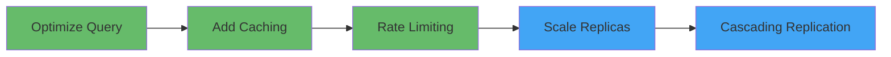

# README: OpenAI PostgreSQL Scaling Research

> **Học hỏi từ kiến trúc PostgreSQL của OpenAI để áp dụng vào product-db cluster**

---

## 📁 Nội dung thư mục

| File | Mô tả |
|------|-------|
| [research.md](./research.md) | Tổng quan kiến trúc OpenAI với diagrams chi tiết |
| [cascading-replication-lab.md](./cascading-replication-lab.md) | Lab thực hành cascading replication |
| [application-layer-optimization.md](./application-layer-optimization.md) | Kỹ thuật tối ưu ở tầng application |
| [your-diagram-review.md](./your-diagram-review.md) | Đánh giá diagram bạn vẽ |

---

## 🎯 Mục tiêu học tập

### Phase 1: Hiểu kiến trúc cơ bản
- [x] Đọc và hiểu blog OpenAI
- [x] Vẽ lại diagram kiến trúc
- [ ] Review diagram với các điểm cải thiện

### Phase 2: Áp dụng vào product-db
- [ ] Scale từ 3 lên 5 replicas
- [ ] Enable read-write splitting với PgDog
- [ ] Thử nghiệm cascading replication (manual)

### Phase 3: Tối ưu Application Layer
- [ ] Thêm Redis caching với lock mechanism
- [ ] Implement workload isolation
- [ ] Setup multi-layer rate limiting

---

## 🔑 Key Takeaways từ OpenAI

### 1. Keep It Simple
> "Với mindset của một người devops/sre thì hệ thống càng lớn thì nên làm càng đơn giản"

OpenAI **không dùng sharding** cho PostgreSQL vì:
- Quản trị và operation phức tạp
- Khó debug và maintain
- Thay vào đó, họ scale bằng read replicas + caching

### 2. Application-First Optimization
Trước khi scale infrastructure, hãy tối ưu tầng application:



### 3. Avoid ALTER TABLE on Large Tables
PostgreSQL MVCC design có trade-off:
- UPDATE/DELETE tạo dead tuples
- ALTER TABLE ADD COLUMN với DEFAULT gây full table rewrite (trước PG11)
- Giải pháp: Schema migration cẩn thận, dùng nullable columns

### 4. Cascading Replication cho Scale Lớn

| Scale | Approach |
|-------|----------|
| < 10 replicas | Direct replication từ Primary |
| 10-50 replicas | Cân nhắc Cascading |
| 50+ replicas | Bắt buộc Cascading |

---

## 📊 So sánh: OpenAI vs product-db

| Aspect | OpenAI | product-db | Gap |
|--------|--------|------------|-----|
| Users | 800M+ | Dev/Test | N/A |
| Replicas | ~50 | 2 | Learning opportunity |
| Pooler | PgBouncer | PgDog | ✅ Similar |
| Caching | Redis + Lock | None | ❌ Need to add |
| Rate Limiting | Multi-layer | None | ❌ Need to add |
| Cascading | Yes | No | Learning goal |

---

## 🚀 Quick Start

```bash
# 1. Đọc overview research
cat specs/active/openai-postgresql-scaling/research.md

# 2. Xem current product-db config
cat kubernetes/infra/configs/databases/clusters/product-db/instance.yaml

# 3. Thử lab cascading replication (manual steps)
cat specs/active/openai-postgresql-scaling/cascading-replication-lab.md

# 4. Áp dụng application optimizations
cat specs/active/openai-postgresql-scaling/application-layer-optimization.md
```

---

## 📚 References

- [OpenAI Blog - Scaling PostgreSQL](https://openai.com/index/scaling-postgresql/)
- [PostgreSQL Cascading Replication](https://www.postgresql.org/docs/current/warm-standby.html#CASCADING-REPLICATION)
- [CloudNativePG Documentation](https://cloudnative-pg.io/documentation/)
- [PgBouncer](https://www.pgbouncer.org/)
