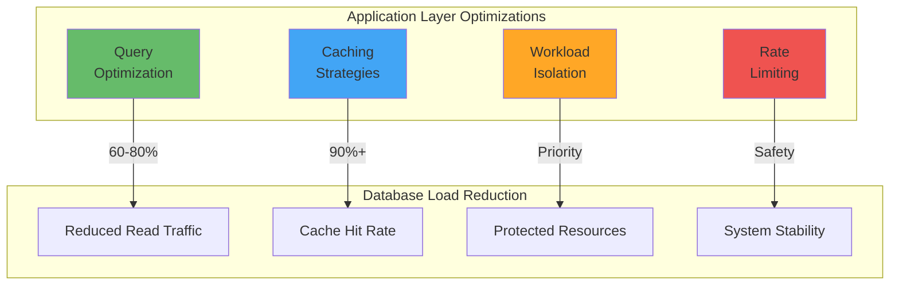
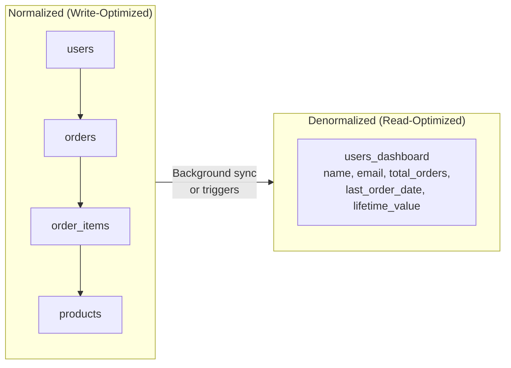
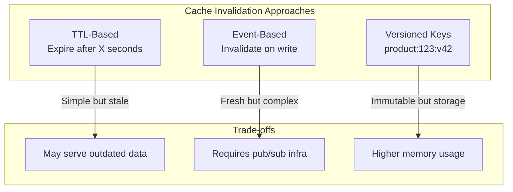
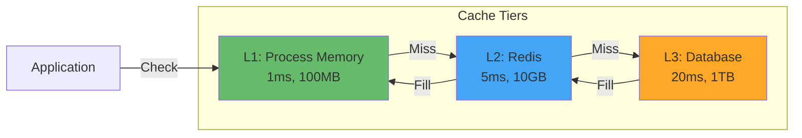
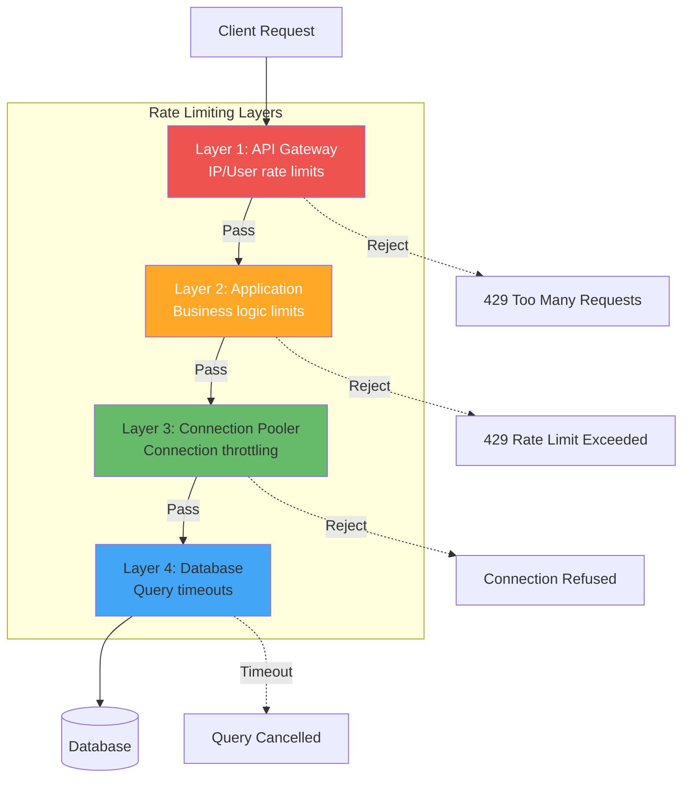

# Application-Layer Optimization Patterns

> **Source**: OpenAI PostgreSQL Scaling Blog
> **Focus**: Techniques to reduce database load from the application side

---

## 🎯 Overview

OpenAI's key insight: **Apply as much optimization at the application layer as possible before scaling database infrastructure.**



---

## 1️⃣ Query Optimization via ORM

### Anti-Pattern: N+1 Queries

```go
// ❌ BAD: N+1 query problem
func GetProductsWithCategories() []ProductWithCategory {
    products := db.Query("SELECT * FROM products")  // 1 query
    
    result := []ProductWithCategory{}
    for _, p := range products {
        // N additional queries!
        category := db.Query("SELECT * FROM categories WHERE id = ?", p.CategoryID)
        result = append(result, ProductWithCategory{Product: p, Category: category})
    }
    return result
}
```

```go
// ✅ GOOD: Single query with JOIN or preloading
func GetProductsWithCategories() []ProductWithCategory {
    return db.Query(`
        SELECT p.*, c.name as category_name
        FROM products p
        LEFT JOIN categories c ON p.category_id = c.id
        WHERE p.active = true
    `)
}

// Or with GORM preloading
func GetProductsWithCategories() []Product {
    var products []Product
    db.Preload("Category").Find(&products)
    return products
}
```

### Anti-Pattern: SELECT *

```sql
-- ❌ BAD: Fetching all columns
SELECT * FROM products WHERE id = 123;

-- ✅ GOOD: Fetch only needed columns
SELECT id, name, price, stock_quantity 
FROM products 
WHERE id = 123;
```

### Pattern: Denormalization for Read Performance



```sql
-- Create materialized view for dashboard queries
CREATE MATERIALIZED VIEW users_dashboard AS
SELECT 
    u.id,
    u.name,
    u.email,
    COUNT(o.id) AS total_orders,
    MAX(o.created_at) AS last_order_date,
    COALESCE(SUM(o.total_amount), 0) AS lifetime_value
FROM users u
LEFT JOIN orders o ON u.id = o.user_id
GROUP BY u.id, u.name, u.email;

-- Refresh periodically
REFRESH MATERIALIZED VIEW CONCURRENTLY users_dashboard;
```

---

## 2️⃣ Caching Strategies

### Cache-Aside Pattern with Lock (Stampede Prevention)

```go
package cache

import (
    "context"
    "time"
    "github.com/redis/go-redis/v9"
)

type CacheAside struct {
    redis *redis.Client
    db    *sql.DB
}

// GetProduct with cache stampede prevention
func (c *CacheAside) GetProduct(ctx context.Context, id string) (*Product, error) {
    cacheKey := "product:" + id
    lockKey := "lock:product:" + id
    
    // 1. Try cache first
    cached, err := c.redis.Get(ctx, cacheKey).Bytes()
    if err == nil {
        var product Product
        json.Unmarshal(cached, &product)
        return &product, nil
    }
    
    // 2. Cache miss - try to acquire lock
    acquired, err := c.redis.SetNX(ctx, lockKey, "1", 5*time.Second).Result()
    if err != nil {
        return nil, err
    }
    
    if !acquired {
        // 3. Another goroutine is fetching - wait and retry
        time.Sleep(100 * time.Millisecond)
        return c.GetProduct(ctx, id)  // Retry with backoff in production
    }
    
    // 4. We have the lock - fetch from database
    defer c.redis.Del(ctx, lockKey)
    
    product, err := c.fetchFromDB(ctx, id)
    if err != nil {
        return nil, err
    }
    
    // 5. Store in cache
    data, _ := json.Marshal(product)
    c.redis.Set(ctx, cacheKey, data, 5*time.Minute)
    
    return product, nil
}
```

### Cache Invalidation Strategies



```go
// Event-based cache invalidation
func (s *ProductService) UpdateProduct(ctx context.Context, p *Product) error {
    // 1. Update database
    if err := s.repo.Update(ctx, p); err != nil {
        return err
    }
    
    // 2. Invalidate cache
    s.cache.Del(ctx, "product:"+p.ID)
    
    // 3. Publish invalidation event (for distributed systems)
    s.pubsub.Publish("cache.invalidate", CacheInvalidation{
        Key:    "product:" + p.ID,
        Action: "delete",
    })
    
    return nil
}
```

### Multi-Tier Caching



---

## 3️⃣ Workload Isolation

### Priority-Based Routing

```go
package router

type WorkloadPriority string

const (
    PriorityHigh   WorkloadPriority = "high"   // Core features
    PriorityMedium WorkloadPriority = "medium" // Standard features
    PriorityLow    WorkloadPriority = "low"    // Experimental/beta
)

type DBRouter struct {
    highPriorityPool   *sql.DB
    mediumPriorityPool *sql.DB
    lowPriorityPool    *sql.DB
}

func (r *DBRouter) GetPool(priority WorkloadPriority) *sql.DB {
    switch priority {
    case PriorityHigh:
        return r.highPriorityPool
    case PriorityMedium:
        return r.mediumPriorityPool
    case PriorityLow:
        return r.lowPriorityPool
    default:
        return r.mediumPriorityPool
    }
}

// Usage in handlers
func (h *Handler) GetProduct(w http.ResponseWriter, r *http.Request) {
    ctx := r.Context()
    priority := getPriorityFromContext(ctx)
    
    db := h.router.GetPool(priority)
    product, err := h.repo.GetWithDB(ctx, db, r.PathValue("id"))
    // ...
}
```

### Feature Flag Integration

```go
// Route based on feature flags
func (h *Handler) GetProducts(w http.ResponseWriter, r *http.Request) {
    ctx := r.Context()
    
    // Check if user is in experimental cohort
    if h.featureFlags.IsEnabled(ctx, "use_experimental_search") {
        // Route to low-priority pool (experimental feature)
        return h.experimentalSearch(ctx, w, r)
    }
    
    // Standard path - high priority
    return h.standardSearch(ctx, w, r)
}
```

---

## 4️⃣ Multi-Layer Rate Limiting

### Rate Limiting Architecture



### Implementation: Token Bucket with Redis

```go
package ratelimit

import (
    "context"
    "time"
    "github.com/redis/go-redis/v9"
)

type TokenBucket struct {
    redis      *redis.Client
    rate       int           // tokens per interval
    interval   time.Duration // refill interval
    bucketSize int           // max tokens
}

func (tb *TokenBucket) Allow(ctx context.Context, key string) (bool, error) {
    now := time.Now().UnixNano()
    
    // Lua script for atomic token bucket
    script := redis.NewScript(`
        local key = KEYS[1]
        local rate = tonumber(ARGV[1])
        local interval = tonumber(ARGV[2])
        local bucket_size = tonumber(ARGV[3])
        local now = tonumber(ARGV[4])
        
        local bucket = redis.call('HGETALL', key)
        local tokens = bucket_size
        local last_update = now
        
        if #bucket > 0 then
            tokens = tonumber(bucket[2])
            last_update = tonumber(bucket[4])
        end
        
        -- Calculate tokens to add based on time elapsed
        local elapsed = now - last_update
        local tokens_to_add = math.floor(elapsed * rate / interval)
        tokens = math.min(bucket_size, tokens + tokens_to_add)
        
        if tokens >= 1 then
            tokens = tokens - 1
            redis.call('HSET', key, 'tokens', tokens, 'last_update', now)
            redis.call('EXPIRE', key, math.ceil(interval / 1000000000))
            return 1
        else
            return 0
        end
    `)
    
    result, err := script.Run(ctx, tb.redis, []string{key},
        tb.rate, tb.interval.Nanoseconds(), tb.bucketSize, now).Int()
    
    return result == 1, err
}

// Middleware
func RateLimitMiddleware(limiter *TokenBucket) func(http.Handler) http.Handler {
    return func(next http.Handler) http.Handler {
        return http.HandlerFunc(func(w http.ResponseWriter, r *http.Request) {
            key := "ratelimit:" + getUserID(r)
            
            allowed, err := limiter.Allow(r.Context(), key)
            if err != nil {
                http.Error(w, "Internal error", 500)
                return
            }
            
            if !allowed {
                w.Header().Set("Retry-After", "60")
                http.Error(w, "Rate limit exceeded", 429)
                return
            }
            
            next.ServeHTTP(w, r)
        })
    }
}
```

### Database-Level Protection

```sql
-- Set statement timeout to prevent runaway queries
SET statement_timeout = '30s';

-- Set lock timeout to prevent long waits
SET lock_timeout = '10s';

-- Limit connections per user
ALTER ROLE product_app CONNECTION LIMIT 50;
```

```yaml
# PgBouncer configuration
[pgbouncer]
max_client_conn = 1000       # Max connections from apps
default_pool_size = 20       # Connections per pool
reserve_pool_size = 5        # Emergency connections
reserve_pool_timeout = 5     # Wait before using reserve

# Per-database limits
max_db_connections = 100     # Max connections to single DB
```

---

## 📊 Metrics to Track

### Application Layer

| Metric | Target | Alert Threshold |
|--------|--------|-----------------|
| Cache Hit Rate | > 90% | < 80% |
| N+1 Query Count | 0 | > 0 |
| Avg Query Time | < 10ms | > 50ms |
| Rate Limit Hits | < 1% | > 5% |

### Database Layer

| Metric | Target | Alert Threshold |
|--------|--------|-----------------|
| Connection Usage | < 70% | > 85% |
| Active Queries | < 50 | > 100 |
| Query Timeout Rate | < 0.1% | > 1% |
| Replication Lag | < 100ms | > 1s |

---

## 🎯 Application to product-db

### Quick Wins

1. **Add caching to Product Service**
   - Cache product listings (TTL: 1 minute)
   - Cache individual products (TTL: 5 minutes)
   - Implement cache locking for stampede prevention

2. **Query optimization**
   - Enable pg_stat_statements analysis
   - Identify and optimize slow queries
   - Add missing indexes

3. **Rate limiting**
   - Add per-user rate limits at API level
   - Configure PgDog connection limits

### Implementation Checklist

```markdown
- [ ] Add Redis to product namespace
- [ ] Implement cache-aside pattern in Product repository
- [ ] Add cache lock mechanism
- [ ] Enable pg_stat_statements monitoring
- [ ] Review and optimize top 10 slow queries
- [ ] Configure rate limiting middleware
- [ ] Add workload priority routing
```

---

## 📚 References

- [Redis Rate Limiting](https://redis.io/docs/reference/pattern-examples/rate-limiting/)
- [PostgreSQL Query Optimization](https://www.postgresql.org/docs/current/performance-tips.html)
- [GORM Preloading](https://gorm.io/docs/preload.html)
- [Cache Stampede Prevention](https://en.wikipedia.org/wiki/Cache_stampede)
