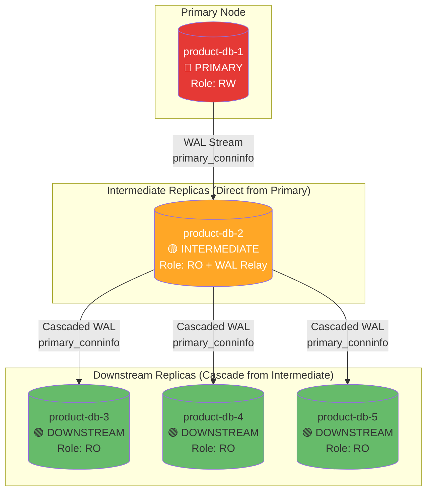
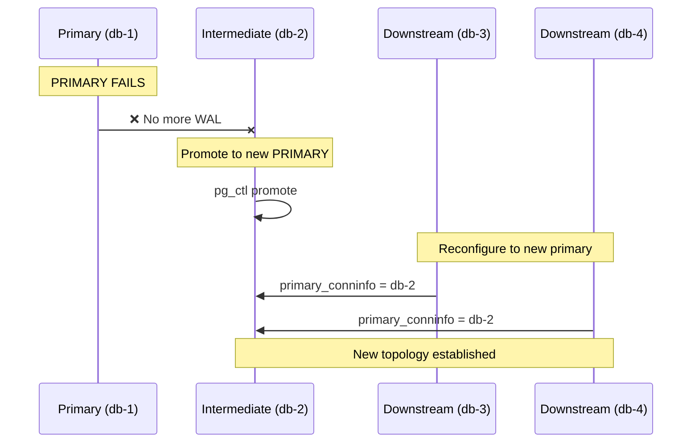
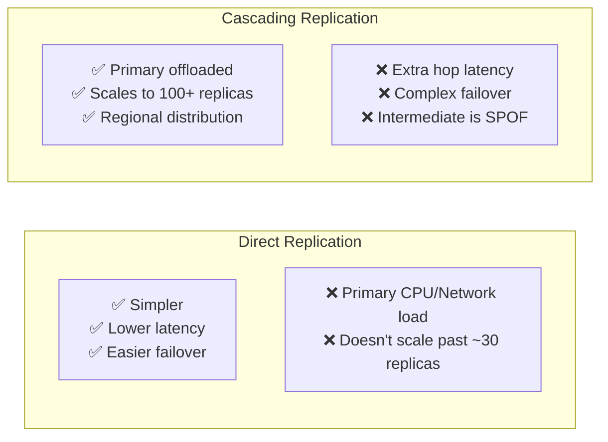

# Cascading Replication Lab for product-db

> **Goal**: Implement cascading replication pattern from OpenAI's architecture for learning purposes
> **Scope**: Extend product-db from 3 instances to support cascading replication topology

---

## 🎯 Learning Objectives

1. Understand PostgreSQL WAL streaming replication internals
2. Configure cascading replication (intermediate → downstream)
3. Monitor replication lag across the cascade
4. Test failover scenarios with cascading topology

---

## 📊 Target Architecture



---

## 🔧 Implementation Steps

### Step 1: Understand Current CloudNativePG Topology

CloudNativePG automatically handles physical streaming replication. By default, all replicas connect directly to the primary.

```yaml
# Current: product-db with 3 instances
spec:
  instances: 3
  # All replicas → Primary (standard topology)
```

### Step 2: Scale to 5 Instances

```yaml
# specs/active/openai-postgresql-scaling/cluster-5-replicas.yaml
apiVersion: postgresql.cnpg.io/v1
kind: Cluster
metadata:
  name: product-db
  namespace: product
spec:
  instances: 5  # 1 primary + 4 replicas
  
  postgresql:
    parameters:
      # Replication settings for cascading
      max_wal_senders: "10"          # Allow enough WAL sender processes
      wal_keep_size: "1GB"           # Keep WAL for slow replicas
      hot_standby: "on"              # Allow read queries on replicas
      hot_standby_feedback: "on"     # Prevent query conflicts
      
      # Existing parameters...
      max_connections: "200"
      shared_buffers: "64MB"
      # ...
```

### Step 3: Configure Cascading Replication

> ⚠️ **Note**: CloudNativePG does not natively support cascading replication out-of-the-box. This is a custom configuration exercise.

For manual PostgreSQL setup (learning purposes):

```sql
-- On DOWNSTREAM replica (e.g., product-db-3, product-db-4, product-db-5)
-- postgresql.auto.conf or recovery.conf (pre-PG12)

-- Instead of connecting to PRIMARY:
-- primary_conninfo = 'host=product-db-rw port=5432 user=streaming_replica'

-- Connect to INTERMEDIATE replica:
primary_conninfo = 'host=product-db-2 port=5432 user=streaming_replica application_name=product-db-3'
```

### Step 4: Verification Script

```bash
#!/bin/bash
# verify-cascade.sh

# Check replication topology on PRIMARY
kubectl exec -it product-db-1 -n product -- psql -U postgres -c "
SELECT 
    application_name,
    client_addr,
    state,
    sent_lsn,
    write_lsn,
    flush_lsn,
    replay_lsn,
    pg_wal_lsn_diff(sent_lsn, replay_lsn) AS lag_bytes
FROM pg_stat_replication
ORDER BY application_name;
"

# Check replication on INTERMEDIATE (should show downstream replicas)
kubectl exec -it product-db-2 -n product -- psql -U postgres -c "
SELECT 
    application_name,
    client_addr,
    state,
    pg_wal_lsn_diff(sent_lsn, replay_lsn) AS lag_bytes
FROM pg_stat_replication;
"

# Check replication status on each DOWNSTREAM
for i in 3 4 5; do
    echo "=== product-db-$i ==="
    kubectl exec -it product-db-$i -n product -- psql -U postgres -c "
    SELECT 
        pg_is_in_recovery() AS is_replica,
        pg_last_wal_receive_lsn() AS received_lsn,
        pg_last_wal_replay_lsn() AS replayed_lsn,
        pg_last_xact_replay_timestamp() AS last_replay_time,
        now() - pg_last_xact_replay_timestamp() AS replay_lag
    ;"
done
```

---

## 📈 Monitoring Cascading Replication

### Prometheus Metrics to Track

```yaml
# Replication lag per replica
pg_replication_lag_seconds{slot_name=~".*"}

# WAL sender state
pg_stat_replication_state{application_name=~"product-db-.*"}

# Bytes behind
pg_replication_lag_bytes{application_name=~"product-db-.*"}
```

### Grafana Dashboard Panel

```sql
-- Replication lag across cascade
SELECT 
  r.application_name,
  CASE 
    WHEN r.client_addr = (SELECT client_addr FROM pg_stat_replication WHERE application_name = 'product-db-2') 
    THEN 'intermediate'
    ELSE 'downstream'
  END AS replica_tier,
  pg_wal_lsn_diff(r.sent_lsn, r.replay_lsn) AS lag_bytes,
  extract(epoch FROM (now() - r.replay_lag)) AS lag_seconds
FROM pg_stat_replication r;
```

---

## 🧪 Lab Exercises

### Exercise 1: Measure Cascade Latency Overhead

**Objective**: Compare replication lag between direct vs cascaded replicas

```bash
# Insert test data on PRIMARY
kubectl exec -it product-db-1 -n product -- psql -U product -d product -c "
INSERT INTO products (name, price, created_at) 
VALUES ('cascade-test-$(date +%s)', 99.99, now())
RETURNING id, created_at;
"

# Immediately check when it appears on each replica
for i in 2 3 4 5; do
    echo "=== product-db-$i ==="
    kubectl exec -it product-db-$i -n product -- psql -U product -d product -c "
    SELECT id, name, created_at, now() AS check_time,
           now() - created_at AS propagation_delay
    FROM products 
    WHERE name LIKE 'cascade-test-%'
    ORDER BY created_at DESC LIMIT 1;
    "
done
```

### Exercise 2: Intermediate Replica Failure

**Objective**: Observe downstream behavior when intermediate fails

```bash
# 1. Simulate intermediate failure
kubectl delete pod product-db-2 -n product

# 2. Watch downstream replicas - what happens?
watch -n 1 'kubectl get pods -n product -l cnpg.io/cluster=product-db'

# 3. Check replication status on downstream
kubectl exec -it product-db-3 -n product -- psql -U postgres -c "
SELECT pg_is_in_recovery(), pg_last_wal_receive_lsn();
"

# 4. In cascading setup, downstream replicas CANNOT receive WAL
#    until intermediate is restored or reconfigured
```

### Exercise 3: Failover with Cascading Topology

**Objective**: Practice manual failover procedure



---

## ⚠️ Important Considerations

### CloudNativePG Limitations

CloudNativePG currently does **not** support cascading replication natively. All replicas connect directly to the primary. This lab is for:

1. **Learning PostgreSQL replication internals** manually
2. **Understanding why cascading helps** at large scale
3. **Testing with manual PostgreSQL clusters** outside CNPG

### When to Use Cascading (Real World)

| Scenario | Recommendation |
|----------|----------------|
| < 10 replicas | Direct replication is fine |
| 10-30 replicas | Consider cascading |
| 30+ replicas | Cascading strongly recommended |
| Multi-region | Intermediate per region |

### Trade-offs Summary



---

## 📚 References

- [PostgreSQL Cascading Replication Docs](https://www.postgresql.org/docs/current/warm-standby.html#CASCADING-REPLICATION)
- [CloudNativePG Replication Documentation](https://cloudnative-pg.io/documentation/)
- [pg_stat_replication](https://www.postgresql.org/docs/current/monitoring-stats.html#MONITORING-PG-STAT-REPLICATION-VIEW)
