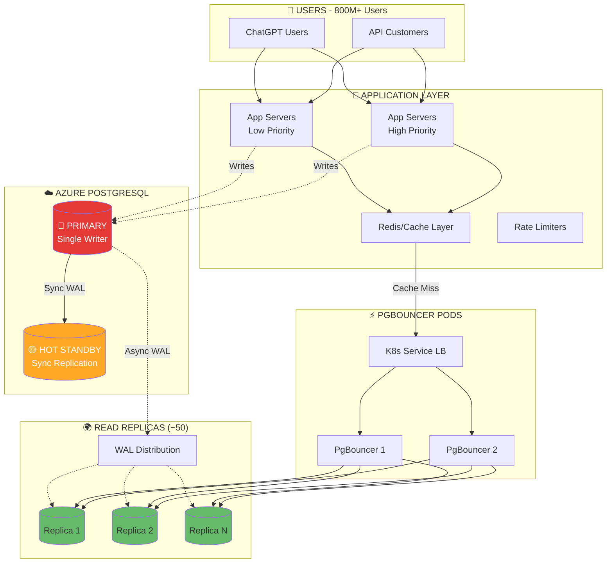
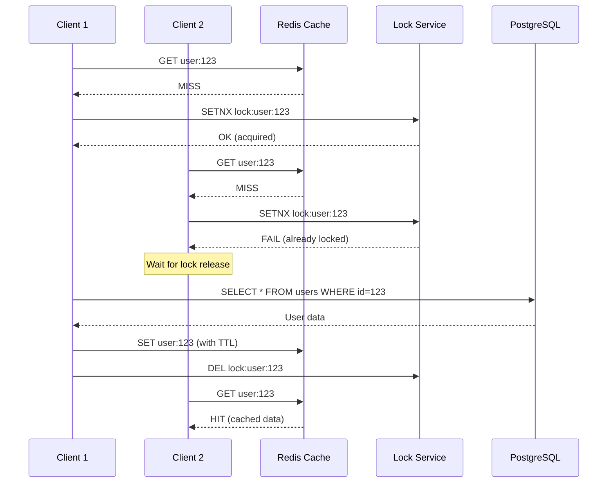
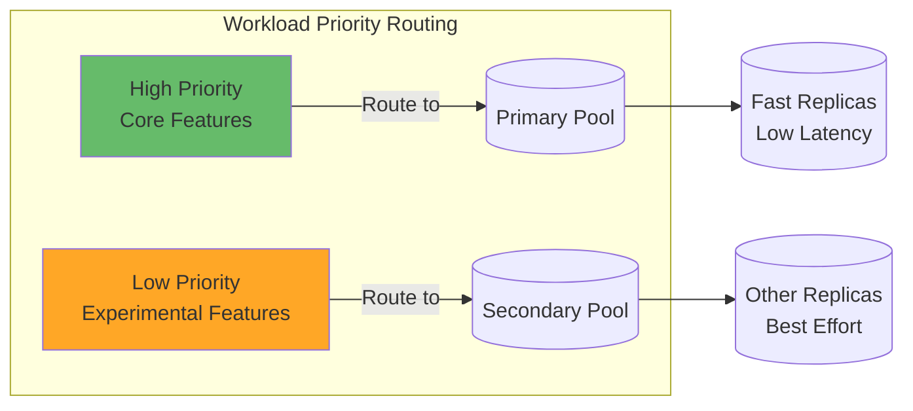
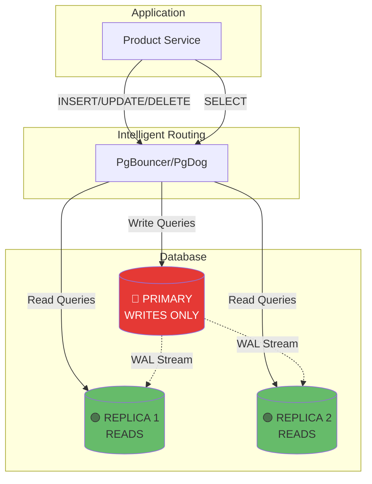
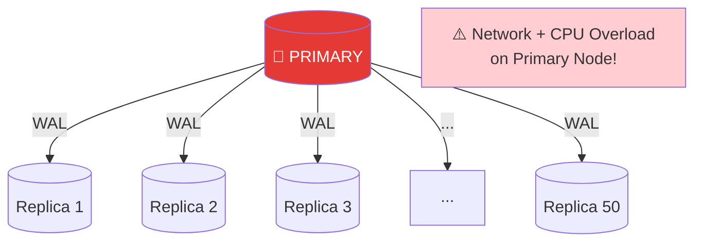
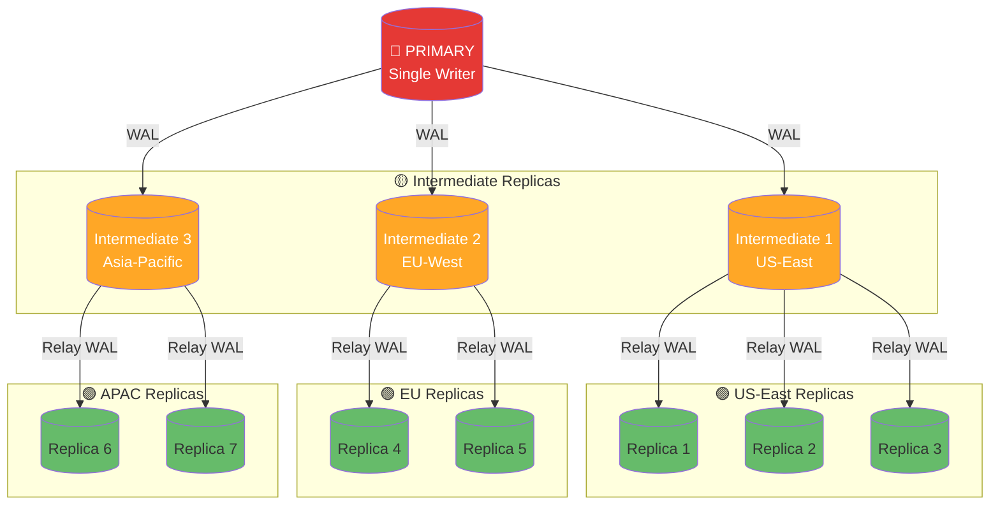
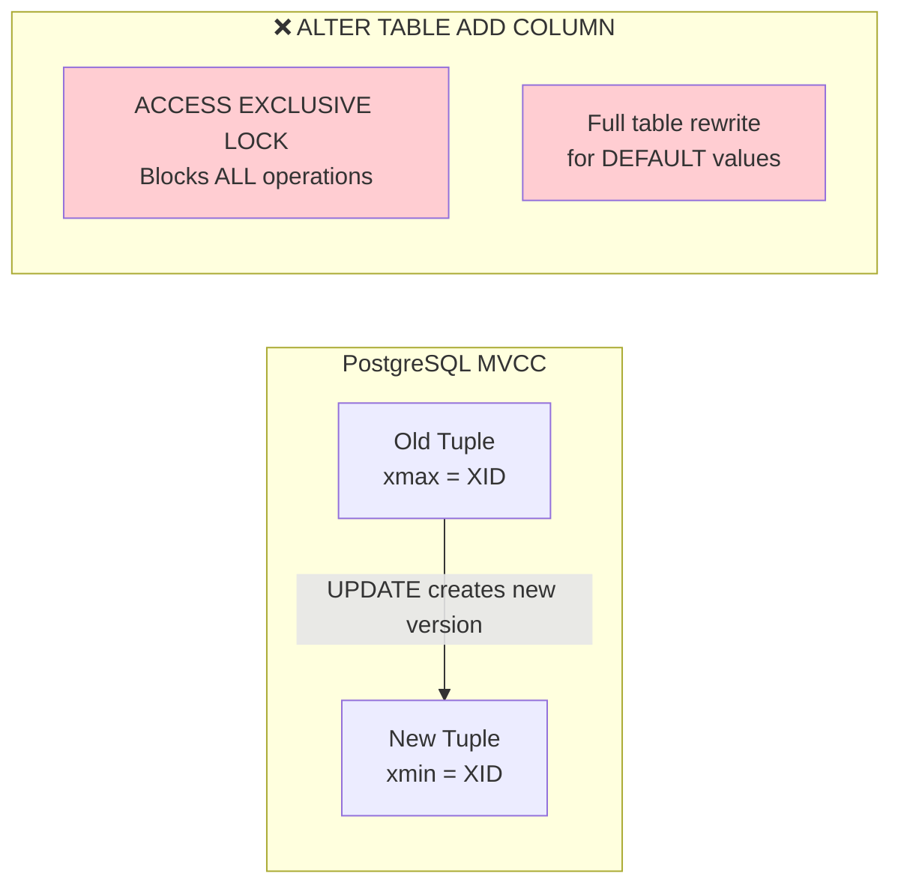
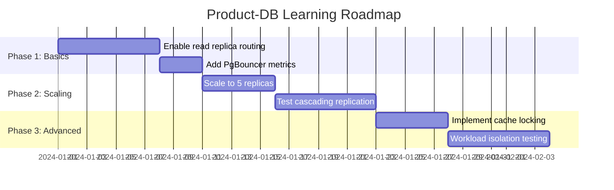

# OpenAI PostgreSQL Scaling Architecture Research

> **Source**: [OpenAI Blog - Scaling PostgreSQL](https://openai.com/index/scaling-postgresql/)
> **Purpose**: Learn from OpenAI's PostgreSQL scaling patterns for application to `product-db` cluster

---

## 📌 TL;DR Summary

OpenAI scales PostgreSQL to serve **800M+ users** with:

| Layer | Techniques |
|-------|------------|
| **Application** | Query optimization, caching, cache stampede prevention, workload isolation, multi-layer rate limiting |
| **Database** | Read replicas, write offload to CosmosDB, PgBouncer connection pooling, cascading replication |
| **Infrastructure** | Azure PostgreSQL Flexible Server, multi-region deployment, ~50 read replicas |

---

## 🏗️ Architecture Overview



---

## 📊 Key Metrics

| Metric | Value |
|--------|-------|
| Users | 800M+ worldwide |
| Queries | Millions QPS |
| P99 Latency | Low double-digit ms |
| Availability | 99.999% |
| Replicas | ~50 read replicas |
| Regions | Multi-region deployment |

---

## 🔧 Application Layer Optimizations

### 1. Query Optimization via ORM
```sql
-- ❌ AVOID: Complex JOINs across multiple tables
SELECT u.*, o.*, p.*, c.*
FROM users u
JOIN orders o ON u.id = o.user_id
JOIN products p ON o.product_id = p.id
JOIN categories c ON p.category_id = c.id
WHERE u.status = 'active';

-- ✅ PREFER: Simpler queries, denormalized data
SELECT id, name, email, order_count, last_order_date
FROM users_denormalized
WHERE status = 'active';
```

### 2. Cache Layer with Stampede Prevention



**Key Insight**: Without cache locking, N concurrent requests for the same cache key would all hit the database simultaneously during a cache miss.

### 3. Workload Isolation



**Implementation Ideas**:
- Application-level routing based on feature flags
- Separate connection pools for different workload types
- Resource quotas per workload class

### 4. Multi-Layer Rate Limiting

| Layer | Purpose | Example |
|-------|---------|---------|
| Application | Business logic rate limits | 100 requests/user/minute |
| Connection Pooler | Connection throttling | Max 50 connections/app instance |
| Proxy | Query rate limiting | 1000 QPS per endpoint |
| Database | Query timeout | 30 second statement_timeout |

---

## 🗄️ Database Layer Optimizations

### 1. Read/Write Splitting Architecture



### 2. Heavy Write Migration to CosmosDB

| Data Type | Storage | Reason |
|-----------|---------|--------|
| User Profiles | PostgreSQL | Read-heavy, relational |
| Chat History | CosmosDB | Write-heavy, document store |
| Session Data | Redis | Ephemeral, high throughput |
| Audit Logs | CosmosDB | Append-only, sharded |

### 3. PgBouncer Connection Pooling

**Before PgBouncer**: `5000ms` connection overhead
**After PgBouncer**: `5ms` connection overhead (1000x improvement!)

```ini
# pgbouncer.ini example
[databases]
product = host=product-db-rw.product.svc port=5432 dbname=product

[pgbouncer]
listen_port = 6432
listen_addr = 0.0.0.0

# Transaction mode: connection returned after each transaction
pool_mode = transaction
max_client_conn = 1000
default_pool_size = 20
min_pool_size = 5
reserve_pool_size = 5
reserve_pool_timeout = 5

# Timeouts
server_connect_timeout = 15
server_idle_timeout = 600
```

---

## 🚀 Advanced: Cascading Replication

### Problem: Direct WAL Streaming to 50+ Replicas



### Solution: Cascading Replication Architecture



### PostgreSQL Cascading Configuration

```sql
-- On Intermediate Replica (receives from Primary)
-- recovery.conf or postgresql.conf (PG12+)
primary_conninfo = 'host=primary.example.com port=5432 user=replicator'

-- On Downstream Replica (receives from Intermediate)
primary_conninfo = 'host=intermediate-1.example.com port=5432 user=replicator'
```

### Benefits vs Trade-offs

| ✅ Benefits | ⚠️ Trade-offs |
|-------------|---------------|
| Primary streams to only 3 intermediates | +1 hop = slightly higher lag |
| Reduced network/CPU on Primary | More complex failover scenarios |
| Scale to 100+ replicas easily | Need to monitor intermediate health |
| Stable replica lag | Intermediate failure affects downstream |

---

## 🔄 Schema Evolution Best Practices

### Why ALTER TABLE is Problematic at Scale



### Safe Schema Migration Strategies

| Operation | Safe Approach |
|-----------|---------------|
| Add nullable column | `ALTER TABLE ADD COLUMN name TEXT;` (instant) |
| Add column with default | PG11+: instant; Before: use trigger-based migration |
| Drop column | Just remove from queries; physical removal via VACUUM |
| Add index | `CREATE INDEX CONCURRENTLY` (non-blocking) |
| Rename table/column | Use views as abstraction layer |

---

## 📈 Monitoring & Observability

### Key Metrics to Track

```sql
-- Replication lag monitoring
SELECT 
    client_addr, 
    state, 
    sent_lsn, 
    write_lsn, 
    flush_lsn, 
    replay_lsn,
    pg_wal_lsn_diff(sent_lsn, replay_lsn) AS replication_lag_bytes
FROM pg_stat_replication;

-- Connection usage
SELECT 
    count(*) AS total_connections,
    sum(CASE WHEN state = 'active' THEN 1 ELSE 0 END) AS active,
    sum(CASE WHEN state = 'idle' THEN 1 ELSE 0 END) AS idle
FROM pg_stat_activity;

-- Query performance (pg_stat_statements)
SELECT 
    query,
    calls,
    mean_exec_time,
    total_exec_time,
    rows
FROM pg_stat_statements
ORDER BY total_exec_time DESC
LIMIT 10;
```

---

## 🎯 Application to product-db Cluster

### Current State

| Aspect | Current | OpenAI Inspired Goal |
|--------|---------|----------------------|
| Instances | 3 (1 primary + 2 replicas) | 5-10 replicas for learning |
| Pooler | PgDog (transaction mode) | Keep PgDog, optimize config |
| Read splitting | Not enabled | Enable via PgDog |
| Caching | None | Add Redis with lock mechanism |

### Learning Roadmap



---

## 📚 References

- [PostgreSQL Warm Standby](https://www.postgresql.org/docs/current/warm-standby.html)
- [Cascading Replication](https://www.postgresql.org/docs/current/warm-standby.html#CASCADING-REPLICATION)
- [PgBouncer Documentation](https://www.pgbouncer.org/)
- [Azure PostgreSQL Flexible Server](https://docs.microsoft.com/azure/postgresql/)
- [pg_stat_statements](https://www.postgresql.org/docs/current/pgstatstatements.html)
