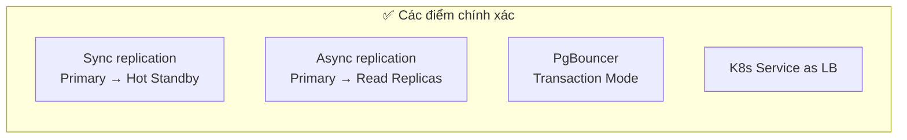
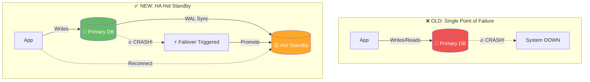
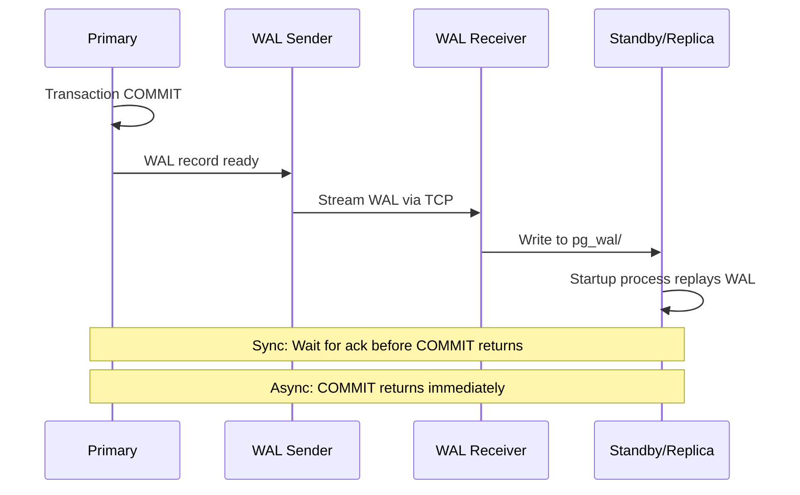
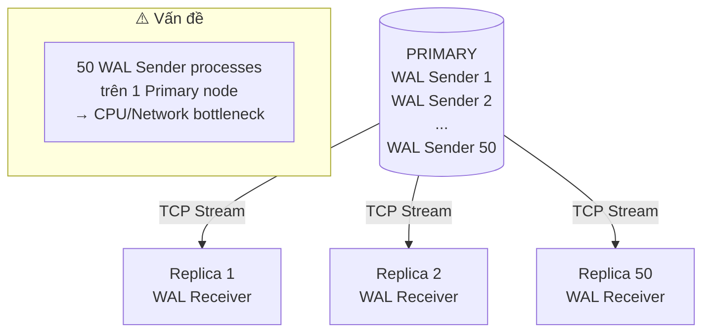
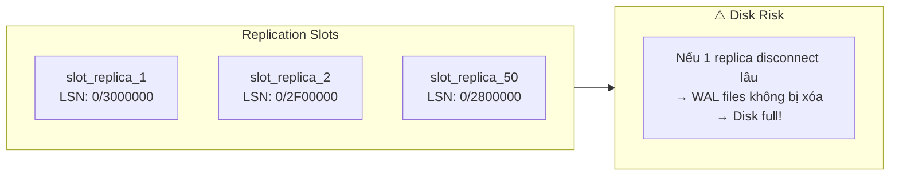
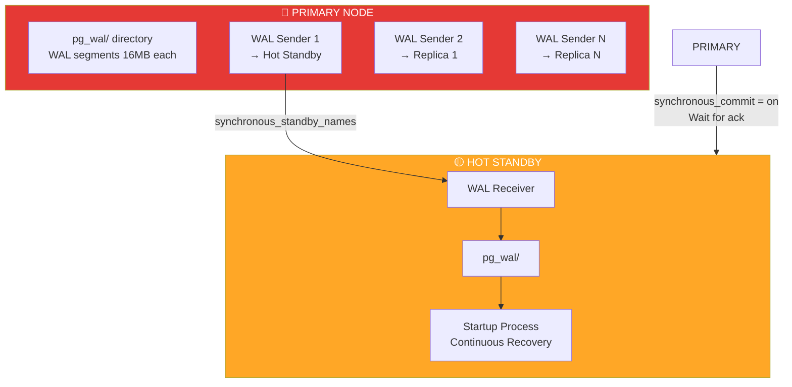
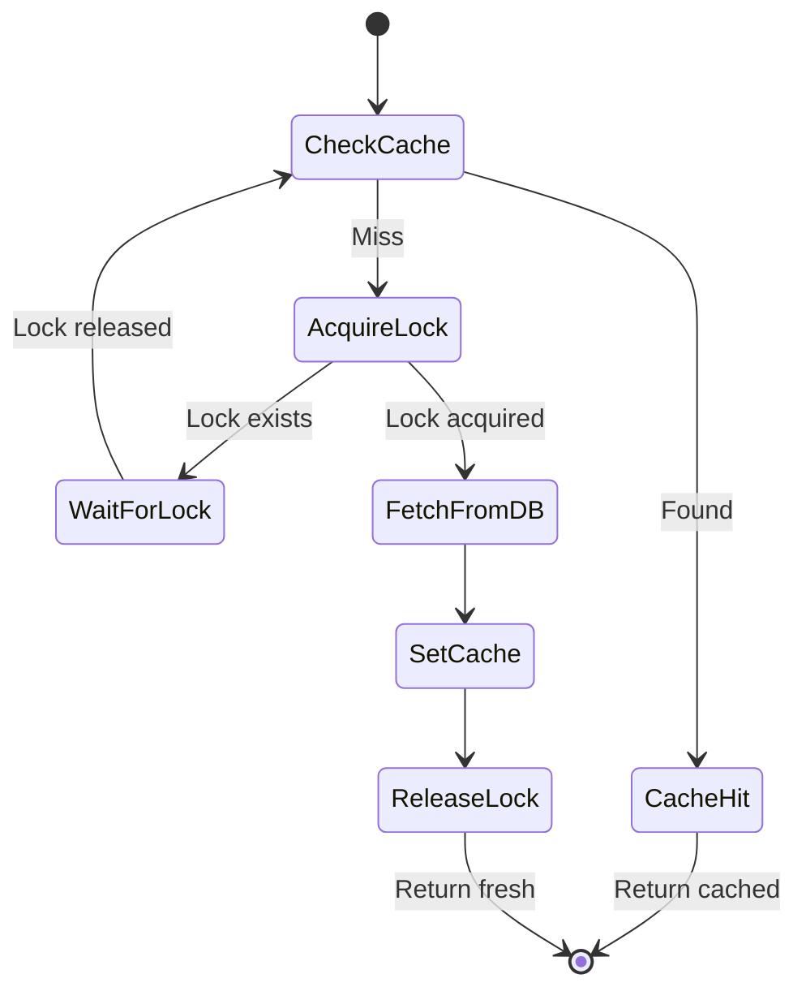

# Đánh Giá Diagram Kiến Trúc OpenAI PostgreSQL

> **Review diagram bạn đã vẽ dựa trên blog OpenAI**

---

## ✅ Điểm Tốt của Diagram

### 1. Comprehensive Architecture View
Diagram của bạn cover đầy đủ các layer:

| Layer | Status | Nhận xét |
|-------|--------|----------|
| Users (800M+) | ✅ | Đúng scale |
| Application Layer | ✅ | Cache, Rate Limiter, Priority routing |
| Azure PostgreSQL | ✅ | Primary + Hot Standby + WAL Distribution |
| Multi-region Replicas | ✅ | US East, APAC, Europe |
| PgBouncer per region | ✅ | Connection pooling architecture |
| Sharded Systems (CosmosDB) | ✅ | Write-heavy offload |
| Cascading Replication Future | ✅ | Good forward-thinking |

### 2. Chính Xác về Kỹ Thuật



### 3. Key Metrics Section
Bạn capture đủ các metrics quan trọng:
- Millions QPS
- P99 latency: low double-digit ms
- 99.999% availability
- ~50 Read Replicas

### 4. Challenges Solved Section
Rất hữu ích cho việc hiểu trade-offs:
- Single Point of Failure → HA Hot Standby
- Connection Storms → PgBouncer Pooling
- Cache Miss Storms → Cache Locking
- Expensive Queries → Query Optimization + Rate Limiting
- Write Amplification → Migration to CosmosDB
- Replica Lag → Co-location + Large Instance Types

### 5. Deep Dive: SPOF vs HA Hot Standby
> **Concept Explanation**:

- **SPOF (Single Point of Failure)**: Nếu database chết, toàn bộ app chết (Downtime 100%).
- **HA Hot Standby**: Có 1 database dự phòng (Standby) luôn "nóng" (sync data liên tục). Khi cái chính (Primary) chết, cái phụ lên thay ngay lập tức (Failover).

**Diagram visualized:**



---

## 🔧 Góp Ý Cải Thiện

### 1. Bổ Sung Chi Tiết Cascading Configuration

Trong section "FUTURE: CASCADING REPLICATION", bạn có thể thêm PostgreSQL config cụ thể hơn:

```sql
-- Trên Intermediate Replica
-- File: postgresql.conf (PG12+) hoặc recovery.conf (PG11-)

primary_conninfo = 'host=primary.postgres.database.azure.com port=5432 user=replicator sslmode=require'

-- Trên Downstream Replica (nhận WAL từ Intermediate)
primary_conninfo = 'host=intermediate-replica-us-east.postgres.database.azure.com port=5432 user=replicator sslmode=require'

-- Quan trọng: downstream replica cũng cần
-- Được allow trong pg_hba.conf của intermediate
```

### 2. Thêm WAL Sender/Receiver Flow



### 3. Connection Pooling Details

Bạn có thể chi tiết hơn về PgBouncer config:

```ini
# Transaction mode (OpenAI dùng mode này)
pool_mode = transaction

# Pooler chỉ giữ connection khi có query active
# Sau khi COMMIT/ROLLBACK, connection trả về pool
# Cho phép 1000 app connections chỉ cần 20-50 backend connections

# Trade-off:
# ❌ Không dùng được prepared statements across transactions
# ❌ SET session variables reset sau mỗi transaction
# ✅ Giảm connections 50-100x
```

### 4. Clarify WAL Distribution Component

Trong diagram, bạn có `WAL_DIST[WAL Distribution to ~50 Replicas]`. Thực tế:
- Đây không phải là 1 component riêng
- Mỗi Replica có **WAL Receiver process** kết nối trực tiếp tới Primary
- Primary chạy **WAL Sender process** cho mỗi replica



### 5. Thêm Replication Slot Management



```sql
-- Monitor replication slots
SELECT slot_name, active, restart_lsn,
       pg_wal_lsn_diff(pg_current_wal_lsn(), restart_lsn) AS lag_bytes
FROM pg_replication_slots;
```

---

## 📝 Diagram Cải Tiến Đề Xuất

### Phần Primary-Standby Chi Tiết Hơn



### Cache Locking Flow Chi Tiết



---

## 🎯 Điểm Đặc Biệt Hay

### 1. Giải Thích Bằng Tiếng Việt
Việc bạn viết "nôm na là..." giúp người đọc dễ hiểu hơn. Đây là phong cách documentation tốt khi target audience là Vietnamese developers.

### 2. Trade-offs Section
Section `CHALLENGES SOLVED` và `LỢI ÍCH/Trade-offs` trong phần Cascading rất hữu ích. Luôn nêu trade-offs giúp người đọc hiểu tại sao chọn solution này.

### 3. Reference Link
Link tới `postgresql.org/docs/current/warm-standby.html` là best practice - cho phép người đọc tự tìm hiểu thêm.

---

## 📊 Score Card

| Tiêu chí | Score | Notes |
|----------|-------|-------|
| Technical Accuracy | 9/10 | Một vài simplification nhưng nhìn chung chính xác |
| Comprehensiveness | 9/10 | Cover đủ các layers |
| Clarity | 8/10 | Có thể break thành nhiều diagrams nhỏ hơn |
| Practical Value | 9/10 | Có thể apply learnings vào product-db |
| Documentation Quality | 8/10 | Good use of colors và annotations |

**Overall: 8.6/10** - Rất tốt cho việc hiểu và communicate kiến trúc!

---

## 🚀 Next Steps

1. **Apply learnings**: Xem `cascading-replication-lab.md` để thực hành
2. **Optimize application**: Xem `application-layer-optimization.md`
3. **Scale product-db**: Tăng từ 3 lên 5 instances để thử nghiệm
