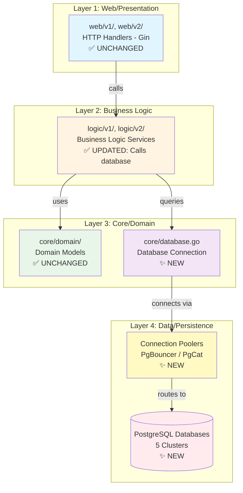
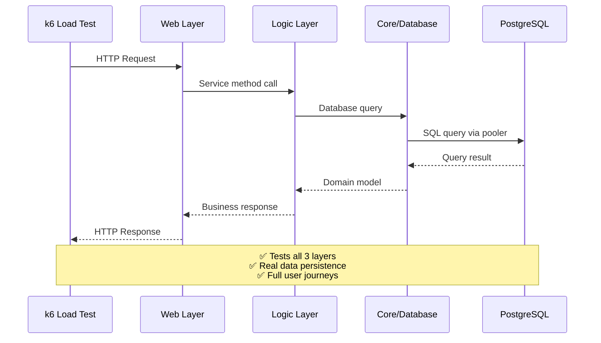
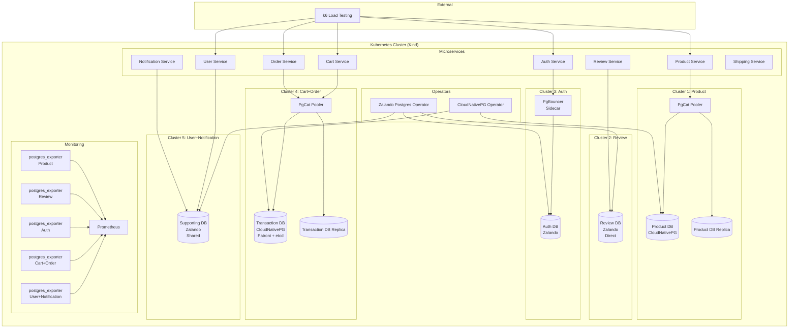

# Implementation Plan: PostgreSQL Database Integration for k6 Load Testing

> **Status**: Planned  
> **Created**: December 14, 2025  
> **Related**: [spec.md](./spec.md) | [research.md](./research.md)

---

## Table of Contents

1. [Architecture Overview](#architecture-overview)
2. [Technology Stack](#technology-stack)
3. [Data Model](#data-model)
4. [Implementation Tasks](#implementation-tasks)
5. [Security Considerations](#security-considerations)
6. [Performance Strategy](#performance-strategy)
7. [Testing Approach](#testing-approach)
8. [Deployment Plan](#deployment-plan)
9. [Risk Assessment](#risk-assessment)

---

## Architecture Overview

### Architecture Pattern Verification

**✅ 3-Layer Architecture Preserved**

The database integration **maintains the existing 3-layer architecture** pattern:



**Key Architecture Principles:**
- ✅ **Web layer unchanged**: Still calls logic layer only (no direct database access)
- ✅ **Logic layer updated**: Calls database through `core/database.go`
- ✅ **Core layer extended**: Adds `core/database.go` without breaking existing domain models
- ✅ **3-layer pattern preserved**: web → logic → core (database is part of core layer)

**k6 Load Testing Pattern:**



**Related**: See [research.md](./research.md) and [spec.md](./spec.md) for detailed architecture verification.

---

### System Components

The PostgreSQL integration implements **Scenario 0: Service-Specific Multi-Cluster** setup with 5 distinct PostgreSQL clusters, each optimized for specific service characteristics:

1. **Cluster 1 (Product)**: CloudNativePG operator + PgCat pooler + read replicas
2. **Cluster 2 (Review)**: Zalando operator + NO pooler (direct connection)
3. **Cluster 3 (Auth)**: Zalando operator + PgBouncer pooler
4. **Cluster 4 (Cart+Order)**: CloudNativePG operator + PgCat pooler + Patroni HA (with etcd)
5. **Cluster 5 (User+Notification)**: Zalando operator + NO pooler (shared database)

**Final Operator Distribution:**

| Cluster | Services | Operator | Pooler | HA Pattern | Learning Focus |
|---------|----------|----------|--------|------------|----------------|
| **Product** | Product | **CloudNativePG** | **PgCat** (standalone) | Read replicas | Read scaling, PgCat routing |
| **Review** | Review | **Zalando** | **None** (direct) | Single instance | Simple setup, direct connection |
| **Auth** | Auth | **Zalando** | **PgBouncer** (sidecar) | Single instance | Transaction pooling, Zalando built-in pooler |
| **Cart+Order** | Cart, Order | **CloudNativePG** | **PgCat** (standalone) | **Patroni + etcd** | **HA với etcd, multi-database routing** |
| **Supporting** | User, Notification, Shipping-v2 | **Zalando** | **None** (direct) | Single instance | **Shared database pattern** |

### Architecture Diagram



### Design Patterns

**1. CRD-Based Management**
- PostgreSQL clusters managed via Kubernetes Custom Resource Definitions (CRDs)
- Zalando: `postgresql.acid.zalan.do/v1`
- CrunchyData: `postgrescluster.postgres-operator.crunchydata.com/v1beta1`
- Operators watch CRDs and create/manage PostgreSQL instances

**2. Sidecar Pattern (PgBouncer)**
- PgBouncer deployed as sidecar container alongside PostgreSQL (Zalando operator built-in)
- Shared network namespace with database
- Automatic configuration via operator

**3. Service Pattern (PgCat)**
- PgCat deployed as standalone Kubernetes Service
- Routes connections to appropriate database (primary/replica)
- Load balancing for read replicas

**4. High Availability Pattern (Patroni)**
- Patroni integrated with CrunchyData operator
- Leader election via Kubernetes API
- Automatic failover (< 30 seconds)

**5. Connection Pooling Strategy**
- **Transaction Pooling** (PgBouncer): For short-lived connections (Auth)
- **Session Pooling** (PgCat): For long-lived connections with routing (Product, Cart+Order)
- **Direct Connection**: For simple, low-traffic services (Review, User+Notification)

### Component Interactions

```
1. Operator Deployment
   └─> Operators watch for CRDs

2. Cluster Creation
   └─> CRD created → Operator creates PostgreSQL pods
   └─> Database initialized with default settings

3. Pooler Deployment (if applicable)
   └─> PgBouncer: Sidecar created by Zalando operator
   └─> PgCat: Standalone service deployed manually

4. Schema Migration
   └─> Init container runs SQL scripts
   └─> Tables, indexes, constraints created

5. Service Connection
   └─> Service reads DB_* env vars
   └─> Builds DSN from env vars
   └─> Connects to pooler (if configured) or direct
   └─> Executes queries

6. Monitoring
   └─> postgres_exporter scrapes metrics
   └─> Prometheus discovers via ServiceMonitor
   └─> Metrics visible in Grafana
```

---

## Technology Stack

### PostgreSQL Operators

**Zalando Postgres Operator**
- **Version**: v1.15.0 (fixed in values.yaml)
- **Helm Chart**: `postgres-operator/postgres-operator`
- **Repository**: `registry.opensource.zalan.do/acid/postgres-operator`
- **Use Cases**: Review, Auth, User+Notification clusters
- **Features**: Built-in PgBouncer, Patroni integration, simple CRD model
- **Justification**: Simpler than CrunchyData, good for learning, production-proven

**CloudNativePG Operator**
- **Version**: v1.24.0 (fixed in values.yaml)
- **Helm Chart**: `cloudnative-pg/cloudnative-pg`
- **Repository**: `ghcr.io/cloudnative-pg/cloudnative-pg`
- **Use Cases**: Product, Cart+Order clusters
- **Features**: Kubernetes-native PostgreSQL management, built-in HA with Patroni, etcd support, CNCF project
- **Justification**: Open source, easier deployment, Kubernetes-native approach, supports Patroni HA with etcd (learning purpose)
- **Namespace**: Deployed in dedicated `database` namespace

### Connection Poolers

**PgBouncer**
- **Version**: Latest (managed by Zalando operator)
- **Type**: Sidecar container (built into Zalando operator)
- **Mode**: Transaction pooling
- **Use Case**: Auth service (frequent, short-lived connections)
- **Justification**: Industry standard, proven for high concurrency, simple setup

**PgCat**
- **Version**: Latest (check GitHub releases)
- **Type**: Standalone Kubernetes Service
- **Mode**: Session pooling with routing
- **Use Case**: Product (read replica routing), Cart+Order (multi-database routing)
- **Justification**: Modern Rust-based, better for multi-cluster, advanced routing

### High Availability

**Patroni**
- **Version**: Integrated with CloudNativePG operator
- **Type**: Built into CloudNativePG operator
- **Use Case**: Cart+Order cluster (transaction-heavy, requires HA)
- **Leader Election**: etcd (for learning and interview preparation)
- **Justification**: Production-grade HA, automatic failover, Kubernetes-native, etcd integration for learning

### Monitoring

**postgres_exporter**
- **Version**: v0.15.0 (fixed in values.yaml)
- **Helm Chart**: `prometheus-community/prometheus-postgres-exporter`
- **Repository**: `quay.io/prometheuscommunity/postgres-exporter`
- **Use Case**: All 5 clusters
- **Justification**: Standard PostgreSQL metrics, Prometheus integration, well-maintained

### Go Libraries

**PostgreSQL Driver**
- **Package**: `github.com/lib/pq`
- **Version**: Latest stable (v1.10.x)
- **Type**: Pure Go PostgreSQL driver
- **Justification**: Standard library, widely used, good performance

**Database/SQL**
- **Package**: `database/sql` (standard library)
- **Justification**: Standard Go database interface, connection pooling built-in

### Version Management Strategy

**Fixed Versions Policy:**
- All operators: Fixed versions in `k8s/{operator}/values.yaml`
- All exporters: Fixed versions in `k8s/{exporter}/values.yaml`
- Go dependencies: Pinned in `go.mod` and `go.sum`
- **Rationale**: Reproducible deployments, prevents unexpected updates, easier troubleshooting

---

## Data Model

### Database Schema Design

#### Cluster 1: Product Database

**Schema**: `product`

**Tables:**

```sql
-- Products table
CREATE TABLE products (
    id SERIAL PRIMARY KEY,
    name VARCHAR(255) NOT NULL,
    description TEXT,
    price DECIMAL(10, 2) NOT NULL,
    category_id INTEGER,
    stock_quantity INTEGER DEFAULT 0,
    created_at TIMESTAMP DEFAULT CURRENT_TIMESTAMP,
    updated_at TIMESTAMP DEFAULT CURRENT_TIMESTAMP
);

CREATE INDEX idx_products_category ON products(category_id);
CREATE INDEX idx_products_name ON products(name);

-- Categories table
CREATE TABLE categories (
    id SERIAL PRIMARY KEY,
    name VARCHAR(100) NOT NULL UNIQUE,
    description TEXT,
    created_at TIMESTAMP DEFAULT CURRENT_TIMESTAMP
);

-- Inventory table (for stock tracking)
CREATE TABLE inventory (
    id SERIAL PRIMARY KEY,
    product_id INTEGER REFERENCES products(id),
    quantity INTEGER NOT NULL,
    reserved_quantity INTEGER DEFAULT 0,
    updated_at TIMESTAMP DEFAULT CURRENT_TIMESTAMP
);

CREATE INDEX idx_inventory_product ON inventory(product_id);
```

#### Cluster 2: Review Database

**Schema**: `review`

**Tables:**

```sql
-- Reviews table
CREATE TABLE reviews (
    id SERIAL PRIMARY KEY,
    product_id INTEGER NOT NULL,
    user_id INTEGER NOT NULL,
    rating INTEGER CHECK (rating >= 1 AND rating <= 5),
    title VARCHAR(255),
    comment TEXT,
    created_at TIMESTAMP DEFAULT CURRENT_TIMESTAMP,
    updated_at TIMESTAMP DEFAULT CURRENT_TIMESTAMP
);

CREATE INDEX idx_reviews_product ON reviews(product_id);
CREATE INDEX idx_reviews_user ON reviews(user_id);
CREATE INDEX idx_reviews_rating ON reviews(rating);
```

#### Cluster 3: Auth Database

**Schema**: `auth`

**Tables:**

```sql
-- Users table (for authentication)
CREATE TABLE users (
    id SERIAL PRIMARY KEY,
    username VARCHAR(100) NOT NULL UNIQUE,
    email VARCHAR(255) NOT NULL UNIQUE,
    password_hash VARCHAR(255) NOT NULL,
    created_at TIMESTAMP DEFAULT CURRENT_TIMESTAMP,
    last_login TIMESTAMP
);

CREATE INDEX idx_users_username ON users(username);
CREATE INDEX idx_users_email ON users(email);

-- Sessions table
CREATE TABLE sessions (
    id SERIAL PRIMARY KEY,
    user_id INTEGER REFERENCES users(id),
    token VARCHAR(255) NOT NULL UNIQUE,
    expires_at TIMESTAMP NOT NULL,
    created_at TIMESTAMP DEFAULT CURRENT_TIMESTAMP
);

CREATE INDEX idx_sessions_token ON sessions(token);
CREATE INDEX idx_sessions_user ON sessions(user_id);
CREATE INDEX idx_sessions_expires ON sessions(expires_at);
```

#### Cluster 4: Cart+Order Database (Transaction)

**Schema**: `cart` and `order`

**Tables:**

```sql
-- Cart items table
CREATE TABLE cart_items (
    id SERIAL PRIMARY KEY,
    user_id INTEGER NOT NULL,
    product_id INTEGER NOT NULL,
    quantity INTEGER NOT NULL DEFAULT 1,
    created_at TIMESTAMP DEFAULT CURRENT_TIMESTAMP,
    updated_at TIMESTAMP DEFAULT CURRENT_TIMESTAMP,
    UNIQUE(user_id, product_id)
);

CREATE INDEX idx_cart_items_user ON cart_items(user_id);
CREATE INDEX idx_cart_items_product ON cart_items(product_id);

-- Orders table
CREATE TABLE orders (
    id SERIAL PRIMARY KEY,
    user_id INTEGER NOT NULL,
    total_amount DECIMAL(10, 2) NOT NULL,
    status VARCHAR(50) DEFAULT 'pending',
    created_at TIMESTAMP DEFAULT CURRENT_TIMESTAMP,
    updated_at TIMESTAMP DEFAULT CURRENT_TIMESTAMP
);

CREATE INDEX idx_orders_user ON orders(user_id);
CREATE INDEX idx_orders_status ON orders(status);
CREATE INDEX idx_orders_created ON orders(created_at);

-- Order items table
CREATE TABLE order_items (
    id SERIAL PRIMARY KEY,
    order_id INTEGER REFERENCES orders(id) ON DELETE CASCADE,
    product_id INTEGER NOT NULL,
    quantity INTEGER NOT NULL,
    price DECIMAL(10, 2) NOT NULL,
    created_at TIMESTAMP DEFAULT CURRENT_TIMESTAMP
);

CREATE INDEX idx_order_items_order ON order_items(order_id);
CREATE INDEX idx_order_items_product ON order_items(product_id);
```

#### Cluster 5: User+Notification Database (Shared)

**Schema**: `user` and `notification`

**Tables:**

```sql
-- User profiles table
CREATE TABLE user_profiles (
    id SERIAL PRIMARY KEY,
    user_id INTEGER NOT NULL UNIQUE,  -- References auth.users.id (cross-cluster)
    first_name VARCHAR(100),
    last_name VARCHAR(100),
    phone VARCHAR(20),
    address TEXT,
    created_at TIMESTAMP DEFAULT CURRENT_TIMESTAMP,
    updated_at TIMESTAMP DEFAULT CURRENT_TIMESTAMP
);

CREATE INDEX idx_user_profiles_user ON user_profiles(user_id);

-- Notifications table
CREATE TABLE notifications (
    id SERIAL PRIMARY KEY,
    user_id INTEGER NOT NULL,  -- References auth.users.id (cross-cluster)
    title VARCHAR(255) NOT NULL,
    message TEXT,
    type VARCHAR(50),
    read BOOLEAN DEFAULT FALSE,
    created_at TIMESTAMP DEFAULT CURRENT_TIMESTAMP
);

CREATE INDEX idx_notifications_user ON notifications(user_id);
CREATE INDEX idx_notifications_read ON notifications(read);
CREATE INDEX idx_notifications_created ON notifications(created_at);
```

### Schema Relationships

**Within Cluster:**
- `cart_items` → `orders` → `order_items` (Cart+Order cluster)
- `reviews` → `products` (Review cluster, product_id is external reference)
- `sessions` → `users` (Auth cluster)

**Cross-Cluster References:**
- `user_profiles.user_id` → `auth.users.id` (soft reference, no FK)
- `notifications.user_id` → `auth.users.id` (soft reference, no FK)
- `cart_items.user_id` → `auth.users.id` (soft reference, no FK)
- `orders.user_id` → `auth.users.id` (soft reference, no FK)
- `reviews.user_id` → `auth.users.id` (soft reference, no FK)

**Note**: Cross-cluster foreign keys are not enforced (PostgreSQL limitation). Application logic handles referential integrity.

### Migration Strategy

**Approach**: Init Containers

**Rationale:**
- Automatic execution on pod startup
- No separate job management needed
- Simple and sufficient for learning project
- Idempotent scripts (can be re-run safely)

**Migration Script Structure:**
```
services/migrations/
├── auth/
│   └── 001_init_schema.sql
├── user/
│   └── 001_init_schema.sql
├── product/
│   └── 001_init_schema.sql
├── cart/
│   └── 001_init_schema.sql
├── order/
│   └── 001_init_schema.sql
├── review/
│   └── 001_init_schema.sql
├── notification/
│   └── 001_init_schema.sql
└── shipping/
    └── 001_init_schema.sql
```

**Init Container Pattern:**
```yaml
initContainers:
  - name: db-migration
    image: postgres:15-alpine
    command: ['sh', '-c']
    args:
      - |
        PGPASSWORD=$DB_PASSWORD psql -h $DB_HOST -p $DB_PORT -U $DB_USER -d $DB_NAME -f /migrations/001_init_schema.sql
    env:
      - name: DB_HOST
        valueFrom:
          configMapKeyRef:
            name: db-config
            key: host
      # ... other env vars
    volumeMounts:
      - name: migrations
        mountPath: /migrations
```

---

## Implementation Tasks

### Phase 1: Infrastructure Setup (Operators & Clusters)

#### Task 1.1: Deploy Zalando Postgres Operator
**Priority**: High  
**Effort**: 1-2 hours  
**Dependencies**: None

**Steps:**
1. Create `database` namespace: `kubectl create namespace database`
2. Create `k8s/postgres-operator-zalando/values.yaml` with fixed version (v1.15.0)
3. Add Helm repository: `postgres-operator/postgres-operator`
4. Deploy operator: `helm upgrade --install postgres-operator postgres-operator/postgres-operator -f k8s/postgres-operator-zalando/values.yaml -n database --create-namespace --wait`
5. Verify operator pod is running: `kubectl get pods -n database -l app.kubernetes.io/name=postgres-operator`
6. Verify CRD exists: `kubectl get crd postgresqls.acid.zalan.do`

**Acceptance Criteria:**
- `database` namespace created
- Operator pod is Running in `database` namespace
- CRD `postgresqls.acid.zalan.do` exists
- Operator logs show no errors

**Files to Create:**
- `k8s/postgres-operator-zalando/values.yaml`

---

#### Task 1.2: Deploy CloudNativePG Operator
**Priority**: High  
**Effort**: 1-2 hours  
**Dependencies**: None

**Steps:**
1. Ensure `database` namespace exists: `kubectl create namespace database --dry-run=client -o yaml | kubectl apply -f -`
2. Create `k8s/postgres-operator-cloudnativepg/values.yaml` with fixed version (v1.24.0)
3. Add Helm repository: `helm repo add cloudnative-pg https://cloudnative-pg.github.io/charts`
4. Update Helm repo: `helm repo update cloudnative-pg`
5. Deploy operator: `helm upgrade --install cloudnative-pg cloudnative-pg/cloudnative-pg -f k8s/postgres-operator-cloudnativepg/values.yaml -n database --create-namespace --wait`
6. Verify operator pod is running: `kubectl get pods -n database -l app.kubernetes.io/name=cloudnative-pg`
7. Verify CRD exists: `kubectl get crd clusters.postgresql.cnpg.io`

**Acceptance Criteria:**
- Operator pod is Running in `database` namespace
- CRD `clusters.postgresql.cnpg.io` exists
- Operator logs show no errors

**Files to Create:**
- `k8s/postgres-operator-cloudnativepg/values.yaml`

---

#### Task 1.3: Create Review Cluster (Zalando, No Pooler)
**Priority**: High  
**Effort**: 1 hour  
**Dependencies**: Task 1.1

**Steps:**
1. Create `k8s/postgres-operator-zalando/crds/review-db.yaml`
2. Define PostgreSQL CRD with:
   - Name: `review-db`
   - Namespace: `review` (or dedicated namespace)
   - Single instance (no HA)
   - Database: `review`
   - User: `review`
   - No connection pooler
3. Apply CRD: `kubectl apply -f k8s/postgres-operator-zalando/crds/review-db.yaml`
4. Wait for cluster to be ready: `kubectl wait --for=condition=ready postgresql review-db -n review --timeout=300s`
5. Verify database is accessible

**Acceptance Criteria:**
- PostgreSQL pod is Running
- Database `review` exists
- User `review` can connect
- Service `review-db.postgres-operator.svc.cluster.local` exists

**Files to Create:**
- `k8s/postgres-operator-zalando/crds/review-db.yaml`

---

#### Task 1.4: Create Auth Cluster (Zalando, with PgBouncer)
**Priority**: High  
**Effort**: 1-2 hours  
**Dependencies**: Task 1.1

**Steps:**
1. Create `k8s/postgres-operator-zalando/crds/auth-db.yaml`
2. Define PostgreSQL CRD with:
   - Name: `auth-db`
   - Namespace: `auth`
   - Single instance
   - Database: `auth`
   - User: `auth`
   - Connection pooler enabled (PgBouncer sidecar)
   - Pool mode: `transaction`
   - Pool size: 25
3. Apply CRD
4. Wait for cluster to be ready
5. Verify PgBouncer sidecar is running
6. Verify pooler service exists: `auth-db-pooler.postgres-operator.svc.cluster.local`

**Acceptance Criteria:**
- PostgreSQL pod is Running
- PgBouncer sidecar is Running
- Pooler service exists
- Database is accessible via pooler endpoint

**Files to Create:**
- `k8s/postgres-operator-zalando/crds/auth-db.yaml`

---

#### Task 1.5: Create User+Notification Cluster (Zalando, Shared DB)
**Priority**: High  
**Effort**: 1-2 hours  
**Dependencies**: Task 1.1

**Steps:**
1. Create `k8s/postgres-operator-zalando/crds/supporting-db.yaml`
2. Define PostgreSQL CRD with:
   - Name: `supporting-db`
   - Namespace: `user` (or dedicated namespace)
   - Single instance
   - Multiple databases: `user`, `notification`
   - Multiple users: `user`, `notification`
   - No connection pooler
3. Apply CRD
4. Wait for cluster to be ready
5. Verify both databases exist

**Acceptance Criteria:**
- PostgreSQL pod is Running
- Databases `user` and `notification` exist
- Users `user` and `notification` can connect
- Service `supporting-db.postgres-operator.svc.cluster.local` exists

**Files to Create:**
- `k8s/postgres-operator-zalando/crds/supporting-db.yaml`

---

#### Task 1.6: Create Product Cluster (CloudNativePG, with PgCat)
**Priority**: High  
**Effort**: 2-3 hours  
**Dependencies**: Task 1.2

**Steps:**
1. Create `k8s/postgres-operator-cloudnativepg/crds/product-db.yaml`
2. Define Cluster CRD (cloudnative-pg.io/v1) with:
   - Name: `product-db`
   - Namespace: `product`
   - Instances: 1 primary + 1 replica (for read scaling)
   - Database: `product`
   - User: `product`
   - PostgreSQL version: 15
3. Apply CRD
4. Wait for cluster to be ready (primary + replica)
5. Verify read replica is in sync
6. Note: PgCat will be deployed in Phase 2

**Acceptance Criteria:**
- Primary PostgreSQL pod is Running
- Replica PostgreSQL pod is Running
- Replication lag is minimal (< 1 second)
- Database `product` exists
- Service `product-db-primary.postgres-operator.svc.cluster.local` exists
- Service `product-db-replica-1.postgres-operator.svc.cluster.local` exists

**Files to Create:**
- `k8s/postgres-operator-crunchydata/crds/product-db.yaml`

---

#### Task 1.7: Create Cart+Order Cluster (CloudNativePG, PgCat, Patroni HA with etcd)
**Priority**: High  
**Effort**: 2-3 hours  
**Dependencies**: Task 1.2

**Steps:**
1. Create `k8s/postgres-operator-cloudnativepg/crds/transaction-db.yaml`
2. Define Cluster CRD (cloudnative-pg.io/v1) with:
   - Name: `transaction-db`
   - Namespace: `cart`
   - Instances: 2 replicas (for HA)
   - Patroni HA enabled with etcd (for learning)
   - Multiple databases: `cart`, `order`
   - Multiple users: `cart`, `order`
   - PostgreSQL version: 15
3. Apply CRD
4. Wait for cluster to be ready (primary + replica)
5. Verify Patroni leader election via etcd
6. Test failover (optional, can be done in Phase 8)

**Acceptance Criteria:**
- Primary PostgreSQL pod is Running
- Replica PostgreSQL pod is Running
- Patroni leader is elected via etcd
- Databases `cart` and `order` exist
- HA failover works (< 30 seconds)
- etcd integration documented for learning

**Files to Create:**
- `k8s/postgres-operator-cloudnativepg/crds/transaction-db.yaml`

---

### Phase 2: Connection Poolers

#### Task 2.1: Deploy PgBouncer for Auth Service
**Priority**: High  
**Effort**: 1 hour  
**Dependencies**: Task 1.4

**Note**: PgBouncer is built into Zalando operator as sidecar. This task is mainly verification.

**Steps:**
1. Verify PgBouncer sidecar is running: `kubectl get pods -n auth -l application-name=auth-db`
2. Check PgBouncer configuration: `kubectl exec -n auth <pod-name> -c pgbouncer -- cat /etc/pgbouncer/pgbouncer.ini`
3. Verify pooler service: `kubectl get svc -n auth auth-db-pooler`
4. Test connection via pooler: `kubectl run -it --rm test-pg --image=postgres:15-alpine --restart=Never -- psql -h auth-db-pooler.postgres-operator.svc.cluster.local -U auth -d auth`

**Acceptance Criteria:**
- PgBouncer sidecar is Running
- Pooler service exists and is accessible
- Connection via pooler works
- Pool mode is `transaction`

**Files to Verify:**
- PgBouncer config (auto-generated by operator)

---

#### Task 2.2: Deploy PgCat for Product Service
**Priority**: High  
**Effort**: 2-3 hours  
**Dependencies**: Task 1.6

**Steps:**
1. Create `k8s/pgcat/product/` directory
2. Create `k8s/pgcat/product/configmap.yaml` with PgCat configuration:
   - Pool for `product` database
   - Primary: `product-db-primary.postgres-operator.svc.cluster.local:5432`
   - Replicas: `product-db-replica-1.postgres-operator.svc.cluster.local:5432`
   - Load balancing enabled for reads
   - Pool size: 50
3. Create `k8s/pgcat/product/deployment.yaml`:
   - Image: `postgresml/pgcat:latest` (or specific version)
   - ConfigMap mounted
   - Service on port 5432
4. Create `k8s/pgcat/product/service.yaml`:
   - Service name: `pgcat.product.svc.cluster.local`
   - Port: 5432
5. Apply manifests: `kubectl apply -f k8s/pgcat/product/`
6. Verify PgCat pod is running
7. Test connection via PgCat

**Acceptance Criteria:**
- PgCat pod is Running
- PgCat service exists
- Connection via PgCat works
- Read queries route to replica
- Write queries route to primary

**Files to Create:**
- `k8s/pgcat/product/configmap.yaml`
- `k8s/pgcat/product/deployment.yaml`
- `k8s/pgcat/product/service.yaml`

---

#### Task 2.3: Deploy PgCat for Cart+Order Services
**Priority**: High  
**Effort**: 2-3 hours  
**Dependencies**: Task 1.7

**Steps:**
1. Create `k8s/pgcat/transaction/` directory
2. Create `k8s/pgcat/transaction/configmap.yaml` with PgCat configuration:
   - Pool for `cart` database
   - Pool for `order` database
   - Primary: `transaction-db-primary.postgres-operator.svc.cluster.local:5432`
   - Replicas: `transaction-db-replica-1.postgres-operator.svc.cluster.local:5432`
   - Pool sizes: 30 for each
3. Create deployment and service manifests
4. Apply manifests
5. Verify PgCat is running
6. Test connections for both databases

**Acceptance Criteria:**
- PgCat pod is Running
- PgCat service exists
- Connection to `cart` database works
- Connection to `order` database works
- Multi-database routing works

**Files to Create:**
- `k8s/pgcat/transaction/configmap.yaml`
- `k8s/pgcat/transaction/deployment.yaml`
- `k8s/pgcat/transaction/service.yaml`

---

### Phase 3: Database Schemas & Migrations

#### Task 3.1: Design Database Schemas for All Services
**Priority**: High  
**Effort**: 3-4 hours  
**Dependencies**: None (can be done in parallel)

**Steps:**
1. Review API documentation (`docs/api/API_REFERENCE.md`) for data models
2. Design schemas for each service (see Data Model section above)
3. Define tables, indexes, constraints
4. Document relationships (within cluster and cross-cluster)
5. Review schemas for normalization and performance

**Acceptance Criteria:**
- Schemas designed for all 9 services
- Tables match API data models
- Indexes defined for common queries
- Relationships documented

**Files to Create:**
- `docs/database/SCHEMA_DESIGN.md` (documentation)

---

#### Task 3.2: Create SQL Migration Scripts
**Priority**: High  
**Effort**: 4-6 hours  
**Dependencies**: Task 3.1

**Steps:**
1. Create `services/migrations/` directory structure
2. Create SQL scripts for each service:
   - `services/migrations/auth/001_init_schema.sql`
   - `services/migrations/user/001_init_schema.sql`
   - `services/migrations/product/001_init_schema.sql`
   - `services/migrations/cart/001_init_schema.sql`
   - `services/migrations/order/001_init_schema.sql`
   - `services/migrations/review/001_init_schema.sql`
   - `services/migrations/notification/001_init_schema.sql`
   - `services/migrations/shipping/001_init_schema.sql`
3. Make scripts idempotent (use `IF NOT EXISTS`, `CREATE OR REPLACE`)
4. Test scripts manually against test database

**Acceptance Criteria:**
- SQL scripts exist for all services
- Scripts are idempotent (can be run multiple times)
- Scripts create all tables, indexes, constraints
- Scripts tested manually

**Files to Create:**
- `services/migrations/{service}/001_init_schema.sql` (8 files)

---

#### Task 3.3: Create Init Containers or Migration Jobs
**Priority**: High  
**Effort**: 2-3 hours  
**Dependencies**: Task 3.2

**Approach**: Init Containers (recommended)

**Steps:**
1. Create Docker image for migrations (or use postgres:15-alpine)
2. Update Helm chart templates to include init container:
   - Mount migrations volume
   - Set DB_* env vars
   - Run SQL script
3. Test init container with one service
4. Apply to all services

**Alternative Approach**: Migration Jobs (if init containers don't work)

**Steps:**
1. Create Kubernetes Job manifests for each service
2. Jobs run SQL scripts
3. Jobs are idempotent (can be re-run)
4. Jobs run before service deployment

**Acceptance Criteria:**
- Init containers or migration jobs exist
- Migrations run automatically on deployment
- Migrations are idempotent
- Migration failures prevent service startup

**Files to Create/Modify:**
- `charts/templates/deployment.yaml` (add init container)
- OR `k8s/migrations/jobs/{service}-migration.yaml` (if using jobs)

---

### Phase 4: Go Code Integration

#### Task 4.1: Add DatabaseConfig to services/pkg/config/config.go
**Priority**: High  
**Effort**: 1-2 hours  
**Dependencies**: None

**Steps:**
1. Add `DatabaseConfig` struct to `config.go`:
   ```go
   type DatabaseConfig struct {
       Host           string
       Port           string
       Name           string
       User           string
       Password       string
       SSLMode        string
       MaxConnections int
       PoolMode       string
       PoolerType     string
   }
   ```
2. Add `BuildDSN()` method to build connection string
3. Update `Load()` function to read DB_* env vars
4. Update `Validate()` function to validate database config
5. Test config loading and validation

**Acceptance Criteria:**
- `DatabaseConfig` struct added
- `BuildDSN()` method works correctly
- Config loads from env vars
- Validation catches missing required fields

**Files to Modify:**
- `services/pkg/config/config.go`

---

#### Task 4.2: Create database.go for Each Service
**Priority**: High  
**Effort**: 4-6 hours  
**Dependencies**: Task 4.1

**Steps:**
1. Create `services/internal/{service}/core/database.go` for each service
2. Implement `Connect()` function:
   - Load config from env vars
   - Build DSN
   - Open connection
   - Configure connection pool
   - Test connection (Ping)
3. Add helper functions: `getEnv()`, `getEnvInt()`
4. Add error handling and logging
5. Test connection for each service

**Acceptance Criteria:**
- `database.go` exists for all 9 services
- `Connect()` function works
- Connection pool configured
- Errors are logged clearly

**Files to Create:**
- `services/internal/{service}/core/database.go` (9 files)

---

#### Task 4.3: Update Service Handlers to Use Database
**Priority**: High  
**Effort**: 8-12 hours  
**Dependencies**: Task 4.2, Task 3.2

**Steps:**
1. For each service, update handlers in `web/v1/` and `web/v2/`:
   - Initialize database connection in `main.go`
   - Replace mock data with database queries
   - Implement CRUD operations in `logic/v1/` and `logic/v2/`
2. Add database queries using `database/sql`
3. Handle errors appropriately
4. Add database tracing spans (if applicable)
5. Test each endpoint

**Acceptance Criteria:**
- All handlers use database (not mock data)
- CRUD operations work correctly
- Errors are handled gracefully
- Endpoints return real data

**Files to Modify:**
- `services/cmd/{service}/main.go` (9 files)
- `services/internal/{service}/web/v1/handler.go` (9 files)
- `services/internal/{service}/web/v2/handler.go` (9 files)
- `services/internal/{service}/logic/v1/service.go` (9 files)
- `services/internal/{service}/logic/v2/service.go` (9 files)

---

#### Task 4.4: Add github.com/lib/pq to go.mod
**Priority**: High  
**Effort**: 15 minutes  
**Dependencies**: None

**Steps:**
1. Run: `cd services && go get github.com/lib/pq`
2. Verify `go.mod` and `go.sum` are updated
3. Test import in one service

**Acceptance Criteria:**
- `github.com/lib/pq` added to `go.mod`
- Package can be imported
- No dependency conflicts

**Files to Modify:**
- `services/go.mod`
- `services/go.sum`

---

### Phase 5: Helm Charts & Configuration

#### Task 5.1: Create Kubernetes Secrets for All Databases
**Priority**: High  
**Effort**: 1-2 hours  
**Dependencies**: Phase 1 (clusters created)

**Steps:**
1. Generate passwords for each database (or use simple passwords for learning)
2. Create Secret manifests:
   - `k8s/secrets/auth-db-secret.yaml`
   - `k8s/secrets/review-db-secret.yaml`
   - `k8s/secrets/product-db-secret.yaml`
   - `k8s/secrets/transaction-db-secret.yaml` (for cart and order)
   - `k8s/secrets/supporting-db-secret.yaml` (for user and notification)
3. Base64 encode passwords
4. Apply secrets: `kubectl apply -f k8s/secrets/`
5. Verify secrets exist

**Acceptance Criteria:**
- Secrets created for all databases
- Passwords are base64 encoded
- Secrets are not committed to git (add to .gitignore)
- Secrets are accessible from service namespaces

**Files to Create:**
- `k8s/secrets/{database}-secret.yaml` (5 files)
- `.gitignore` entry for secrets

---

#### Task 5.2: Update All 9 Service Helm Values with DB Env Vars
**Priority**: High  
**Effort**: 2-3 hours  
**Dependencies**: Task 5.1, Phase 2 (poolers)

**Steps:**
1. For each service, update `charts/values/{service}.yaml`:
   - Add `extraEnv` section with DB_* variables
   - Set `DB_HOST` (pooler endpoint if applicable, else direct)
   - Set `DB_PORT` (5432)
   - Set `DB_NAME` (database name)
   - Set `DB_USER` (database user)
   - Set `DB_PASSWORD` via `valueFrom.secretKeyRef`
   - Set `DB_SSLMODE` ("disable")
   - Set `DB_POOL_MAX_CONNECTIONS` (per service requirements)
2. Test Helm template rendering: `helm template charts/ -f charts/values/{service}.yaml`

**Service-Specific Configurations:**

- **Auth**: `DB_HOST=auth-db-pooler.postgres-operator.svc.cluster.local`, `DB_POOL_MAX_CONNECTIONS=25`
- **Review**: `DB_HOST=review-db.postgres-operator.svc.cluster.local`, `DB_POOL_MAX_CONNECTIONS=10`
- **Product**: `DB_HOST=pgcat.product.svc.cluster.local`, `DB_POOL_MAX_CONNECTIONS=50`
- **Cart**: `DB_HOST=pgcat.transaction.svc.cluster.local`, `DB_NAME=cart`, `DB_POOL_MAX_CONNECTIONS=30`
- **Order**: `DB_HOST=pgcat.transaction.svc.cluster.local`, `DB_NAME=order`, `DB_POOL_MAX_CONNECTIONS=30`
- **User**: `DB_HOST=supporting-db.postgres-operator.svc.cluster.local`, `DB_NAME=user`, `DB_POOL_MAX_CONNECTIONS=10`
- **Notification**: `DB_HOST=supporting-db.postgres-operator.svc.cluster.local`, `DB_NAME=notification`, `DB_POOL_MAX_CONNECTIONS=10`
- **Shipping**: (no database for now, or add later)

**Acceptance Criteria:**
- All service values files have DB_* env vars
- `DB_PASSWORD` uses `valueFrom.secretKeyRef`
- `DB_HOST` points to correct endpoint
- Helm templates render correctly

**Files to Modify:**
- `charts/values/{service}.yaml` (9 files)

---

#### Task 5.3: Test Helm Chart Deployment
**Priority**: Medium  
**Effort**: 1-2 hours  
**Dependencies**: Task 5.2

**Steps:**
1. Deploy one service with new database config: `helm upgrade --install auth charts/ -f charts/values/auth.yaml -n auth --create-namespace`
2. Verify service pod starts
3. Check env vars in pod: `kubectl exec -n auth <pod-name> -- env | grep DB_`
4. Check service logs for database connection
5. Test service endpoint
6. Repeat for other services

**Acceptance Criteria:**
- Services deploy successfully
- Env vars are set correctly
- Services connect to databases
- No connection errors in logs

---

### Phase 6: Monitoring

#### Task 6.1: Deploy postgres_exporter for All Clusters
**Priority**: High  
**Effort**: 2-3 hours  
**Dependencies**: Phase 1 (clusters created), Task 5.1 (secrets)

**Steps:**
1. Create `k8s/postgres-exporter/values.yaml` with fixed version (v0.15.0)
2. For each cluster, create postgres_exporter deployment:
   - `k8s/postgres-exporter/product-exporter.yaml`
   - `k8s/postgres-exporter/review-exporter.yaml`
   - `k8s/postgres-exporter/auth-exporter.yaml`
   - `k8s/postgres-exporter/transaction-exporter.yaml`
   - `k8s/postgres-exporter/supporting-exporter.yaml`
3. Configure database connection via env vars (use secrets)
4. Deploy exporters: `helm upgrade --install postgres-exporter-{cluster} prometheus-community/prometheus-postgres-exporter -f k8s/postgres-exporter/{cluster}-exporter.yaml -n monitoring`
5. Verify exporters are running
6. Check metrics endpoint: `kubectl port-forward -n monitoring svc/postgres-exporter-{cluster} 9187:9187 && curl http://localhost:9187/metrics`

**Acceptance Criteria:**
- postgres_exporter deployed for all 5 clusters
- Exporters are Running
- Metrics endpoint returns PostgreSQL metrics
- No connection errors in exporter logs

**Files to Create:**
- `k8s/postgres-exporter/values.yaml`
- `k8s/postgres-exporter/{cluster}-exporter.yaml` (5 files)

---

#### Task 6.2: Create ServiceMonitor CRDs
**Priority**: High  
**Effort**: 1 hour  
**Dependencies**: Task 6.1

**Steps:**
1. Create ServiceMonitor for each exporter:
   - `k8s/postgres-exporter/product-servicemonitor.yaml`
   - `k8s/postgres-exporter/review-servicemonitor.yaml`
   - `k8s/postgres-exporter/auth-servicemonitor.yaml`
   - `k8s/postgres-exporter/transaction-servicemonitor.yaml`
   - `k8s/postgres-exporter/supporting-servicemonitor.yaml`
2. Follow existing pattern from `k8s/prometheus/servicemonitor-microservices.yaml`
3. Apply ServiceMonitors: `kubectl apply -f k8s/postgres-exporter/*-servicemonitor.yaml`
4. Verify Prometheus discovers targets: `kubectl port-forward -n monitoring svc/prometheus-kube-prometheus-stack-prometheus 9090:9090 && open http://localhost:9090/targets`

**Acceptance Criteria:**
- ServiceMonitors created for all exporters
- Prometheus discovers all targets
- Targets show as "UP" in Prometheus
- Metrics are scraped

**Files to Create:**
- `k8s/postgres-exporter/{cluster}-servicemonitor.yaml` (5 files)

---

#### Task 6.3: Verify Metrics in Prometheus
**Priority**: Medium  
**Effort**: 1 hour  
**Dependencies**: Task 6.2

**Steps:**
1. Port-forward Prometheus: `kubectl port-forward -n monitoring svc/prometheus-kube-prometheus-stack-prometheus 9090:9090`
2. Open Prometheus UI: http://localhost:9090
3. Query PostgreSQL metrics:
   - `pg_up` (should be 1 for all clusters)
   - `pg_stat_database_numbackends` (connection count)
   - `pg_stat_database_xact_commit` (transaction commits)
   - `pg_stat_database_xact_rollback` (transaction rollbacks)
4. Verify metrics are being collected
5. Check Grafana (optional): Create simple dashboard or verify datasource

**Acceptance Criteria:**
- Metrics visible in Prometheus
- `pg_up = 1` for all clusters
- Connection metrics are non-zero (if services are connected)
- No metric collection errors

---

### Phase 7: Deployment Scripts

#### Task 7.1: Create 04-deploy-databases.sh Script
**Priority**: High  
**Effort**: 2-3 hours  
**Dependencies**: All previous phases

**Steps:**
1. Create `scripts/04-deploy-databases.sh` (step 4, before build/deploy)
2. Follow existing script pattern (see `scripts/03-deploy-apm.sh`)
3. Script should:
   - Create `database` namespace for operators
   - Deploy Zalando operator (in `database` namespace)
   - Deploy CloudNativePG operator (in `database` namespace)
   - Wait for operators to be ready
   - Create all 5 database clusters
   - Wait for clusters to be ready
   - Deploy PgCat poolers (if not using operator built-in)
   - Create Kubernetes Secrets
   - Deploy postgres_exporter for all clusters
   - Create ServiceMonitors
   - Print summary
4. Make script idempotent (can be re-run)
5. Add error handling and logging
6. Test script execution

**Script Structure:**
```bash
#!/bin/bash
set -e

echo "Deploying PostgreSQL infrastructure..."

# Deploy operators
# Create database namespace
echo "Creating database namespace..."
kubectl create namespace database --dry-run=client -o yaml | kubectl apply -f -

echo "Deploying Zalando Postgres Operator..."
helm upgrade --install postgres-operator postgres-operator/postgres-operator \
  -f k8s/postgres-operator-zalando/values.yaml \
  -n database --create-namespace --wait

echo "Deploying CloudNativePG Operator..."
helm repo add cloudnative-pg https://cloudnative-pg.github.io/charts
helm repo update cloudnative-pg
helm upgrade --install cloudnative-pg cloudnative-pg/cloudnative-pg \
  -f k8s/postgres-operator-cloudnativepg/values.yaml \
  -n database --create-namespace --wait

# Create clusters
echo "Creating database clusters..."
kubectl apply -f k8s/postgres-operator-zalando/crds/
kubectl apply -f k8s/postgres-operator-cloudnativepg/crds/

# Wait for clusters
echo "Waiting for clusters to be ready..."
# ... wait logic ...

# Deploy poolers
echo "Deploying connection poolers..."
kubectl apply -f k8s/pgcat/

# Create secrets
echo "Creating database secrets..."
kubectl apply -f k8s/secrets/

# Deploy exporters
echo "Deploying postgres_exporter..."
# ... deployment logic ...

echo "Database infrastructure deployed successfully!"
```

**Acceptance Criteria:**
- Script exists and is executable
- Script deploys all components in correct order
- Script is idempotent
- Script has error handling
- Script prints summary at end

**Files to Create:**
- `scripts/04-deploy-databases.sh`

---

#### Task 7.2: Update Deployment Order Documentation
**Priority**: Medium  
**Effort**: 30 minutes  
**Dependencies**: Task 7.1

**Steps:**
1. Update `AGENTS.md` with database deployment step
2. Update `docs/getting-started/SETUP.md` (if exists)
3. Document deployment order:
   1. Infrastructure (01)
   2. Monitoring (02)
   3. APM (03)
   4. **Databases (13)** ← NEW
   5. Build & Deploy Apps (04-05)
   6. Load Testing (06)
   7. SLO (07)
   8. Access Setup (08)

**Acceptance Criteria:**
- Documentation updated
- Deployment order is clear
- Script numbering is documented

**Files to Modify:**
- `AGENTS.md`
- `docs/getting-started/SETUP.md` (if exists)

---

#### Task 7.3: Test Full Deployment Flow
**Priority**: High  
**Effort**: 2-3 hours  
**Dependencies**: Task 7.1, Task 7.2

**Steps:**
1. Start with clean Kind cluster
2. Run deployment scripts in order:
   - `01-create-kind-cluster.sh`
   - `02-deploy-monitoring.sh`
   - `03-deploy-apm.sh`
   - `04-deploy-databases.sh` ← NEW (step 4, before build)
   - `05-build-microservices.sh` (renamed from 04)
   - `06-deploy-microservices.sh` (renamed from 05)
3. Verify all components are running
4. Test service endpoints
5. Verify database connections
6. Document any issues

**Acceptance Criteria:**
- Full deployment succeeds
- All components are running
- Services connect to databases
- No errors in logs

---

### Phase 8: Testing & Validation

#### Task 8.1: Test Database Connections from All Services
**Priority**: High  
**Effort**: 2-3 hours  
**Dependencies**: Phase 5, Phase 4

**Steps:**
1. For each service, verify:
   - Service pod is Running
   - Database connection succeeds (check logs)
   - Service can execute queries
   - No connection errors
2. Test each endpoint:
   - Create operations (POST)
   - Read operations (GET)
   - Update operations (PUT)
   - Delete operations (DELETE)
3. Verify data persists in database
4. Document any connection issues

**Acceptance Criteria:**
- All services connect to databases
- All CRUD operations work
- Data persists correctly
- No connection errors

---

#### Task 8.2: Test k6 Load Testing with Real Databases
**Priority**: High  
**Effort**: 3-4 hours  
**Dependencies**: Task 8.1

**Steps:**
1. Run k6 load test: `./scripts/07-deploy-k6.sh` (if not already deployed)
2. Execute k6 test scenarios:
   - User registration and login
   - Product browsing
   - Cart operations
   - Order creation
   - Full user journey
3. Verify data is created in databases
4. Check database metrics during load test
5. Verify no connection pool exhaustion
6. Document results

**Acceptance Criteria:**
- k6 tests complete successfully
- Data is created in databases
- Full user journey works
- No connection errors during load test
- Database metrics show activity

---

#### Task 8.3: Verify Monitoring Metrics
**Priority**: Medium  
**Effort**: 1-2 hours  
**Dependencies**: Task 6.3

**Steps:**
1. Check Prometheus for PostgreSQL metrics
2. Verify metrics are being collected:
   - Connection count
   - Query performance
   - Replication lag (for HA clusters)
   - Database size
3. Create simple Grafana dashboard (optional)
4. Verify metrics update during load test

**Acceptance Criteria:**
- Metrics visible in Prometheus
- Metrics update during load test
- No metric collection errors

---

#### Task 8.4: Test HA Failover (Cart+Order Cluster)
**Priority**: Low  
**Effort**: 1-2 hours  
**Dependencies**: Task 1.7

**Steps:**
1. Identify primary pod: `kubectl get pods -n cart -l postgres-operator.crunchydata.com/role=master`
2. Delete primary pod: `kubectl delete pod <primary-pod-name> -n cart`
3. Wait for failover (< 30 seconds)
4. Verify new primary is elected
5. Verify services reconnect automatically
6. Check for data loss (should be none)
7. Document failover time

**Acceptance Criteria:**
- Failover completes within 30 seconds
- New primary is elected
- Services reconnect automatically
- No data loss
- Failover is observable (logs, metrics)

---

## Security Considerations

### Secret Management

**Strategy**: Kubernetes Secrets for all database passwords

**Implementation:**
- All passwords stored in Kubernetes Secrets
- Secrets created via YAML manifests (not committed to git)
- Secrets referenced in Helm values via `valueFrom.secretKeyRef`
- Secrets are base64 encoded (Kubernetes requirement)

**Files:**
- `k8s/secrets/*-secret.yaml` (not in git, add to .gitignore)
- `.gitignore` entry: `k8s/secrets/*.yaml`

### Environment Variables

**Strategy**: Separate env vars (not DATABASE_URL string)

**Implementation:**
- All services use `DB_HOST`, `DB_PORT`, `DB_NAME`, `DB_USER`, `DB_PASSWORD`
- No `DATABASE_URL` string anywhere
- DSN built from env vars in Go code
- Configuration validated on startup

### Network Security

**Current**: SSL disabled (sslmode=disable) for Kind cluster

**Rationale**: Learning project, no external access, data loss acceptable

**Production Note**: In production, enable SSL/TLS encryption

### Access Control

**Strategy**: Database users per service (principle of least privilege)

**Implementation:**
- Each service has dedicated database user
- Users have access only to their database
- No superuser access for services
- Operators use service accounts with RBAC

---

## Performance Strategy

### Connection Pooling

**Strategy**: Different pooling strategies per service

**Implementation:**
- **Auth**: PgBouncer transaction pooling (25 connections)
  - Rationale: Frequent, short-lived connections
- **Product**: PgCat session pooling (50 connections)
  - Rationale: High traffic, read-heavy, needs replica routing
- **Cart+Order**: PgCat session pooling (30 connections each)
  - Rationale: Transaction-heavy, needs HA
- **Review, User, Notification**: Direct connection (10 connections)
  - Rationale: Low traffic, simple setup

### Read Replicas

**Strategy**: Read replicas for high-read services

**Implementation:**
- Product cluster: 1 primary + 1 replica
- PgCat routes read queries to replica
- Write queries go to primary
- Replication lag monitored

### High Availability

**Strategy**: HA for critical services

**Implementation:**
- Cart+Order cluster: 2 replicas with Patroni HA
- Automatic failover (< 30 seconds)
- Leader election via Kubernetes API
- No data loss during failover

### Connection Pool Sizing

**Formula**: Based on service characteristics

- **High traffic** (Product): 50 connections
- **Medium traffic** (Auth, Cart, Order): 25-30 connections
- **Low traffic** (Review, User, Notification): 10 connections

**Monitoring**: Track connection pool usage via postgres_exporter metrics

---

## Testing Approach

### Unit Tests

**Scope**: Database connection logic

**Files to Test:**
- `services/pkg/config/config.go` (DatabaseConfig)
- `services/internal/{service}/core/database.go` (Connect function)

**Test Cases:**
- Config loading from env vars
- DSN building from config
- Connection pool configuration
- Error handling

### Integration Tests

**Scope**: Service-to-database connectivity

**Test Cases:**
- Service can connect to database
- Service can execute queries
- Connection pool works correctly
- Pooler routing works (PgBouncer, PgCat)

**Tools**: Manual testing, kubectl exec, curl

### End-to-End Tests

**Scope**: Full user journey via k6

**Test Scenarios:**
1. User registration → Login → Browse products → Add to cart → Checkout → Track order
2. User login → Create review → View reviews
3. User login → View notifications → Mark as read

**Success Criteria:**
- All steps complete successfully
- Data persists in databases
- No errors in service logs
- Database metrics show activity

### Manual Testing

**Scope**: HA failover, connection issues, edge cases

**Test Cases:**
- HA failover (delete primary pod)
- Database connection failure (delete database pod)
- Pooler unavailability (delete pooler pod)
- Schema migration failure (invalid SQL)

---

## Deployment Plan

### Deployment Order

1. **Infrastructure** (01): Create Kind cluster
2. **Monitoring** (02): Deploy Prometheus, Grafana
3. **APM** (03): Deploy Tempo, Pyroscope, Loki, Vector
4. **Databases** (13): ← NEW - Deploy PostgreSQL infrastructure
   - Operators
   - Clusters
   - Poolers
   - Secrets
   - Exporters
5. **Build** (04): Build microservice images
6. **Deploy Apps** (05): Deploy microservices
7. **Load Testing** (06): Deploy k6
8. **SLO** (07): Deploy Sloth Operator
9. **Access** (08): Setup port-forwarding

### Script Numbering

**New Script**: `04-deploy-databases.sh` (step 4, before build/deploy)

**Rationale**: 
- After APM (03) - databases need monitoring
- Before Build (04) - services need database config
- Number 13 to avoid conflicts with existing scripts

### Idempotency

**Strategy**: All operations are idempotent

**Implementation:**
- Helm `upgrade --install` (can be re-run)
- Kubernetes `apply` (can be re-run)
- SQL scripts use `IF NOT EXISTS` (can be re-run)
- Secrets can be re-created (idempotent)

### Rollback Strategy

**Strategy**: Delete CRDs to remove clusters

**Steps:**
1. Delete service deployments (if needed)
2. Delete database clusters: `kubectl delete postgresql <name> -n <namespace>`
3. Delete operators (if needed): `helm uninstall <operator> -n monitoring`
4. Delete secrets: `kubectl delete secret <name> -n <namespace>`

**Note**: Data will be lost (acceptable for learning project)

---

## Risk Assessment

### High Risk

**Risk**: Database connection failures during service startup  
**Impact**: Services fail to start, deployment fails  
**Mitigation**: 
- Validate database connectivity before deploying services
- Use init containers to wait for database readiness
- Implement retry logic in connection code

**Risk**: Schema migration failures  
**Impact**: Services cannot start, data inconsistency  
**Mitigation**:
- Test migration scripts manually first
- Make scripts idempotent
- Use init containers to catch errors early

### Medium Risk

**Risk**: Connection pool exhaustion during load test  
**Impact**: Service returns 503 errors  
**Mitigation**:
- Monitor connection pool usage
- Size pools appropriately
- Implement connection pool metrics

**Risk**: HA failover takes longer than expected  
**Impact**: Service downtime during failover  
**Mitigation**:
- Test failover scenarios
- Monitor replication lag
- Document expected failover time

### Low Risk

**Risk**: PgCat deployment complexity  
**Impact**: Delayed deployment, need manual configuration  
**Mitigation**:
- Document PgCat configuration thoroughly
- Test PgCat deployment separately
- Consider alternative if PgCat is too complex

**Risk**: Resource constraints in Kind cluster  
**Impact**: Clusters fail to start, OOM errors  
**Mitigation**:
- Monitor resource usage
- Adjust resource requests/limits
- Consider reducing replica count if needed

---

## Success Criteria

### Deployment Success

- ✅ All 5 PostgreSQL clusters deployed and healthy
- ✅ All operators functional
- ✅ All poolers working
- ✅ All secrets created
- ✅ All exporters running

### Integration Success

- ✅ All 9 microservices connect to databases
- ✅ All services can execute queries
- ✅ Data persists correctly
- ✅ No connection errors

### Testing Success

- ✅ k6 load tests complete with real database operations
- ✅ Full user journey works
- ✅ Data persists across requests
- ✅ Database metrics show activity

### Monitoring Success

- ✅ PostgreSQL metrics visible in Prometheus
- ✅ ServiceMonitors discover all exporters
- ✅ Metrics update during load test
- ✅ No metric collection errors

---

**Created:** December 14, 2025  
**Last Updated:** December 14, 2025  
**Status:** Planned  
**Related**: [spec.md](./spec.md) | [research.md](./research.md)  
**Next Phase:** `/tasks` - Create detailed task breakdown
