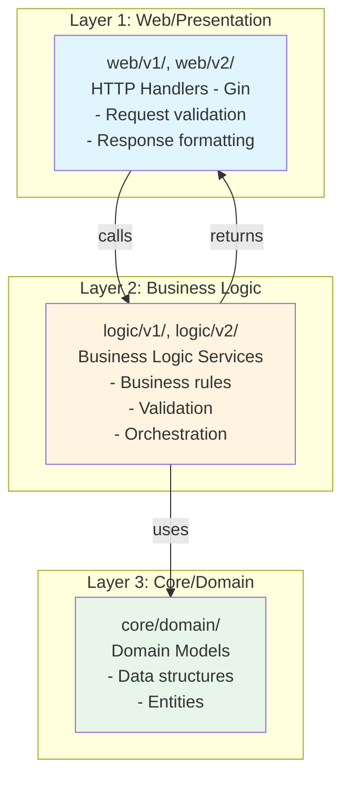
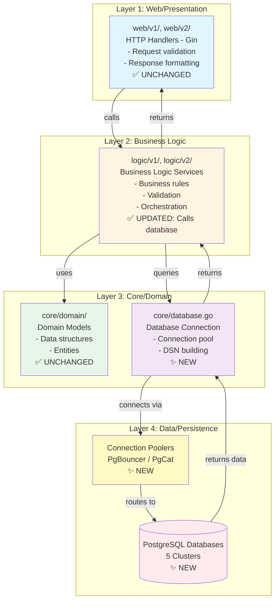
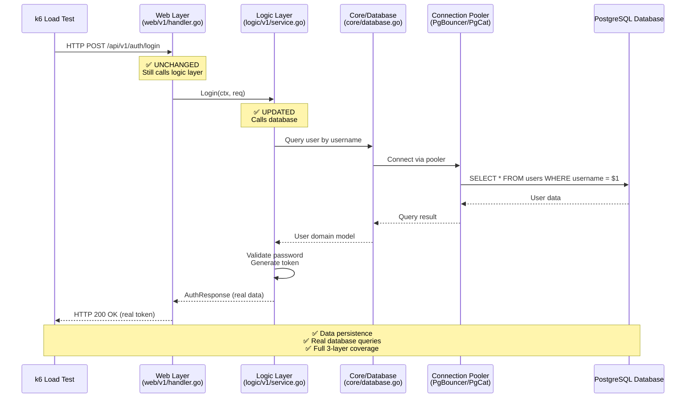

# Feature Specification: PostgreSQL Database Integration for k6 Load Testing

## Overview

Integrate PostgreSQL databases into the microservices architecture to enable realistic k6 load testing with data persistence. This feature implements a multi-cluster PostgreSQL setup using different operators (Zalando, CrunchyData), connection poolers (PgBouncer, PgCat), and high availability patterns (Patroni) to serve as a comprehensive learning platform for DevOps/SRE operations.

**Related Research**: [research.md](./research.md)

---

## Architecture Pattern Verification

### ✅ 3-Layer Architecture Confirmed

**Current Architecture Pattern (Before Database):**

**Architecture Pattern (After Database Integration):**

**Key Points:**
- ✅ **3-Layer Architecture is PRESERVED**: web → logic → core
- ✅ **Database is added to core layer**: `core/database.go` (not a new layer)
- ✅ **Logic layer calls database**: Through core/database.go
- ✅ **Web layer unchanged**: Still calls logic layer only
- ✅ **Domain models unchanged**: Still in core/domain/

### ✅ k6 Load Testing Pattern Confirmed

**k6 Test Flow (After Database Integration):**

**Architecture Compliance Summary:**

| Aspect | Current (Mock) | After Database | Status |
|--------|---------------|----------------|--------|
| **3-Layer Architecture** | ✅ web → logic → core | ✅ web → logic → core | ✅ **PRESERVED** |
| **Web Layer** | HTTP handlers | HTTP handlers (unchanged) | ✅ **UNCHANGED** |
| **Logic Layer** | Business logic (mock) | Business logic (real DB) | ✅ **UPDATED** |
| **Core Layer** | Domain models | Domain models + Database | ✅ **EXTENDED** |
| **k6 Testing** | HTTP → mock data | HTTP → real DB data | ✅ **ENHANCED** |
| **Data Persistence** | ❌ No | ✅ Yes | ✅ **ADDED** |

**Conclusion:**
- ✅ **3-Layer Architecture is MAINTAINED** - Database is added to core layer, not a new layer
- ✅ **k6 Load Testing is CORRECT** - Tests through HTTP (web layer), covering all layers
- ✅ **No Architecture Breaking Changes** - Web layer unchanged, logic layer calls database via core layer

**Related Research**: See [research.md](./research.md) for detailed architecture analysis.

---

## Problem Statement

### What problem are we solving?

**Current State:**
- 9 microservices (auth, user, product, cart, order, review, notification, shipping, shipping-v2) currently return **mock data only**
- No data persistence layer exists
- k6 load testing cannot verify real user journeys (login → create order → track order)
- Cannot test data consistency, transactions, or realistic data flows
- API documentation (`docs/api/API_REFERENCE.md`) is complete with 39 endpoints, but lacks database implementation

**Impact:**
- Load testing results are not representative of production behavior
- Cannot validate end-to-end user journeys
- Missing opportunity to learn database operations (connection pooling, HA, monitoring)
- No way to test database performance under load

### Who are the affected users?

- **Primary Users**: DevOps/SRE engineers learning database operations in Kubernetes
- **Secondary Users**: Developers implementing database integration in microservices
- **Tertiary Users**: QA engineers running k6 load tests

### Why is this important?

- **Learning Platform**: Provides hands-on experience with multiple PostgreSQL operators, poolers, and HA patterns
- **Realistic Testing**: Enables k6 to test actual data flows, not just mock responses
- **Operations Knowledge**: Demonstrates production-like database setups with monitoring
- **Best Practices**: Shows proper configuration management (env vars, Secrets, Helm charts)

---

## Requirements

### Functional Requirements

#### Database Infrastructure

**FR-001: Deploy 5 PostgreSQL Clusters with Different Configurations**
- **Description**: Implement Scenario 0 (Service-Specific Multi-Cluster) from research with 5 distinct PostgreSQL clusters, each tailored to specific service characteristics
- **Acceptance Criteria**:
  - Cluster 1 (Product): CrunchyData operator + PgCat pooler + read replicas
  - Cluster 2 (Review): Zalando operator + NO pooler (direct connection)
  - Cluster 3 (Auth): Zalando operator + PgBouncer pooler
  - Cluster 4 (Cart+Order): CrunchyData operator + PgCat pooler + Patroni HA
  - Cluster 5 (User+Notification): Zalando operator + NO pooler (shared database)
  - All clusters are accessible from their respective microservices
  - All clusters have unique names and namespaces

**FR-002: Deploy Zalando Postgres Operator**
- **Description**: Install and configure Zalando postgres-operator for 3 clusters (Review, Auth, User+Notification)
- **Acceptance Criteria**:
  - Operator deployed via Helm with fixed version in `k8s/postgres-operator-zalando/values.yaml`
  - Operator version fixed (e.g., v1.15.0)
  - Operator has proper RBAC permissions
  - Operator can create PostgreSQL instances via CRDs
  - Operator logs are accessible for troubleshooting

**FR-003: Deploy CrunchyData Postgres Operator**
- **Description**: Install and configure CrunchyData postgres-operator for 2 clusters (Product, Cart+Order)
- **Acceptance Criteria**:
  - Operator deployed via Helm with fixed version in `k8s/postgres-operator-crunchydata/values.yaml`
  - Operator version fixed (e.g., v5.7.0)
  - Operator has proper RBAC permissions
  - Operator can create PostgresCluster CRDs
  - Operator supports Patroni HA configuration

**FR-004: Deploy PgBouncer Connection Pooler**
- **Description**: Configure PgBouncer for Auth service with transaction pooling
- **Acceptance Criteria**:
  - PgBouncer deployed as sidecar or standalone service
  - Transaction pooling mode enabled
  - Pool size configured (25 connections default)
  - Auth service connects via PgBouncer endpoint (not direct database)
  - PgBouncer configuration documented

**FR-005: Deploy PgCat Connection Pooler**
- **Description**: Configure PgCat for Product and Cart+Order services with multi-database routing
- **Acceptance Criteria**:
  - PgCat deployed for Product service (with read replica routing)
  - PgCat deployed for Cart+Order services (multi-database routing)
  - Load balancing enabled for read replicas (Product)
  - Pool sizes configured per service (50 for Product, 30 for Cart/Order)
  - Services connect via PgCat endpoint

**FR-006: Configure Patroni High Availability**
- **Description**: Enable Patroni HA for Cart+Order cluster with automatic failover
- **Acceptance Criteria**:
  - Patroni integrated with CrunchyData operator
  - 2+ replicas configured for HA
  - Automatic failover works (< 30 seconds)
  - Leader election via Kubernetes API
  - Failover events are logged and observable

#### Microservices Integration

**FR-007: Update Microservices to Use Separate Database Environment Variables**
- **Description**: Modify all 9 microservices to connect to PostgreSQL using separate env vars (DB_HOST, DB_PORT, DB_NAME, DB_USER, DB_PASSWORD) instead of DATABASE_URL string
- **Acceptance Criteria**:
  - All services use `DB_HOST`, `DB_PORT`, `DB_NAME`, `DB_USER`, `DB_PASSWORD` env vars
  - No `DATABASE_URL` string is used anywhere
  - DSN is built from env vars in Go code
  - Configuration is validated on service startup
  - Missing required env vars cause service to fail with clear error message

**FR-008: Create Database Schemas for All Services**
- **Description**: Design and implement database schemas (tables, indexes, relationships) for all 9 microservices
- **Acceptance Criteria**:
  - Schema defined for each service (auth, user, product, cart, order, review, notification, shipping)
  - Tables match API data models from `docs/api/API_REFERENCE.md`
  - Primary keys and indexes defined appropriately
  - Foreign key relationships documented (if applicable)
  - Schema can be applied via migration scripts or init containers

**FR-009: Implement Database Connection in Go Code**
- **Description**: Add database connection logic to microservices using `database/sql` and `github.com/lib/pq` driver
- **Acceptance Criteria**:
  - Database connection function in each service's `core/database.go`
  - Connection uses separate env vars (not DATABASE_URL)
  - Connection pool configured (MaxOpenConns, MaxIdleConns)
  - Connection tested on startup (Ping)
  - Errors are logged with context
  - Connection can be reused across requests

**FR-010: Update Helm Charts with Database Environment Variables**
- **Description**: Add database env vars to all service Helm values files (`charts/values/*.yaml`)
- **Acceptance Criteria**:
  - All 9 service values files have `extraEnv` section with DB_* variables
  - `DB_PASSWORD` uses `valueFrom.secretKeyRef` (not hardcoded)
  - `DB_HOST` points to correct endpoint (pooler or direct)
  - `DB_PORT`, `DB_NAME`, `DB_USER` are configured per service
  - `DB_SSLMODE` set to "disable" for Kind cluster
  - `DB_POOL_MAX_CONNECTIONS` configured per service

**FR-011: Create Kubernetes Secrets for Database Passwords**
- **Description**: Create Secrets for all database passwords used by microservices
- **Acceptance Criteria**:
  - Secret created for each database cluster
  - Secrets use proper naming convention (e.g., `auth-db-secret`, `product-db-secret`)
  - Passwords are base64 encoded
  - Secrets are referenced in Helm values via `valueFrom.secretKeyRef`
  - Secrets are not committed to git (documented in .gitignore)

#### Monitoring & Observability

**FR-012: Deploy postgres_exporter for All Clusters**
- **Description**: Install postgres_exporter to expose PostgreSQL metrics to Prometheus
- **Acceptance Criteria**:
  - postgres_exporter deployed for all 5 clusters
  - Exporter configured with database connection (via env vars)
  - Exporter exposes metrics on `/metrics` endpoint
  - Exporter version fixed in `k8s/postgres-exporter/values.yaml`
  - Exporter has proper RBAC permissions

**FR-013: Configure ServiceMonitor for postgres_exporter**
- **Description**: Create ServiceMonitor CRDs for Prometheus to auto-discover postgres_exporter instances
- **Acceptance Criteria**:
  - ServiceMonitor created for each postgres_exporter
  - ServiceMonitor has proper labels for Prometheus discovery
  - Metrics are scraped by Prometheus automatically
  - Metrics visible in Grafana
  - ServiceMonitor follows existing pattern from `k8s/prometheus/servicemonitor-microservices.yaml`

#### Deployment & Operations

**FR-014: Create Database Migration/Initialization Scripts**
- **Description**: Implement schema initialization for all databases (via init containers or migration jobs)
- **Acceptance Criteria**:
  - Migration scripts or SQL files for each service schema
  - Scripts are idempotent (can be run multiple times safely)
  - Scripts run automatically on database creation (init container or operator hook)
  - Schema versioning documented (if applicable)
  - Migration failures prevent service startup

**FR-015: Update Deployment Scripts**
- **Description**: Add database deployment steps to existing scripts or create new deployment script
- **Acceptance Criteria**:
  - Script to deploy PostgreSQL operators (Zalando, CrunchyData)
  - Script to deploy connection poolers (PgBouncer, PgCat)
  - Script to create database clusters via CRDs
  - Script to create Kubernetes Secrets
  - Script execution order documented (operators → clusters → poolers → secrets → services)
  - Scripts follow existing numbering pattern (e.g., `04-deploy-databases.sh` - step 4, before build)

### Non-Functional Requirements

**NFR-001: Environment Variable Configuration**
- **Description**: All database connections MUST use separate environment variables (DB_HOST, DB_PORT, DB_NAME, DB_USER, DB_PASSWORD), NOT a single DATABASE_URL string
- **Rationale**: Easier to configure, debug, and override individual components
- **Validation**: Code review, no DATABASE_URL references in codebase

**NFR-002: Secret Management**
- **Description**: All database passwords MUST be stored in Kubernetes Secrets, never hardcoded or in Helm values
- **Rationale**: Security best practice, prevents credential leaks
- **Validation**: No passwords in Helm values files, all use `valueFrom.secretKeyRef`

**NFR-003: Version Pinning**
- **Description**: All operators and exporters MUST have fixed versions in their `values.yaml` files
- **Rationale**: Ensures reproducible deployments, prevents unexpected updates
- **Validation**: All `values.yaml` files specify exact image tags (no `latest`)

**NFR-004: Prometheus Integration**
- **Description**: All database metrics MUST be scraped by Prometheus via ServiceMonitor
- **Rationale**: Consistent monitoring approach, enables Grafana dashboards
- **Validation**: ServiceMonitors exist for all postgres_exporter instances, metrics visible in Prometheus

**NFR-005: Connection Pooling Configuration**
- **Description**: Connection pooling MUST be configurable per service via environment variables
- **Rationale**: Different services have different connection requirements
- **Validation**: `DB_POOL_MAX_CONNECTIONS` env var works for all services

**NFR-006: Idempotent Deployment**
- **Description**: Database setup MUST be idempotent (can be re-run safely without errors)
- **Rationale**: Supports iterative development, safe to retry failed deployments
- **Validation**: Running deployment scripts multiple times doesn't cause errors

**NFR-007: Error Handling**
- **Description**: Database connection failures MUST be handled gracefully with clear error messages
- **Rationale**: Easier troubleshooting, better user experience
- **Validation**: Services fail fast on startup if database is unavailable, errors are logged clearly

**NFR-008: Documentation**
- **Description**: All database configurations, connection patterns, and troubleshooting steps MUST be documented
- **Rationale**: Learning platform requires clear documentation
- **Validation**: Documentation exists in `docs/` directory, covers all 5 clusters

---

## User Stories

### US-001: Deploy Multiple PostgreSQL Operators
**As a** DevOps engineer  
**I want** to deploy both Zalando and CrunchyData PostgreSQL operators  
**So that** I can learn the differences between operator approaches and choose the right one for different use cases

**Acceptance Criteria:**
- Zalando operator deployed and functional for 3 clusters
- CrunchyData operator deployed and functional for 2 clusters
- Both operators have fixed versions in values.yaml files
- Both operators can create PostgreSQL instances via CRDs
- Operator differences documented (pros/cons, use cases)

**Priority:** High  
**Effort:** Large (8-12 hours)

---

### US-002: Configure Connection Poolers
**As a** DevOps engineer  
**I want** to configure different connection poolers (PgBouncer and PgCat) for different services  
**So that** I can learn when to use each pooler and understand their performance characteristics

**Acceptance Criteria:**
- PgBouncer configured for Auth service with transaction pooling
- PgCat configured for Product service with read replica routing
- PgCat configured for Cart+Order services with multi-database routing
- Pooling configuration documented (pool sizes, modes)
- Services successfully connect via poolers (not direct)

**Priority:** High  
**Effort:** Medium (4-6 hours)

---

### US-003: Setup High Availability with Patroni
**As a** DevOps engineer  
**I want** to configure Patroni HA for the Cart+Order cluster  
**So that** I can learn high availability patterns and automatic failover

**Acceptance Criteria:**
- Patroni HA enabled for Cart+Order cluster
- 2+ replicas configured
- Automatic failover works (< 30 seconds)
- Failover events are observable (logs, metrics)
- HA configuration documented

**Priority:** Medium  
**Effort:** Medium (4-6 hours)

---

### US-004: Microservices Database Integration
**As a** developer  
**I want** microservices to connect to PostgreSQL using separate environment variables  
**So that** configuration is flexible, debuggable, and follows best practices

**Acceptance Criteria:**
- All 9 services use DB_HOST, DB_PORT, DB_NAME, DB_USER, DB_PASSWORD
- No DATABASE_URL string is used
- DSN is built from env vars in Go code
- Configuration is validated on startup
- Connection errors are clear and actionable

**Priority:** High  
**Effort:** Medium (6-8 hours)

---

### US-005: Database Monitoring
**As a** DevOps engineer  
**I want** PostgreSQL metrics exposed to Prometheus  
**So that** I can monitor database performance during k6 load testing and troubleshoot issues

**Acceptance Criteria:**
- postgres_exporter deployed for all 5 clusters
- ServiceMonitor configured for auto-discovery
- Metrics visible in Prometheus (connection count, query performance, replication lag)
- Metrics visible in Grafana (can create dashboards)
- Monitoring setup documented

**Priority:** High  
**Effort:** Small (2-3 hours)

---

### US-006: Realistic k6 Load Testing
**As a** DevOps engineer  
**I want** to run k6 load tests against services with real databases  
**So that** I can test realistic user journeys and verify data consistency

**Acceptance Criteria:**
- k6 can create users via auth service (data persists)
- k6 can browse products (reads from database)
- k6 can add items to cart (data persists)
- k6 can create orders (transaction works)
- Full user journey works: login → browse → cart → checkout → track order
- Data persists across requests (not mock data)

**Priority:** High  
**Effort:** Large (8-12 hours)

---

## Success Metrics

### Deployment Metrics
- ✅ **All 5 PostgreSQL clusters deployed and healthy**
  - All clusters have `Ready` status
  - All clusters are accessible from microservices
  - Zero cluster creation failures

- ✅ **All operators functional**
  - Zalando operator can create PostgreSQL instances
  - CrunchyData operator can create PostgresCluster instances
  - Operator logs show no errors

### Integration Metrics
- ✅ **All 9 microservices successfully connect to databases**
  - All services start without database connection errors
  - All services can execute queries
  - Zero connection timeout errors during normal operation

- ✅ **Connection poolers working**
  - PgBouncer reduces connection count for Auth service
  - PgCat routes queries correctly for Product and Cart+Order
  - Pool metrics show active connections

### Testing Metrics
- ✅ **k6 load tests complete with real database operations**
  - k6 can create 100+ users
  - k6 can create 100+ orders
  - Full user journey completes successfully
  - Data persists across test runs (until cluster deletion)

### Monitoring Metrics
- ✅ **PostgreSQL metrics visible in Prometheus/Grafana**
  - postgres_exporter metrics scraped for all clusters
  - Connection count metrics available
  - Query performance metrics available
  - Replication lag metrics available (for HA clusters)

### Code Quality Metrics
- ✅ **Zero hardcoded database credentials in code**
  - No passwords in code
  - No passwords in Helm values
  - All credentials in Kubernetes Secrets

- ✅ **All database connections use separate env vars**
  - No DATABASE_URL string in codebase
  - All services use DB_HOST, DB_PORT, DB_NAME, DB_USER, DB_PASSWORD
  - Configuration is validated

---

## Edge Cases & Error Scenarios

### Database Connection Failures

**Scenario**: Database cluster is unavailable (pod crash, network partition)  
**Handling**:
- Service startup should fail fast with clear error message: "Failed to connect to database: <host>:<port>"
- Error should include connection details (host, port) for debugging
- Service should not start if database is unreachable
- Logs should show connection retry attempts (if applicable)

**Scenario**: Database password is incorrect  
**Handling**:
- Service startup should fail with authentication error
- Error message: "Database authentication failed for user: <user>"
- Service should not start with invalid credentials
- Validation should happen during connection, not on first query

**Scenario**: Database host/port is misconfigured  
**Handling**:
- Service startup should fail with connection timeout error
- Error message should include attempted host:port
- Configuration validation should catch missing env vars before connection attempt

### Connection Pooling Failures

**Scenario**: PgBouncer pooler is unavailable  
**Handling**:
- Service should handle connection timeout gracefully
- Error should indicate pooler endpoint (not database endpoint)
- Retry logic should use exponential backoff
- After max retries, service should fail with clear error

**Scenario**: PgCat pooler cannot route to database  
**Handling**:
- PgCat should return routing error
- Service should log routing failure
- Service should not silently fail (error should propagate)

### High Availability Failures

**Scenario**: Primary database fails, Patroni triggers failover  
**Handling**:
- Failover should complete within 30 seconds
- Services should automatically reconnect to new primary
- Connection pool should handle reconnection transparently
- No data loss during failover (transactions should be preserved)

**Scenario**: Network partition between primary and replica  
**Handling**:
- Patroni should detect partition
- New primary should be elected
- Services should connect to new primary
- Replication lag should be visible in metrics

### Schema Migration Failures

**Scenario**: Migration script fails due to syntax error  
**Handling**:
- Init container should fail with non-zero exit code
- Service pod should not start (init container failure)
- Error should be logged with SQL statement that failed
- Manual intervention required to fix schema

**Scenario**: Migration script runs twice (idempotency)  
**Handling**:
- Script should check if schema already exists
- Script should skip creation if tables exist
- Script should not fail if objects already exist
- Script should be safe to run multiple times

### Resource Exhaustion

**Scenario**: Database connection pool exhausted  
**Handling**:
- Service should return 503 (Service Unavailable) error
- Error message: "Database connection pool exhausted"
- Metrics should track connection pool usage
- Alert should fire when pool usage > 80%

**Scenario**: Database disk space full  
**Handling**:
- Database should reject writes
- Service should return 500 error for write operations
- Error should indicate disk space issue
- Monitoring should alert on disk usage > 90%

---

## Dependencies

### Infrastructure Dependencies
- **Kubernetes Cluster (Kind)**: Must be running and accessible
- **Helm 3.x**: Required for operator and component deployments
- **kubectl**: Required for CRD creation and cluster management

### Existing System Dependencies
- **Prometheus Operator**: Already deployed (required for ServiceMonitor CRDs)
- **Prometheus**: Already deployed (required for metrics scraping)
- **Grafana**: Already deployed (optional, for visualization)
- **Microservices Codebase**: Existing 9 microservices need to be updated

### External Dependencies
- **PostgreSQL Operators**: Zalando and CrunchyData operators from Helm repositories
- **Connection Poolers**: PgBouncer and PgCat (may require manual deployment)
- **PostgreSQL Driver**: `github.com/lib/pq` Go package (needs to be added to go.mod)

### Deployment Order Dependencies
1. **Operators** must be deployed before database clusters
2. **Database clusters** must be created before poolers
3. **Poolers** must be deployed before microservices
4. **Secrets** must be created before microservices
5. **Microservices** can be deployed after all database infrastructure is ready

---

## Assumptions

### Technical Assumptions
- **Data Loss Acceptable**: Kind cluster will be deleted, data persistence is not required
- **Single Kubernetes Cluster**: No multi-cluster or cross-cluster replication needed
- **PostgreSQL Version**: PostgreSQL 14+ compatible (operators support 12+)
- **No Backup Required**: Learning project, backups not needed
- **Resource Availability**: Kind cluster has sufficient resources (CPU, memory, storage)

### Operational Assumptions
- **All Services Updated Simultaneously**: Can update all 9 services at once (no gradual rollout needed)
- **No Production Data**: No real user data, safe to experiment
- **Manual Secret Creation**: Secrets can be created manually (not automated)
- **Schema Design Flexibility**: Can design schemas from scratch (no migration from existing system)

### Learning Assumptions
- **Focus on Operations**: Primary goal is learning DevOps/SRE operations, not application development
- **Documentation Important**: Clear documentation needed for learning
- **Multiple Scenarios**: Want to learn different approaches (operators, poolers, HA)

---

## Out of Scope

### Backup & Recovery
- ❌ **Database Backups**: Not needed for learning project (data loss acceptable)
- ❌ **Point-in-Time Recovery**: Not required
- ❌ **Backup Automation**: Not needed

### Advanced Features
- ❌ **Multi-Region Replication**: Single cluster only
- ❌ **Database Sharding**: Not needed for learning
- ❌ **Advanced PostgreSQL Tuning**: Basic configuration only
- ❌ **Query Optimization**: Not focus of this feature

### Data Management
- ❌ **Data Seeding Scripts**: Manual or via k6 only (no automated seeding)
- ❌ **Data Migration Tools**: Simple init scripts only (no complex migration framework)
- ❌ **Data Archiving**: Not needed

### Security Hardening
- ❌ **SSL/TLS Encryption**: Disabled for Kind cluster (sslmode=disable)
- ❌ **Network Policies**: Not implemented (learning focus)
- ❌ **RBAC Fine-Tuning**: Basic RBAC only (operators provide default)

### Production Readiness
- ❌ **Disaster Recovery**: Not needed (learning project)
- ❌ **Capacity Planning**: Not focus of this feature
- ❌ **Performance Benchmarking**: Basic monitoring only

---

## Implementation Notes

### Code Structure
- Database connection code should be in `services/internal/{service}/core/database.go`
- Database models should be in `services/internal/{service}/core/domain/`
- Database queries should be in `services/internal/{service}/logic/v1/` and `logic/v2/`

### Configuration Pattern
- Use `services/pkg/config/config.go` pattern for database configuration
- Add `DatabaseConfig` struct to existing Config
- Build DSN from separate env vars (not DATABASE_URL)

### Helm Chart Pattern
- Database env vars go in `extraEnv` section (not `env`)
- Use `valueFrom.secretKeyRef` for passwords
- Follow existing pattern from `charts/values/auth.yaml`

### Documentation Requirements
- Document all 5 cluster configurations
- Document connection patterns (direct vs pooler)
- Document troubleshooting steps
- Update `AGENTS.md` with database setup instructions

---

## Review Checklist

- [x] Requirements are clear and testable
- [x] User stories follow INVEST criteria
- [x] Acceptance criteria are specific and measurable
- [x] Edge cases are identified and addressed
- [x] Dependencies are documented
- [x] Success metrics are defined
- [x] Assumptions are explicit
- [x] Out of scope items are clearly stated
- [ ] Stakeholder review completed

---

**Created:** December 14, 2025  
**Last Updated:** December 14, 2025  
**Status:** Specified  
**Related Research:** [research.md](./research.md)  
**Next Phase:** `/plan` - Create implementation plan
