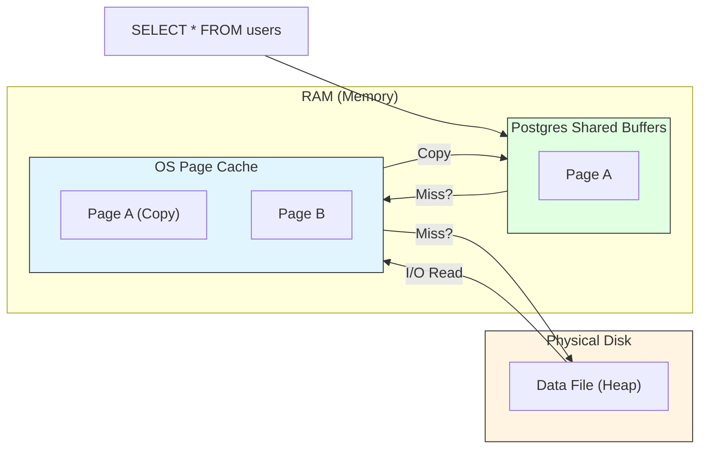
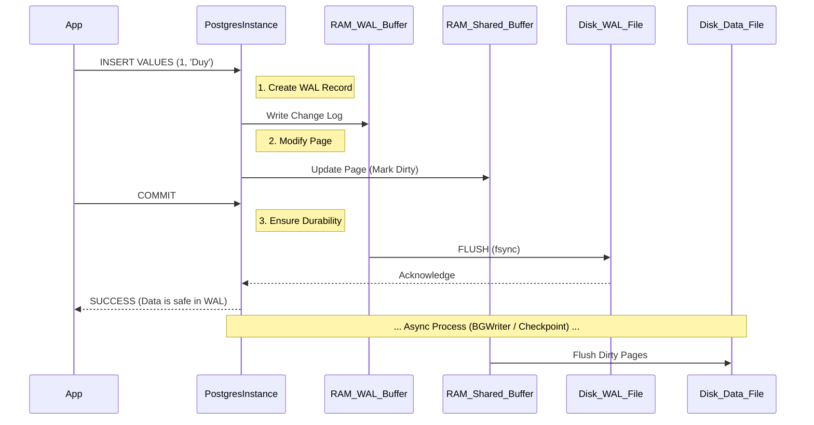
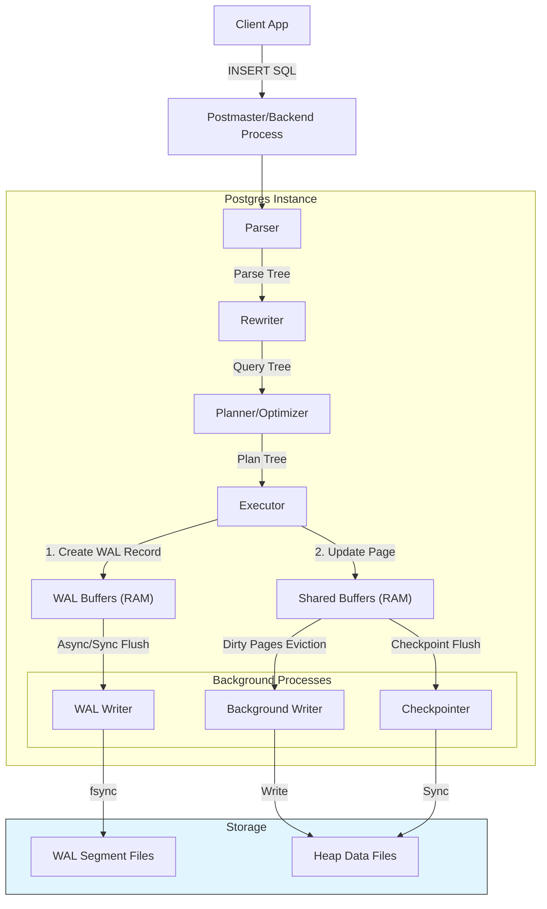
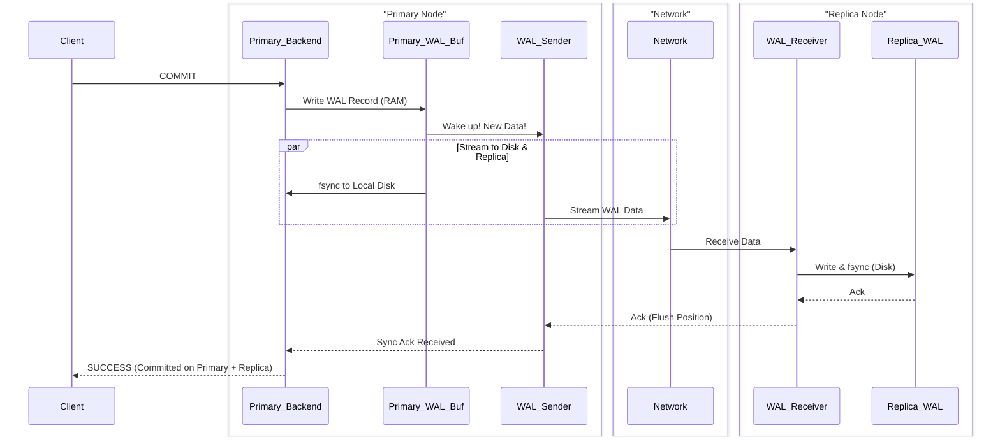
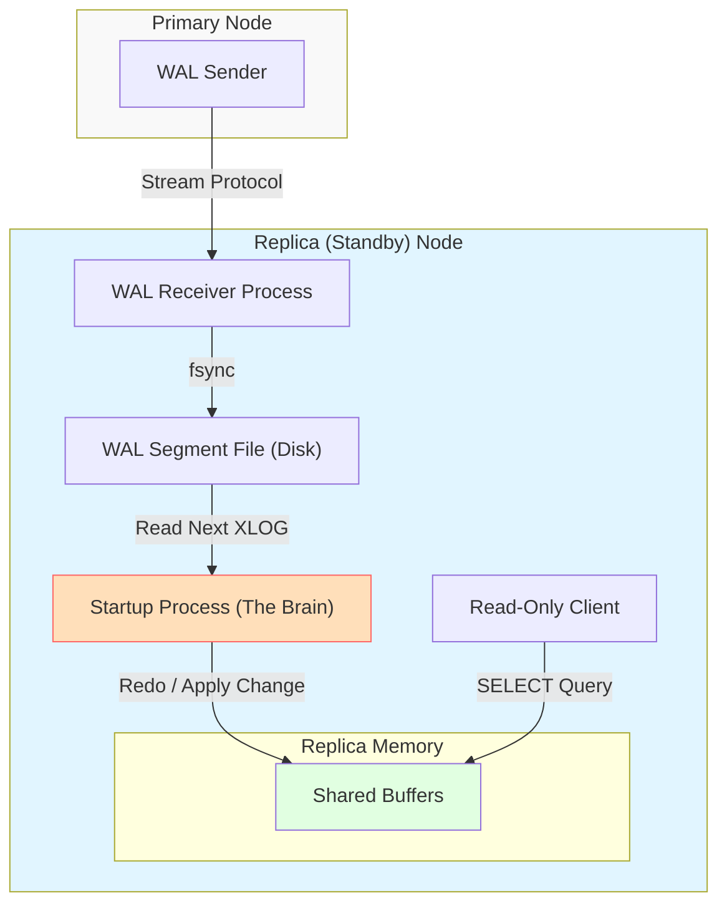
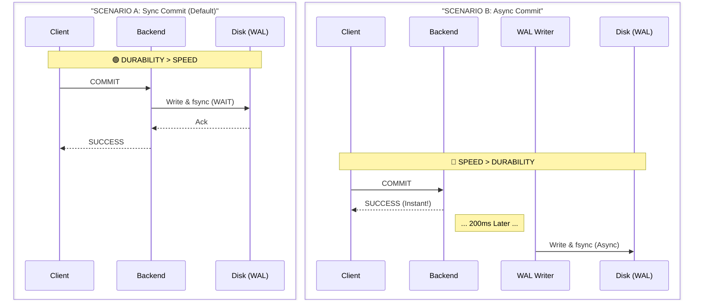
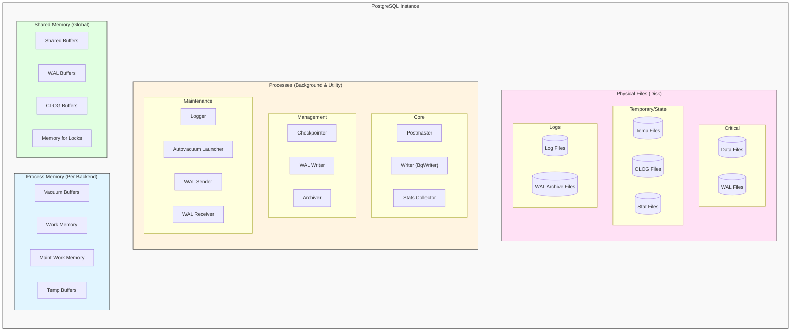

# Deep Dive: PostgreSQL Internals (shared_buffers, Architecture & INSERT Flow)

**Topic:** PostgreSQL Core Mechanics
**Date:** 2026-01-26
**Understanding Level:** Deep Dive

---

## 1. Database vs. DB Instance vs. Schema

You are absolutely correct. The terminology in Oracle and PostgreSQL often overlaps but has distinct meanings.

### ✅ **Database Instance (The Engine)**
*   **Definition:** The running software process (`postgres` processes) and the memory structures (Shared Memory).
*   **Analogy:** The "Factory" and "Workers". They do the work but disappear if you turn off the power (restart the server).
*   **Components:**
    *   **Processes:** Postmaster, Background Writer, Wal Writer, Autovacuum, etc.
    *   **Memory:** Shared Buffers, WAL Buffers.

### ✅ **Database (The Storage Unit)**
*   **Definition:** The physical collection of files on disk (datafiles within `base/` directory).
*   **Analogy:** The "Warehouse". It persists even if the factory closes for the night.
*   **Architecture:**
    *   One **Instance** can manage multiple **Databases** (e.g., `postgres`, `app_db`, `analytics_db`).
    *   **Isolation:** A connection is made to *one specific database*. You cannot query data from `app_db` while connected to `postgres` (unlike Oracle where "Cross-Schema" queries are common). To query across databases in Postgres, you need extensions like `postgres_fdw`.

### ✅ **Schema (Logical Namespace)**
*   **Definition:** A logical container *within* a Database.
*   **Analogy:** "Folders" inside a specific "Warehouse".
*   **Usage:**
    *   Used for logical separation (e.g., `public`, `sales`, `inventory`) within the same database.
    *   Tables in different schemas (e.g., `sales.orders` and `inventory.products`) **CAN** be joined easily in a single query.

**Summary Hierarchy:**
`Instance (Process/Memory) -> Manages -> Databases (Disk) -> Contain -> Schemas (Logical) -> Contain -> Tables/Indexes`

---

## 2. shared_buffers: The Heart of Caching

### **What is it?**
`shared_buffers` is the dedicated RAM area that the PostgreSQL instance allocates at startup. It serves as the **Database Buffer Pool**.

### **What does it configure?**
It configures **how much memory** Postgres reserves for caching "pages" (8KB blocks of data/indexes).

### **Why not use all RAM?**
PostgreSQL has a unique architecture: it relies heavily on the **Operating System (OS) Cache**.
*   **Double Caching:** Data is often cached twice (once in `shared_buffers`, once in OS cache).
*   **Recommendation (25-40%):**
    *   Data in `shared_buffers` is "hot" (frequently accessed).
    *   The OS Cache handles the larger "warm" dataset.
    *   If you set `shared_buffers` to 90%, the OS has no RAM left for file buffering, and performance degrades because Postgres assumes the OS handles disk I/O efficiently.

---

## 3. Beyond Shared Buffers: The Hidden Heroes

You rightly noted that `shared_buffers` is not the only important component. In fact, for **Write Performance** and **Data Integrity**, other components are equally critical.

### 🩸 **WAL Buffers & WAL Writer (The Speed Demon)**
The Write-Ahead Log (WAL) is the reason Databases are faster than simple File Systems.
*   **Role**: When you INSERT data, Postgres **does not** immediately write to the data file (Heap) on disk. That would require random I/O (slow).
*   **Mechanism**:
    1.  The change is written to `wal_buffers` (RAM).
    2.  The `wal_writer` process flushes this to the **WAL Segment File** (disk) sequentially.
*   **Why it matters**: Sequential writes are 10x-100x faster than random writes. This allows the database to acknowledge a COMMIT in milliseconds, even if `shared_buffers` hasn't been flushed to the main data files yet.

### 🧹 **Background Writer (The Janitor)**
*   **Role**: Moves "Dirty Pages" from `shared_buffers` to disk *gradually* in the background.
*   **Why**: If `shared_buffers` gets full, the next query has to evict a page to make room. If that page is dirty, the *query itself* has to write it to disk, causing latency for the user.
*   **Goal**: Ensure that `shared_buffers` always has clean, freeable pages available for new queries.

### 🚦 **Checkpointer (The Synchronization Point)**
*   **Role**: Limits recovery time and manages WAL file growth.
*   **Mechanism**: Periodically (e.g., every 5-15 mins), it forces **ALL** dirty pages in `shared_buffers` to be flushed to disk/datafiles.
*   **Impact**:
    *   After a checkpoint, the old WAL files can be deleted (recycled).
    *   Heavy checkpoints cause "I/O Storms" where the disk is overwhelmed by writes. This is why `checkpoint_completion_target` (smoothing) is a top 10 tuning parameter.

---

## 4. The Read Path: "Double Buffering"

You asked: *"it loads it from OS/Disk. What does this look like?"*

This is a specific design choice in PostgreSQL called **Double Buffering**.

### **How a Read Works**
When Postgres needs to read a page (e.g., specific row in `users` table):

1.  **Check Shared Buffers:** Postgres checks its own dedicated RAM (`shared_buffers`).
    *   **Hit:** Data is returned immediately. (Fastest)
    *   **Miss:** Postgres asks the Operating System (Kernel) to read the file.
2.  **OS Kernel Read:** The OS assumes it knows how to manage disks better than any application.
    *   **Check OS Page Cache:** The OS checks *its* own RAM cache.
    *   **Hit:** OS copies data from **Page Cache** -> **Shared Buffers**. (Fast RAM Copy).
    *   **Miss:** OS issues physical I/O to the Disk -> **Page Cache** -> **Shared Buffers**. (Slowest).

### **Why is this "Double"?**
Because the same data page often exists in **BOTH** places:
1.  **Shared Buffers**: For Postgres exclusive use.
2.  **OS Page Cache**: Managed by Linux.

*This is why we recommend `shared_buffers` at 25-40%, NOT 90%. If you give 90% to Postgres, the OS has no RAM left for its Page Cache, forcing every "Miss" to go all the way to the physical disk!*

### **Visualizing the Read Path**

---

## 5. The Lifecycle of an INSERT: Step-by-Step

What happens when an application sends: `INSERT INTO users (id, name) VALUES (1, 'Duy');`?

### **Phase 1: Parsing & Planning (The Brain)**
1.  **Parser:** Checks syntax (valid SQL?) and validity (table `users` exists?).
2.  **Rewrite System:** Checks if there are any RULES impacting the query.
3.  **Planner/Optimizer:** For simple `INSERT`, this is trivial.

### **Phase 2: Execution (The RAM & Log)**
4.  **Buffer Manager Check:**
    *   Postgres needs to find the target **Page** (8KB block) in `shared_buffers`.
    *   If missing, it loads it from OS/Disk.
5.  **WAL Write (Crucial Step):**
    *   Before modifying the page, Postgres creates a **WAL Record** (XLOG) describing the change.
    *   This record is written to **WAL Buffers** (RAM).
6.  **Dirty Page:**
    *   The page in `shared_buffers` is modified with the new row.
    *   The page is marked **"Dirty"**.
    *   **Crucially:** The data file (`base/`) on disk is **NOT** touched yet.

### **Phase 3: Commit (The Promise)**
7.  **WAL Flush (Synchronous Commit):**
    *   Client sends `COMMIT`.
    *   **WAL Writer** flushes **WAL Buffers** to **WAL Segment Files** (disk).
    *   `fsync()` is called to force physical storage.
    *   **Success:** Client receives acknowledgement. Data is durable because the Log exists.

### **Phase 4: Background Sync (The Reality)**
8.  **Background Writer:** Gradually moves the dirty page to the OS Cache/Disk if buffers get full.
9.  **Checkpoint:**
    *   Eventually, a Checkpoint runs.
    *   It forces the dirty page to be written to the **Heap File** (Data File).
    *   It updates the Control File to say "Data up to this point is safe in data files".

### **Summary Flow:**
`App` -> `Parser` -> `WAL Buffer` -> `Shared Buffers (Dirty Page)` -> `Commit (WAL Flush to Disk)` -> `Success` -> ...(Later)... -> `Checkpoint (Data Flush to Disk)`

---

## 5. Visualizing the Path

### **Step-by-Step Explanation**

Here is the translation of the diagrams above into a concrete sequence of events:

**1. Client (App) $\rightarrow$ Postmaster (Backend)**
*   **Action:** `INSERT INTO users (id, name) VALUES (1, 'Duy');`
*   **Details:** The application establishes a connection and sends the SQL string over the network to the Postgres Backend Process.

**2. Backend $\rightarrow$ Parser & Planner**
*   **Action:** `Parse & Plan`
*   **Details:** The backend checks: "Is the SQL valid?", "Does table `users` exist?". Then it creates an optimal execution plan (trivial for single insert).

**3. Executor $\rightarrow$ WAL Buffers (RAM)**
*   **Action:** `Create WAL Record`
*   **What happens:** Before touching *any* data page, Postgres writes a small "change log" entry to the `wal_buffers`.
*   **Message:** "I am about to add row (1, 'Duy') to Page X."

**4. Executor $\rightarrow$ Shared Buffers (RAM)**
*   **Action:** `Update Page` (Mark Dirty)
*   **What happens:** Postgres finds the 8KB page in `shared_buffers`. It locks the page and adds the new row tuple.
*   **Result:** The page is now **"Dirty"** (it is different from what is on the disk).

**5. Client $\rightarrow$ Backend**
*   **Action:** `COMMIT`
*   **Message:** "Save this for real."

**6. Backend $\rightarrow$ WAL Writer $\rightarrow$ Disk (Storage)**
*   **Action:** `Sync / fsync`
*   **Critical Step:** The `wal_writer` process takes what is in `wal_buffers` and forces it to the physical **WAL Segment File**.
*   **Result:** Only *after* this fsync returns successfully does Postgres tell the Client "Success". The data is now Durable (D is ACID).

**7. Background Writer $\rightarrow$ Disk (Async)**
*   **Action:** `Evict / Write`
*   **Details:** Minutes later, if memory is getting full, the `bgwriter` process moves the "Dirty Page" from Shared Buffers to the OS Cache/Data File to free up RAM for other queries.

**8. Checkpointer $\rightarrow$ Disk (Async)**
*   **Action:** `Checkpoint`
*   **Details:** Periodically (e.g., 5 mins), the `checkpointer` ensures **ALL** dirty pages are flushed to the **Heap Data Files**. This synchronizes the "Warehouse" (Disk) with the "Factory" (Memory).

### **Detailed Component Flow (Architecture View)**

### **6. Production-Ready: High Availability (Replication) Flow**

In a production environment (like the one you are learning), a single instance is not enough. You have **Replicas** (Standbys).

**How does an INSERT work with Synchronous Replication?**

The flow changes significantly at the **Commit** phase. PostgreSQL must ensure the WAL log reaches the Replica before telling the client "Success".

**Key Difference:**
*   **Latency:** The "Success" response depends on the *network speed* and *replica disk speed*.
*   **Durability:** Data is safe on TWO disks. If Primary burns down, Replica has the data.

### **7. Deep Dive: Types of Replicas & How They Work**

You asked: *"How many types? I know standbys but don't understand how they work."*

There are **3 Main Categories** of replication in PostgreSQL.

#### **A. Physical Replication (Streaming Replication)**
*   **What is it?** A byte-for-byte copy of the entire database cluster (all databases, all schemas).
*   **Mechanism:** Ships WAL (Change Logs) from Primary to Replica.
*   **Result:** The Replica is an exact clone of the Primary.
*   **Use Case:** High Availability (HA), Disaster Recovery, Offloading Read Traffic.
*   **Sub-types:**
    *   **Warm Standby:** Server is running but **cannot answer queries**. It just applies logs.
    *   **Hot Standby:** Server applies logs AND **accepts Read-Only queries** (SELECTs). *This is what 99% of production uses.*

#### **B. Logical Replication**
*   **What is it?** Replicates specific **tables** or **rows** (Data objects, not bytes).
*   **Mechanism:** Decodes WAL into a stream of changes (Insert ID=1) and sends to Subscriber.
*   **Use Case:** Migrations (Zero Downtime), Replicating to different OS/Version, Analytics Data Lake.

#### **C. Archive Recovery (Log Shipping)**
*   **Mechanism:** Primary writes WAL files to S3/NFS. Replica downloads them 1-by-1 and replays.
*   **Latency:** High (Minutes).
*   **Use Case:** Point-In-Time Recovery (PITR) ("Restore DB to state at 10:00 AM yesterday").

---

### **8. How a "Standby" Actually Works (The Internals)**

A Standby is not just a "passive" disk. It has a specialized process called the **Startup Process** doing the hard work.

**The "Redo" Loop:**
1.  **WAL Receiver:** Connects to Primary, streams WAL data, writes to **Standby's WAL Disk**.
2.  **Startup Process:** This is the "Recovery" engine. It continuously reads the WAL file from disk.
3.  **Replay:** It looks at the log: *"Insert row at Page 40"*.
4.  **Buffer Update:** It modifies **Shared Buffers** in the Replica, making the page identical to Primary.
5.  **Traffic Control:** If a user runs `SELECT * FROM users`:
    *   If the page is valid, they see data.
    *   If the Startup Process needs to modify that page *right now*, the SELECT query might be **cancelled** (This is known as a "Recovery Conflict").

### **Visualizing the Standby Internal Flow**

### **9. Validation: Your Findings & Sync vs Async Commit**

**Verdict:** Your research and the flow you provided are **100% Accurate**.

The text correctly identifies a crucial detail about *who* writes to disk:

1.  **Sync Commit (Default):**
    *   **Trigger:** Client sends `COMMIT`.
    *   **Action:** The **Backend Process** (handling the user query) forces a flush of WAL buffers to disk.
    *   **Wait:** The backend *waits* for the OS to confirm the write (`fsync`) before sending "Success" to the user.
    *   **Durability:** Guaranteed.

2.  **Async Commit (`synchronous_commit = off`):**
    *   **Trigger:** Client sends `COMMIT`.
    *   **Action:** The Backend *does not* flush immediately. It returns "Success" to the user instantly.
    *   **Flush:** The **WAL Writer** process (running in background) flushes the buffer soon after (usually within 200ms).
    *   **Trade-off:** Much faster performance, but risk of losing the last few milliseconds of data if the server crashes *right* after commit.

**Visualizing the Difference:**

**Visual Verification:**

*Figure: The standard PostgreSQL WAL Write architecture (matches your findings).*

### **10. Full Architecture Overview (Visualized)**

Based on the architecture diagram you shared, here is the complete system view in Mermaid:

