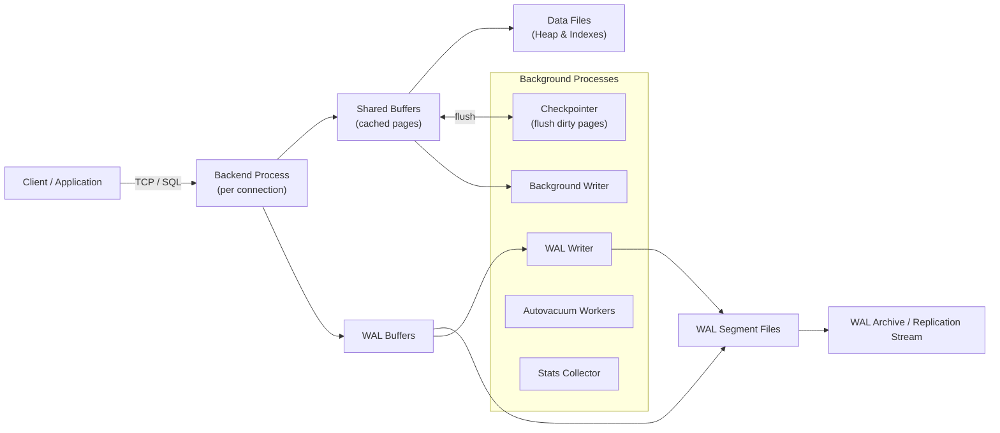
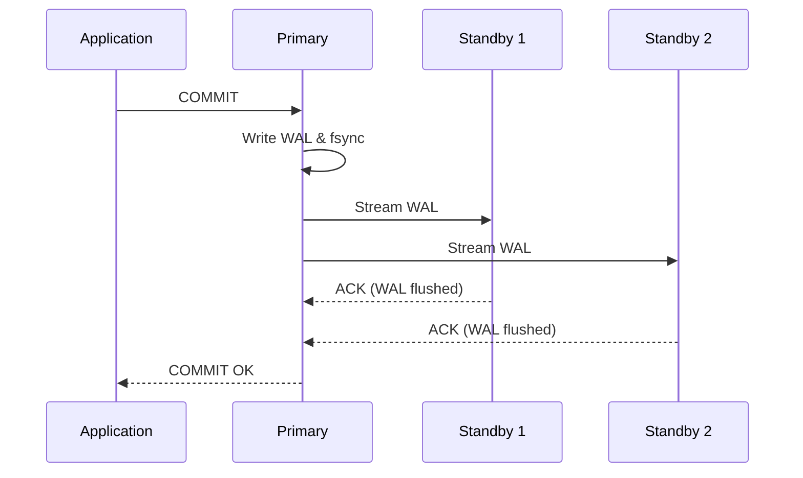
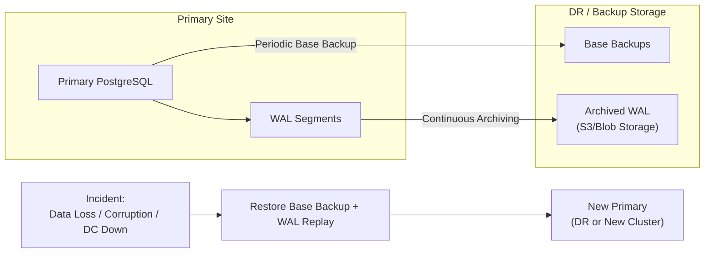
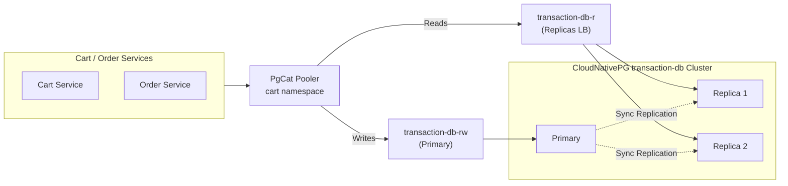

# Research: PostgreSQL Deep Dive for DevOps/SRE

**Task ID:** `postgresql-deep-dive`  
**Date:** 2026-01-07  
**Status:** Complete

---

## Executive Summary

Mục tiêu của tài liệu này là giúp bạn – một DevOps/SRE đang hướng tới Senior – có **mental model sâu về PostgreSQL**: kiến trúc lõi, cách PostgreSQL đảm bảo **ACID**, mối quan hệ với **CAP** khi triển khai HA/replication, các pattern **Scalability / High Availability / Resilience**, cùng với **RTO/RPO** và các bài tập **troubleshooting** thực chiến.  
PostgreSQL bản chất là một **strongly-consistent, ACID-compliant relational database** chạy trên 1 node, nhưng trong thực tế production, ta luôn triển khai nó **như một hệ phân tán** (primary + replicas + failover + backup + DR) – đây chính là chỗ DevOps/SRE tạo khác biệt.

Trong repo monitoring hiện tại, bạn đã có một “lab” khá chuẩn: **5 PostgreSQL clusters** dưới hai operator (**CloudNativePG** và **Zalando**), nhiều pattern HA (single instance, async replica, synchronous HA với Patroni, connection poolers PgBouncer/PgCat, observability đầy đủ: postgres_exporter, PodMonitor, Grafana dashboards cho query & replication lag). Nhiệm vụ của tài liệu này là **kết nối** những gì bạn đang có trong repo với kiến thức “chuẩn sách giáo khoa” của PostgreSQL, để bạn hiểu **vì sao** các thiết kế này tồn tại, trade-off là gì, và khi gặp sự cố thì phải nhìn vào đâu.

Key takeaways:

- Về **core**: PostgreSQL dùng **MVCC + WAL + shared buffers + background processes (checkpointer, WAL writer, autovacuum)** để đảm bảo ACID, phục hồi sau crash, và phục vụ workload OLTP hiệu quả.  
- Về **distributed semantics**: Bản thân PostgreSQL không phải distributed database, nhưng khi bạn thêm **streaming replication + synchronous/quorum commit + failover orchestration (Patroni)**, bạn phải suy nghĩ theo **CAP + RTO/RPO**: chấp nhận trade-off giữa **availability** và **data loss**.  
- Về **SRE skill**: Bạn cần thành thạo 3 mảng:
  1. **Mental model nội bộ PostgreSQL** (MVCC, WAL, vacuum, locking, checkpoint) – để hiểu tại sao query/perf/IO xảy ra như vậy.  
  2. **HA/DR design** (async vs sync/quorum replication, backup/PITR, RTO/RPO) – để thiết kế topology đúng nhu cầu kinh doanh.  
  3. **Observability + Runbook** (metrics, logs, Patroni/Operator tools) – để điều tra: replication lag, failover, performance issues, recovery.  

---

## Codebase Analysis

### Existing PostgreSQL Patterns in This Repo

Tài liệu `docs/guides/DATABASE.md` mô tả rất chi tiết kiến trúc PostgreSQL hiện tại:

- **5 PostgreSQL clusters**:
  - **CloudNativePG Operator (v1.28.1)**:
    - `product-db` (PostgreSQL 18, 1 primary + 1 replica, **async replication**, PgCat pooler).  
    - `transaction-db` (PostgreSQL 18, 1 primary + 2 replicas, **synchronous replication**, PgCat pooler, logical replication slot sync).  
  - **Zalando Postgres Operator (v1.15.1)**:
    - `auth-db` (PostgreSQL 17, 3 nodes HA với **Patroni + PgBouncer sidecar**).  
    - `review-db` (PostgreSQL 16, single instance, direct connection).  
    - `supporting-db` (PostgreSQL 16, single instance shared cho user/notification/shipping, direct connection + cross-namespace secrets).  

Điều này cho bạn một **spectrum đầy đủ**:

- Từ **single-instance** (review/supporting) → **HA với async replica** (product-db) → **HA với synchronous replication “production-ready”** (transaction-db, auth-db).  
- Từ **direct connections** → **PgBouncer sidecar** (Auth) → **PgCat standalone** (Product/Transaction) cho read routing, multi-database routing, Prometheus metrics.

Về **observability & monitoring**:

- Tất cả clusters đều có **postgres_exporter sidecar** với **custom queries** cho:
  - `pg_stat_statements` – performance profiling.  
  - `pg_replication` – replication lag.  
  - `pg_postmaster` – server start time.  
- CloudNativePG + Zalando đều được scrape thông qua **PodMonitor** (`k8s/prometheus/podmonitors/*postgres*`).  
- Có nhiều Grafana dashboards chuyên cho PostgreSQL:
  - `k8s/grafana-operator/dashboards/pg-monitoring.json`  
  - `k8s/grafana-operator/dashboards/pg-query-overview.json`  
  - `k8s/grafana-operator/dashboards/pg-query-drilldown.json`  
  - `k8s/grafana-operator/dashboards/grafana-dashboard-postgres-replication-lag.yaml`  
- Kết hợp với `docs/monitoring/METRICS.md`, bạn đã có sẵn **metrics về application (latency/RPS/errors), Go runtime (GC/memory/goroutines), và database (replication lag, query stats)**.

Về **HA orchestration**:

- Cả hai operator đều dùng **Patroni** phía dưới:
  - CloudNativePG & Zalando dùng **Kubernetes API làm Distributed Configuration Store (DCS)**; không cần etcd riêng.  
  - Failover tự động < 30s, có lệnh `patronictl list` để kiểm tra leader/replica, lag, trạng thái cluster.  
- CloudNativePG tự động tạo các service:
  - `{cluster}-rw` (trỏ vào primary)  
  - `{cluster}-r` (trỏ vào replicas, load-balanced)  
  → PgCat cấu hình route **SELECT → -r** và **WRITE → -rw**, đạt được **read scaling + HA-friendly connection layer**.

### Reusable Components & Conventions

Một số pattern bạn có thể coi là “chuẩn” để tái sử dụng:

- **Operator-first**: mọi thứ về PostgreSQL được quản lý thông qua CRD (CloudNativePG/Zalando), không deploy PostgreSQL “raw” bằng bare Deployment/StatefulSet.  
- **Connection Poolers chuẩn hoá**:
  - **PgBouncer sidecar** (Auth DB) cho high connection churn, transaction pooling.  
  - **PgCat standalone** (Product/Transaction DB) cho read replica routing, multi-database routing, HA pooler, Prometheus metrics.  
- **Monitoring nhất quán**:
  - Mọi cluster đều expose metrics thông qua `postgres_exporter` + custom queries.  
  - Mọi cluster đều có **PodMonitor**.  
  - Vector sidecar ship PostgreSQL logs sang Loki, labels rõ ràng theo namespace/cluster/pod.  
- **Secret naming conventions** (Zalando): `username.cluster.credentials.postgresql.acid.zalan.do` và dạng `namespace.username.cluster...` cho cross-namespace.  

Những pattern này giúp bạn nhìn PostgreSQL **ở tầng control-plane**: operator, CRD, pooler, monitoring – chứ không chỉ là “một container database”.

---

## PostgreSQL Core Architecture & MVCC

### High-level Architecture

Về mặt internal, PostgreSQL sử dụng mô hình **multi-process**:

- Một **postmaster** (còn gọi là PostgreSQL server process).  
- Mỗi connection là **một backend process** riêng (không phải thread).  
- Một nhóm **background processes** để xử lý I/O, WAL, autovacuum,…  
- **Shared memory region** chứa `shared_buffers`, WAL buffers, lock tables, catalog cache, v.v.



Key points:

- Mọi thay đổi **luôn được ghi vào WAL trước (Write-Ahead Logging)** → đảm bảo Durability & crash recovery.  
- **Shared Buffers** là cache của database – đọc/ghi hầu hết đi qua đây trước khi xuống disk.  
- **Checkpointer + Background Writer** chịu trách nhiệm flush dirty pages theo chu kỳ, để tránh “spike” lớn khi checkpoint.  
- **Autovacuum** dọn dẹp tuple “chết” do MVCC (xem bên dưới).  

### MVCC (Multi-Version Concurrency Control)

PostgreSQL dùng **MVCC dựa trên tuple-versioning**:

- Mỗi row (tuple) trong table có metadata `xmin` (transaction tạo ra) và `xmax` (transaction xoá/ghi đè).  
- Khi transaction bắt đầu, nó chụp một **snapshot**: tập các transaction đã commit/đang chạy.  
- Một row **visible** với transaction T nếu:
  - `xmin` đã committed và không thuộc các transaction bị abort.  
  - `xmax` là `NULL` *hoặc* transaction tương ứng chưa committed tại thời điểm snapshot.  

Điều này dẫn tới:

- **Readers không block writers** và ngược lại (đặc biệt ở mức `READ COMMITTED` và `REPEATABLE READ`).  
- Updates thực chất là **INSERT phiên bản mới + đánh dấu phiên bản cũ chết (xmax)**.  
- Các row “chết” được **autovacuum** dọn dẹp (reclaim space & tránh bloat).

Hệ quả quan trọng cho SRE:
- Khác với Oracle hay MySQL (InnoDB) dùng **Undo Logs** để lưu phiên bản cũ ở một vùng riêng, PostgreSQL lưu **tất cả các phiên bản của một row ngay tại các data blocks của table đó**.
- Do đó, nếu không có cơ chế dọn dẹp các phiên bản cũ (dead tuples), file dữ liệu sẽ phình to vô hạn (**Bloat**) và hiệu năng query sẽ giảm thảm hại do phải scan qua quá nhiều rác. Đây chính là lý do **Vacuum** ra đời.

---

## Deep-Dive: The Vacuum Mechanism

### Tại sao lại cần Vacuum? (4 Mục đích chính)

Khi nói về Vacuum, một Senior SRE phải nắm rõ 4 mục đích "sống còn" sau:

1. **Dọn dẹp Dead Tuples (Space Reclaim)**: 
   - Khi một row được UPDATE hoặc DELETE, phiên bản cũ không bị xóa ngay mà chỉ được đánh dấu là "dead".
   - Vacuum quét qua và đánh dấu các space này là "available" để Postgres có thể chèn dữ liệu mới vào đó.
   - **Lưu ý**: Vacuum bình thường KHÔNG trả lại space cho OS (trừ khi dead tuples nằm ở cuối file), nó chỉ để dành cho Postgres tái sử dụng. Để trả lại space cho OS, cần `VACUUM FULL` (gây lock table hoàn toàn).

2. **Cập nhật Statistics cho Query Planner**:
   - `ANALYZE` (thường đi kèm Vacuum) cập nhật các thống kê về phân phối dữ liệu trong table.
   - Nếu stats cũ, Planner có thể chọn sai Plan (ví dụ: dùng Seq Scan thay vì Index Scan), khiến query chậm đi hàng chục lần.

3. **Cập nhật Visibility Map (VM)**:
   - File `_vm` lưu thông tin các pages nào chỉ chứa toàn data đã committed (visible to all).
   - Giúp Index-Only Scans chạy nhanh hơn vì không cần check data file để xác nhận visibility.
   - Giúp Vacuum sau này bỏ qua các page "sạch", giảm I/O.

4. **Ngăn chặn Transaction ID (XID) Wraparound**:
   - PostgreSQL dùng XID 32-bit (giới hạn ~4 tỷ transactions). 
   - Vacuum thực hiện "Freeze" các XID cũ, đánh dấu chúng là "vĩnh viễn có hiệu lực" (XID cực cũ).
   - Nếu không Freeze kịp, khi XID chạm ngưỡng giới hạn, Database sẽ tự động chuyển sang chế độ **Read-Only** để bảo vệ dữ liệu. Đây là lỗi nghiêm trọng nhất mà SRE cần tránh.

### FSM và VM: Những "Trợ thủ" của Vacuum

Mỗi table trong PostgreSQL thường đi kèm với 2 file phụ:

- **FSM (Free Space Map - `_fsm`)**: 
  - Lưu trữ thông tin về các vùng trống (available space) trong mỗi page của table.
  - Khi cần INSERT, Postgres check FSM để tìm page còn chỗ nhanh nhất mà không cần scan toàn bộ file.
- **VM (Visibility Map - `_vm`)**:
  - Lưu trạng thái "all-visible" của từng page.
  - Cực kỳ quan trọng cho hiệu năng: Giúp Vacuum chỉ quét những page có rác, và giúp Query Planner thực hiện **Index-Only Scans**.

### Phân tích cấu hình Autovacuum trong Repo

Trong repo của chúng ta, các cluster được cấu hình autovacuum rất chủ động:

#### 1. CloudNativePG (`transaction-db.yaml`)
```yaml
autovacuum_vacuum_scale_factor: "0.1"    # Mặc định 0.2
autovacuum_analyze_scale_factor: "0.05"  # Mặc định 0.1
autovacuum_vacuum_cost_limit: "200"
log_autovacuum_min_duration: "1000"
```
- **Tại sao giảm scale_factor?**: Giúp Autovacuum kích hoạt sớm hơn (khi 10% table thay đổi thay vì 20%). Điều này giúp table không bị "bloat" quá lớn trước khi được dọn dẹp, rất quan trọng cho các bảng Transaction (Cart/Order) có tần suất thay đổi cao.
- **Cost Limit & Delay**: Giúp kiểm soát tài nguyên. Autovacuum sẽ tạm dừng nếu tiêu tốn quá nhiều I/O (cost), tránh ảnh hưởng đến performance của ứng dụng.

#### 2. Zalando (`auth-db.yaml`)
```yaml
autovacuum_analyze_scale_factor: "0.1"
autovacuum_vacuum_scale_factor: "0.2"
```
- Sử dụng các giá trị chuẩn hơn vì Workload của Auth thường ít biến động cực lớn so với Transaction, nhưng vẫn đảm bảo có Autovacuum để dọn dẹp session/token cũ.

---

## SRE Practice: Troubleshooting Vacuum & Bloat

### Scenario 6: Detect Table Bloat

**Mục tiêu**: Nhận diện table nào đang "phình to" bất thường mặc dù số lượng row thực tế không nhiều.

1. **Điều tra bằng SQL**:
   ```sql
   -- Kiểm tra số lượng dead tuples và thời điểm vacuum gần nhất
   SELECT relname, n_live_tup, n_dead_tup, last_autovacuum, last_autoanalyze
   FROM pg_stat_all_tables
   WHERE schemaname = 'public'
   ORDER BY n_dead_tup DESC;
   ```
2. **Quan sát Metrics**:
   - Grafana dashboard: Tìm panel **PostgreSQL Table Stats**.
   - Nếu `n_dead_tup` tăng liên tục mà `last_autovacuum` không cập nhật -> Autovacuum đang bị nghẽn hoặc cấu hình quá chậm.
3. **Nguyên nhân tiềm ẩn**:
   - Long-running transactions: Một transaction chạy quá lâu (vài giờ/ngày) sẽ ngăn cản Autovacuum dọn dẹp dữ liệu (vì Postgres sợ transaction đó vẫn cần đọc data cũ).
   - Cấu hình `autovacuum_vacuum_cost_limit` quá thấp khiến nó chạy quá chậm so với tốc độ sinh rác.

### Scenario 7: XID Wraparound Alert

**Mục tiêu**: Theo dõi tuổi thọ của Transaction ID để tránh thảm họa Read-Only.

1. **Check XID Age**:
   ```sql
   SELECT datname, age(datfrozenxid) FROM pg_database;
   ```
2. **Ngưỡng nguy hiểm**:
   - Mặc định Postgres bắt đầu "la hét" (autovacuum_freeze_max_age) ở mức 200 triệu XID.
   - Nếu đạt tới 2 tỷ XID mà chưa được Freeze, database sẽ dừng hoạt động ghi.

---

---

## ACID in PostgreSQL

### Atomicity

- Mỗi transaction là **all-or-nothing**: nếu lỗi, mọi thay đổi trong transaction được rollback.  
- Postgres sử dụng **WAL + transaction status log (CLOG)** để đảm bảo atomicity:
  - Khi COMMIT, nó ghi record commit vào WAL, fsync WAL, cập nhật trạng thái transaction là committed.  
  - Khi crash, lúc recovery nó đọc WAL, “replay” hoặc “rollback” các transaction tuỳ theo trạng thái.  

### Consistency

- Database đảm bảo **constraints luôn đúng**:
  - Data types, NOT NULL, CHECK, UNIQUE, PRIMARY KEY, FOREIGN KEY.  
  - Triggers, rules.  
- Application-level invariants (ví dụ: số dư không âm) cần được implement trong code/constraints/triggers.  
- Với MVCC, snapshots đảm bảo mỗi transaction thấy một trạng thái **self-consistent**.

### Isolation

PostgreSQL hỗ trợ các mức isolation:

- `READ COMMITTED` (default) – mỗi statement thấy snapshot mới nhất đã commit trước khi statement bắt đầu.  
- `REPEATABLE READ` – mỗi transaction thấy snapshot cố định tới hết transaction.  
- `SERIALIZABLE` – true serializable bằng **SSI (Serializable Snapshot Isolation)**, phát hiện và abort các transaction gây anomaly.  

Từ góc SRE:

- Isolation càng cao → càng ít anomaly nhưng **nguy cơ deadlock/lỗi serialization cao hơn**.  
- Latency tail (p95/p99) có thể tăng nếu nhiều transaction bị retry dưới SERIALIZABLE.  

### Durability

- Durability dựa trên việc WAL được **fsync** trước khi COMMIT trả về.  
- Các setting quan trọng:
  - `synchronous_commit` (`on`, `remote_write`, `remote_apply`, `off`).  
  - `wal_sync_method` (fdatasync, fsync, O_DIRECT,…).  
- Khi có replication, Durability còn phụ thuộc vào **standby acks** (xem phần synchronous replication).

---

## CAP & PostgreSQL in a Distributed Topology

Bản thân PostgreSQL **single node** không phải system phân tán, nên CAP không áp dụng nguyên xi. Tuy nhiên, khi bạn thêm:

- **Streaming replication** (primary + replicas).  
- **Failover orchestration** (Patroni + CloudNativePG/Zalando).  
- **Multi-node services & operators**.

… thì cả hệ thống (cluster PostgreSQL + operator + clients) bắt đầu có **trade-off CAP**:

- **Consistency (C)** – mọi client thấy cùng một data mới nhất.  
- **Availability (A)** – hệ thống tiếp tục trả lời request.  
- **Partition tolerance (P)** – tiếp tục hoạt động dù có network partition.

Điểm cần nhớ:

- **Async replication**: primary tiếp tục commit ngay cả khi replicas chậm hoặc down → **ưu tiên Availability, chấp nhận mất dữ liệu nếu failover** (RPO > 0).  
- **Sync replication** (với `synchronous_commit=on` + `synchronous_standby_names`):
  - Primary **chấp nhận block COMMIT** nếu synchronous standby không ACK → **ưu tiên Consistency, hy sinh Availability** khi có partition hoặc standby lag.  
  - Khi commit thành công, dữ liệu **ít nhất đã durable trên N nodes** → RPO có thể về 0 (tuỳ thiết kế).

Trong repo:

- `product-db` dùng **async replication** → phù hợp cho workload đọc nhiều/ít critical data, ưu tiên latency.  
- `transaction-db` dùng **synchronous replication + logical replication slot sync** → phù hợp cho cart/order (gần với tiền), **ưu tiên không mất dữ liệu khi failover**.

---

## Replication & High Availability Patterns

### Physical (Streaming) Replication – Async

**Physical replication** sao chép WAL ở cấp độ byte từ primary sang standby:

- Standby lấy **base backup** từ primary.  
- Bật `wal_level=replica` hoặc `logical`.  
- Standby chạy **WAL receiver** đọc WAL từ primary (WAL sender).  
- **Replication slot** đảm bảo primary không xoá WAL mà standby chưa nhận.

**Asynchronous replication:**

- Commit chỉ cần WAL được fsync trên primary, **không chờ standby**.  
- WAL được stream sang replicas “sau đó” (gần real-time).  

Pros:

- Latency commit thấp (không chờ network/replica disk).  
- Ít ảnh hưởng khi standby chậm hoặc tạm down.  

Cons:

- Nếu primary chết **trước khi standby bắt kịp**, ta có:
  - **RPO > 0**: một số committed transactions trên primary **không tồn tại** trên standby.  
  - Nếu bạn promote standby → bạn **mất những commit đó**.  

Use case:

- `product-db`: read-heavy, có thể chấp nhận mất một vài write gần nhất nếu incident nặng → async replication hợp lý.  

### Synchronous Replication & “Two-phase Synchronous Replication”

Với **synchronous replication**, commit chỉ hoàn thành khi:

1. WAL được fsync trên primary.  
2. WAL được gửi tới N standby được đánh dấu synchronous.  
3. Standby ACK lại (tùy `synchronous_commit`: `remote_write` hay `remote_apply`).  

Trong PostgreSQL:

- `synchronous_standby_names` cho phép:
  - `FIRST 1 (node_a, node_b)` – chờ **1** standby bất kỳ trong danh sách.  
  - `ANY 2 (node_a, node_b, node_c)` – **quorum commit**, chờ đủ 2 standby.  
- Một số tài liệu vendor gọi mô hình này là “**two‑phase synchronous replication**” vì commit đi qua:
  - Phase 1: write WAL local + send WAL đến standbys.  
  - Phase 2: chờ đủ số standby ACK rồi mới báo COMMIT thành công.  



Pros:

- Nếu bạn promote một trong các synchronous standby sau khi commit OK:
  - **RPO ≈ 0** (không mất committed data).  
- Thích hợp cho hệ thống **rất nhạy cảm với mất dữ liệu** (cart/order, payments).  

Cons:

- Latency commit tăng: phải chờ network + I/O của standby.  
- Nếu standby chậm hoặc mất kết nối:
  - Primary **block commit** (hy sinh Availability để giữ Consistency).  
  - Hoặc bạn phải thay đổi `synchronous_standby_names` để bỏ standby đó khỏi danh sách synchronous.  

Trong repo:

- `transaction-db` được mô tả là dùng **synchronous replication** với 3 nodes (1 primary + 2 replicas), logical replication slot sync, cluster “production-ready”.  
- Kết hợp với PgCat **route read → replicas, write → primary**, cluster này minh hoạ rất rõ trade-off **RPO gần 0** vs **latency & availability**.

### Logical Replication

Logical replication hoạt động ở mức **row/statement**, không phải block-level:

- Cho phép replicate **một phần** (subset) tables.  
- Có thể replicate **sang database khác version**, hoặc sang hệ thống downstream (Kafka, data warehouse).  
- Dựa trên **replication slots** logical.  

Use cases:

- Online migration giữa version/cluster khác nhau.  
- Analytics / CDC (Change Data Capture) dùng Debezium, Kafka Connect,…  

Trong repo:

- `transaction-db` bật **logical replication slot synchronization** để đảm bảo:
  - Khi failover qua replica, **các logical replication slots cũng được sync**, tránh bị mất dòng CDC.  

---

## RTO/RPO & Disaster Recovery

### Định nghĩa

- **RTO (Recovery Time Objective)** – tối đa bao lâu hệ thống có thể down trước khi phải phục hồi (ví dụ: ≤ 4 giờ).  
- **RPO (Recovery Point Objective)** – tối đa bao nhiêu dữ liệu (theo thời gian) có thể mất chấp nhận được (ví dụ: ≤ 15 phút).  

Tất cả design HA/DR của PostgreSQL đều là **trade-off** để đạt được RTO/RPO mục tiêu với chi phí chấp nhận được.



Các pattern chính:

- **Async streaming replication + WAL archiving**:
  - RPO ≈ max(replication lag, WAL archiving interval).  
  - Nếu primary mất hoàn toàn và phải restore từ backup + WAL:
    - RPO = thời gian từ last archived WAL → thời điểm incident.  
    - RTO = thời gian restore base backup + replay WAL + promote.  
- **Synchronous replication với 1+ standbys**:
  - Nếu failover sang synchronous standby:
    - RPO ≈ 0 (theo lý thuyết).  
    - RTO = thời gian Patroni/Operator detect failure + promote (target: < 30s trong repo).  
- **Geo-replication / multi-DC**:
  - Nếu standby ở region khác, latency tăng → phải cân nhắc synchronous vs asynchronous giữa regions.

Trong `DATABASE.md`:

- Phần backup strategy (Zalando) đặt mục tiêu **RTO 4h, RPO 15m** thông qua:
  - Continuous WAL archiving (WAL-G/WAL-E – future).  
  - Base backups periodic.  
  - PITR procedure: restore base backup + replay WAL tới thời điểm mong muốn.

---

## Distributed-System-Related Concepts Around PostgreSQL

### Patroni & Leader Election

Patroni biến một PostgreSQL cluster (primary + replicas) thành một hệ thống có **leader election**:

- Mỗi node chạy Patroni, dùng **Kubernetes API làm DCS** để lưu cluster state (leader key, members, lock).  
- Leader định kỳ **renew lease**; replicas quan sát DCS để biết ai là leader.  
- Khi leader fail (không renew lease, health fail), Patroni chạy **election** để chọn replica mới promote thành leader.

Hệ quả:

- Đây là **consensus-like** behavior (dựa trên DCS) nhưng **chỉ control-plane**, không phải data-plane như Raft/Paxos trong distributed DB.  
- Split-brain được giảm thiểu vì chỉ node có lease hợp lệ mới được đóng vai leader.  

Đối với SRE:

- Khi điều tra sự cố, bạn cần nhìn cả:
  - **PostgreSQL logs** (WAL, replication, checkpoints).  
  - **Patroni logs** (failover decisions).  
  - **Kubernetes events** (node/pod issues).  

### PostgreSQL Không Phải Distributed Database

Quan trọng: PostgreSQL + replication + Patroni ≠ Spanner / CockroachDB:

- Vẫn là mô hình **leader/follower** với replication **log-based**.  
- Không có **global consensus trên mỗi transaction** kiểu Spanner; consistency chỉ được đảm bảo **bên trong cluster** theo cách bạn cấu hình replication (async vs sync).  
- Multi-master, global distributed transactions cần additional layers (Citus, logical replication topo phức tạp, 2PC).

Hiểu rõ điều này giúp bạn biết khi nào **PostgreSQL là đủ**, và khi nào cần distributed DB thực thụ.

---

## Two-Phase Commit vs “Two-Phase Synchronous Replication”

Trong câu hỏi bạn có nhắc **Two-phase sync replication** – cần phân biệt:

### True Two-Phase Commit (2PC) Trong PostgreSQL

PostgreSQL hỗ trợ **2PC** để đảm bảo atomic commit across **nhiều resource managers** (ví dụ: nhiều databases, hoặc ứng dụng tích hợp XA):

- Transaction flow:
  1. Giai đoạn 1: `PREPARE TRANSACTION 'x'` – ghi trạng thái “prepared” vào disk, nhưng **chưa commit**.  
  2. Giai đoạn 2: `COMMIT PREPARED 'x'` hoặc `ROLLBACK PREPARED 'x'`.  
- Ưu điểm:
  - Cho phép atomic commit across nhiều hệ thống nếu tất cả tuân thủ 2PC.  
- Nhược điểm:
  - Dễ tạo **“in-doubt transactions”** nếu coordinator chết sau khi prepare nhưng trước khi commit/rollback.  
  - Cần housekeeping: `pg_prepared_xacts` để dọn dẹp transactions bị treo.  

2PC thường **không khuyến khích** trong hầu hết app vì:

- Khó vận hành, dễ gây block.  
- Thường tốt hơn là thiết kế **idempotent operations + outbox pattern + message queue**.

### “Two-Phase Synchronous Replication” (Quorum Commit)

Khi nói về **two-phase sync replication**, nhiều tài liệu vendor ám chỉ **cách synchronous replication commit**:

- Phase 1: Commit ghi WAL local + gửi WAL tới **N synchronous standbys**.  
- Phase 2: Đợi đủ ACK theo `synchronous_standby_names` (FIRST/ANY quorum) rồi trả COMMIT thành công.  

Tại sao cần mô hình này?

- Bạn muốn khi ứng dụng nhận **COMMIT OK**, dữ liệu **ít nhất đang durable trên >1 node** (primary + ≥1 standby).  
- Điều này cực kỳ quan trọng cho:
  - Thanh toán, orders, ledger, systems-of-record.  
  - Khi failover sang standby, **không được mất bất kỳ commit đã acknowledged**.  

Trade-off:

- Độ trễ commit tăng lên (phụ thuộc network + disk standby).  
- Availability giảm nếu standby không khoẻ (commit có thể block).  

Trong repo, bạn thấy:

- `transaction-db` dùng synchronous replication + logical replication slot sync → đây là candidate điển hình cho workload **rất nhạy cảm với mất dữ liệu** (cart/order).  
- `product-db` dùng async replication cho workload **ít critical hơn** (product catalog).

---

## Scalability Patterns

### Vertical vs Horizontal

- **Vertical scaling**:
  - Tăng CPU/RAM/IOPS cho một instance.  
  - Đơn giản, nhưng có **giới hạn phần cứng** và chi phí cao.  
- **Horizontal scaling với read replicas**:
  - Physical streaming replication để thêm replicas (async hoặc sync).  
  - Offload workloads read-only (reporting, analytics nhẹ, background jobs).  

### Read Scaling với Poolers (PgBouncer/PgCat)

Trong repo, bạn đã có pattern đọc rất tốt:



Ưu điểm:

- Apps không cần biết topology, chỉ nói chuyện với PgCat.  
- PgCat route:
  - SELECT → replicas (qua service `-r`).  
  - Writes → primary (qua service `-rw`).  
- CloudNativePG quản lý HA, failover, service endpoints.  

Với pattern này, bạn có thể:

- Scale **số lượng readers** (thêm replicas).  
- Kiểm soát số connections đến PostgreSQL qua pooler, tránh “too many connections”.  

### Write Scalability

Write-scaling khó hơn; một số options:

- **Partitioning trong cùng cluster**:
  - Partition theo range/hash (ví dụ: theo tenant_id, time).  
  - Giảm contention, improve index performance.  
- **Sharding across multiple clusters**:
  - Mỗi cluster phục vụ một subset tenants/shards.  
  - Cần layer routing (application, PgCat/PgDog, hoặc middleware).  
  - Cross-shard transactions có thể dùng **2PC** hoặc patterns eventual-consistent.  
- **Extensions như Citus** (distributed PostgreSQL):  
  - Biến cluster thành distributed DB thực thụ, nhưng complexity tăng mạnh.

Trong bối cảnh DevOps/SRE:

- Bạn không nhất thiết triển khai Citus ngay, nhưng cần biết:
  - Khi nào **scale up** là đủ.  
  - Khi nào phải **scale out** (sharding/partitioning).  
  - Tác động của design đó lên **ops** (backup, failover, observability).

---

## Practice & Troubleshooting Scenarios

Phần này trả lời trực tiếp yêu cầu của bạn: **“Practice troubleshooting: Tạo scenarios về performance issues, failover, recovery”**. Dưới đây là các bài tập bạn có thể làm ngay trên lab hiện tại (Kind + Postgres operators).

### 1. Performance Issues

#### Scenario 1: Missing Index / Slow Query

Mục tiêu: Nhận diện và xử lý slow query do thiếu index.

1. **Setup:**
   - Trên `product-db` hoặc `auth-db`, tạo bảng lớn (vài trăm ngàn / triệu rows).  
   - Tạo query với condition trên cột **không có index**.  
2. **Generate load:**
   - Dùng k6 hoặc simple Go script để gọi API tương ứng lặp lại query.  
3. **Quan sát:**
   - **Application metrics** (`docs/monitoring/METRICS.md`):
     - `request_duration_seconds_bucket` → p95/p99 tăng.  
     - RPS đủ cao.  
   - **Database metrics** (`postgres_exporter`):
     - `pg_stat_statements_*` – top slow queries.  
   - Logs PostgreSQL → xem `EXPLAIN`/`auto_explain` nếu bật.  
4. **Điều tra chi tiết:**
   - Vào pod Postgres, chạy:
     - `EXPLAIN (ANALYZE, BUFFERS)` cho query chậm.  
   - Kiểm tra seq scan vs index scan.  
5. **Fix:**
   - Tạo index thích hợp, rerun test, so sánh metrics trước/sau.  

Kỹ năng bạn luyện:

- Mapping từ **“API latency cao” → “slow query cụ thể”**.  
- Đọc `EXPLAIN ANALYZE`, hiểu differences giữa seq scan vs index scan.  

#### Scenario 2: Connection Exhaustion / Pooler Saturation

Mục tiêu: Thấy và xử lý hiện tượng hết connection / pool bị full.

1. **Setup:**
   - Giảm `pool_size` trên PgCat (product/transaction) hoặc PgBouncer (auth) qua ConfigMap/CRD.  
2. **Generate high concurrency:**
   - Dùng k6 tạo vài trăm – vài nghìn concurrent clients.  
3. **Quan sát:**
   - PgCat metrics:
     - `pgcat_pools_active_connections` – active connections tiệm cận `pool_size`.  
     - `pgcat_pools_waiting_clients` – tăng cao.  
   - Application metrics:
     - `request_duration_seconds` tăng, có thể timeout.  
   - PostgreSQL view: `pg_stat_activity` nhiều connections idle in transaction?  
4. **Fix options:**
   - Tăng `pool_size`.  
   - Giảm `max_connections` của ứng dụng (để pooler handle).  
   - Tối ưu timeouts để tránh giữ connection quá lâu.  

Kỹ năng bạn luyện:

- Nhận diện **bottleneck tại pooler**, không phải tại Postgres trực tiếp.  
- Đọc metrics PgCat/PgBouncer để điều chỉnh config hợp lý.

### 2. Failover & HA Behavior

#### Scenario 3: Unplanned Failover (CloudNativePG transaction-db)

Mục tiêu: Hiểu failover flow & đo **RTO/RPO thực tế**.

1. **Setup:**
   - Xác định primary: `kubectl get pods -n cart -l cnpg.io/cluster=transaction-db`.  
   - Dùng `patronictl list` (trong pod) để thấy leader & replicas.  
2. **Generate load:**
   - Chạy traffic đọc/ghi vừa phải lên Cart/Order services.  
3. **Trigger failure:**
   - `kubectl delete pod transaction-db-0 -n cart` (giả sử đây là primary).  
4. **Quan sát:**
   - **Application metrics**: spike error rate, drop in RPS, rồi phục hồi.  
   - **Database metrics**: `pg_replication_lag` trên replicas trước khi failover.  
   - **Patroni logs**: quyết định failover & node mới được promote.  
   - Thời gian từ lúc primary chết đến khi app ổn định lại → **RTO thực tế**.  
5. **Check RPO:**
   - Ghi một vài transaction “đánh dấu thời gian” gần lúc failover (ví dụ: insert row với timestamp).  
   - Sau failover, verify tất cả các transaction “được COMMIT OK” có tồn tại hay không.  
   - Với synchronous replication đúng cấu hình, bạn mong đợi **không mất commit đã ack**.  

Kỹ năng bạn luyện:

- Đọc **failover path** end-to-end: app → pooler → CNPG/Patroni → Postgres.  
- Kết nối RTO/RPO lý thuyết với **số liệu thực tế** (metrics + logs).

### 3. Recovery & PITR

#### Scenario 4: User Error – Accidental Delete

Mục tiêu: Tập quy trình **Point-in-Time Recovery (PITR)**.

Giả lập (khi bạn có setup WAL-G/archiving theo `DATABASE.md`):

1. **Setup:**
   - Bật continuous WAL archiving + periodic base backups (WAL-G).  
2. **Normal operations:**
   - Chạy workload bình thường vài tiếng.  
3. **Accidental delete:**
   - Cố tình chạy `DELETE FROM important_table WHERE ...; COMMIT;`.  
4. **Recovery plan:**
   - Xác định **thời điểm trước khi delete** (t₀).  
   - Tạo cluster mới (hoặc restore vào environment mới) từ:
     - Base backup gần nhất trước t₀.  
     - WAL replay đến **recovery_target_time = t₀ - ε**.  
5. **Verification:**
   - Kiểm tra data đã được khôi phục đúng thời điểm.  
   - Ghi nhận thời gian thực hiện recovery → so với mục tiêu RTO 4h.  

Kỹ năng bạn luyện:

- Hiểu mối liên hệ **backup + WAL archiving + recovery.conf/postgresql.conf**.  
- Biết khi nào nên **restore vào cluster mới** (để tránh phá cluster hiện tại).

### 4. Replication Lag & Risk of RPO Violation

#### Scenario 5: Large Write Burst Causing Replication Lag

Mục tiêu: Hiểu replication lag & khi nào **failover có thể vi phạm RPO**.

1. **Setup:**
   - Trên `product-db` (async replication), tạo workload ghi dữ dội (bulk insert/update).  
2. **Quan sát:**
   - Metrics `pg_replication_lag` (seconds/bytes).  
   - So sánh với RPO mà bạn muốn (ví dụ: 60s).  
3. **Giả lập failover:**
   - Trong lúc lag cao, promote standby (giả lập primary mất hoàn toàn).  
4. **Xem kết quả:**
   - Xem có bao nhiêu transaction cuối cùng bị mất (so sánh state trước/sau).  

Kỹ năng bạn luyện:

- Kết nối replication lag → **risk mất dữ liệu khi failover**.  
- Biết set alert: nếu `pg_replication_lag` vượt ngưỡng → **không được failover** trừ khi bất khả kháng.

---

## Comparison Matrix – Replication Modes

### Asynchronous vs Synchronous vs Quorum Commit

| Mode | Commit Behavior | CAP Trade-off | RPO (theoretical) | Pros | Cons | Typical Use |
|------|-----------------|---------------|--------------------|------|------|-------------|
| **Async** | Commit khi WAL fsync trên primary, **không chờ standby** | Ưu tiên **Availability**; nếu partition, tiếp tục commit | > 0 (phụ thuộc lag) | Latency thấp, ít phụ thuộc standby | Có thể mất commit sau failover | Product catalog, logs, metrics, non-critical data |
| **Sync (single standby)** | Commit chờ 1 standby ACK (remote_write/remote_apply) | Ưu tiên **Consistency**; có thể block khi standby chậm | ≈ 0 (nếu standby còn) | Không mất data khi failover sang standby đó | Latency cao hơn, dễ block nếu standby issue | Orders, payments, ledger nội bộ |
| **Quorum (ANY N of M)** | Commit chờ N standby trong danh sách | Cho phép trade-off giữa C & A (N configurable) | ≈ 0 nếu ≥ N standbys còn sống | Đa dạng hoá failure domain, chịu được 1 số standby down | Tuning phức tạp hơn, overhead tăng | Multi-DC deployments, critical data với nhiều replicas |

---

## Recommendations & Learning Path (DevOps/SRE → Senior với “PostgreSQL strength”)

### Giai đoạn 1 (0–1 tháng): Solid Fundamentals

- Nắm vững:
  - ACID, MVCC, WAL, shared buffers, checkpoint, autovacuum.  
  - psql basics, `psql -c`, `\dt`, `\d`, `EXPLAIN (ANALYZE, BUFFERS)`.  
- Đọc kỹ:
  - PostgreSQL docs sections: Architecture, WAL, MVCC, Vacuum.  
  - `docs/guides/DATABASE.md` + `docs/monitoring/METRICS.md` trong repo.  
- Thực hành:
  - Tạo/restore base backup thủ công (local).  
  - Chạy vài EXPLAIN trên query thực tế trong repo.

### Giai đoạn 2 (1–3 tháng): Operations & HA/DR

- Thành thạo:
  - Streaming replication setup (bên ngoài operator) – chỉ để hiểu concept.  
  - Sử dụng **CloudNativePG/Zalando** để:
    - Tạo cluster mới với cấu hình HA khác nhau.  
    - Thực hiện manual switchover/failover và đo RTO/RPO.  
  - Sử dụng **Grafana dashboards** để debug latency / replication lag.  
- Viết **runbook** cho:
  - Failover procedure (planned & unplanned) cho clusters hiện tại.  
  - Investigate high replication lag.  
  - Investigate slow query với `pg_stat_statements` + EXPLAIN.

### Giai đoạn 3 (3–6+ tháng): Design & Architecture

- Thiết kế:
  - Topologies PostgreSQL cho các RTO/RPO khác nhau (single-DC, multi-DC).  
  - Policies backup/PITR, retention, test restore định kỳ.  
  - Connection pooling & capacity planning (max_connections, pool size, node sizing).  
- Đào sâu:
  - Indexing strategy (B-tree, BRIN, GIN, partial indexes, covering indexes).  
  - Query planning & optimization.  
  - Sharding/partitioning patterns và tác động tới ops.  

Nếu bạn biến PostgreSQL thành **“signature strength”** của mình, kết hợp với background DevOps/SRE, bạn sẽ trở thành người:

- Thiết kế được HA/DR “đúng bài” cho production.  
- Đọc được metrics/logs và hiểu ngay chuyện gì đang xảy ra bên trong Postgres.  
- Nói chuyện được với DBA/Backend về design/infra ở level sâu – đúng kỳ vọng của Senior.

---

## Open Questions / Next Steps

Một số hướng bạn có thể tiếp tục đào sâu (và có thể thành **các task `/research` khác**):

1. **Indexing & Query Planning Deep Dive**  
   - Các loại index (B-Tree, GIN, BRIN, GiST), khi nào dùng loại nào.  
   - Planner internals: cost model, statistics, `ANALYZE`, auto-vacuum & auto-analyze.  
2. **Locking & Concurrency**  
   - Row-level locks, predicate locks, deadlock detection.  
   - Runbook xử lý deadlock & lock contention.  
3. **Advanced HA/DR**  
   - Multi-region topologies, asynchronous vs synchronous cross-region replication.  
   - DR runbooks chi tiết với WAL-G và PITR automation.  
4. **Sharding / Multi-tenant Design**  
   - Khi nào đủ với single cluster partitioning vs khi nào cần sharding thực sự.  
   - Trade-off operational khi có nhiều clusters PostgreSQL.  

Khi bạn muốn đi sâu vào một mảng cụ thể (ví dụ: chỉ về replication, hay chỉ về performance tuning), bạn có thể tạo thêm `/research` task riêng (ví dụ: `postgresql-replication-strategies`, `postgresql-performance-tuning`) để xây từng “chân trụ” kiến thức một cách hệ thống.

