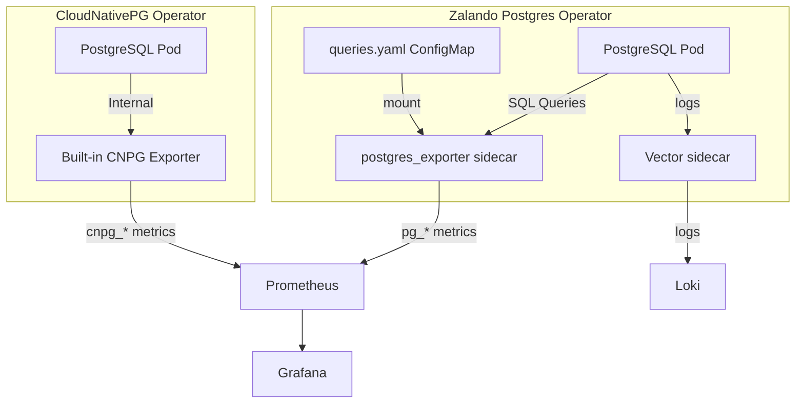
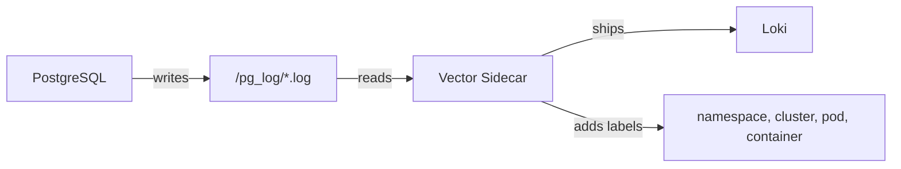
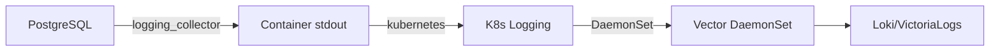

# PostgreSQL Monitoring Audit Research

> **Date:** 2026-01-28  
> **Scope:** 5 clusters, 2 operators, 2 monitoring/logging methods

---

## Table of Contents

1. [Cluster Inventory](#cluster-inventory)
2. [Operators Comparison](#operators-comparison)
3. [Monitoring Architecture](#monitoring-architecture)
4. [Metric Source Analysis](#metric-source-analysis)
5. [Logging Architecture](#logging-architecture)
6. [pg_stat_statements Analysis](#pg_stat_statements-analysis)
7. [Grafana Dashboard Deep Dive](#grafana-dashboard-deep-dive)
8. [Issues & Gaps](#issues--gaps)
9. [Recommendations](#recommendations)

---

## Cluster Inventory

### Version Verification

| Cluster | Namespace | Operator | Documented | Actual | pg_stat_statements |
|---------|-----------|----------|------------|--------|-------------------|
| supporting-db | user | Zalando | PG 16 | **PG 16.4** ✅ | v1.10 ✅ |
| auth-db | auth | Zalando | PG 17 | **PG 16.4** ⚠️ | v1.10 ✅ |
| review-db | review | Zalando | PG 16 | **PG 16.4** ✅ | v1.10 ✅ |
| product-db | product | CloudNativePG | PG 18 | **PG 18.1** ✅ | ❌ NOT INSTALLED |
| transaction-db | cart | CloudNativePG | PG 18 | **PG 18.1** ✅ | ❌ NOT INSTALLED |

### Verification Commands Used

```bash
# Zalando clusters
kubectl exec -n user supporting-db-0 -c postgres -- psql -U postgres -c "SELECT version();"
kubectl exec -n auth auth-db-0 -c postgres -- psql -U postgres -c "SELECT version();"
kubectl exec -n review review-db-0 -c postgres -- psql -U postgres -c "SELECT version();"

# CloudNativePG clusters
kubectl exec -n product product-db-1 -- psql -U postgres -c "SELECT version();"
kubectl exec -n cart transaction-db-1 -- psql -U postgres -c "SELECT version();"
```

---

## Operators Comparison

### Zalando Postgres Operator

**Version:** v1.15.1  
**Clusters:** supporting-db, auth-db, review-db

| Feature | Implementation |
|---------|---------------|
| **Sidecar Containers** | postgres_exporter, vector, pgbouncer |
| **Metrics** | Custom `queries.yaml` ConfigMap |
| **Logging** | Vector sidecar → Loki |
| **Extensions** | `pg_stat_statements`, `pg_cron`, `pg_trgm`, `pgcrypto`, `pg_stat_kcache` |

**Configuration Files:**
- [instance.yaml](file:///home/duydo/Working/duy/Github/monitoring/kubernetes/infra/configs/databases/clusters/supporting-db/instance.yaml)
- [monitoring-queries.yaml](file:///home/duydo/Working/duy/Github/monitoring/kubernetes/infra/configs/databases/clusters/supporting-db/configmaps/monitoring-queries.yaml)
- [vector-sidecar.yaml](file:///home/duydo/Working/duy/Github/monitoring/kubernetes/infra/configs/databases/clusters/supporting-db/configmaps/vector-sidecar.yaml)

---

### CloudNativePG Operator

**Version:** v1.28.0  
**Clusters:** product-db, transaction-db

| Feature | Implementation |
|---------|---------------|
| **Sidecar Containers** | Built-in exporter only |
| **Metrics** | Automatic `cnpg_*` metrics |
| **Logging** | `logging_collector` → stdout |
| **Extensions** | `shared_preload_libraries` is **empty** |

**Configuration Files:**
- [product-db/instance.yaml](file:///home/duydo/Working/duy/Github/monitoring/kubernetes/infra/configs/databases/clusters/product-db/instance.yaml)
- [transaction-db/instance.yaml](file:///home/duydo/Working/duy/Github/monitoring/kubernetes/infra/configs/databases/clusters/transaction-db/instance.yaml)
- [podmonitor.yaml](file:///home/duydo/Working/duy/Github/monitoring/kubernetes/infra/configs/databases/clusters/product-db/monitoring/podmonitor-cloudnativepg-product-db.yaml)

---

## Monitoring Architecture

### Architecture Diagram



---

## Metric Source Analysis

### Zalando Clusters (postgres_exporter)

**Exporter Version:** `postgres_exporter v0.18.1`  
**Config Method:** Custom `queries.yaml` (deprecated format)

| Metric Name | Type | Description |
|-------------|------|-------------|
| `pg_stat_statements_calls` | counter | Number of query executions |
| `pg_stat_statements_time_milliseconds` | counter | Total execution time |
| `pg_stat_statements_rows` | counter | Rows returned/affected |
| `pg_stat_statements_shared_blks_*` | counter | Shared buffer I/O |
| `pg_stat_statements_local_blks_*` | counter | Local buffer I/O |
| `pg_stat_statements_temp_blks_*` | counter | Temp table I/O |
| `pg_replication_lag` | gauge | Replication lag in seconds |
| `pg_replication_is_replica` | gauge | 1 if replica, 0 if primary |
| `pg_postmaster_start_time_seconds` | gauge | Postmaster start time |
| `pg_static{short_version}` | info | PostgreSQL version |
| `pg_settings_max_connections` | gauge | Max connections setting |
| `pg_stat_database_*` | counter | Database-level statistics |

---

### CloudNativePG Clusters (Built-in Exporter)

**Exporter:** Integrated into CloudNativePG operator  
**Config Method:** Automatic (no custom queries)

| Metric Name | Type | Description |
|-------------|------|-------------|
| `cnpg_collector_up` | gauge | PostgreSQL is running |
| `cnpg_collector_postgres_version` | info | PG version info |
| `cnpg_backends_total` | gauge | Backend connections by state |
| `cnpg_backends_waiting_total` | gauge | Waiting backends count |
| `cnpg_backends_max_tx_duration_seconds` | gauge | Longest transaction |
| `cnpg_pg_database_size_bytes` | gauge | Database size |
| `cnpg_pg_database_xid_age` | gauge | Transaction ID age |
| `cnpg_pg_database_mxid_age` | gauge | Multixact ID age |
| `cnpg_collector_pg_wal{value}` | gauge | WAL segment stats |
| `cnpg_collector_pg_wal_archive_status` | gauge | Archive status |
| `cnpg_pg_postmaster_start_time` | gauge | Start timestamp |
| `cnpg_pg_replication_in_recovery` | gauge | Recovery mode status |
| `cnpg_collector_sync_replicas` | gauge | Sync replica counts |
| `cnpg_collector_wal_records` | counter | WAL records generated |
| `cnpg_collector_wal_bytes` | counter | WAL bytes generated |

> [!IMPORTANT]
> **No `pg_stat_statements` metrics available in CloudNativePG!**  
> The CNPG exporter does NOT expose query-level statistics by default.

---

### CNPG vs postgres_exporter Coverage Matrix

```
┌───────────────────────────────┬──────────────┬──────────────┐
│ Capability                    │ Zalando      │ CloudNativePG│
├───────────────────────────────┼──────────────┼──────────────┤
│ Query performance metrics     │ ✅ Full      │ ❌ None      │
│ Top N slowest queries         │ ✅ Yes       │ ❌ No        │
│ Query call count over time    │ ✅ Yes       │ ❌ No        │
│ Buffer hit ratio per query    │ ✅ Yes       │ ❌ No        │
│ Temp table usage per query    │ ✅ Yes       │ ❌ No        │
├───────────────────────────────┼──────────────┼──────────────┤
│ Connection stats              │ ✅ Yes       │ ✅ Yes       │
│ Database size                 │ ✅ Yes       │ ✅ Yes       │
│ WAL statistics                │ ✅ Basic     │ ✅ Detailed  │
│ Replication lag (seconds)     │ ✅ Yes       │ ⚠️ Status only│
│ Archive status                │ ❌ No        │ ✅ Yes       │
│ Transaction ID age            │ ✅ Yes       │ ✅ Yes       │
├───────────────────────────────┼──────────────┼──────────────┤
│ Custom query support          │ ✅ queries.  │ ❌ Not       │
│                               │    yaml      │    supported │
│ Configuration method          │ ConfigMap    │ Automatic    │
│ Maintenance burden            │ Medium       │ Low          │
└───────────────────────────────┴──────────────┴──────────────┘
```

---

## Logging Architecture

### Zalando: Vector Sidecar → Loki



**Config:** [vector-sidecar.yaml](file:///home/duydo/Working/duy/Github/monitoring/kubernetes/infra/configs/databases/clusters/supporting-db/configmaps/vector-sidecar.yaml)

---

### CloudNativePG: logging_collector → stdout



---

## pg_stat_statements Analysis

### Extension Version Mapping

| PostgreSQL | pg_stat_statements | New Columns |
|------------|-------------------|-------------|
| 16 | v1.10 | baseline |
| 17 | v1.11 | `stats_since`, `minmax_stats_since` |
| 18 | v1.12 | (same as 1.11) |

### Current queries.yaml Columns Used

All columns used in [monitoring-queries.yaml](file:///home/duydo/Working/duy/Github/monitoring/kubernetes/infra/configs/databases/clusters/supporting-db/configmaps/monitoring-queries.yaml) exist in **all versions**:

| Column | PG 16 | PG 17 | PG 18 | Used in queries.yaml |
|--------|-------|-------|-------|---------------------|
| userid, dbid, queryid, query | ✅ | ✅ | ✅ | ✅ |
| calls | ✅ | ✅ | ✅ | ✅ |
| total_exec_time | ✅ | ✅ | ✅ | ✅ |
| rows | ✅ | ✅ | ✅ | ✅ |
| shared_blks_hit/read/dirtied/written | ✅ | ✅ | ✅ | ✅ |
| local_blks_* | ✅ | ✅ | ✅ | ✅ |
| temp_blks_* | ✅ | ✅ | ✅ | ✅ |
| blk_read_time, blk_write_time | ✅ | ✅ | ✅ | ✅ |
| stats_since | ❌ | ✅ | ✅ | ❌ Not used |

**Result:** ✅ No breaking changes. Current monitoring queries are version-compatible.

### Why CloudNativePG Lacks pg_stat_statements

```yaml
# Current: product-db/instance.yaml
postgresql:
  parameters: {}  # Empty! No shared_preload_libraries set

# Required for pg_stat_statements:
postgresql:
  parameters:
    shared_preload_libraries: "pg_stat_statements"
    pg_stat_statements.max: "10000"
    pg_stat_statements.track: "all"
```

---

## Grafana Dashboard Deep Dive

### Dashboard Inventory

| Dashboard File | Purpose | Metric Prefix | Zalando | CNPG |
|----------------|---------|---------------|---------|------|
| `pg-monitoring.json` | General PostgreSQL health | `pg_*` | ✅ | ❌ |
| `pg-query-overview.json` | Query statistics overview | `pg_stat_statements_*` | ✅ | ❌ |
| `pg-query-drilldown.json` | Single query deep dive | `pg_stat_statements_*` | ✅ | ❌ |
| `postgres-replication-lag.json` | Replication lag | `pg_replication_lag` | ✅ | ❌ |
| CloudNativePG (Helm) | CloudNativePG metrics | `cnpg_*` | ❌ | ✅ |
| `pgbouncer.json` | PgBouncer pooler metrics | `pgbouncer_*` | ✅ | — |
| `pgcat.json` | PgCat pooler metrics | `pgcat_*` | — | ✅ |

---

### What Can Be Monitored Currently

#### ✅ Zalando Clusters (supporting-db, auth-db, review-db)

| Category | Status | Dashboards |
|----------|--------|------------|
| **Query Performance** | ✅ Full | pg-query-overview, pg-query-drilldown |
| **Replication Lag** | ✅ Full | postgres-replication-lag |
| **Connection Stats** | ✅ Full | pg-monitoring |
| **Buffer/Cache Stats** | ✅ Full | pg-query-overview |
| **Database Size** | ✅ Full | pg-monitoring |
| **CPU/Memory** | ✅ Full | pg-monitoring |
| **Version Info** | ✅ Full | pg-monitoring |

#### ⚠️ CloudNativePG Clusters (product-db, transaction-db)

| Category | Status | Dashboard |
|----------|--------|-----------|
| **Connection Stats** | ✅ Full | cloudnative-pg (Helm) |
| **Database Size** | ✅ Full | cloudnative-pg (Helm) |
| **WAL Stats** | ✅ Full | cloudnative-pg (Helm) |
| **Replication Status** | ✅ Basic | cloudnative-pg (Helm) |
| **Version Info** | ✅ Full | cloudnative-pg (Helm) |
| **Query Performance** | ❌ **None** | — |
| **Buffer Stats** | ❌ **None** | — |

---

### Dashboard Query Analysis

#### pg-query-overview.json

| Panel | PromQL Query | Works for CNPG? |
|-------|--------------|-----------------|
| Statements Calls | `rate(pg_stat_statements_calls{...})` | ❌ No |
| Most Called Queries | `topk(50, rate(pg_stat_statements_calls{...}))` | ❌ No |
| Total Duration | `rate(pg_stat_statements_time_milliseconds{...})` | ❌ No |
| Average Runtime | `rate(pg_stat_statements_time_milliseconds) / rate(pg_stat_statements_calls)` | ❌ No |
| Shared Blocks Read/Written | `rate(pg_stat_statements_shared_blks_*)` | ❌ No |

#### pg-monitoring.json

| Panel | PromQL Query | Works for CNPG? |
|-------|--------------|-----------------|
| Version | `pg_static{...}` | ❌ No (use `cnpg_collector_postgres_version`) |
| Start Time | `pg_postmaster_start_time_seconds` | ❌ No (use `cnpg_pg_postmaster_start_time`) |
| Current fetch data | `pg_stat_database_tup_fetched` | ❌ No |
| Max Connections | `pg_settings_max_connections` | ❌ No |
| CPU Usage | `process_cpu_seconds_total` | ⚠️ May work |
| Memory Usage | `process_resident_memory_bytes` | ⚠️ May work |

#### postgres-replication-lag.json

| Panel | PromQL Query | Works for CNPG? |
|-------|--------------|-----------------|
| Replication Lag | `pg_replication_lag{source=...,kubernetes_pod_name=...}` | ❌ No |

---

## Issues & Gaps

### 🔴 Critical

| Issue | Impact | Clusters Affected |
|-------|--------|-------------------|
| No pg_stat_statements on CNPG | Cannot monitor query performance | product-db, transaction-db |
| Dashboard incompatibility | Empty panels for CNPG | All CNPG |

### 🟡 Moderate

| Issue | Impact | Clusters Affected |
|-------|--------|-------------------|
| Documentation wrong for auth-db | Confusion, incorrect planning | auth-db |
| queries.yaml deprecated | Future maintenance burden | All Zalando |
| Metric naming mismatch | Cannot use same PromQL | All clusters |

### 🟢 Minor

| Issue | Impact |
|-------|--------|
| CNPG dashboard from Helm (not version-controlled) | External dependency |
| PgDog dashboard JSON missing | Dashboard not available |
| No replication lag seconds for CNPG | Only status available |

---

## Recommendations

### Priority 1: Enable pg_stat_statements on CloudNativePG

**Add to instance.yaml:**
```yaml
postgresql:
  parameters:
    shared_preload_libraries: "pg_stat_statements"
    pg_stat_statements.max: "10000"
    pg_stat_statements.track: "all"
    pg_stat_statements.track_utility: "on"
```

**Create extension:**
```sql
CREATE EXTENSION IF NOT EXISTS pg_stat_statements;
```

> [!CAUTION]
> Requires pod restart. Schedule during maintenance window.

---

### Priority 2: Add postgres_exporter Sidecar to CNPG

For dashboard reuse, add postgres_exporter sidecar with same queries.yaml:

```yaml
spec:
  monitoring:
    enablePodMonitor: true
    customQueriesConfigMap:
      - name: postgres-monitoring-queries
        key: queries.yaml
```

---

### Priority 3: Dashboard Unification Options

| Option | Pros | Cons |
|--------|------|------|
| Separate dashboards | Simple | Duplicate maintenance |
| Variable prefix `${metric}` | Single dashboard | Refactoring needed |
| Union queries | Works for both | Complex PromQL |

**Recommended approach after enabling pg_stat_statements on CNPG:**
- Use variable prefix approach for unified dashboards
- Example: `${metric_prefix}backends_total`

---

### Priority 4: Fix Documentation

Update DATABASE.md:
```diff
- auth-db: PostgreSQL 17
+ auth-db: PostgreSQL 16
```

---

### Priority 5: Migrate postgres_exporter Config

Plan migration from deprecated `queries.yaml` to collector-based config in future postgres_exporter upgrade.

---

## Summary Matrix

| Capability | Zalando | CloudNativePG | Action |
|------------|---------|---------------|--------|
| Query analytics | ✅ | ❌ | Enable pg_stat_statements |
| Replication lag | ✅ | ⚠️ status only | Add custom query |
| Connection stats | ✅ | ✅ | None |
| Log collection | ✅ Vector | ✅ DaemonSet | None |
| Dashboard support | ✅ | ⚠️ Helm only | Add sidecar or unify |
| Metric prefix | `pg_*` | `cnpg_*` | Consider unification |

---

## Action Items Checklist

### 🔴 Critical - Must Fix

- [ ] **Enable pg_stat_statements on product-db**
  - File: `clusters/product-db/instance.yaml`
  - Add:
    ```yaml
    postgresql:
      parameters:
        shared_preload_libraries: "pg_stat_statements"
        pg_stat_statements.max: "10000"
        pg_stat_statements.track: "all"
    ```
  - Run: `kubectl apply -f clusters/product-db/instance.yaml`
  - Then: `kubectl exec -n product product-db-1 -- psql -U postgres -c "CREATE EXTENSION IF NOT EXISTS pg_stat_statements;"`

- [ ] **Enable pg_stat_statements on transaction-db**
  - File: `clusters/transaction-db/instance.yaml`
  - Add same parameters as above
  - Run: `kubectl apply -f clusters/transaction-db/instance.yaml`
  - Then: `kubectl exec -n cart transaction-db-1 -- psql -U postgres -c "CREATE EXTENSION IF NOT EXISTS pg_stat_statements;"`

### 🟡 Moderate - Should Fix

- [ ] **Investigate auth-db version mismatch**
  - Config says: PostgreSQL 17
  - Running: PostgreSQL 16.4 (verified via `SELECT version()`)
  - Action: Either upgrade the cluster or update config to match reality
  - Check: `kubectl exec -n auth auth-db-0 -c postgres -- psql -U postgres -c "SELECT version();"`

- [ ] **Add postgres_exporter sidecar to CNPG clusters** (for dashboard reuse)
  - Files to create:
    - `clusters/product-db/configmaps/monitoring-queries.yaml` (copy from supporting-db)
    - `clusters/transaction-db/configmaps/monitoring-queries.yaml`
  - Files to modify:
    - `clusters/product-db/instance.yaml` - add sidecar config
    - `clusters/transaction-db/instance.yaml` - add sidecar config

- [ ] **Create PgDog Grafana dashboard**
  - Missing: `dashboards/pgdog.json`
  - Reference exists: `grafana-dashboard-pgdog.yaml`
  - Action: Create dashboard JSON for PgDog metrics

### 🟢 Low Priority - Nice to Have

- [ ] **Migrate postgres_exporter from queries.yaml to collector config**
  - Files: All `monitoring-queries.yaml` ConfigMaps
  - Reason: `queries.yaml` format is deprecated
  - Reference: [postgres_exporter collectors](https://github.com/prometheus-community/postgres_exporter#collectors)

- [ ] **Version-control CloudNativePG dashboard**
  - Currently: Uses Helm-managed ConfigMap `cnpg-grafana-dashboard`
  - Action: Export and add to `dashboards/cloudnative-pg.json`

- [ ] **Add replication lag query for CNPG**
  - Current: Only has `cnpg_pg_replication_in_recovery` (boolean)
  - Missing: Lag in seconds like Zalando's `pg_replication_lag`
  - Action: Add custom query or use `pg_stat_replication`

---

## Files to Modify

| File | Change |
|------|--------|
| `clusters/product-db/instance.yaml` | Add `shared_preload_libraries` |
| `clusters/transaction-db/instance.yaml` | Add `shared_preload_libraries` |
| `clusters/auth-db/instance.yaml` | Verify/fix version mismatch |
| `dashboards/pgdog.json` | Create new dashboard |

## Commands to Run After Changes

```bash
# Apply CNPG changes (will trigger rolling restart)
kubectl apply -f clusters/product-db/instance.yaml
kubectl apply -f clusters/transaction-db/instance.yaml

# Create extensions after pods are ready
kubectl exec -n product product-db-1 -- psql -U postgres -c "CREATE EXTENSION IF NOT EXISTS pg_stat_statements;"
kubectl exec -n cart transaction-db-1 -- psql -U postgres -c "CREATE EXTENSION IF NOT EXISTS pg_stat_statements;"

# Verify pg_stat_statements is working
kubectl exec -n product product-db-1 -- psql -U postgres -c "SELECT * FROM pg_stat_statements LIMIT 1;"
kubectl exec -n cart transaction-db-1 -- psql -U postgres -c "SELECT * FROM pg_stat_statements LIMIT 1;"
```
