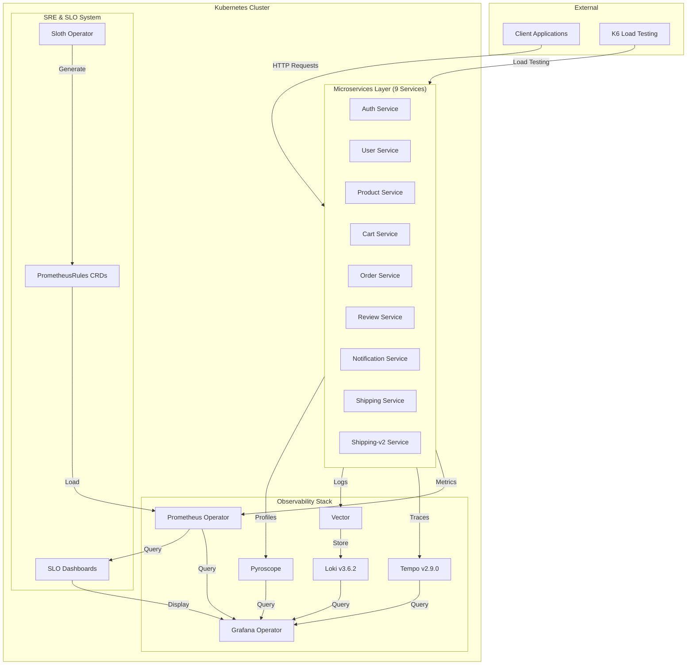
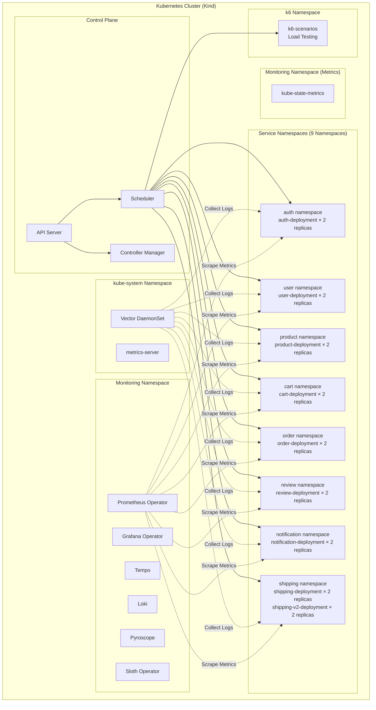
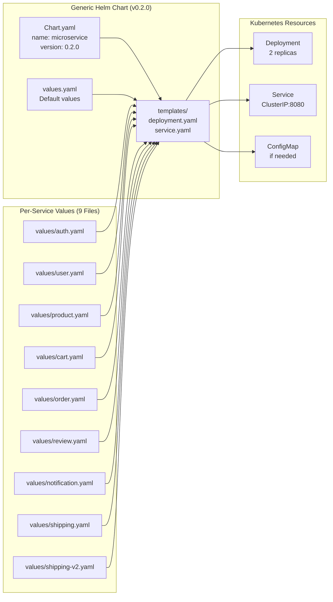
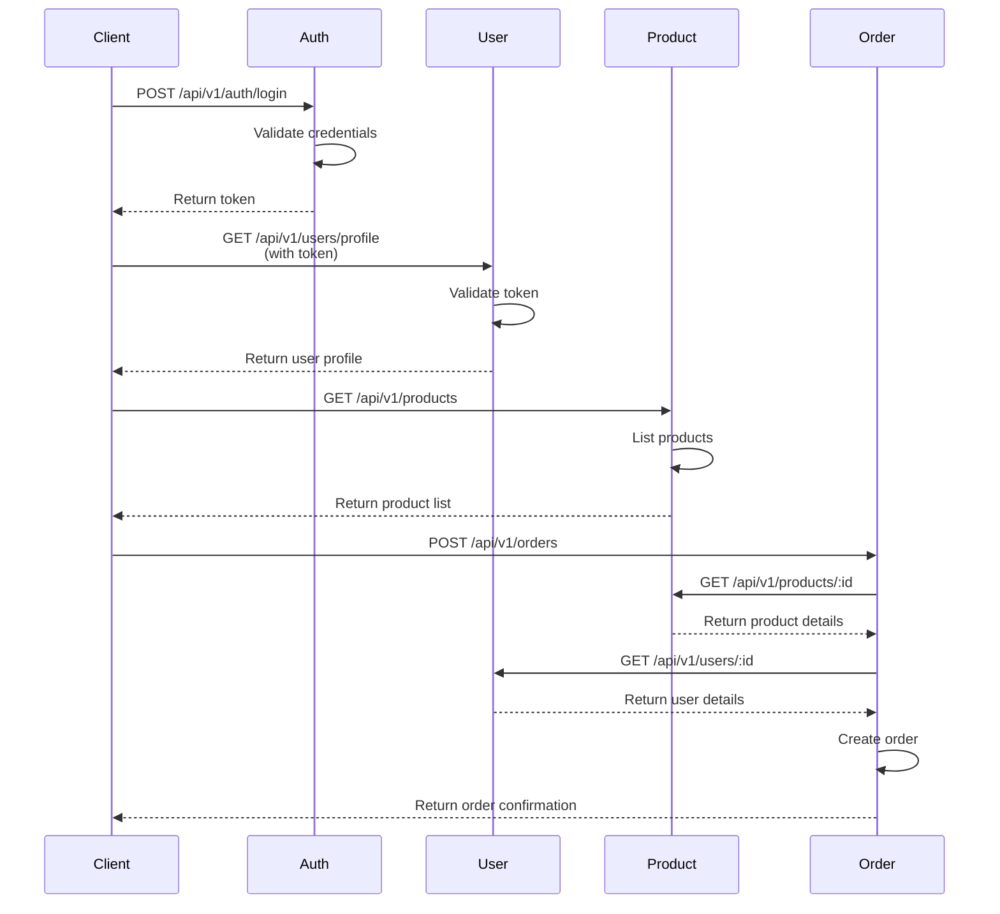

# 01. Architecture Overview

> **Purpose**: High-level system architecture, deployment patterns, and component organization.

---

## Table of Contents

- [System Architecture](#system-architecture)
- [Deployment Architecture](#deployment-architecture)
- [Component Organization](#component-organization)
- [Namespace Structure](#namespace-structure)
- [Network Architecture](#network-architecture)
- [Key Architectural Decisions](#key-architectural-decisions)

---

## System Architecture

### High-Level Architecture Diagram



### Component Layers

**Layer 1: Application Layer (9 Microservices)**
- Domain: E-commerce platform
- Pattern: RESTful APIs with versioning (v1, v2)
- Architecture: 3-layer (Web → Logic → Core)
- Communication: HTTP/JSON

**Layer 2: Observability Layer (6 Components)**
- **Metrics**: Prometheus Operator + Grafana + kube-state-metrics + metrics-server
- **Tracing**: Tempo with OpenTelemetry
- **Logging**: Loki + Vector
- **Profiling**: Pyroscope
- **Visualization**: Grafana (unified UI)
- **Discovery**: ServiceMonitor (automatic)

**Layer 3: SRE Layer (3 Components)**
- **SLO Management**: Sloth Operator
- **Rule Generation**: PrometheusServiceLevel CRDs
- **Error Budget Tracking**: Prometheus + Grafana dashboards

**Layer 4: Infrastructure Layer**
- **Orchestration**: Kubernetes (Kind for local)
- **Deployment**: Helm 3 with generic chart
- **Automation**: 12 numbered deployment scripts
- **CI/CD**: GitHub Actions

---

## Deployment Architecture

### Kubernetes Deployment Pattern



### Helm Chart Deployment Pattern



**Key Features:**
- **Generic Chart**: One chart for all 9 microservices
- **Value Overrides**: Per-service configuration (image, env, resources)
- **extraEnv Pattern**: Flexible environment variable injection
- **Tracing Config**: Built-in Tempo endpoint configuration
- **Health Checks**: Automatic liveness/readiness probes

---

## Component Organization

### Directory Structure

```
monitoring/
├── services/              # Go application code
│   ├── cmd/               # 9 microservice entry points
│   ├── internal/          # Domain logic (3-layer architecture)
│   ├── pkg/middleware/    # Shared observability middleware
│   ├── Dockerfile         # Unified Dockerfile for all services
│   ├── go.mod             # Go dependencies
│   └── go.sum
├── charts/                # Helm chart for microservices
│   ├── Chart.yaml         # Chart metadata (v0.2.0)
│   ├── values.yaml        # Default values
│   ├── values/            # Per-service overrides (9 files)
│   └── templates/         # Kubernetes templates
├── k8s/                   # Kubernetes manifests for infrastructure
│   ├── prometheus/        # Prometheus Operator config
│   ├── grafana-operator/  # Grafana Operator resources
│   ├── sloth/             # Sloth Operator + SLO CRDs
│   ├── postgres-operator/  # PostgreSQL operators and poolers
│   │   ├── cloudnativepg/ # CloudNativePG operator (CRDs, values)
│   │   ├── zalando/       # Zalando operator (CRDs, values)
│   │   └── pgcat/         # PgCat connection poolers
│   ├── tempo/             # Tempo deployment
│   ├── loki/              # Loki deployment
│   ├── pyroscope/         # Pyroscope deployment
│   ├── vector/            # Vector DaemonSet
│   └── kind/              # Kind cluster config
├── scripts/               # Deployment automation (01-12)
│   ├── 01-create-kind-cluster.sh
│   ├── 03-deploy-monitoring.sh
│   ├── 04-deploy-apm.sh
│   ├── 05-build-microservices.sh
│   ├── 06-deploy-microservices.sh
│   ├── 07-deploy-k6.sh
│   ├── 08-deploy-slo.sh
│   ├── 09-setup-access.sh
│   ├── 10-reload-dashboard.sh
│   ├── 11-diagnose-latency.sh
│   └── 12-error-budget-alert.sh
├── services/
│   ├── k6/                # Load testing
│   │   ├── Dockerfile
│   │   └── load-test-multiple-scenarios.js
├── docs/                  # Documentation
└── specs/                 # System context (this document)
```

### Service Code Organization (3-Layer Architecture)

```
services/
├── cmd/
│   └── auth/              # Service entry point
│       └── main.go        # HTTP server, middleware setup
├── internal/
│   └── auth/              # Auth service domain
│       ├── web/           # HTTP handlers (Layer 1)
│       │   ├── v1/        # v1 API handlers
│       │   │   └── handler.go
│       │   └── v2/        # v2 API handlers
│       │       └── handler.go
│       ├── logic/         # Business logic (Layer 2)
│       │   ├── v1/        # v1 business logic
│       │   │   └── service.go
│       │   └── v2/        # v2 business logic
│       │       └── service.go
│       └── core/          # Domain models (Layer 3)
│           └── domain/
│               └── model.go
└── pkg/middleware/        # Shared middleware
    ├── tracing.go         # OpenTelemetry tracing
    ├── logging.go         # Zap structured logging
    ├── prometheus.go      # Prometheus metrics
    ├── profiling.go       # Pyroscope profiling
    └── resource.go        # Kubernetes service detection
```

---

## Namespace Structure

### Namespace Organization

| Namespace | Purpose | Components | Pods | Labels |
|-----------|---------|------------|------|--------|
| **default** | Kubernetes default | - | 0 | - |
| **kube-system** | System components | Vector DaemonSet, metrics-server | ~10 | `monitoring=enabled` |
| **monitoring** | Observability stack | Prometheus, Grafana, Tempo, Loki, Pyroscope, Sloth, kube-state-metrics | ~15 | `monitoring=enabled` |
| **auth** | Auth service | auth-deployment (2 replicas) | 2 | `monitoring=enabled`, `app=auth` |
| **user** | User service | user-deployment (2 replicas) | 2 | `monitoring=enabled`, `app=user` |
| **product** | Product service | product-deployment (2 replicas) | 2 | `monitoring=enabled`, `app=product` |
| **cart** | Cart service | cart-deployment (2 replicas) | 2 | `monitoring=enabled`, `app=cart` |
| **order** | Order service | order-deployment (2 replicas) | 2 | `monitoring=enabled`, `app=order` |
| **review** | Review service | review-deployment (2 replicas) | 2 | `monitoring=enabled`, `app=review` |
| **notification** | Notification service | notification-deployment (2 replicas) | 2 | `monitoring=enabled`, `app=notification` |
| **shipping** | Shipping services | shipping-deployment (2 replicas)<br/>shipping-v2-deployment (2 replicas) | 4 | `monitoring=enabled`, `app=shipping`, `app=shipping-v2` |
| **k6** | Load testing | k6-scenarios | 1 | - |

**Total Namespaces**: 13 (1 default + 1 kube-system + 1 monitoring + 9 services + 1 k6)
**Total Pods**: ~43 pods (9 services × 2 replicas + 4 shipping pods + monitoring stack ~15 + system ~10 + k6)

### Namespace Label Strategy

**Purpose of `monitoring=enabled` label:**
- ServiceMonitor selector for auto-discovery
- Prometheus scrapes all pods in labeled namespaces
- No need to manually add each service to Prometheus config
- Scales to 1000+ pods automatically

**How to add monitoring to new namespace:**
```bash
kubectl label namespace <namespace> monitoring=enabled
```

---

## Network Architecture

### Service-to-Service Communication



**Communication Pattern:**
- **Protocol**: HTTP/JSON (REST)
- **Service Discovery**: Kubernetes DNS (`<service>.<namespace>.svc.cluster.local`)
- **Port**: 8080 (all services)
- **Load Balancing**: Kubernetes Service (ClusterIP)

**Example Service URLs:**
```
http://auth.auth.svc.cluster.local:8080/api/v1/auth/login
http://user.user.svc.cluster.local:8080/api/v1/users/profile
http://product.product.svc.cluster.local:8080/api/v1/products
http://order.order.svc.cluster.local:8080/api/v1/orders
```

### Observability Data Flow

```mermaid
flowchart LR
    subgraph "Microservice Pod"
        App[Go Application]
        MetricsEndpoint[/metrics endpoint]
        LogsStdout[Logs to stdout]
        TracesExporter[OTLP Exporter]
        ProfilesExporter[Pyroscope SDK]
    end

    subgraph "Collection Layer"
        Vector[Vector DaemonSet]
        ServiceMonitor[ServiceMonitor CRD]
    end

    subgraph "Storage Layer"
        Prometheus[Prometheus]
        Tempo[Tempo]
        Loki[Loki]
        Pyroscope[Pyroscope Storage]
    end

    subgraph "Visualization Layer"
        Grafana[Grafana]
    end

    App --> MetricsEndpoint
    App --> LogsStdout
    App --> TracesExporter
    App --> ProfilesExporter

    MetricsEndpoint -->|HTTP Scrape| ServiceMonitor
    LogsStdout -->|Read container logs| Vector
    TracesExporter -->|OTLP HTTP| Tempo
    ProfilesExporter -->|HTTP Push| Pyroscope

    ServiceMonitor -->|Configure| Prometheus
    Vector -->|HTTP Push| Loki

    Prometheus -->|PromQL Query| Grafana
    Tempo -->|TraceQL Query| Grafana
    Loki -->|LogQL Query| Grafana
    Pyroscope -->|FlameGraph Query| Grafana
```

---

## Key Architectural Decisions

### Decision 1: Microservices Over Monolith

**Rationale:**
- **Scalability**: Each service scales independently based on load
- **Isolation**: Failures in one service don't cascade to others
- **Technology Flexibility**: Can use different tech stacks per service (though we standardized on Go)
- **Team Autonomy**: Different teams can own different services

**Trade-offs:**
- ✅ **Pros**: Better scalability, fault isolation, independent deployments
- ❌ **Cons**: More complex observability, distributed transactions, network overhead

### Decision 2: 3-Layer Architecture (Web → Logic → Core)

**Rationale:**
- **Separation of Concerns**: Clear boundaries between HTTP, business logic, and domain
- **Testability**: Each layer can be unit tested independently
- **Tracing**: Each layer creates its own span for detailed observability
- **Maintainability**: Easy to understand and modify

**Layer Responsibilities:**
- **Web**: HTTP request/response, validation, serialization
- **Logic**: Business rules, orchestration, external API calls
- **Core/Domain**: Data models, domain entities, no external dependencies

### Decision 3: Kubernetes-Native Operators

**Rationale:**
- **Declarative Configuration**: Define desired state, Operator maintains it
- **Self-Healing**: Operators automatically reconcile when state drifts
- **GitOps Ready**: All configs in Git, no manual kubectl commands
- **Best Practices**: Use battle-tested open-source Operators

**Operators Used:**
- **Prometheus Operator**: Metrics collection (kube-prometheus-stack v80.0.0)
- **Grafana Operator**: Dashboard management (v5.20.0)
- **Sloth Operator**: SLO rule generation (v0.15.0)

### Decision 4: Namespace Isolation Per Service

**Rationale:**
- **Security**: RBAC policies per namespace
- **Resource Quotas**: Prevent one service from consuming all resources
- **Network Policies**: Control traffic between services
- **Multi-Tenancy**: Simulate production multi-tenant environment

**Trade-offs:**
- ✅ **Pros**: Better security, resource isolation, blast radius containment
- ❌ **Cons**: More namespaces to manage, cross-namespace communication requires DNS

### Decision 5: API Versioning (v1 & v2)

**Rationale:**
- **Backward Compatibility**: v1 clients continue working when v2 is released
- **Gradual Migration**: Clients can migrate at their own pace
- **Testing**: Test v2 in production without breaking v1 clients
- **Deprecation**: Clear path to sunset old API versions

**Implementation:**
- v1 and v2 handlers coexist in same service
- Different URL paths: `/api/v1/*` vs `/api/v2/*`
- Separate logic and domain models per version

### Decision 6: Helm for Deployment

**Rationale:**
- **Templating**: One chart for all 9 microservices
- **Value Overrides**: Per-service configuration without code duplication
- **Release Management**: Easy rollback, history tracking
- **Package Distribution**: OCI registry for chart distribution

**Chart Strategy:**
- **Generic Chart**: `charts/Chart.yaml` (v0.2.0)
- **Per-Service Values**: `charts/values/*.yaml` (9 files)
- **extraEnv Pattern**: Flexible environment variable injection
- **Unified Deployment**: `./scripts/05-deploy-microservices.sh` deploys all services

### Decision 7: Observability-First Middleware

**Rationale:**
- **Built-In Observability**: Metrics, traces, logs, profiles from day one
- **No Code Changes**: Middleware automatically instruments all endpoints
- **Consistent Data**: All services emit same metrics format
- **Correlation**: trace-id links logs, traces, metrics, profiles

**Middleware Stack:**
1. **TracingMiddleware**: OpenTelemetry span creation
2. **LoggingMiddleware**: Structured logging with trace-id
3. **PrometheusMiddleware**: Request metrics collection
4. **ProfilingMiddleware**: Pyroscope profiling (initialized at startup)

### Decision 8: 10% Trace Sampling

**Rationale:**
- **Production Viability**: 100% sampling is too expensive at scale
- **Statistical Significance**: 10% is enough for detecting issues
- **Configurable**: Can increase to 100% for debugging (OTEL_SAMPLE_RATE=1.0)
- **Cost vs Insight**: Balance between observability and resource usage

**Sampling Strategy:**
- **Production**: 10% (1 in 10 requests traced)
- **Development**: 100% (all requests traced)
- **Override**: Set `OTEL_SAMPLE_RATE` env var per service

---

## Deployment Order

### Script Execution Sequence

**Phase 1: Infrastructure (Steps 1-2)**
```bash
./scripts/01-create-kind-cluster.sh      # Create Kind Kubernetes cluster
```

**Phase 2: Monitoring Stack (Step 3)**
```bash
./scripts/02-deploy-monitoring.sh        # Deploy Prometheus + Grafana Operators (BEFORE apps)
```

**Phase 3: APM Stack (Step 4)**
```bash
./scripts/03-deploy-apm.sh               # Deploy Tempo, Pyroscope, Loki, Vector (BEFORE apps)
```

**Phase 4: Build & Deploy Applications (Steps 5-6)**
```bash
./scripts/04-build-microservices.sh      # Build Docker images (9 services + k6)
./scripts/05-deploy-microservices.sh     # Deploy all 9 microservices via Helm
```

**Phase 5: Load Testing (Step 7)**
```bash
./scripts/06-deploy-k6.sh                # Deploy k6 load generators (AFTER apps)
```

**Phase 6: SLO System (Step 8)**
```bash
./scripts/07-deploy-slo.sh               # Deploy Sloth Operator + SLO CRDs
```

**Phase 7: Access Setup (Step 9)**
```bash
./scripts/08-setup-access.sh             # Setup port-forwarding for Grafana/Prometheus
```

**Important Notes:**
- **Monitoring BEFORE apps**: Ensures metrics are collected from the first request
- **APM BEFORE apps**: Ensures traces/logs/profiles are captured immediately
- **Load testing AFTER apps**: Need services running before testing them
- **Sequential execution**: Each phase depends on previous phases

---

## Resource Requirements

### Minimum Cluster Configuration

**For Local Development (Kind):**
- **CPU**: 8 cores minimum (12 cores recommended)
- **RAM**: 16GB minimum (32GB recommended)
- **Disk**: 50GB minimum (100GB recommended for long-term logs/traces)

**Breakdown:**
- **Microservices**: 9 services × 2 replicas × (100m CPU + 128Mi RAM) = ~2 CPU cores, 2.5GB RAM
- **Monitoring Stack**: Prometheus, Grafana = ~2 CPU cores, 4GB RAM
- **APM Stack**: Tempo, Loki, Pyroscope, Vector = ~2 CPU cores, 6GB RAM
- **Load Testing**: K6 = 2 CPU cores, 4GB RAM
- **Kubernetes System**: ~1 CPU core, 2GB RAM
- **Headroom**: 20-30% extra for spikes

### Production Cluster (Estimated)

**For Production Environment:**
- **CPU**: 24-32 cores
- **RAM**: 64-128GB
- **Disk**: 500GB-1TB SSD (for metrics, logs, traces retention)
- **High Availability**: 3 master nodes, 5+ worker nodes
- **Autoscaling**: Horizontal Pod Autoscaler (HPA) enabled
- **Persistent Storage**: Dynamic provisioning for Prometheus, Loki, Tempo

---

**Next**: Continue to [02. Microservices](02-microservices.md) →

