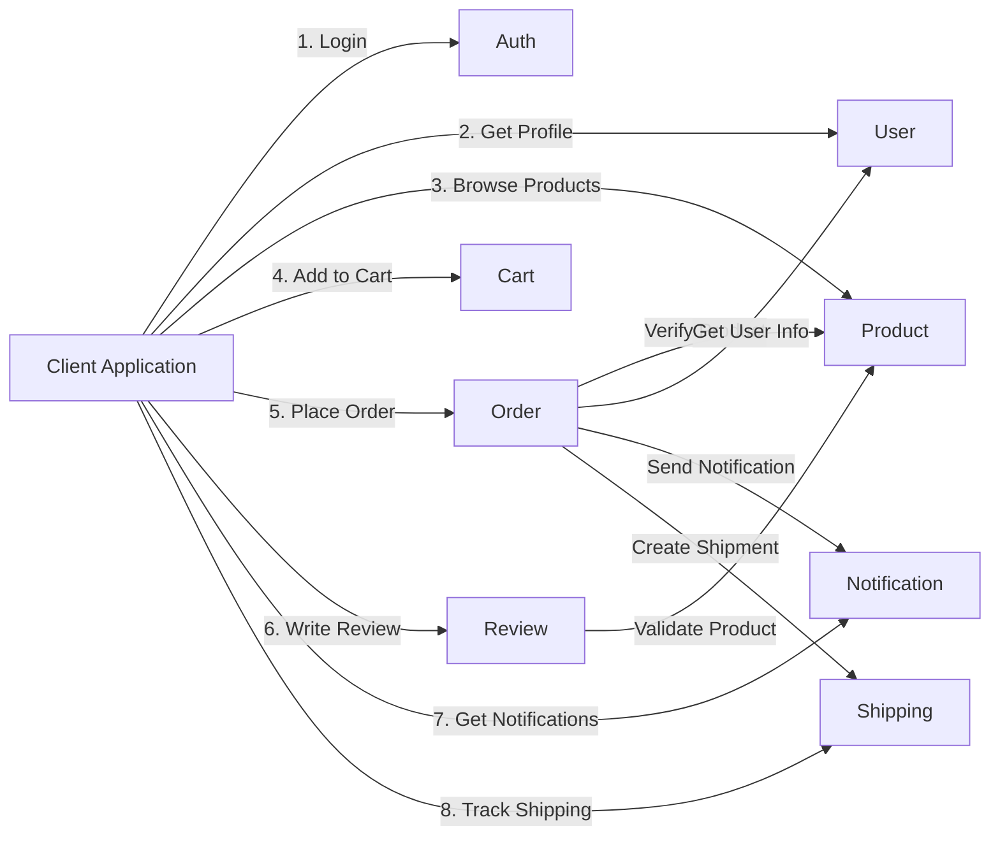
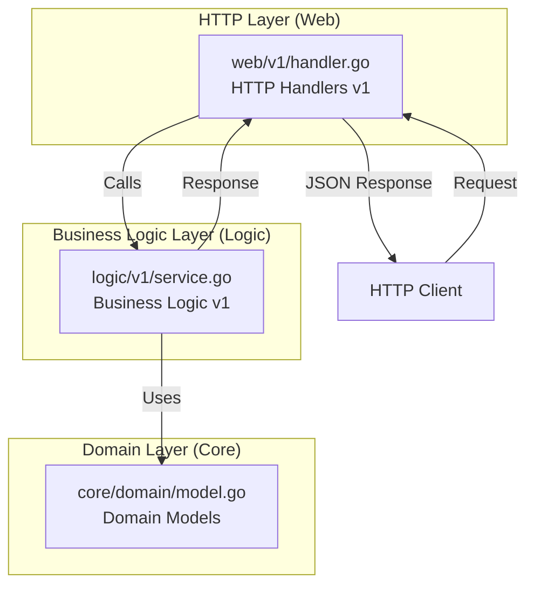
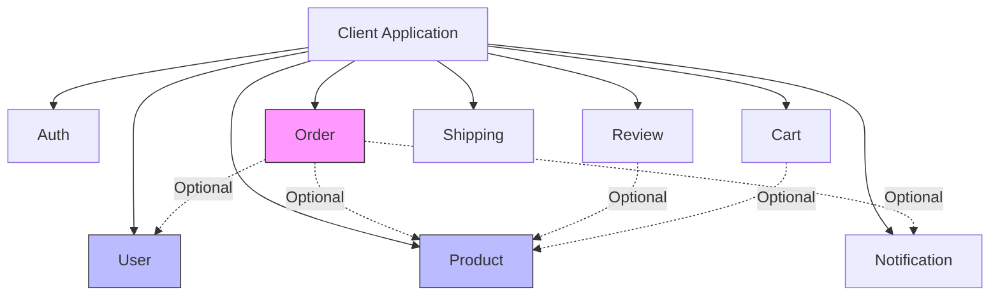

# 02. Microservices

> **Purpose**: Detailed documentation of all 8 microservices, API endpoints (v1 only), 3-layer architecture, and service responsibilities.

---

## Table of Contents

- [Service Catalog](#service-catalog)
- [3-Layer Architecture Pattern](#3-layer-architecture-pattern)
- [Service Details](#service-details)
- [API Versioning Strategy](#api-versioning-strategy)
- [Common Patterns](#common-patterns)

---

## Service Catalog

### Overview

| # | Service | Namespace | Replicas | API | Port | Responsibility |
|---|---------|-----------|----------|-----|------|----------------|
| 1 | **auth** | auth | 2 | v1 | 8080 | Authentication & registration |
| 2 | **user** | user | 2 | v1 | 8080 | User management & profiles |
| 3 | **product** | product | 2 | v1 | 8080 | Product catalog management |
| 4 | **cart** | cart | 2 | v1 | 8080 | Shopping cart operations |
| 5 | **order** | order | 2 | v1 | 8080 | Order processing & tracking |
| 6 | **review** | review | 2 | v1 | 8080 | Product reviews & ratings |
| 7 | **notification** | notification | 2 | v1 | 8080 | Notification delivery |
| 8 | **shipping** | shipping | 2 | v1 | 8080 | Shipping tracking & estimates |

**Total**: 8 services (v1 API only; shipping-v2 suspended)

### Service Communication Pattern



---

## 3-Layer Architecture Pattern

### Architecture Overview

All microservices follow a consistent 3-layer architecture:



### Layer Responsibilities

#### Layer 1: Web (HTTP Handlers)

**Location**: `services/{service}/internal/web/v1/handler.go`

**Responsibilities:**
- HTTP request/response handling
- Input validation and binding
- JSON serialization/deserialization
- HTTP status code selection
- Error response formatting
- Span creation with `layer=web` attribute

**Example**: Auth Service v1 Handler

```go
// services/auth/internal/web/v1/handler.go
package v1

import (
    "net/http"
    "github.com/gin-gonic/gin"
    "github.com/duynhne/monitoring/internal/auth/core/domain"
    logicv2 "github.com/duynhne/monitoring/internal/auth/logic/v2"
    "github.com/duynhne/monitoring/pkg/middleware"
    "go.opentelemetry.io/otel/attribute"
    "go.opentelemetry.io/otel/trace"
)

func Login(c *gin.Context) {
    // Create span for web layer
    ctx, span := middleware.StartSpan(c.Request.Context(), "http.request", 
        trace.WithAttributes(attribute.String("layer", "web")))
    defer span.End()

    // Parse request
    var req domain.LoginRequest
    if err := c.ShouldBindJSON(&req); err != nil {
        span.RecordError(err)
        c.JSON(http.StatusBadRequest, gin.H{"error": "Invalid request"})
        return
    }

    // Call business logic
    authService := logicv1.NewAuthService()
    token, err := authService.Login(ctx, req)
    if err != nil {
        span.RecordError(err)
        c.JSON(http.StatusUnauthorized, gin.H{"error": "Authentication failed"})
        return
    }

    c.JSON(http.StatusOK, gin.H{"token": token})
}
```

#### Layer 2: Logic (Business Logic)

**Location**: `services/{service}/internal/logic/v1/service.go`

**Responsibilities:**
- Business rule enforcement
- Service orchestration
- External API calls
- Data transformation
- Span creation with `layer=logic` attribute

**Example**: Auth Service v1 Logic

```go
// services/auth/internal/logic/v1/service.go
package v1

import (
    "context"
    "github.com/duynhne/monitoring/services/auth/internal/core/domain"
    "github.com/duynhne/monitoring/services/auth/middleware"
    "go.opentelemetry.io/otel/attribute"
    "go.opentelemetry.io/otel/trace"
)

type AuthService struct{}

func NewAuthService() *AuthService {
    return &AuthService{}
}

func (s *AuthService) Login(ctx context.Context, req domain.LoginRequest) (string, error) {
    // Create span for logic layer
    ctx, span := middleware.StartSpan(ctx, "auth.login", 
        trace.WithAttributes(
            attribute.String("layer", "logic"),
            attribute.String("username", req.Username),
        ))
    defer span.End()

    // Business logic: Validate credentials
    if req.Username == "" || req.Password == "" {
        return "", fmt.Errorf("username and password required")
    }

    // Simulate authentication (in real app, check database)
    token := "jwt-token-" + req.Username
    span.SetAttributes(attribute.Bool("auth.success", true))
    
    return token, nil
}
```

#### Layer 3: Core/Domain (Data Models)

**Location**: `services/internal/{service}/core/domain/model.go`

**Responsibilities:**
- Domain entity definitions
- Data structures
- No business logic
- No external dependencies

**Example**: Auth Service Domain Models

```go
// services/internal/auth/core/domain/model.go
package domain

type LoginRequest struct {
    Username string `json:"username" binding:"required"`
    Password string `json:"password" binding:"required"`
}

type RegisterRequest struct {
    Username string `json:"username" binding:"required"`
    Password string `json:"password" binding:"required"`
    Email    string `json:"email" binding:"required,email"`
}

type AuthResponse struct {
    Token     string `json:"token"`
    ExpiresIn int    `json:"expires_in"`
}
```

### Tracing Through Layers


**Span Hierarchy:**
```
Trace: 2db2fe7dcd3c8cb8cb4647ea2b455a21
├─ Span 1: "POST /api/v1/auth/login" [middleware]
   ├─ Span 2: "http.request" [web, layer=web]
      ├─ Span 3: "auth.login" [logic, layer=logic]
```

---

## Service Details

### 1. Auth Service

**Purpose**: User authentication and registration

**Namespace**: `auth`
**Image**: `ghcr.io/duynhne/auth:v6`
**Replicas**: 2

#### API Endpoints

**v1 API (canonical):**
| Method | Endpoint | Description | Request Body | Response |
|--------|----------|-------------|--------------|----------|
| POST | `/api/v1/auth/login` | User login | `{username, password}` | `{token, user}` |
| POST | `/api/v1/auth/register` | User registration | `{username, email, password}` | `{id, username, email}` |
| GET | `/api/v1/auth/me` | Get current user from token | - | `{id, username, email}` |

#### Directory Structure

```
services/auth/
├── internal/
│   ├── web/v1/
│   │   └── handler.go      # HTTP handlers
│   ├── logic/v1/
│   │   └── service.go      # Business logic
│   └── core/
│       └── domain/         # Domain models
├── middleware/
└── cmd/main.go
```

---

### 2. User Service

**Purpose**: User profile management

**Namespace**: `user`
**Image**: `ghcr.io/duynhne/user:v6`
**Replicas**: 2

#### API Endpoints

**v1 API (canonical):**
| Method | Endpoint | Description | Response |
|--------|----------|-------------|----------|
| GET | `/api/v1/users/:id` | Get user by ID | `{id, name, email}` |
| GET | `/api/v1/users/profile` | Get current user profile | `{id, name, email, ...}` |
| PUT | `/api/v1/users/profile` | Update user profile | - |
| POST | `/api/v1/users` | Create user | `{id, name, email}` |

---

### 3. Product Service

**Purpose**: Product catalog management

**Namespace**: `product`
**Image**: `ghcr.io/duynhne/product:v6`
**Replicas**: 2

#### API Endpoints

**v1 API (canonical):**
| Method | Endpoint | Description | Response |
|--------|----------|-------------|----------|
| GET | `/api/v1/products` | List all products | `[{id, name, price, description, category}]` |
| GET | `/api/v1/products/:id` | Get product by ID | `{id, name, price, description, category}` |
| GET | `/api/v1/products/:id/details` | Aggregated product details | `{product, stock, reviews, related_products}` |
| POST | `/api/v1/products` | Create product | `{id, name, price, ...}` |

---

### 4. Cart Service

**Purpose**: Shopping cart management

**Namespace**: `cart`
**Image**: `ghcr.io/duynhne/cart:v6`
**Replicas**: 2

#### API Endpoints

**v1 API (canonical):**
| Method | Endpoint | Description | Request Body | Response |
|--------|----------|-------------|--------------|----------|
| GET | `/api/v1/cart` | Get cart contents | - | `{id, user_id, items, subtotal, total, item_count}` |
| GET | `/api/v1/cart/count` | Get cart item count | - | `{count}` |
| POST | `/api/v1/cart` | Add item to cart | `{product_id, product_name, product_price, quantity}` | `{message}` |
| PATCH | `/api/v1/cart/items/:itemId` | Update item quantity | `{quantity}` | `{success, cart_total, cart_count}` |
| DELETE | `/api/v1/cart/items/:itemId` | Remove item | - | `{success, cart_total, cart_count}` |

---

### 5. Order Service

**Purpose**: Order processing and tracking

**Namespace**: `order`
**Image**: `ghcr.io/duynhne/order:v6`
**Replicas**: 2

#### API Endpoints

**v1 API (canonical):**
| Method | Endpoint | Description | Request Body | Response |
|--------|----------|-------------|--------------|----------|
| GET | `/api/v1/orders` | List user orders | - | `[{id, status, items, total, ...}]` |
| GET | `/api/v1/orders/:id` | Get order details | - | `{id, status, items, total, ...}` |
| GET | `/api/v1/orders/:id/details` | Aggregated order + shipment | - | `{order, shipment}` |
| POST | `/api/v1/orders` | Create order | `{user_id, items: [{product_id, quantity, price}]}` | `{id, status, total, ...}` |

---

### 6. Review Service

**Purpose**: Product reviews and ratings

**Namespace**: `review`
**Image**: `ghcr.io/duynhne/review:v6`
**Replicas**: 2

#### API Endpoints

**v1 API (canonical):**
| Method | Endpoint | Description | Request Body | Response |
|--------|----------|-------------|--------------|----------|
| GET | `/api/v1/reviews?product_id={id}` | List reviews for product | - | `[{id, product_id, user_id, rating, title, comment, ...}]` |
| POST | `/api/v1/reviews` | Create review | `{product_id, user_id, rating, title, comment}` | `{id, product_id, user_id, rating, ...}` |

---

### 7. Notification Service

**Purpose**: Notification delivery

**Namespace**: `notification`
**Image**: `ghcr.io/duynhne/notification:v6`
**Replicas**: 2

#### API Endpoints

**v1 API (canonical):**
| Method | Endpoint | Description | Request Body | Response |
|--------|----------|-------------|--------------|----------|
| GET | `/api/v1/notifications` | List notifications | - | `[{id, type, title, message, status, read, ...}]` |
| GET | `/api/v1/notifications/:id` | Get notification by ID | - | `{id, type, title, message, ...}` |
| PATCH | `/api/v1/notifications/:id` | Mark as read | - | - |
| POST | `/api/v1/notify/email` | Send email (internal) | `{recipient, subject, body}` | - |
| POST | `/api/v1/notify/sms` | Send SMS (internal) | `{recipient, message}` | - |

---

### 8. Shipping Service

**Purpose**: Shipping tracking and estimates

**Namespace**: `shipping`
**Image**: `ghcr.io/duynhne/shipping:v6`
**Replicas**: 2

#### API Endpoints

**v1 API (canonical):**
| Method | Endpoint | Description | Request Body | Response |
|--------|----------|-------------|--------------|----------|
| GET | `/api/v1/shipping/track` | Track shipment | Query: `tracking_number` | Shipment status |
| GET | `/api/v1/shipping/estimate` | Estimate shipping cost | Query: `origin`, `destination`, `weight` | Estimate |
| GET | `/api/v1/shipping/orders/:orderId` | Get shipment by order ID | - | Shipment details |

**Note**: shipping-v2 service is suspended; v1 is the canonical API.

---

## API Versioning Strategy

### v1 Only (Canonical API)

- **URL Pattern**: `/api/v1/{resource}`
- **Frontend-aligned**: The React frontend uses v1 exclusively
- **Standardized**: Single API surface; v2 was removed (was demo-only)
- **Future**: A new v2 will be introduced only when there are breaking changes or genuinely new semantics

---

## Common Patterns

### 1. Request Validation

**All services use Gin's binding validation:**

```go
type CreateProductRequest struct {
    Name        string  `json:"name" binding:"required"`
    Price       float64 `json:"price" binding:"required,min=0"`
    Description string  `json:"description"`
    Category    string  `json:"category"`
}

func CreateProduct(c *gin.Context) {
    var req CreateProductRequest
    if err := c.ShouldBindJSON(&req); err != nil {
        c.JSON(http.StatusBadRequest, gin.H{"error": err.Error()})
        return
    }
    // Process request...
}
```

### 2. Error Handling

**Consistent error response format:**

```go
// Bad Request (400)
c.JSON(http.StatusBadRequest, gin.H{"error": "Invalid request"})

// Unauthorized (401)
c.JSON(http.StatusUnauthorized, gin.H{"error": "Authentication failed"})

// Internal Server Error (500)
c.JSON(http.StatusInternalServerError, gin.H{"error": "Internal server error"})
```

### 3. Logging with Trace-ID

**All services use structured logging:**

```go
zapLogger := middleware.GetLoggerFromGinContext(c)
zapLogger.Info("Processing request", 
    zap.String("userId", userId),
    zap.String("productId", productId),
)
```

### 4. Span Creation

**All layers create spans for tracing:**

```go
ctx, span := middleware.StartSpan(ctx, "operation.name", 
    trace.WithAttributes(
        attribute.String("layer", "web"), // or "logic"
        attribute.String("layer", "web"), // or "logic"
        attribute.String("entity.id", id),
    ))
defer span.End()
```

### 5. Health Checks

**All services expose health endpoint:**

```go
r.GET("/health", func(c *gin.Context) {
    c.JSON(200, gin.H{"status": "ok"})
})
```

**Used by:**
- Kubernetes liveness probe
- Kubernetes readiness probe
- Load balancer health checks

### 6. Metrics Endpoint

**All services expose Prometheus metrics:**

```go
r.GET("/metrics", gin.WrapH(promhttp.Handler()))
```

**Metrics collected:**
- `request_duration_seconds` (histogram)
- `requests_total` (counter)
- `requests_in_flight` (gauge)
- Go runtime metrics (heap, goroutines, GC)

---

## Service Dependencies

### Dependency Graph



**Legend:**
- Solid arrows: Client-to-service (direct calls)
- Dashed arrows: Service-to-service (optional dependencies)

**Note**: In this demo, services are mostly independent. In production, Order service would call Product/User/Notification services via HTTP.

---

## Testing Each Service

### Manual Testing with curl

**Auth Service:**
```bash
# Login
curl -X POST http://localhost:8080/api/v1/auth/login \
  -H "Content-Type: application/json" \
  -d '{"username":"admin","password":"admin"}'
```

**Product Service:**
```bash
# List products
curl http://localhost:8080/api/v1/products
```

**Order Service:**
```bash
# Create order (requires Authorization: Bearer <token>)
curl -X POST http://localhost:8080/api/v1/orders \
  -H "Content-Type: application/json" \
  -H "Authorization: Bearer <token>" \
  -d '{"user_id":"1","items":[{"product_id":"1","quantity":2,"price":29.99}]}'
```

### Load Testing with K6

**See**: [K6 Load Testing Documentation](../../docs/testing/k6.md)

K6 automatically tests all services with 8 journey types:
1. E-commerce Shopping Journey (8 services)
2. Product Review Journey (5 services)
3. Order Tracking Journey (6 services)
4. Quick Browse Journey (4 services)
5. API Monitoring Journey (7 services)
6. Timeout/Retry Journey (edge case)
7. Concurrent Operations Journey (edge case)
8. Error Handling Journey (edge case)

---

**Next**: Continue to [03. Observability Stack](03-observability-stack.md) →

