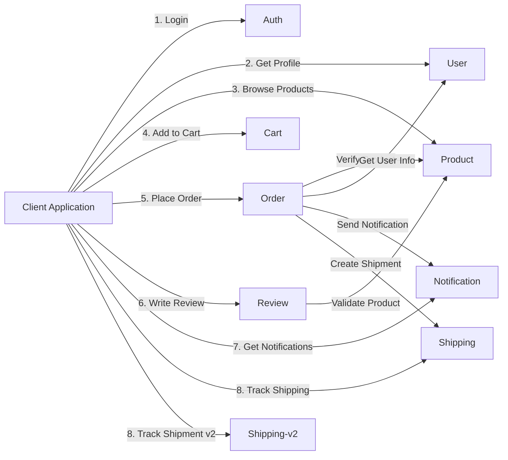
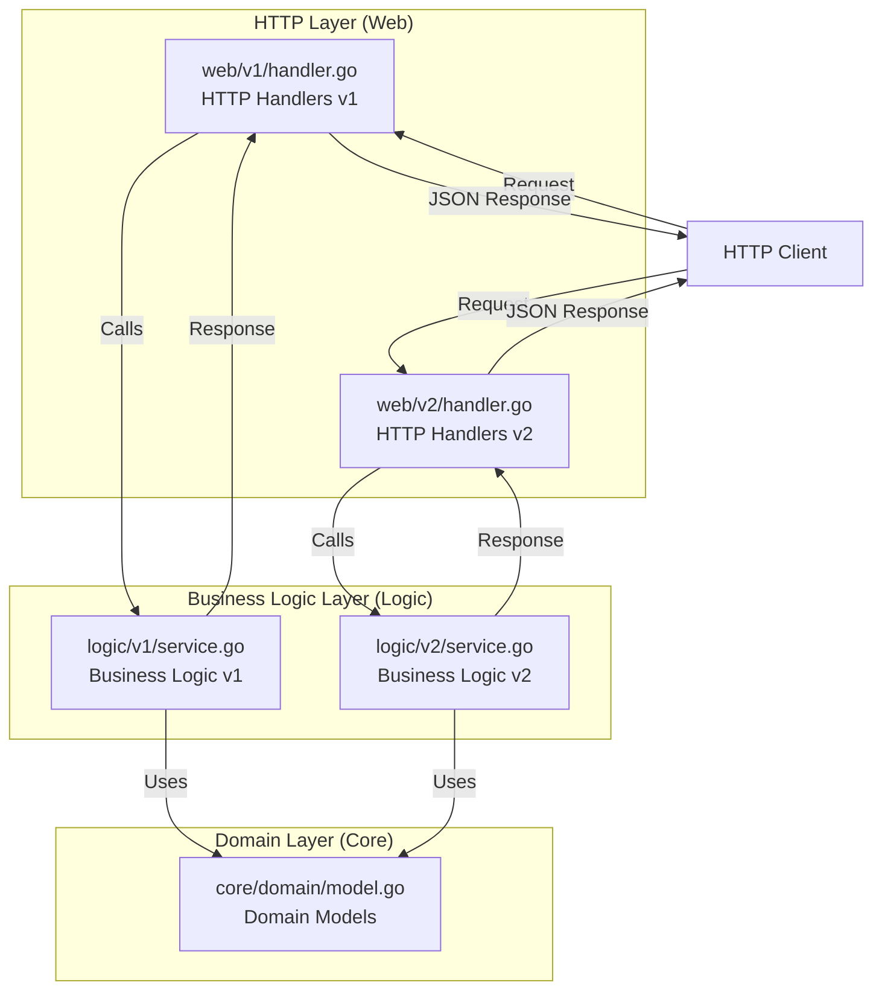
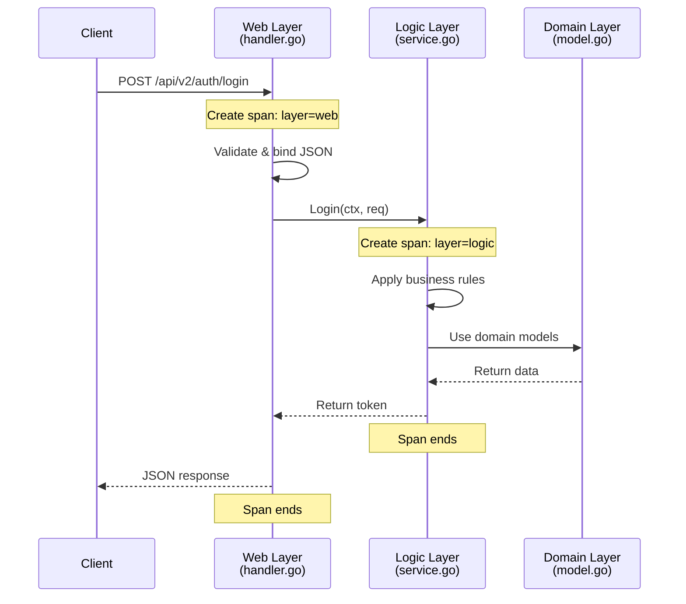
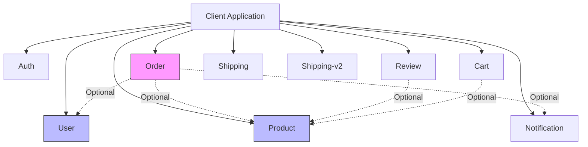

# 02. Microservices

> **Purpose**: Detailed documentation of all 9 microservices, API endpoints, 3-layer architecture, and service responsibilities.

---

## Table of Contents

- [Service Catalog](#service-catalog)
- [3-Layer Architecture Pattern](#3-layer-architecture-pattern)
- [Service Details](#service-details)
- [API Versioning Strategy](#api-versioning-strategy)
- [Common Patterns](#common-patterns)

---

## Service Catalog

### Overview

| # | Service | Namespace | Replicas | API Versions | Port | Responsibility |
|---|---------|-----------|----------|--------------|------|----------------|
| 1 | **auth** | auth | 2 | v1, v2 | 8080 | Authentication & registration |
| 2 | **user** | user | 2 | v1, v2 | 8080 | User management & profiles |
| 3 | **product** | product | 2 | v1, v2 | 8080 | Product catalog management |
| 4 | **cart** | cart | 2 | v1, v2 | 8080 | Shopping cart operations |
| 5 | **order** | order | 2 | v1, v2 | 8080 | Order processing & tracking |
| 6 | **review** | review | 2 | v1, v2 | 8080 | Product reviews & ratings |
| 7 | **notification** | notification | 2 | v1, v2 | 8080 | Notification delivery |
| 8 | **shipping** | shipping | 2 | v1 only | 8080 | Shipping tracking (legacy) |
| 9 | **shipping-v2** | shipping | 2 | v2 only | 8080 | Enhanced shipping API |

**Total**: 9 services, 18 pods (2 replicas each)

### Service Communication Pattern



---

## 3-Layer Architecture Pattern

### Architecture Overview

All microservices follow a consistent 3-layer architecture:



### Layer Responsibilities

#### Layer 1: Web (HTTP Handlers)

**Location**: `services/internal/{service}/web/v{1,2}/handler.go`

**Responsibilities:**
- HTTP request/response handling
- Input validation and binding
- JSON serialization/deserialization
- HTTP status code selection
- Error response formatting
- Span creation with `layer=web` attribute

**Example**: Auth Service v2 Handler

```go
// services/internal/auth/web/v2/handler.go
package v2

import (
    "net/http"
    "github.com/gin-gonic/gin"
    "github.com/duynhne/monitoring/internal/auth/core/domain"
    logicv2 "github.com/duynhne/monitoring/internal/auth/logic/v2"
    "github.com/duynhne/monitoring/pkg/middleware"
    "go.opentelemetry.io/otel/attribute"
    "go.opentelemetry.io/otel/trace"
)

func Login(c *gin.Context) {
    // Create span for web layer
    ctx, span := middleware.StartSpan(c.Request.Context(), "http.request", 
        trace.WithAttributes(
            attribute.String("layer", "web"),
            attribute.String("api.version", "v2"),
        ))
    defer span.End()

    // Parse request
    var req domain.LoginRequest
    if err := c.ShouldBindJSON(&req); err != nil {
        span.RecordError(err)
        c.JSON(http.StatusBadRequest, gin.H{"error": "Invalid request"})
        return
    }

    // Call business logic
    authService := logicv2.NewAuthService()
    token, err := authService.Login(ctx, req)
    if err != nil {
        span.RecordError(err)
        c.JSON(http.StatusUnauthorized, gin.H{"error": "Authentication failed"})
        return
    }

    c.JSON(http.StatusOK, gin.H{"token": token})
}
```

#### Layer 2: Logic (Business Logic)

**Location**: `services/internal/{service}/logic/v{1,2}/service.go`

**Responsibilities:**
- Business rule enforcement
- Service orchestration
- External API calls
- Data transformation
- Span creation with `layer=logic` attribute

**Example**: Auth Service v2 Logic

```go
// services/internal/auth/logic/v2/service.go
package v2

import (
    "context"
    "github.com/duynhne/monitoring/internal/auth/core/domain"
    "github.com/duynhne/monitoring/pkg/middleware"
    "go.opentelemetry.io/otel/attribute"
    "go.opentelemetry.io/otel/trace"
)

type AuthService struct{}

func NewAuthService() *AuthService {
    return &AuthService{}
}

func (s *AuthService) Login(ctx context.Context, req domain.LoginRequest) (string, error) {
    // Create span for logic layer
    ctx, span := middleware.StartSpan(ctx, "auth.login", 
        trace.WithAttributes(
            attribute.String("layer", "logic"),
            attribute.String("api.version", "v2"),
            attribute.String("username", req.Username),
        ))
    defer span.End()

    // Business logic: Validate credentials
    if req.Username == "" || req.Password == "" {
        return "", fmt.Errorf("username and password required")
    }

    // Simulate authentication (in real app, check database)
    token := "jwt-token-" + req.Username
    span.SetAttributes(attribute.Bool("auth.success", true))
    
    return token, nil
}
```

#### Layer 3: Core/Domain (Data Models)

**Location**: `services/internal/{service}/core/domain/model.go`

**Responsibilities:**
- Domain entity definitions
- Data structures
- No business logic
- No external dependencies

**Example**: Auth Service Domain Models

```go
// services/internal/auth/core/domain/model.go
package domain

type LoginRequest struct {
    Username string `json:"username" binding:"required"`
    Password string `json:"password" binding:"required"`
}

type RegisterRequest struct {
    Username string `json:"username" binding:"required"`
    Password string `json:"password" binding:"required"`
    Email    string `json:"email" binding:"required,email"`
}

type AuthResponse struct {
    Token     string `json:"token"`
    ExpiresIn int    `json:"expires_in"`
}
```

### Tracing Through Layers



**Span Hierarchy:**
```
Trace: 2db2fe7dcd3c8cb8cb4647ea2b455a21
├─ Span 1: "POST /api/v2/auth/login" [middleware]
   ├─ Span 2: "http.request" [web, layer=web, api.version=v2]
      ├─ Span 3: "auth.login" [logic, layer=logic, api.version=v2]
```

---

## Service Details

### 1. Auth Service

**Purpose**: User authentication and registration

**Namespace**: `auth`
**Image**: `ghcr.io/duynhne/auth:v6`
**Replicas**: 2

#### API Endpoints

**v1 API:**
| Method | Endpoint | Description | Request Body | Response |
|--------|----------|-------------|--------------|----------|
| POST | `/api/v1/auth/login` | User login | `{username, password}` | `{token}` |
| POST | `/api/v1/auth/register` | User registration | `{username, password}` | `{message}` |

**v2 API:**
| Method | Endpoint | Description | Request Body | Response |
|--------|----------|-------------|--------------|----------|
| POST | `/api/v2/auth/login` | Enhanced login | `{username, password, deviceId}` | `{token, expiresIn}` |
| POST | `/api/v2/auth/register` | Enhanced registration | `{username, password, email}` | `{userId, token}` |

#### Directory Structure

```
services/internal/auth/
├── web/
│   ├── v1/
│   │   └── handler.go      # v1 HTTP handlers
│   └── v2/
│       └── handler.go      # v2 HTTP handlers
├── logic/
│   ├── v1/
│   │   └── service.go      # v1 business logic
│   └── v2/
│       └── service.go      # v2 business logic
└── core/
    └── domain/
        └── model.go        # Domain models
```

---

### 2. User Service

**Purpose**: User profile management

**Namespace**: `user`
**Image**: `ghcr.io/duynhne/user:v6`
**Replicas**: 2

#### API Endpoints

**v1 API:**
| Method | Endpoint | Description | Response |
|--------|----------|-------------|----------|
| GET | `/api/v1/users/:id` | Get user by ID | `{id, name, email}` |
| GET | `/api/v1/users/profile` | Get current user profile | `{id, name, email, createdAt}` |
| POST | `/api/v1/users` | Create user | `{name, email}` |

**v2 API:**
| Method | Endpoint | Description | Response |
|--------|----------|-------------|----------|
| GET | `/api/v2/users/:id` | Get user by ID (enhanced) | `{id, name, email, avatar, bio}` |
| GET | `/api/v2/users/profile` | Get profile (enhanced) | `{id, name, email, avatar, bio, preferences}` |
| POST | `/api/v2/users` | Create user (enhanced) | `{userId, name, email, avatar}` |

---

### 3. Product Service

**Purpose**: Product catalog management

**Namespace**: `product`
**Image**: `ghcr.io/duynhne/product:v6`
**Replicas**: 2

#### API Endpoints

**v1 API:**
| Method | Endpoint | Description | Response |
|--------|----------|-------------|----------|
| GET | `/api/v1/products` | List all products | `[{id, name, price, description}]` |
| GET | `/api/v1/products/:id` | Get product by ID | `{id, name, price, description, category}` |
| POST | `/api/v1/products` | Create product | `{id, name, price}` |

**v2 API (Catalog):**
| Method | Endpoint | Description | Response |
|--------|----------|-------------|----------|
| GET | `/api/v2/catalog/items` | List catalog items | `[{itemId, name, price, sku, category}]` |
| GET | `/api/v2/catalog/items/:itemId` | Get catalog item | `{itemId, name, price, sku, description}` |
| POST | `/api/v2/catalog/items` | Create catalog item | `{itemId, name, price, sku}` |

**Note**: v2 uses "catalog" namespace and "item" terminology instead of "product"

---

### 4. Cart Service

**Purpose**: Shopping cart management

**Namespace**: `cart`
**Image**: `ghcr.io/duynhne/cart:v6`
**Replicas**: 2

#### API Endpoints

**v1 API:**
| Method | Endpoint | Description | Request Body | Response |
|--------|----------|-------------|--------------|----------|
| GET | `/api/v1/cart` | Get cart contents | - | `{items: [{productId, quantity}], total}` |
| POST | `/api/v1/cart/add` | Add item to cart | `{productId, quantity}` | `{message}` |
| POST | `/api/v1/cart/remove` | Remove item | `{productId}` | `{message}` |

**v2 API:**
| Method | Endpoint | Description | Request Body | Response |
|--------|----------|-------------|--------------|----------|
| GET | `/api/v2/carts/:cartId` | Get cart by ID | - | `{cartId, items, total, updatedAt}` |
| POST | `/api/v2/carts/:cartId/items` | Add item | `{itemId, quantity}` | `{cartId, items}` |
| DELETE | `/api/v2/carts/:cartId/items/:itemId` | Remove item | - | `{cartId, items}` |

---

### 5. Order Service

**Purpose**: Order processing and tracking

**Namespace**: `order`
**Image**: `ghcr.io/duynhne/order:v6`
**Replicas**: 2

#### API Endpoints

**v1 API:**
| Method | Endpoint | Description | Request Body | Response |
|--------|----------|-------------|--------------|----------|
| GET | `/api/v1/orders` | List user orders | - | `[{id, status, items, total}]` |
| GET | `/api/v1/orders/:id` | Get order details | - | `{id, status, items, total, createdAt}` |
| POST | `/api/v1/orders` | Create order | `{items: [{productId, quantity}]}` | `{id, status, total}` |

**v2 API:**
| Method | Endpoint | Description | Request Body | Response |
|--------|----------|-------------|--------------|----------|
| GET | `/api/v2/orders` | List orders (paginated) | - | `{orders: [], page, totalPages}` |
| GET | `/api/v2/orders/:orderId/status` | Get order status | - | `{orderId, status, tracking}` |
| POST | `/api/v2/orders` | Create order (enhanced) | `{items, shippingAddress}` | `{orderId, status, estimatedDelivery}` |

---

### 6. Review Service

**Purpose**: Product reviews and ratings

**Namespace**: `review`
**Image**: `ghcr.io/duynhne/review:v6`
**Replicas**: 2

#### API Endpoints

**v1 API:**
| Method | Endpoint | Description | Request Body | Response |
|--------|----------|-------------|--------------|----------|
| GET | `/api/v1/reviews` | List all reviews | - | `[{productId, rating, comment}]` |
| POST | `/api/v1/reviews` | Create review | `{productId, rating, comment}` | `{message}` |

**v2 API:**
| Method | Endpoint | Description | Request Body | Response |
|--------|----------|-------------|--------------|----------|
| GET | `/api/v2/reviews/:reviewId` | Get review by ID | - | `{reviewId, productId, rating, comment, createdAt}` |
| POST | `/api/v2/reviews` | Create review (enhanced) | `{productId, rating, comment, verified}` | `{reviewId, productId, rating}` |

---

### 7. Notification Service

**Purpose**: Notification delivery

**Namespace**: `notification`
**Image**: `ghcr.io/duynhne/notification:v6`
**Replicas**: 2

#### API Endpoints

**v1 API:**
| Method | Endpoint | Description | Request Body | Response |
|--------|----------|-------------|--------------|----------|
| GET | `/api/v1/notify` | Get notifications | - | `[{message, type, timestamp}]` |
| POST | `/api/v1/notify/send` | Send notification | `{userId, message}` | `{message}` |

**v2 API:**
| Method | Endpoint | Description | Request Body | Response |
|--------|----------|-------------|--------------|----------|
| GET | `/api/v2/notifications` | List notifications | - | `{notifications: [], unreadCount}` |
| POST | `/api/v2/notifications` | Send notification (enhanced) | `{userId, message, type, priority}` | `{notificationId, status}` |

---

### 8. Shipping Service (v1 Only)

**Purpose**: Legacy shipping tracking

**Namespace**: `shipping`
**Image**: `ghcr.io/duynhne/shipping:v6`
**Replicas**: 2

#### API Endpoints

**v1 API Only:**
| Method | Endpoint | Description | Request Body | Response |
|--------|----------|-------------|--------------|----------|
| GET | `/api/v1/shipping/:id` | Get shipment status | - | `{id, status, location}` |
| POST | `/api/v1/shipping/track` | Track shipment | `{trackingNumber}` | `{status, location, estimatedDelivery}` |

**Note**: No v2 API - see shipping-v2 service for enhanced version

---

### 9. Shipping-v2 Service (v2 Only)

**Purpose**: Enhanced shipping with estimates

**Namespace**: `shipping` (same as shipping v1)
**Image**: `ghcr.io/duynhne/shipping-v2:v6`
**Replicas**: 2

#### API Endpoints

**v2 API Only:**
| Method | Endpoint | Description | Request Body | Response |
|--------|----------|-------------|--------------|----------|
| POST | `/api/v2/shipments/estimate` | Estimate shipping cost | `{origin, destination, weight}` | `{cost, days, carrier}` |
| GET | `/api/v2/shipments/:shipmentId/tracking` | Track shipment (enhanced) | - | `{shipmentId, status, history, eta}` |

**Note**: No v1 API - this is a new service separate from shipping v1

---

## API Versioning Strategy

### Why v1 and v2 Coexist

**Benefits:**
- **Backward Compatibility**: Existing clients continue working
- **Gradual Migration**: Clients migrate at their own pace
- **A/B Testing**: Test v2 in production without breaking v1
- **Deprecation Path**: Clear timeline for sunsetting old versions

### Version Differences

| Aspect | v1 | v2 |
|--------|----|----|
| **URL Pattern** | `/api/v1/{resource}` | `/api/v2/{resource}` |
| **Response Format** | Basic fields | Enhanced fields with metadata |
| **Pagination** | No pagination | Paginated responses |
| **Error Handling** | Simple error messages | Structured error responses |
| **Validation** | Basic validation | Enhanced validation with field errors |
| **Product Terminology** | "products" | "catalog/items" |

### Migration Example

**v1 Product Response:**
```json
{
  "id": "1",
  "name": "Product 1",
  "price": 100,
  "description": "Description 1"
}
```

**v2 Catalog Item Response:**
```json
{
  "itemId": "item-1",
  "name": "Product 1",
  "price": 100,
  "description": "Description 1",
  "sku": "SKU-001",
  "category": "Electronics",
  "createdAt": "2025-01-01T00:00:00Z",
  "updatedAt": "2025-01-10T00:00:00Z"
}
```

---

## Common Patterns

### 1. Request Validation

**All services use Gin's binding validation:**

```go
type CreateProductRequest struct {
    Name        string  `json:"name" binding:"required"`
    Price       float64 `json:"price" binding:"required,min=0"`
    Description string  `json:"description"`
    Category    string  `json:"category"`
}

func CreateProduct(c *gin.Context) {
    var req CreateProductRequest
    if err := c.ShouldBindJSON(&req); err != nil {
        c.JSON(http.StatusBadRequest, gin.H{"error": err.Error()})
        return
    }
    // Process request...
}
```

### 2. Error Handling

**Consistent error response format:**

```go
// Bad Request (400)
c.JSON(http.StatusBadRequest, gin.H{"error": "Invalid request"})

// Unauthorized (401)
c.JSON(http.StatusUnauthorized, gin.H{"error": "Authentication failed"})

// Internal Server Error (500)
c.JSON(http.StatusInternalServerError, gin.H{"error": "Internal server error"})
```

### 3. Logging with Trace-ID

**All services use structured logging:**

```go
zapLogger := middleware.GetLoggerFromGinContext(c)
zapLogger.Info("Processing request", 
    zap.String("userId", userId),
    zap.String("productId", productId),
)
```

### 4. Span Creation

**All layers create spans for tracing:**

```go
ctx, span := middleware.StartSpan(ctx, "operation.name", 
    trace.WithAttributes(
        attribute.String("layer", "web"), // or "logic"
        attribute.String("api.version", "v2"),
        attribute.String("entity.id", id),
    ))
defer span.End()
```

### 5. Health Checks

**All services expose health endpoint:**

```go
r.GET("/health", func(c *gin.Context) {
    c.JSON(200, gin.H{"status": "ok"})
})
```

**Used by:**
- Kubernetes liveness probe
- Kubernetes readiness probe
- Load balancer health checks

### 6. Metrics Endpoint

**All services expose Prometheus metrics:**

```go
r.GET("/metrics", gin.WrapH(promhttp.Handler()))
```

**Metrics collected:**
- `request_duration_seconds` (histogram)
- `requests_total` (counter)
- `requests_in_flight` (gauge)
- Go runtime metrics (heap, goroutines, GC)

---

## Service Dependencies

### Dependency Graph



**Legend:**
- Solid arrows: Client-to-service (direct calls)
- Dashed arrows: Service-to-service (optional dependencies)

**Note**: In this demo, services are mostly independent. In production, Order service would call Product/User/Notification services via HTTP.

---

## Testing Each Service

### Manual Testing with curl

**Auth Service:**
```bash
# v1 Login
curl -X POST http://localhost:8080/api/v1/auth/login \
  -H "Content-Type: application/json" \
  -d '{"username":"admin","password":"admin"}'

# v2 Login
curl -X POST http://localhost:8080/api/v2/auth/login \
  -H "Content-Type: application/json" \
  -d '{"username":"admin","password":"admin"}'
```

**Product Service:**
```bash
# v1 List Products
curl http://localhost:8080/api/v1/products

# v2 List Catalog Items
curl http://localhost:8080/api/v2/catalog/items
```

**Order Service:**
```bash
# v1 Create Order
curl -X POST http://localhost:8080/api/v1/orders \
  -H "Content-Type: application/json" \
  -d '{"items":[{"productId":"1","quantity":2}]}'

# v2 Create Order
curl -X POST http://localhost:8080/api/v2/orders \
  -H "Content-Type: application/json" \
  -d '{"items":[{"itemId":"item-1","quantity":2}],"shippingAddress":"123 Main St"}'
```

### Load Testing with K6

**See**: [K6 Load Testing Documentation](../../docs/guides/K6.md)

K6 automatically tests all services with 8 journey types:
1. E-commerce Shopping Journey (9 services)
2. Product Review Journey (5 services)
3. Order Tracking Journey (6 services)
4. Quick Browse Journey (4 services)
5. API Monitoring Journey (7 services)
6. Timeout/Retry Journey (edge case)
7. Concurrent Operations Journey (edge case)
8. Error Handling Journey (edge case)

---

**Next**: Continue to [03. Observability Stack](03-observability-stack.md) →

