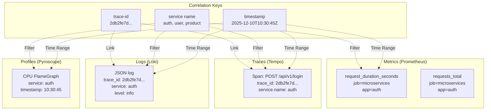
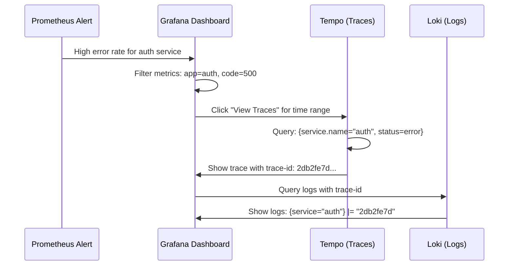
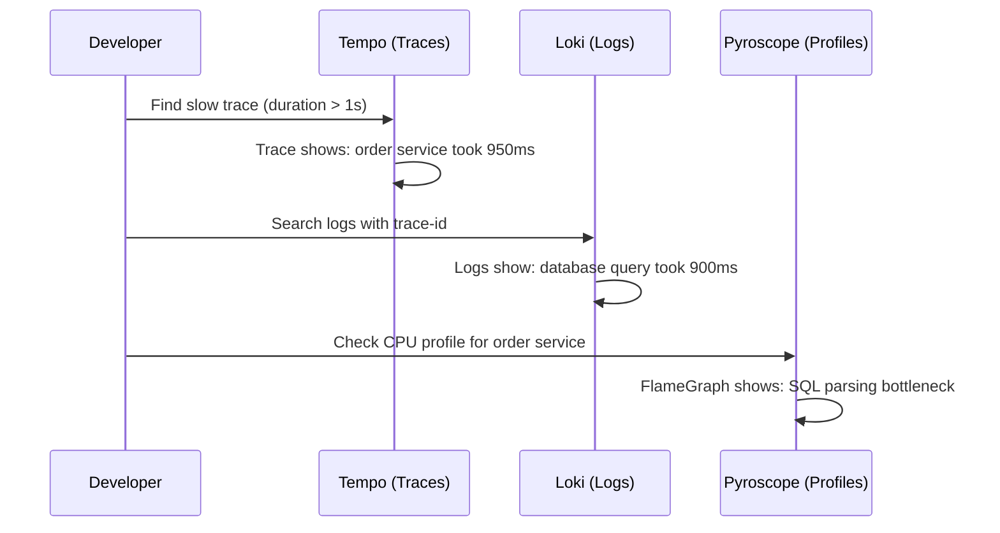

# 03. Observability Stack

> **Purpose**: Complete documentation of monitoring, tracing, logging, and profiling infrastructure.

---

## Table of Contents

- [Stack Overview](#stack-overview)
- [Metrics (Prometheus + Grafana)](#metrics-prometheus--grafana)
- [Distributed Tracing (Tempo)](#distributed-tracing-tempo)
- [Structured Logging (Loki + Vector)](#structured-logging-loki--vector)
- [Continuous Profiling (Pyroscope)](#continuous-profiling-pyroscope)
- [Data Correlation](#data-correlation)

---

## Stack Overview

### Components

| Component | Version | Purpose | Namespace | Port |
|-----------|---------|---------|-----------|------|
| **Prometheus Operator** | kube-prometheus-stack v80.0.0 | Metrics collection & alerting | monitoring | 9090 |
| **Grafana Operator** | v5.20.0 | Dashboard management | monitoring | 3000 |
| **Tempo** | v2.9.0 | Distributed tracing backend | monitoring | 3200, 4318 |
| **Loki** | v3.6.2 | Log aggregation & storage | monitoring | 3100 |
| **Vector** | latest | Log collection agent | kube-system | 9090 |
| **Pyroscope** | latest | Continuous profiling | monitoring | 4040 |

### Architecture Diagram

```mermaid
flowchart TB
    subgraph "Microservices (9 Services)"
        App[Go Applications]
        MetricsEP[/metrics endpoint]
        LogsStdout[stdout/stderr logs]
        OTELExporter[OTLP Traces]
        PyroscopeSDK[Pyroscope SDK]
    end

    subgraph "Collection Layer"
        ServiceMonitor[ServiceMonitor CRD]
        Vector[Vector DaemonSet]
    end

    subgraph "Storage Layer"
        Prometheus[Prometheus<br/>Timeseries DB]
        Tempo[Tempo<br/>Trace Storage]
        Loki[Loki<br/>Log Storage]
        Pyroscope[Pyroscope<br/>Profile Storage]
    end

    subgraph "Visualization Layer"
        Grafana[Grafana<br/>Unified UI]
        Dashboard1[Microservices Dashboard<br/>32 panels]
        Dashboard2[SLO Dashboards<br/>2 dashboards]
        Dashboard3[Tempo Dashboard<br/>8 panels]
        Dashboard4[Vector Dashboard]
    end

    App --> MetricsEP
    App --> LogsStdout
    App --> OTELExporter
    App --> PyroscopeSDK

    MetricsEP -->|HTTP Scrape :8080/metrics| ServiceMonitor
    LogsStdout -->|Read /var/log/pods| Vector
    OTELExporter -->|OTLP HTTP :4318| Tempo
    PyroscopeSDK -->|HTTP Push :4040| Pyroscope

    ServiceMonitor -->|Configure scrape| Prometheus
    Vector -->|HTTP Push :3100| Loki

    Prometheus -->|PromQL| Grafana
    Tempo -->|TraceQL| Grafana
    Loki -->|LogQL| Grafana
    Pyroscope -->|FlameGraph| Grafana

    Grafana --> Dashboard1
    Grafana --> Dashboard2
    Grafana --> Dashboard3
    Grafana --> Dashboard4
```

---

## Metrics (Prometheus + Grafana)

### Prometheus Operator

**Deployment**: Helm chart `prometheus-community/kube-prometheus-stack` v80.0.0

**Key Features:**
- **Operator Pattern**: Kubernetes CRDs for configuration
- **ServiceMonitor**: Auto-discovery of metrics endpoints
- **PrometheusRule**: Alert rule management
- **Namespace Selector**: Scrapes all pods in `monitoring=enabled` namespaces

**Configuration**: `k8s/prometheus/values.yaml`

```yaml
prometheus:
  prometheusSpec:
    # Retention and storage
    retention: 15d
    retentionSize: "10GB"
    
    # ServiceMonitor selector (scrape all)
    serviceMonitorSelector: {}
    serviceMonitorNamespaceSelector:
      matchLabels:
        monitoring: enabled
    
    # PrometheusRule selector (load all SLO rules)
    ruleSelector: {}
    ruleNamespaceSelector: {}
    
    # Resources
    resources:
      requests:
        cpu: 500m
        memory: 2Gi
      limits:
        cpu: 2000m
        memory: 4Gi

# Disable admission webhooks (not needed for our use case)
admissionWebhooks:
  enabled: false
```

### ServiceMonitor for Microservices

**File**: `k8s/prometheus/servicemonitor-microservices.yaml`

**Single ServiceMonitor for all 9 services:**

```yaml
apiVersion: monitoring.coreos.com/v1
kind: ServiceMonitor
metadata:
  name: microservices
  namespace: monitoring
  labels:
    release: kube-prometheus-stack
spec:
  # Select all services with app label
  selector:
    matchExpressions:
      - key: app
        operator: In
        values:
          - auth
          - user
          - product
          - cart
          - order
          - review
          - notification
          - shipping
  
  # Scrape services in all namespaces with monitoring=enabled
  namespaceSelector:
    matchLabels:
      monitoring: enabled
  
  # Scrape /metrics on port 8080
  endpoints:
    - port: http
      path: /metrics
      interval: 30s
      
      # Relabel to inject job, app, service, namespace
      relabelings:
        - sourceLabels: [__meta_kubernetes_service_label_app]
          targetLabel: app
        - sourceLabels: [__meta_kubernetes_service_name]
          targetLabel: service
        - sourceLabels: [__meta_kubernetes_namespace]
          targetLabel: namespace
        - targetLabel: job
          replacement: microservices
```

**How It Works:**
1. ServiceMonitor watches for services with `app` label (auth, user, product, etc.)
2. Filters namespaces with `monitoring=enabled` label
3. Prometheus scrapes `/metrics` on port 8080 every 30s
4. Injects labels: `job=microservices`, `app=<service>`, `namespace=<namespace>`

### Custom Metrics

**Metrics emitted by each microservice:**

| Metric | Type | Labels | Description |
|--------|------|--------|-------------|
| `request_duration_seconds` | Histogram | method, path, code | Request latency in seconds |
| `requests_total` | Counter | method, path, code | Total request count |
| `requests_in_flight` | Gauge | method, path | Current requests being processed |
| `go_memstats_alloc_bytes` | Gauge | - | Heap allocated memory |
| `go_memstats_heap_inuse_bytes` | Gauge | - | Heap in-use memory |
| `go_goroutines` | Gauge | - | Number of goroutines |

**Labels added by Prometheus (via ServiceMonitor):**
- `job="microservices"` - Job name for all services
- `app` - Service name (auth, user, product, etc.)
- `service` - Kubernetes service name
- `namespace` - Kubernetes namespace
- `instance` - Pod IP:port

### Grafana Dashboards

**Dashboard 1: Microservices Monitoring (32 panels)**

**UID**: `microservices-monitoring-001`
**File**: `k8s/grafana-operator/dashboards/microservices-dashboard.json`

**Structure (5 Row Groups):**

**Row 1: 📊 Overview & Key Metrics (12 panels)**
- Response Time P50, P95, P99
- Total RPS, Success RPS (2xx), Error RPS (4xx/5xx)
- Success Rate %, Error Rate %
- Apdex Score (Application Performance Index)
- Total Requests, Up Instances, Restarts

**Row 2: 🚀 Traffic & Requests (4 panels)**
- Status code distribution (pie chart)
- Total requests by endpoint (pie chart)
- Request rate by endpoint (time series)
- RPS by endpoint

**Row 3: ⚠️ Errors & Performance (5 panels)**
- Request rate by HTTP method + endpoint
- Error rate by HTTP method + endpoint
- Response time per endpoint (P95, P50, P99)

**Row 4: 🔧 Go Runtime & Memory (6 panels)**
- Heap allocated memory (memory leak detection)
- Heap in-use memory (baseline monitoring)
- Process memory (RSS) - OS-level tracking
- Goroutines & threads (goroutine leak detection)
- GC duration (GC performance)
- GC frequency (GC pressure tracking)

**Row 5: 🖥️ Resources & Infrastructure (5 panels)**
- Total memory per service
- Total CPU per service
- Total network traffic per service
- Total requests in flight per service
- Total memory allocations per service

**Variables:**
- `$app` - Service filter (multi-select: auth, user, product, etc.)
- `$namespace` - Namespace filter (multi-select, excludes kube-* and default)
- `$rate` - Rate interval (1m, 2m, 3m, 5m, 10m, 30m, 1h, 2h, 4h, 8h, 16h, 1d, 2d, 3d, 5d, 7d)
- `$DS_PROMETHEUS` - Prometheus datasource

**Access**: http://localhost:3000/d/microservices-monitoring-001/

**Dashboard 2: Vector Self-Monitoring (ID: 21954)**
**Dashboard 3: SLO Overview (ID: 14643)**
**Dashboard 4: SLO Detailed (ID: 14348)**
**Dashboard 5: Tempo Observability (Custom 8-panel dashboard)**

---

## Distributed Tracing (Tempo)

### Tempo v2.9.0

**Purpose**: Store and query distributed traces

**Deployment**: `k8s/tempo/deployment.yaml`

**Key Features:**
- **OpenTelemetry native**: OTLP HTTP/gRPC ingestion
- **TraceQL**: SQL-like query language for traces
- **Metrics-generator**: Generates span metrics for service graphs
- **Monolithic mode**: Single instance for simplicity (demo/dev)

**Configuration**: `k8s/tempo/configmap.yaml`

```yaml
server:
  http_listen_port: 3200
  grpc_listen_port: 9095
  memberlist_listen_port: 7946

distributor:
  receivers:
    otlp:
      protocols:
        http:
          endpoint: 0.0.0.0:4318  # OTLP HTTP endpoint
        grpc:
          endpoint: 0.0.0.0:4317  # OTLP gRPC endpoint

# Metrics generator for service graphs
metrics_generator:
  processor:
    service_graphs:
      dimensions:
        - resource.service.name
        - resource.cluster
        - resource.namespace
        - resource.pod
    span_metrics:
      dimensions:
        - resource.service.name
        - http.method
        - http.status_code
  storage:
    path: /var/tempo/generator/wal
    remote_write: []  # Rely on direct scrape
  registry:
    external_labels:
      source: tempo

# Storage configuration
storage:
  trace:
    backend: local
    local:
      path: /var/tempo/traces

# Memberlist for single-instance mode
memberlist:
  join_members:
    - tempo-memberlist.monitoring.svc.cluster.local:7946
```

### OpenTelemetry Integration

**Middleware**: `services/pkg/middleware/tracing.go`

**Initialization in each microservice:**

```go
// Initialize OpenTelemetry tracing
tp, err := middleware.InitTracing()
if err != nil {
    logger.Warn("Failed to initialize tracing", zap.Error(err))
} else {
    defer func() {
        if err := tp.Shutdown(context.Background()); err != nil {
            logger.Error("Error shutting down tracer provider", zap.Error(err))
        }
    }()
}

// Add tracing middleware (must be first)
r.Use(middleware.TracingMiddleware())
```

**Configuration:**

```go
type TracingConfig struct {
    ServiceName      string    // Auto-detected from pod name
    ServiceNamespace string    // Auto-detected from Kubernetes
    TempoEndpoint    string    // tempo.monitoring.svc.cluster.local:4318
    Insecure         bool      // true (no TLS for demo)
    SampleRate       float64   // 0.1 (10% sampling)
    ExportTimeout    time.Duration
    BatchTimeout     time.Duration
    SkipPaths        []string  // ["/health", "/metrics"]
}
```

**Sampling Strategy:**
- **Production**: 10% sampling (1 in 10 requests traced)
- **Development**: 100% sampling (ENV=dev)
- **Override**: Set `OTEL_SAMPLE_RATE=1.0` for 100% sampling

**Service Name Detection:**

```go
// Auto-detect service name from Kubernetes pod name
// Example: "auth-deployment-7d6f8b9c5-abc12" → "auth"
func detectServiceInfo() (string, string) {
    podName := os.Getenv("HOSTNAME")  // Kubernetes sets this
    namespace := os.Getenv("NAMESPACE")
    
    // Parse pod name: <deployment-name>-<rs-hash>-<pod-hash>
    parts := strings.Split(podName, "-")
    if len(parts) >= 3 {
        serviceName = strings.Join(parts[:len(parts)-2], "-")
    }
    
    return serviceName, namespace
}
```

### TraceQL Queries

**Example queries in Grafana:**

```traceql
# Find all traces for auth service
{ resource.service.name = "auth" }

# Find slow traces (> 1s duration)
{ duration > 1s }

# Find error traces
{ status = error }

# Find traces with specific endpoint
{ span.http.target = "/api/v1/orders" }

# Service graph rate (requires metrics-generator)
{ resource.service.name != nil } | rate() by(resource.service.name)
```

### Tempo Observability Dashboard

**Custom 8-panel dashboard for Tempo metrics:**

**Panels:**
1. **TraceQL Search** - Interactive trace search
2. **Top Slow Spans** - Highest latency operations
3. **Latency Percentiles** - p50, p90, p95, p99
4. **Error Rate** - % of failed spans
5. **Request Throughput (RPS)** - Requests per second
6. **Service Operations Table** - Span names with metrics
7. **Exemplars** - Click metrics to see traces
8. **Logs ↔ Traces** - Correlation with Loki

---

## Structured Logging (Loki + Vector)

### Loki v3.6.2

**Purpose**: Log aggregation and storage

**Deployment**: `k8s/loki/deployment.yaml`

**Key Features:**
- **Pattern ingestion**: Automatic log pattern detection
- **LogQL**: Query language similar to PromQL
- **Label indexing**: Efficient querying by service, namespace, level
- **Grafana integration**: Seamless log exploration

**Configuration**: `k8s/loki/configmap.yaml`

```yaml
auth_enabled: false

server:
  http_listen_port: 3100

ingester:
  lifecycler:
    ring:
      replication_factor: 1
  chunk_idle_period: 5m
  chunk_retain_period: 30s

storage_config:
  boltdb_shipper:
    active_index_directory: /loki/index
    cache_location: /loki/cache
  filesystem:
    directory: /loki/chunks

schema_config:
  configs:
    - from: 2020-10-24
      store: boltdb-shipper
      object_store: filesystem
      schema: v11
      index:
        prefix: index_
        period: 24h

limits_config:
  retention_period: 168h  # 7 days
  reject_old_samples: true
  reject_old_samples_max_age: 168h

# Pattern ingestion (NEW in v3.6.2)
pattern_ingester:
  enabled: true
  metric_aggregation:
    enabled: true
```

### Vector Log Collection

**Purpose**: Collect logs from all pods and ship to Loki

**Deployment**: DaemonSet in `kube-system` namespace
**File**: `k8s/vector/configmap.yaml`

**Configuration:**

```yaml
sources:
  # Kubernetes logs source
  kubernetes_logs:
    type: kubernetes_logs
    auto_partial_merge: true
    exclude_paths_glob_patterns:
      - "**/kube-system/**"
      - "**/default/**"

transforms:
  # Parse JSON logs
  parse_json:
    type: remap
    inputs: ["kubernetes_logs"]
    source: |
      . = parse_json!(.message)
      .timestamp = now()

  # Add labels for Loki
  add_labels:
    type: remap
    inputs: ["parse_json"]
    source: |
      .labels.service = .kubernetes.pod_labels.app
      .labels.namespace = .kubernetes.pod_namespace
      .labels.pod = .kubernetes.pod_name
      .labels.level = .level

sinks:
  # Ship to Loki
  loki:
    type: loki
    inputs: ["add_labels"]
    endpoint: http://loki.monitoring.svc.cluster.local:3100
    encoding:
      codec: json
    labels:
      service: "{{ service }}"
      namespace: "{{ namespace }}"
      pod: "{{ pod }}"
      level: "{{ level }}"

  # Self-monitoring metrics
  internal_metrics:
    type: internal_metrics
  
  prometheus_exporter:
    type: prometheus_exporter
    inputs: ["internal_metrics"]
    address: 0.0.0.0:9090
```

**Vector Self-Monitoring:**
- Exposes metrics on port 9090
- ServiceMonitor for auto-discovery: `k8s/vector/servicemonitor.yaml`
- Dashboard in Grafana (ID: 21954)

### Structured Logging Middleware

**Middleware**: `services/pkg/middleware/logging.go`

**JSON log format:**

```json
{
  "level": "info",
  "timestamp": "2025-12-10T10:30:45.123Z",
  "caller": "middleware/logging.go:92",
  "message": "HTTP request",
  "trace_id": "2db2fe7dcd3c8cb8cb4647ea2b455a21",
  "method": "GET",
  "path": "/api/v1/products",
  "status": 200,
  "duration": 0.025,
  "client_ip": "10.244.1.5",
  "user_agent": "k6/1.4.2"
}
```

**Trace-ID Correlation:**

```go
// Extract trace-id from W3C Trace Context header
func GetTraceID(c *gin.Context) string {
    if traceParent := c.GetHeader("traceparent"); traceParent != "" {
        // Format: 00-<trace_id>-<parent_id>-<flags>
        parts := strings.Split(traceParent, "-")
        if len(parts) >= 2 {
            return parts[1]  // Extract trace_id
        }
    }
    return generateTraceID()  // Generate new if missing
}

// Add trace-id to all logs
loggerWithTrace := logger.With(zap.String("trace_id", traceID))
c.Set("logger", loggerWithTrace)
```

### LogQL Queries

**Example queries in Grafana:**

```logql
# All logs for auth service
{service="auth"}

# Error logs only
{service="auth", level="error"}

# Logs for specific trace-id
{service="auth"} |= "2db2fe7dcd3c8cb8cb4647ea2b455a21"

# Logs with slow response (> 1s)
{service="order"} | json | duration > 1

# Top 10 slowest requests
topk(10, 
  sum by (path) (
    rate({service="order"} | json | duration > 0.5 [5m])
  )
)
```

---

## Continuous Profiling (Pyroscope)

### Pyroscope

**Purpose**: Continuous profiling of CPU, heap, goroutines, locks

**Deployment**: `k8s/pyroscope/deployment.yaml`

**Key Features:**
- **Always-on profiling**: No performance impact
- **FlameGraph visualization**: Interactive flame graphs
- **Multi-profile types**: CPU, heap, goroutines, mutex, block
- **Grafana integration**: View profiles alongside metrics/traces

**Configuration**: `k8s/pyroscope/configmap.yaml`

```yaml
log-level: info
storage-path: /var/lib/pyroscope
retention: 168h  # 7 days

server:
  http-listen-address: :4040

analytics:
  reporting-enabled: false
```

### Pyroscope SDK Integration

**Middleware**: `services/pkg/middleware/profiling.go`

**Initialization in each microservice:**

```go
// Initialize Pyroscope profiling
if err := middleware.InitProfiling(); err != nil {
    logger.Warn("Failed to initialize profiling", zap.Error(err))
} else {
    defer middleware.StopProfiling()
}
```

**Configuration:**

```go
func InitProfiling() error {
    serviceName := detectServiceName()  // Auto-detected
    
    _, err := pyroscope.Start(pyroscope.Config{
        ApplicationName: serviceName,
        ServerAddress:   "http://pyroscope.monitoring.svc.cluster.local:4040",
        
        // Profile types
        ProfileTypes: []pyroscope.ProfileType{
            pyroscope.ProfileCPU,         // CPU usage
            pyroscope.ProfileAllocObjects, // Heap allocations
            pyroscope.ProfileAllocSpace,   // Heap memory
            pyroscope.ProfileInuseObjects, // Live objects
            pyroscope.ProfileInuseSpace,   // Live memory
            pyroscope.ProfileGoroutines,   // Goroutine count
            pyroscope.ProfileMutexCount,   // Mutex contention
            pyroscope.ProfileMutexDuration,
            pyroscope.ProfileBlockCount,   // Blocking events
            pyroscope.ProfileBlockDuration,
        },
        
        // Tags for filtering
        Tags: map[string]string{
            "namespace": os.Getenv("NAMESPACE"),
            "pod":       os.Getenv("HOSTNAME"),
        },
    })
    
    return err
}
```

**Profile Types:**
- **CPU**: Time spent executing code
- **Heap**: Memory allocations and live objects
- **Goroutines**: Number of goroutines over time
- **Mutex**: Lock contention (mutexes)
- **Block**: Blocking operations (channels, I/O)

---

## Data Correlation

### The Four Pillars of Observability



### Correlation Workflows

**Workflow 1: Metric Alert → Trace → Logs**



**Workflow 2: Trace → Logs → Profiles**



### Exemplars (Metrics → Traces)

**What are Exemplars?**
- Sample traces linked to metric data points
- Click a spike in metrics graph → see actual trace

**Configuration in Prometheus:**

```yaml
exemplars:
  enabled: true
  max_exemplars: 100
```

**How it works:**
1. Tempo metrics-generator creates span metrics
2. Metrics include exemplar: `trace_id=2db2fe7d...`
3. Grafana shows "View Trace" button on metric spikes
4. Click → opens trace in Tempo

---

## Access & Usage

### Port-Forwarding

```bash
# Grafana (dashboards)
kubectl port-forward -n monitoring svc/grafana-service 3000:3000

# Prometheus (metrics)
kubectl port-forward -n monitoring svc/kube-prometheus-stack-prometheus 9090:9090

# Tempo (traces)
kubectl port-forward -n monitoring svc/tempo 3200:3200

# Loki (logs)
kubectl port-forward -n monitoring svc/loki 3100:3100

# Pyroscope (profiles)
kubectl port-forward -n monitoring svc/pyroscope 4040:4040
```

### Grafana Access

**URL**: http://localhost:3000
**Credentials**: admin/admin (default)

**Datasources** (pre-configured):
- **Prometheus**: http://kube-prometheus-stack-prometheus.monitoring:9090
- **Tempo**: http://tempo.monitoring:3200
- **Loki**: http://loki.monitoring:3100
- **Pyroscope**: http://pyroscope.monitoring:4040

### Example Queries

**PromQL (Prometheus):**
```promql
# Request rate per service
rate(requests_total{job="microservices"}[5m])

# P95 latency per service
histogram_quantile(0.95, 
  rate(request_duration_seconds_bucket{job="microservices"}[5m])
)

# Error rate
sum(rate(requests_total{job="microservices", code=~"5.."}[5m])) 
  / 
sum(rate(requests_total{job="microservices"}[5m]))
```

**TraceQL (Tempo):**
```traceql
# Slow auth requests
{ service.name = "auth" && duration > 500ms }

# All traces with errors
{ status = error }

# Specific endpoint
{ span.http.target = "/api/v1/orders" }
```

**LogQL (Loki):**
```logql
# Error logs for order service
{service="order", level="error"}

# Logs for trace-id
{service="order"} |= "2db2fe7d"

# Slow queries (JSON parsing)
{service="order"} | json | duration > 1
```

---

**Next**: Continue to [04. SLO System](04-slo-system.md) →

