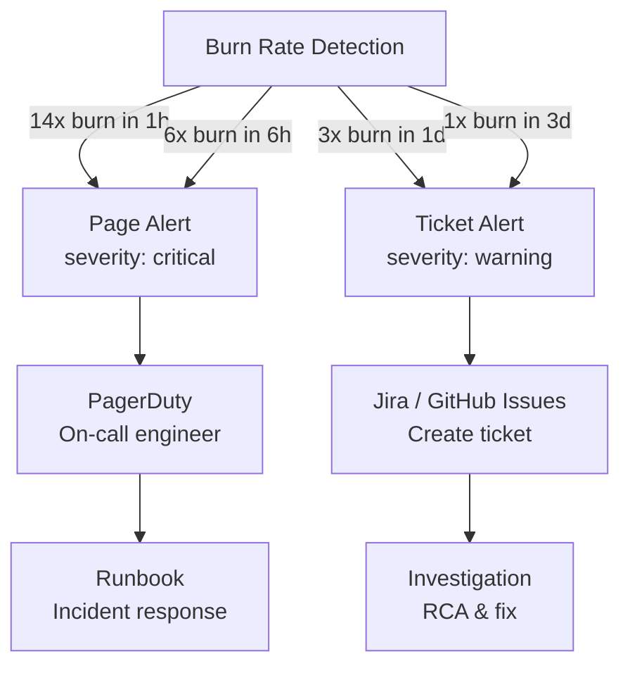

# 04. SLO System

> **Purpose**: Service Level Objectives (SLO) management, error budget tracking, and SRE practices.

---

## Table of Contents

- [SLO Overview](#slo-overview)
- [Sloth Operator](#sloth-operator)
- [SLO Definitions](#slo-definitions)
- [Error Budget Tracking](#error-budget-tracking)
- [Alerting Strategy](#alerting-strategy)
- [SLO Dashboards](#slo-dashboards)

---

## SLO Overview

### What are SLOs?

**Service Level Objectives (SLOs)** define target reliability levels for services:

- **SLI (Service Level Indicator)**: What you measure (e.g., request success rate, latency)
- **SLO (Service Level Objective)**: Target for SLI (e.g., 99.9% success rate)
- **SLA (Service Level Agreement)**: Contract with consequences (e.g., refund if SLO not met)

### Why SLOs Matter

**For SRE Teams:**
- **Objective reliability targets**: Move from "maximize uptime" to "meet SLO"
- **Error budget**: Safe failure allowance for innovation
- **Data-driven decisions**: Deploy vs stability trade-offs
- **Incident prioritization**: Focus on SLO-breaching issues

**For this project:**
- **9 microservices** → 9 SLO definitions
- **Automatic monitoring**: Sloth Operator generates Prometheus rules
- **Burn rate alerts**: Early warning before budget exhaustion
- **2 Grafana dashboards**: Overview + detailed metrics

---

## Sloth Operator

### What is Sloth?

**Sloth** is a Kubernetes Operator that generates SLO Prometheus rules from simple YAML definitions.

**Key Features:**
- **CRD-based**: Define SLOs as Kubernetes custom resources
- **Automatic rule generation**: Creates recording rules + alert rules
- **Multi-window burn rates**: 1h, 6h, 1d, 3d burn rate tracking
- **Error budget calculation**: Automatic budget tracking

**Version**: v0.15.0
**Namespace**: monitoring
**Deployment**: Helm chart `sloth/sloth`

### Deployment

**Script**: `scripts/08-deploy-slo.sh`

```bash
#!/bin/bash
set -e

echo "=== Deploying SLO System (Sloth Operator) ==="

# Add Sloth Helm repository
helm repo add sloth https://sloth-dev.github.io/sloth
helm repo update

# Install Sloth Operator
helm upgrade --install sloth sloth/sloth \
  --namespace monitoring \
  --create-namespace \
  --values k8s/sloth/values.yaml \
  --version 0.15.0 \
  --wait

# Apply PrometheusServiceLevel CRDs (9 services)
echo "Applying SLO definitions..."
kubectl apply -f k8s/sloth/crds/

echo "✅ Sloth Operator deployed successfully!"
echo ""
echo "Check PrometheusServiceLevels:"
echo "  kubectl get prometheusservicelevels -n monitoring"
echo ""
echo "Check generated PrometheusRules:"
echo "  kubectl get prometheusrules -n monitoring"
```

**Helm Values**: `k8s/sloth/values.yaml`

```yaml
# Sloth Operator configuration
sloth:
  # Image configuration
  image:
    repository: ghcr.io/sloth-dev/sloth
    tag: v0.15.0
    pullPolicy: IfNotPresent

  # Resources
  resources:
    requests:
      cpu: 100m
      memory: 128Mi
    limits:
      cpu: 500m
      memory: 512Mi

  # Service account
  serviceAccount:
    create: true

  # Extra labels for generated PrometheusRules
  extraLabels:
    # NOTE: This doesn't work as Sloth doesn't support metadata labels
    # We fix this by patching Prometheus ruleSelector to {}

# Disable common plugins (causes DNS issues in Kind)
commonPlugins:
  enabled: false
```

### PrometheusServiceLevel CRD

**Custom Resource Definition** for defining SLOs:

```yaml
apiVersion: sloth.sloth.dev/v1
kind: PrometheusServiceLevel
metadata:
  name: auth-slo
  namespace: monitoring
spec:
  service: auth
  labels:
    team: platform
    environment: production
  
  slos:
    - name: requests-availability
      objective: 99.9  # 99.9% availability target
      description: "Auth service availability SLO"
      sli:
        events:
          error_query: |
            sum(rate(requests_total{job="microservices", app="auth", code=~"5.."}[{{.window}}]))
          total_query: |
            sum(rate(requests_total{job="microservices", app="auth"}[{{.window}}]))
      alerting:
        name: AuthHighErrorRate
        labels:
          category: availability
        annotations:
          summary: "High error rate on auth service"
        page_alert:
          labels:
            severity: critical
        ticket_alert:
          labels:
            severity: warning
```

**Key Fields:**
- `service`: Service name (auth, user, product, etc.)
- `objective`: Target SLO (99.9 = 99.9% success rate)
- `sli.events.error_query`: Query for error events (5xx responses)
- `sli.events.total_query`: Query for total events (all requests)
- `alerting`: Alert configuration (page_alert for critical, ticket_alert for warning)

---

## SLO Definitions

### SLO for All 9 Services

| Service | File | Objective | SLI Metric | Error Definition |
|---------|------|-----------|------------|------------------|
| auth | `k8s/sloth/crds/auth-slo.yaml` | 99.9% | request success rate | HTTP 5xx |
| user | `k8s/sloth/crds/user-slo.yaml` | 99.9% | request success rate | HTTP 5xx |
| product | `k8s/sloth/crds/product-slo.yaml` | 99.9% | request success rate | HTTP 5xx |
| cart | `k8s/sloth/crds/cart-slo.yaml` | 99.9% | request success rate | HTTP 5xx |
| order | `k8s/sloth/crds/order-slo.yaml` | 99.9% | request success rate | HTTP 5xx |
| review | `k8s/sloth/crds/review-slo.yaml` | 99.9% | request success rate | HTTP 5xx |
| notification | `k8s/sloth/crds/notification-slo.yaml` | 99.9% | request success rate | HTTP 5xx |
| shipping | `k8s/sloth/crds/shipping-slo.yaml` | 99.9% | request success rate | HTTP 5xx |
| shipping-v2 | `k8s/sloth/crds/shipping-v2-slo.yaml` | 99.9% | request success rate | HTTP 5xx |

**Objective Explanation:**
- **99.9%** = 0.1% error budget
- **43.2 minutes** downtime allowed per month
- **8.64 hours** downtime allowed per year

### Example: Auth Service SLO

**File**: `k8s/sloth/crds/auth-slo.yaml`

```yaml
apiVersion: sloth.sloth.dev/v1
kind: PrometheusServiceLevel
metadata:
  name: auth-slo
  namespace: monitoring
spec:
  service: auth
  labels:
    team: platform
    environment: production
    owner: sre-team
  
  slos:
    # SLO 1: Availability (request success rate)
    - name: requests-availability
      objective: 99.9
      description: "Auth service availability - 99.9% of requests succeed"
      sli:
        events:
          error_query: |
            sum(rate(requests_total{
              job="microservices",
              app="auth",
              code=~"5.."
            }[{{.window}}]))
          total_query: |
            sum(rate(requests_total{
              job="microservices",
              app="auth"
            }[{{.window}}]))
      alerting:
        name: AuthHighErrorRate
        labels:
          category: availability
          service: auth
        annotations:
          summary: "High error rate on auth service"
          description: "Auth service error rate is above SLO threshold"
          runbook_url: "https://runbooks.example.com/auth-high-error-rate"
        page_alert:
          labels:
            severity: critical
          annotations:
            description: "Auth service is burning error budget too fast (page immediately)"
        ticket_alert:
          labels:
            severity: warning
          annotations:
            description: "Auth service error budget consumption is high (create ticket)"
```

---

## Error Budget Tracking

### What is Error Budget?

**Error budget** = Allowed failures within SLO period

**Calculation:**
```
Error Budget = (1 - SLO) × Total Requests
```

**Example for auth service (99.9% SLO):**
- **SLO**: 99.9% success rate
- **Error Budget**: 0.1% failure rate
- **If 1M requests/month**: 1,000 errors allowed

### Error Budget Consumption

**Burn Rate** = Speed of error budget consumption

```
Burn Rate = (Actual Error Rate) / (SLO Error Rate)
```

**Example:**
- **SLO**: 99.9% (0.1% error budget)
- **Actual Error Rate**: 0.2%
- **Burn Rate**: 0.2% / 0.1% = **2x** (burning budget 2x faster than allowed)

### Multi-Window Burn Rates

Sloth generates burn rate rules for multiple time windows:

| Window | Purpose | Alert Threshold | Alert Severity |
|--------|---------|-----------------|----------------|
| **1 hour** | Detect fast burns | 14x burn rate | Critical (page) |
| **6 hours** | Detect medium burns | 6x burn rate | Critical (page) |
| **1 day** | Detect slow burns | 3x burn rate | Warning (ticket) |
| **3 days** | Detect very slow burns | 1x burn rate | Warning (ticket) |

**Why multiple windows?**
- **Fast burns (1h)**: Severe outage, need immediate action
- **Slow burns (3d)**: Gradual degradation, plan maintenance

### Generated Prometheus Rules

**Sloth automatically generates these rules:**

**1. SLI Recording Rule** (actual error rate):
```promql
slo:sli_error:ratio_rate5m{sloth_service="auth", sloth_slo="requests-availability"}
```

**2. Error Budget Recording Rule** (remaining budget):
```promql
slo:error_budget:ratio{sloth_service="auth", sloth_slo="requests-availability"}
```

**3. Burn Rate Recording Rules** (for each window):
```promql
slo:sli_error:ratio_rate1h{sloth_service="auth"}   # 1-hour burn rate
slo:sli_error:ratio_rate6h{sloth_service="auth"}   # 6-hour burn rate
slo:sli_error:ratio_rate1d{sloth_service="auth"}   # 1-day burn rate
slo:sli_error:ratio_rate3d{sloth_service="auth"}   # 3-day burn rate
```

**4. Alert Rules** (burn rate thresholds):
```promql
# Critical: 14x burn rate in 1 hour
ALERT AuthHighErrorRate
  IF slo:sli_error:ratio_rate1h{sloth_service="auth"} > 14 * (1 - 0.999)
  FOR 2m
  LABELS { severity="critical" }

# Warning: 3x burn rate in 1 day
ALERT AuthHighErrorRate
  IF slo:sli_error:ratio_rate1d{sloth_service="auth"} > 3 * (1 - 0.999)
  FOR 1h
  LABELS { severity="warning" }
```

---

## Alerting Strategy

### Alert Levels

**Page Alert (Critical):**
- **Condition**: Fast burn rate (14x in 1h or 6x in 6h)
- **Action**: Page on-call engineer immediately
- **Severity**: `critical`
- **Example**: Auth service at 10% error rate (100x burn rate)

**Ticket Alert (Warning):**
- **Condition**: Slow burn rate (3x in 1d or 1x in 3d)
- **Action**: Create ticket for investigation
- **Severity**: `warning`
- **Example**: Auth service at 0.3% error rate (3x burn rate)

### Alert Routing



### Runbook Integration

**Alert annotations include runbook URLs:**

```yaml
annotations:
  summary: "High error rate on {{$labels.sloth_service}}"
  description: "Error budget burning at {{$value}}x rate"
  runbook_url: "https://runbooks.example.com/{{$labels.sloth_service}}-high-error-rate"
```

**Runbook script**: `scripts/12-error-budget-alert.sh`

```bash
#!/bin/bash
# Error Budget Alert Response Runbook

SERVICE=$1
BURN_RATE=$2

echo "=== Error Budget Alert Response ==="
echo "Service: $SERVICE"
echo "Burn Rate: ${BURN_RATE}x"
echo ""

# Step 1: Check current error rate
echo "1. Checking current error rate..."
kubectl exec -n monitoring deploy/prometheus -- \
  promtool query instant \
  "rate(requests_total{app=\"$SERVICE\", code=~\"5..\"}[5m]) / rate(requests_total{app=\"$SERVICE\"}[5m])"

# Step 2: Check recent deployments
echo "2. Checking recent deployments..."
kubectl rollout history deployment/$SERVICE -n $SERVICE

# Step 3: Check logs for errors
echo "3. Checking error logs..."
kubectl logs -n $SERVICE -l app=$SERVICE --tail=50 | grep -i error

# Step 4: Check Grafana dashboard
echo "4. Open Grafana dashboard:"
echo "   http://localhost:3000/d/microservices-monitoring-001/?var-app=$SERVICE"

# Step 5: Recommended actions
echo ""
echo "Recommended Actions:"
if (( $(echo "$BURN_RATE > 10" | bc -l) )); then
    echo "  - CRITICAL: Rollback immediately"
    echo "  - kubectl rollout undo deployment/$SERVICE -n $SERVICE"
elif (( $(echo "$BURN_RATE > 3" | bc -l) )); then
    echo "  - WARNING: Investigate within 1 hour"
    echo "  - Check logs and metrics"
else
    echo "  - INFO: Monitor and create ticket"
fi
```

---

## SLO Dashboards

### Dashboard 1: SLO Overview (ID: 14643)

**Purpose**: High-level view of all SLOs

**File**: `k8s/grafana-operator/dashboards/grafana-dashboard-slo-overview.yaml`

**Panels:**
1. **SLO Compliance** - % of services meeting SLO
2. **Error Budget Remaining** - Remaining budget per service
3. **Burn Rate Heatmap** - Burn rate visualization
4. **Service Health Status** - Green/yellow/red status per service

**Variables:**
- `$service` - Service filter
- `$slo` - SLO name filter
- `$timerange` - Time range (30d default)

**Access**: http://localhost:3000/d/slo-overview/

### Dashboard 2: SLO Detailed (ID: 14348)

**Purpose**: Detailed SLO metrics per service

**File**: `k8s/grafana-operator/dashboards/grafana-dashboard-slo-detailed.yaml`

**Panels:**
1. **SLI Over Time** - Actual vs target SLI
2. **Error Budget Consumption** - Budget burn over time
3. **Burn Rate (1h, 6h, 1d, 3d)** - Multi-window burn rates
4. **Alert History** - Fired alerts timeline
5. **Error Rate by Endpoint** - Breakdown by API endpoint
6. **Top Error Responses** - Most common error messages

**Variables:**
- `$service` - Service filter
- `$slo` - SLO name filter

**Access**: http://localhost:3000/d/slo-detailed/

### Example Dashboard Queries

**Error Budget Remaining:**
```promql
100 * (1 - (
  slo:sli_error:ratio_rate30d{sloth_service="$service"}
  / (1 - 0.999)
))
```

**Burn Rate (1 hour):**
```promql
slo:sli_error:ratio_rate1h{sloth_service="$service"} 
  / (1 - 0.999)
```

**SLO Compliance:**
```promql
slo:sli_error:ratio_rate30d{sloth_service="$service"} 
  <= (1 - 0.999)
```

---

## SLO Verification

### Check PrometheusServiceLevels

```bash
# List all SLO definitions
kubectl get prometheusservicelevels -n monitoring

# Expected output (9 services):
NAME                      SERVICE          DESIRED SLOs   READY SLOs   GEN OK   AGE
auth-slo                  auth             1              1            true     5d
user-slo                  user             1              1            true     5d
product-slo               product          1              1            true     5d
cart-slo                  cart             1              1            true     5d
order-slo                  order            1              1            true     5d
review-slo                review           1              1            true     5d
notification-slo          notification     1              1            true     5d
shipping-slo              shipping         1              1            true     5d
shipping-v2-slo           shipping-v2      1              1            true     5d
```

**Status Fields:**
- `DESIRED SLOs`: Number of SLOs defined
- `READY SLOs`: Number of SLOs successfully processed
- `GEN OK`: Prometheus rule generation status (should be `true`)

### Check Generated PrometheusRules

```bash
# List generated Prometheus rules
kubectl get prometheusrules -n monitoring | grep slo

# Expected output (9 rules, one per service):
auth-slo-requests-availability
user-slo-requests-availability
product-slo-requests-availability
...
```

### Verify Rules in Prometheus

```bash
# Port-forward Prometheus
kubectl port-forward -n monitoring svc/kube-prometheus-stack-prometheus 9090:9090

# Open Prometheus UI
open http://localhost:9090/rules

# Search for: sloth_service="auth"
```

**Expected rules:**
- `slo:sli_error:ratio_rate5m` (SLI recording rule)
- `slo:error_budget:ratio` (error budget)
- `slo:sli_error:ratio_rate1h` (1h burn rate)
- Alert rules: `AuthHighErrorRate`

---

## Troubleshooting SLO Issues

### Issue 1: PrometheusServiceLevel shows `GEN OK = false`

**Symptom:**
```bash
kubectl get prometheusservicelevels -n monitoring
NAME       DESIRED SLOs   READY SLOs   GEN OK
auth-slo   1              0            false
```

**Cause**: Prometheus Operator webhook rejects Sloth-generated rules

**Solution**:
```bash
# Delete problematic webhook
kubectl delete validatingwebhookconfigurations kube-prometheus-stack-admission

# Restart Sloth to clear cache
kubectl delete pod -n monitoring -l app=sloth
```

### Issue 2: No SLO metrics in Prometheus

**Check 1: Base metrics exist**
```promql
requests_total{job="microservices", app="auth"}
```
If no results → microservices not exposing metrics

**Check 2: Prometheus ruleSelector**
```bash
kubectl get prometheus -n monitoring kube-prometheus-stack-prometheus -o yaml | grep ruleSelector
```
Should be `ruleSelector: {}` (no label filtering)

**Fix**:
```bash
# Patch Prometheus to load all rules
kubectl patch prometheus kube-prometheus-stack-prometheus -n monitoring --type merge -p '
spec:
  ruleSelector: {}
  ruleNamespaceSelector: {}
'
```

### Issue 3: Alerts not firing

**Check alert status in Prometheus:**
```bash
# Port-forward Prometheus
kubectl port-forward -n monitoring svc/kube-prometheus-stack-prometheus 9090:9090

# Check alerts
open http://localhost:9090/alerts
```

**Debug alert expression:**
```promql
# Check if burn rate exceeds threshold
slo:sli_error:ratio_rate1h{sloth_service="auth"} > 14 * (1 - 0.999)
```

---

## Best Practices

### 1. Start Conservative

- **Initial SLO**: 99% (easier to meet)
- **Increase gradually**: 99.5% → 99.9% → 99.95%
- **Monitor for 1 month** before tightening

### 2. Align with User Experience

- **User-facing services**: Higher SLO (99.9%)
- **Internal services**: Lower SLO (99%)
- **Batch jobs**: Different SLI (completion rate)

### 3. Multiple SLIs per Service

```yaml
slos:
  - name: requests-availability
    objective: 99.9
    sli: { ... }  # Success rate
    
  - name: requests-latency
    objective: 95
    sli: { ... }  # P95 latency < 500ms
```

### 4. Regular SLO Reviews

- **Weekly**: Check error budget consumption
- **Monthly**: Review SLO targets
- **Quarterly**: Update SLO definitions

---

**Next**: Continue to [05. Infrastructure](05-infrastructure.md) →

