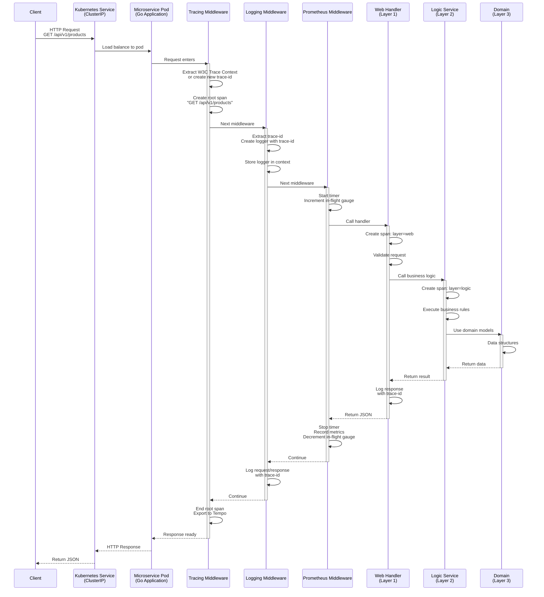
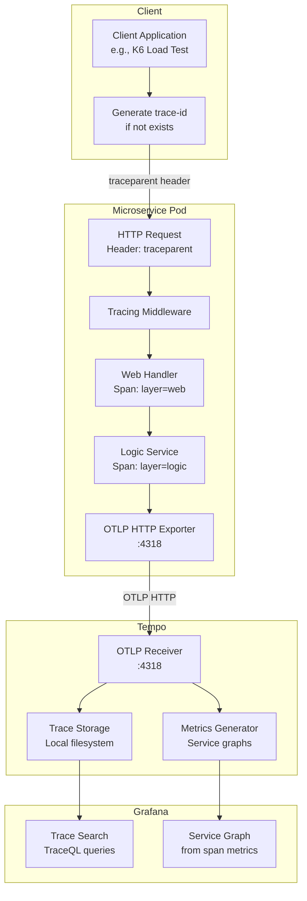
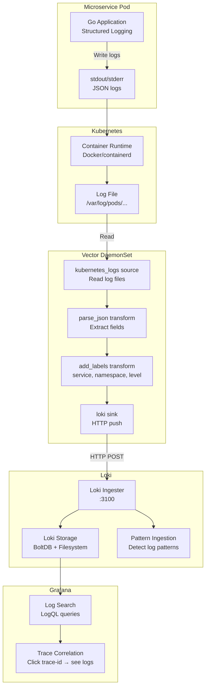
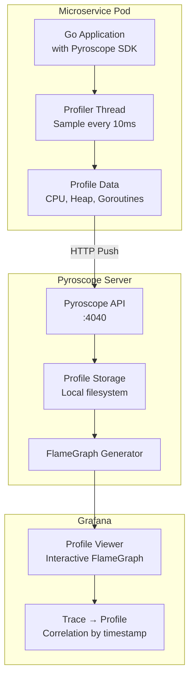
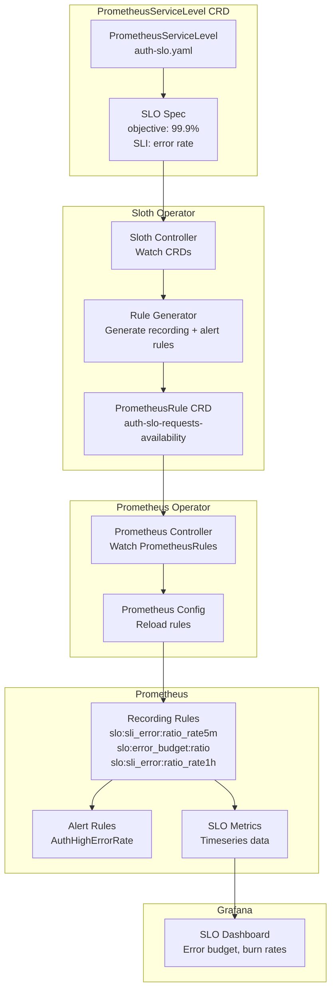

# 07. Data Flows

> **Purpose**: Visual representation of how data flows through the system - requests, metrics, traces, logs, profiles.

---

## Table of Contents

- [Request Lifecycle](#request-lifecycle)
- [Metrics Collection Flow](#metrics-collection-flow)
- [Trace Propagation Flow](#trace-propagation-flow)
- [Log Aggregation Flow](#log-aggregation-flow)
- [Profile Collection Flow](#profile-collection-flow)
- [SLO Metrics Generation](#slo-metrics-generation)

---

## Request Lifecycle

### End-to-End Request Flow



### Request Processing Steps

**1. Network Layer (Kubernetes)**
- Client → Kubernetes Service (ClusterIP)
- Service load balances → Pod

**2. Middleware Stack (Ordered Execution)**
- **Tracing**: Extract/create trace-id, create root span
- **Logging**: Extract trace-id, create logger
- **Prometheus**: Start timer, increment in-flight gauge

**3. Application Layer (3-Layer Architecture)**
- **Web**: HTTP validation, span creation (layer=web)
- **Logic**: Business rules, span creation (layer=logic)
- **Domain**: Data models (no span)

**4. Response Path (Reverse Order)**
- Domain → Logic → Web → Prometheus → Logging → Tracing
- Metrics recorded, logs written, span exported

---

## Metrics Collection Flow

### Prometheus Scrape Flow

```mermaid
flowchart TD
    subgraph "Microservice Pod"
        App[Go Application<br/>with Prometheus Middleware]
        MetricsEndpoint[/metrics endpoint<br/>:8080/metrics]
        
        App -->|Collect metrics| MetricsEndpoint
    end

    subgraph "Kubernetes"
        Service[Kubernetes Service<br/>auth, user, product, ...]
        Namespace[Namespace<br/>label: monitoring=enabled]
        
        Service -.->|Part of| Namespace
    end

    subgraph "Prometheus Operator"
        ServiceMonitor[ServiceMonitor CRD<br/>microservices]
        Prometheus[Prometheus Server]
        
        ServiceMonitor -->|Configure| Prometheus
    end

    subgraph "Grafana"
        Dashboard[Grafana Dashboard<br/>32 panels]
        
        Prometheus -->|PromQL Query| Dashboard
    end

    MetricsEndpoint -->|HTTP GET :8080/metrics| ServiceMonitor
    Service -->|Discovered by| ServiceMonitor
    Namespace -->|Filter| ServiceMonitor
    
    ServiceMonitor -->|Scrape config| Prometheus
    Prometheus -->|Store timeseries| Prometheus
```

### Metrics Collection Steps

**1. Metrics Generation (Application)**
```go
// Prometheus middleware records metrics
requestDuration.WithLabelValues(method, path, code).Observe(duration)
requestsTotal.WithLabelValues(method, path, code).Inc()
requestsInFlight.WithLabelValues(method, path).Dec()
```

**2. Metrics Exposure**
- HTTP endpoint: `/metrics` on port 8080
- Format: Prometheus text format
- Labels: `method`, `path`, `code`

**3. Service Discovery (ServiceMonitor)**
```yaml
selector:
  matchExpressions:
    - key: app
      operator: In
      values: [auth, user, product, ...]  # 9 services

namespaceSelector:
  matchLabels:
    monitoring: enabled  # Filter namespaces
```

**4. Scraping (Prometheus)**
- Interval: 30 seconds
- Endpoint: `http://<pod-ip>:8080/metrics`
- Timeout: 10 seconds
- Relabeling: Add `job`, `app`, `service`, `namespace` labels

**5. Storage (Prometheus)**
- Timeseries database
- Retention: 15 days
- Size limit: 10GB

**6. Querying (Grafana)**
- PromQL: `rate(requests_total{job="microservices"}[5m])`
- Dashboard variables: `$app`, `$namespace`, `$rate`

---

## Trace Propagation Flow

### OpenTelemetry Trace Flow



### Trace Propagation Steps

**1. Trace Context Creation (Client or First Service)**
```
traceparent: 00-2db2fe7dcd3c8cb8cb4647ea2b455a21-53995c3f42cd8ad8-01
             │  │                                │                │
             │  └─ trace-id (32 hex chars)      │                └─ flags
             │                                   └─ parent-id (16 hex chars)
             └─ version (00)
```

**2. Context Extraction (Tracing Middleware)**
```go
// Extract trace context from HTTP headers
ctx := otel.GetTextMapPropagator().Extract(
    c.Request.Context(),
    propagation.HeaderCarrier(c.Request.Header),
)

// Create root span
ctx, span := tracer.Start(ctx, "GET /api/v1/products")
defer span.End()
```

**3. Span Creation (Handler Layers)**

**Web Layer:**
```go
ctx, span := middleware.StartSpan(ctx, "http.request",
    trace.WithAttributes(
        attribute.String("layer", "web"),
        attribute.String("method", "GET"),
        attribute.String("path", "/api/v1/products"),
    ))
defer span.End()
```

**Logic Layer:**
```go
ctx, span := middleware.StartSpan(ctx, "product.list",
    trace.WithAttributes(
        attribute.String("layer", "logic"),
    ))
defer span.End()
```

**4. Span Export (OTLP)**
- Protocol: OTLP HTTP
- Endpoint: `http://tempo.monitoring.svc.cluster.local:4318`
- Batch: Every 5 seconds
- Compression: gzip

**5. Trace Storage (Tempo)**
- Format: Parquet files
- Location: `/var/tempo/traces`
- Retention: 7 days (configurable)

**6. Metrics Generation (Tempo)**
- Span metrics: `traces_spanmetrics_*`
- Service graph: Request rate, error rate, duration
- Exported: Prometheus scrape on port 3200

**7. Trace Query (Grafana)**
- TraceQL: `{ service.name = "auth" && duration > 500ms }`
- Service graphs: Visual topology
- Exemplars: Click metrics → see trace

---

## Log Aggregation Flow

### Loki Log Pipeline



### Log Aggregation Steps

**1. Log Generation (Application)**
```go
// Structured JSON logs with trace-id
logger.Info("HTTP request",
    zap.String("trace_id", traceID),
    zap.String("method", "GET"),
    zap.String("path", "/api/v1/products"),
    zap.Int("status", 200),
    zap.Duration("duration", 25*time.Millisecond),
)
```

**Output:**
```json
{
  "level": "info",
  "timestamp": "2025-12-10T10:30:45.123Z",
  "caller": "middleware/logging.go:92",
  "message": "HTTP request",
  "trace_id": "2db2fe7dcd3c8cb8cb4647ea2b455a21",
  "method": "GET",
  "path": "/api/v1/products",
  "status": 200,
  "duration": 0.025
}
```

**2. Log Collection (Vector)**

**Source (kubernetes_logs):**
```yaml
[sources.kubernetes_logs]
type = "kubernetes_logs"
auto_partial_merge = true
exclude_paths_glob_patterns = [
  "**/kube-system/**",
  "**/default/**"
]
```

**Transform (parse_json):**
```yaml
[transforms.parse_json]
type = "remap"
inputs = ["kubernetes_logs"]
source = '''
. = parse_json!(.message)
.timestamp = now()
'''
```

**Transform (add_labels):**
```yaml
[transforms.add_labels]
type = "remap"
inputs = ["parse_json"]
source = '''
.labels.service = .kubernetes.pod_labels.app
.labels.namespace = .kubernetes.pod_namespace
.labels.pod = .kubernetes.pod_name
.labels.level = .level
'''
```

**3. Log Shipping (Loki Sink)**
```yaml
[sinks.loki]
type = "loki"
inputs = ["add_labels"]
endpoint = "http://loki.monitoring.svc.cluster.local:3100"
encoding.codec = "json"
labels = {
  service = "{{ service }}",
  namespace = "{{ namespace }}",
  pod = "{{ pod }}",
  level = "{{ level }}"
}
```

**4. Log Storage (Loki)**
- Index: BoltDB (labels)
- Chunks: Filesystem (log content)
- Retention: 7 days

**5. Log Query (Grafana)**
```logql
# All error logs for auth service
{service="auth", level="error"}

# Logs for specific trace-id
{service="auth"} |= "2db2fe7dcd3c8cb8cb4647ea2b455a21"

# Slow requests (JSON parsing)
{service="order"} | json | duration > 1
```

---

## Profile Collection Flow

### Pyroscope Profiling Pipeline



### Profile Collection Steps

**1. Profiler Initialization (Startup)**
```go
pyroscope.Start(pyroscope.Config{
    ApplicationName: "auth",
    ServerAddress:   "http://pyroscope.monitoring.svc.cluster.local:4040",
    ProfileTypes: []pyroscope.ProfileType{
        pyroscope.ProfileCPU,         // CPU usage
        pyroscope.ProfileAllocObjects, // Heap allocations
        pyroscope.ProfileInuseSpace,   // Live memory
        pyroscope.ProfileGoroutines,   // Goroutine count
        pyroscope.ProfileMutexCount,   // Mutex contention
    },
    Tags: map[string]string{
        "namespace": os.Getenv("NAMESPACE"),
        "pod":       os.Getenv("HOSTNAME"),
    },
})
```

**2. Profile Sampling (Continuous)**
- **CPU**: Every 10ms (100 samples/second)
- **Heap**: On allocation
- **Goroutines**: Every 10 seconds
- **Mutex**: On lock contention

**3. Profile Upload (Periodic)**
- Interval: 10 seconds
- Protocol: HTTP POST
- Endpoint: `http://pyroscope.monitoring.svc.cluster.local:4040/ingest`
- Format: pprof

**4. Profile Storage (Pyroscope)**
- Format: Parquet files
- Location: `/var/lib/pyroscope`
- Retention: 7 days

**5. FlameGraph Generation (On-Demand)**
- User selects time range
- Pyroscope aggregates profiles
- Generates interactive FlameGraph

**6. Profile Viewing (Grafana)**
- FlameGraph: Visual stack traces
- Table view: Top functions by CPU/memory
- Diff view: Compare profiles across time

---

## SLO Metrics Generation

### Sloth Operator Pipeline



### SLO Metrics Generation Steps

**1. SLO Definition (PrometheusServiceLevel CRD)**
```yaml
apiVersion: sloth.sloth.dev/v1
kind: PrometheusServiceLevel
metadata:
  name: auth-slo
  namespace: monitoring
spec:
  service: auth
  slos:
    - name: requests-availability
      objective: 99.9
      sli:
        events:
          error_query: |
            sum(rate(requests_total{app="auth", code=~"5.."}[{{.window}}]))
          total_query: |
            sum(rate(requests_total{app="auth"}[{{.window}}]))
```

**2. Rule Generation (Sloth Operator)**

Sloth generates:
- **SLI Recording Rule** (actual error rate)
- **Error Budget Recording Rule** (remaining budget)
- **Burn Rate Recording Rules** (1h, 6h, 1d, 3d)
- **Alert Rules** (critical, warning)

**3. Prometheus Rule Creation**

**SLI Recording:**
```promql
slo:sli_error:ratio_rate5m{sloth_service="auth"}
= sum(rate(requests_total{app="auth", code=~"5.."}[5m]))
  / sum(rate(requests_total{app="auth"}[5m]))
```

**Error Budget:**
```promql
slo:error_budget:ratio{sloth_service="auth"}
= (1 - 0.999) - slo:sli_error:ratio_rate5m{sloth_service="auth"}
```

**Burn Rate (1h):**
```promql
slo:sli_error:ratio_rate1h{sloth_service="auth"}
= sum(rate(requests_total{app="auth", code=~"5.."}[1h]))
  / sum(rate(requests_total{app="auth"}[1h]))
```

**4. Prometheus Evaluation**
- Evaluate rules every 30 seconds
- Store results as timeseries
- Trigger alerts if thresholds exceeded

**5. Dashboard Query (Grafana)**
```promql
# Error budget remaining
100 * slo:error_budget:ratio{sloth_service="$service"}

# Burn rate (1h)
slo:sli_error:ratio_rate1h{sloth_service="$service"} / (1 - 0.999)
```

---

**Next**: Continue to [08. Development Workflow](08-development-workflow.md) →

