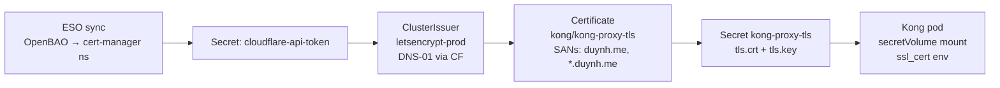

# Tâm sự — deep dive

## 1. Homelab hay tạo đi tạo lại → vấn đề CF token

**Vấn đề thật**: token CF là "secret bootstrap" — không thể commit vào git, không thể đẻ ra từ Flux. Mỗi lần `make down && make up` thì OpenBAO storage (PVC) mất → token mất → cert-manager fail → toàn bộ chain fail.

**3 cách xử lý, từ tệ → tốt**:

### A. Manual re-seed sau mỗi lần up (đang làm hiện tại)
```bash
make up
# chờ openbao ready
ROOT=$(kubectl get secret -n openbao openbao-init-keys -o jsonpath='{.data.root_token}' | base64 -d)
kubectl exec -n openbao openbao-0 -- sh -c "BAO_TOKEN=$ROOT bao kv put secret/local/infra/cloudflare/api-token api_token=cfut_..."
```
Tệ: phải nhớ token, phải nhớ chạy lệnh. Quên là chết.

### B. Local `.env.bootstrap` + script (đề xuất)
- File `~/.homelab/secrets.env` (gitignore tuyệt đối, ngoài repo) chứa:
  ```
  CF_API_TOKEN=cfut_...
  GITHUB_TOKEN=...
  ```
- Script `scripts/bootstrap-secrets.sh` đọc file này, chạy `bao kv put` cho mọi secret bootstrap-only (CF token, GitHub PAT, SMTP creds…).
- `make up` tự gọi nó sau khi OpenBAO ready.
- **Ưu**: idempotent, không cần nhớ. **Nhược**: vẫn là plaintext trên disk.

### C. PVC giữ lại giữa các lần `make down` (best)
Đổi `make down` để **không xoá** PVC của OpenBAO (chỉ xoá khi `make nuke`). Khi `make up` lại, OpenBAO unseal bằng `openbao-init-keys` Secret cũ → toàn bộ secrets (gồm CF token) còn nguyên. Không cần re-seed gì hết.

```bash
# Kind không tự xoá PVC khi delete cluster, nhưng make down hiện tại
# có thể đang xoá luôn cluster → mất hostPath volume.
# Fix: tách "down" (xoá cluster, giữ data dir) vs "nuke" (xoá tất).
```

→ **Tôi đề xuất combo B + C**: bootstrap script làm fallback (cluster mới hoàn toàn), PVC persist là happy path.

---

## 2. Kong giờ dùng cert nào?

**Đúng, đã chuyển sang Let's Encrypt qua DNS-01 Cloudflare**, *về thiết kế*. Chuỗi:



**Hiện tại thực tế**: cert vẫn còn issuer `homelab-ca` (cũ) vì chain chưa reconcile xong sau khi fix OpenBAO. Cert-manager-config Kustomization context-deadline-exceeded — Flux đang chậm. Cần kiên nhẫn hoặc force reconcile.

**Phân biệt 2 cert tồn tại song song**:

| Cert | Issuer | Dùng cho | Ai trust? |
|---|---|---|---|
| `kong-proxy-tls` (after fix) | `letsencrypt-prod` | Kong proxy SNI, browser-facing | **Browser tự trust** (LE có trong system bundle) |
| Internal service certs (ví dụ webhook, admission, MCP server-to-server) | `homelab-ca` | mTLS in-cluster | Workload nào mount `homelab-ca-bundle` mới trust |

→ Đây là 2 PKI **độc lập, không thay thế nhau**.

---

## 3. OpenBAO `auth/kubernetes/config` — vấn đề gì

### Cơ chế
Khi ESO (External Secrets Operator) gọi OpenBAO, nó gửi **JWT của ServiceAccount của ESO**. OpenBAO phải verify JWT đó. Có 2 cách:

1. **`token_reviewer_jwt` được set** → OpenBAO dùng JWT *này* để gọi API `TokenReview` của K8s ("ê K8s, JWT của user kia có hợp lệ không?"). JWT này lấy từ pod nào set nó vào config.
2. **`token_reviewer_jwt` rỗng + `disable_local_ca_jwt=false`** → OpenBAO dùng **JWT của chính pod openbao** (kubelet auto-rotate vô hạn).

### Bug cũ (đã fix trong commit `fb14349`, **đang ở trong git**)
Bootstrap script trước đây làm `bao write ... token_reviewer_jwt=@/var/run/secrets/.../token`. JWT đó lấy từ pod **bootstrap Job** — pod sống vài phút rồi chết. JWT projection có TTL ~1h. Sau 1h → expired → `403 permission denied` cho mọi login → ESO chết → cert-manager chết → cascade xuống mọi thứ.

### Tại sao hôm nay vẫn fail
Bootstrap Job đã **chạy lại** lúc nào đó (35 phút trước theo điều tra cũ). Nhưng commit fix `fb14349` có thể chưa được apply trước thời điểm đó, hoặc Job dùng image cũ. Live config show `token_reviewer_jwt_set: true` → đúng là vẫn còn JWT cũ.

→ **Fix runtime đã làm xong** (vài phút trước):
```bash
bao write auth/kubernetes/config kubernetes_host=... kubernetes_ca_cert=@... \
  disable_local_ca_jwt=false token_reviewer_jwt=''
```
ESO đã sync lại OK. Lần `make up` tới, Job mới sẽ chạy script mới (đã đúng) và không bị nữa.

### Lesson learned
OpenBAO bootstrap pod **không bao giờ** được pin JWT của chính nó. Phải để OpenBAO tự dùng SA của nó.

---

## 4. `homelab-ca.crt` & trust-bundle

### Lệnh tạo file đó
File `kubernetes/infra/configs/cert-manager/ca-source/homelab-ca.crt` được tạo bằng:
```bash
kubectl get secret homelab-ca-secret -n cert-manager \
  -o jsonpath='{.data.tls\.crt}' | base64 -d \
  > kubernetes/infra/configs/cert-manager/ca-source/homelab-ca.crt
```

### Đã có trong docs chưa?
**Có**, ở `docs/security/trust-distribution.md` mục **6. Bootstrap (first-time install)** dòng 195–209. Nhưng nó nằm cuối doc, dễ miss. **Nên thêm note ở đầu doc** + reference từ `README.md` hoặc `setup.md`.

### Dùng CF (Let's Encrypt) rồi thì còn cần Bundle không?

**Khác mục đích, vẫn cần**:

| Use case | Cần CA bundle (homelab-ca) hay LE? |
|---|---|
| Browser → Kong → app (HTTPS public) | **LE** (browser tự trust) |
| App pod → Kong (in-cluster HTTPS) | LE cũng được (system bundle có LE) → **không cần homelab-ca-bundle** |
| Webhook K8s → cert-manager webhook | **homelab-ca** (mTLS internal, nhanh, không rate limit) |
| Service A → Service B mTLS in-cluster | **homelab-ca** nếu muốn mTLS |
| MCP server-to-server, Tempo OTLP, etc. | **homelab-ca** nếu enable TLS internal |

**Tóm tắt**:
- **Frontend/external traffic** → LE (đã setup)
- **Internal mTLS** → homelab-ca + trust-manager bundle
- **Hiện tại**: chưa có service nào dùng mTLS internal. Bundle/trust-manager là **investment cho tương lai** (mTLS, webhook custom, internal CA cho APM…).

**Có bỏ trust-manager + homelab-ca được không?**
Được, nếu confirm không bao giờ làm mTLS internal. Nhưng đã setup rồi, low cost giữ lại. Tôi **giữ lại**.

---

## TL;DR — action items đề xuất

| # | Việc | Ưu tiên |
|---|---|---|
| 1 | Tạo `scripts/bootstrap-secrets.sh` đọc `~/.homelab/secrets.env` + auto-call sau `make up` | High — giải quyết "tạo đi tạo lại" |
| 2 | Tách `make down` (giữ PVC) vs `make nuke` (xoá tất) | High |
| 3 | Đợi cert-manager-config reconcile xong → verify `kong-proxy-tls` issuer = `letsencrypt-prod` | Medium — đang chờ Flux |
| 4 | Thêm note bootstrap CA file vào `README` hoặc `setup.md` (link tới trust-distribution.md §6) | Low |
| 5 | Document phân biệt LE cert vs homelab-ca trong `trust-distribution.md` | Low |
